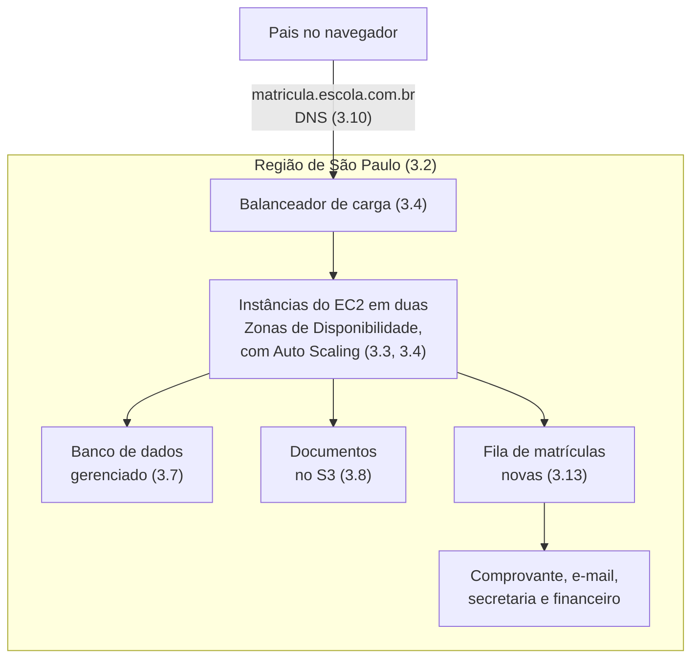

<!-- autoral -->

# O caso da escola

🏠 [Guia do exame](README.md)

---

Todas as aulas e fichas desta apostila contam o mesmo caso: uma escola que tira o sistema de matrícula de um computador da secretaria e o leva para a AWS, e a rede de escolas da qual ela faz parte, que depois leva os outros sistemas também. Quem lê na ordem conhece a escola aos poucos. Quem abre direto uma aula do capítulo 3 encontra uma história já em andamento, com personagens e sistemas que não foram apresentados ali.

Esta página reúne o caso num lugar só. Leia antes de começar ou volte a ela sempre que uma aula citar algo que você não reconhece: quem é a diretora, por que janeiro importa, de onde veio a unidade de Lisboa. Ela não ensina nenhum serviço; cada serviço é explicado na aula que o usa.

## A escola e a rede

O caso é fictício. A história começa numa **escola** em São Paulo e, a partir do capítulo 1, se amplia para a **rede de escolas** à qual ela pertence: várias unidades em São Paulo, uma unidade nova que vai abrir em Lisboa, em Portugal, e uma escola de idiomas parceira. Quando uma aula fala "a escola" e outra fala "a rede de escolas", é o mesmo caso visto de perto ou de longe.

A escola não é uma empresa de tecnologia. A equipe de TI é pequena (numa das aulas, são duas pessoas), e boa parte das decisões passa pela direção e pela área financeira. É por isso que o caso serve à prova: as questões da CLF-C02 falam de necessidades de uma organização, não de configuração técnica.

## O sistema de matrícula

O fio da história é o **sistema de matrícula**. Os pais entram pelo navegador em `matricula.escola.com.br`, preenchem um formulário e enviam documentos dos filhos: certidão de nascimento, comprovante de endereço, foto e, em alguns casos, laudos médicos. Ao enviar, o sistema grava a matrícula, guarda os documentos, gera um comprovante em PDF, manda um e-mail de confirmação e avisa a secretaria, que confere tudo.

Três características do sistema voltam em quase todas as aulas:

- **O pico de janeiro.** As matrículas abrem em janeiro, e nas primeiras semanas a procura é muitas vezes maior que no resto do ano. No resto do ano, o sistema fica quase parado. Esse contraste explica por que a escola se interessa por pagar pelo uso e por aumentar a capacidade quando a procura sobe e reduzi-la quando cai.
- **Os dados sensíveis.** O sistema guarda dados de crianças e documentos pessoais. Quem pode ver esses dados, como protegê-los e como provar isso a uma auditoria são perguntas do capítulo 2.
- **Três tipos de dado.** Os dados de alunos e turmas ficam num banco de dados; os documentos enviados ficam como arquivos; e o próprio sistema, com o sistema operacional, fica no disco do servidor. A [aula 0.3](../fundamentos/03-dados.md) separa os três, e cada um vai para um serviço diferente na AWS.

No início, o sistema roda num único computador guardado numa sala da secretaria, comprado, instalado e mantido pela própria escola. Quando a história passa para a rede, o ponto de partida é a sala de servidores da rede (o "datacenter" das aulas 1.6 e 1.7), com outros sistemas além da matrícula.

## Os outros sistemas

À medida que a rede leva mais coisas para a AWS, outros sistemas entram no caso. Nenhum deles precisa ser lembrado em detalhe; a aula que o usa apresenta o que importa.

| Sistema | O que é | Onde aparece |
|---|---|---|
| Notas e boletins | Lançamento de notas pelos professores e geração dos boletins em PDF | 1.1, 3.4, 3.6, 3.8, 3.14, 4.2 |
| Banco de dados da matrícula | O banco com alunos, turmas e matrículas | 1.6, 3.7, 3.17 |
| Aplicativo dos pais | Aplicativo que guarda a sessão de muitos usuários ao mesmo tempo | 0.3, 3.7, 3.14 |
| Sistema financeiro | Recebe o aviso de cada matrícula nova | 3.13, 4.6 |
| Sistemas antigos da rede | RH feito por um ex-funcionário, site de eventos sem acesso, controle das catracas da portaria | 1.6 |
| Portal e materiais didáticos | Portal novo e a pasta de materiais lida por várias instâncias | 3.6, 3.9 |
| Sistema da biblioteca | Sistema novo, cujo custo a direção quer saber antes de aprovar | 4.4 |
| Salas com sensores | Sensores de temperatura que mandam leituras para a nuvem | 3.14 |

## Quem é quem

Os personagens não têm nome: são identificados pela função, como numa questão de prova.

| Personagem | Papel no caso | Principais aulas |
|---|---|---|
| A diretora | Decide a mudança para a nuvem, abre a conta da AWS e cobra respostas quando algo dá errado | 1.2, 1.4, 2.2, 2.3, 2.4, 2.7 |
| A diretora financeira e o tesoureiro | Comparam custos, leem a fatura e querem previsões e alertas de gasto | 1.2, 1.7, 4.1, 4.4 |
| A coordenadora de TI | Escolhe a Região e confere a conta pelo console | 3.1, 3.2 |
| O técnico e a equipe de TI | Montam e operam o ambiente na AWS; a equipe é pequena e não tem tempo para tarefas manuais | 1.3, 2.2, 2.7, 2.9, 3.16, 4.5, 4.6 |
| O professor de informática | Ajustou o servidor antigo ao longo dos anos e escreve pequenos roteiros de automação | 1.2, 1.4, 3.1, 3.3 |
| A empresa que mantém o sistema | Desenvolvedores contratados que atualizam o sistema e montam o ambiente de testes | 0.5, 3.1, 3.5, 3.15 |
| A secretaria | Confere as matrículas e usa o sistema no dia a dia | 0.4, 0.5, 1.4, 3.9, 3.14 |
| Os pais | Usam o formulário; um conselho de pais cobra a proteção dos documentos | 0.2, 0.4, 2.5, 2.8 |
| A auditora da secretaria de educação | Pede provas de segurança e de que os dados ficam no país | 2.6 |
| Um pai que trabalha com segurança | Oferece-se para fazer um teste de invasão no site | 2.10 |

## Como o caso avança

Cada capítulo pega a escola num momento diferente. As aberturas das aulas foram escritas para funcionar sozinhas, mas saber em que ponto da história você está ajuda a entender por que o problema aparece.

### Capítulo 0: o sistema antes da nuvem

O sistema de matrícula ainda roda no computador da secretaria. O capítulo usa a escola para explicar as peças de TI que a prova pressupõe.

| Aula | O que acontece com a escola |
|---|---|
| [0.1](../fundamentos/01-servidor-e-virtualizacao.md) | O servidor fica parado onze meses e lota em janeiro; a escola compara comprar um servidor maior com alugar uma máquina virtual |
| [0.2](../fundamentos/02-rede.md) | Uma mãe abre `matricula.escola.com.br`; o caminho do pedido explica IP, porta, DNS e HTTPS |
| [0.3](../fundamentos/03-dados.md) | O sistema guarda três tipos de dado: banco, arquivos e disco do servidor |
| [0.4](../fundamentos/04-api-e-filas.md) | O envio do formulário aciona vários programas; um e-mail lento derruba o formulário |
| [0.5](../fundamentos/05-seguranca-basica.md) | Um técnico contratado pede acesso de administrador, e a direção quer cifrar os documentos |

### Capítulo 1: a decisão de ir para a nuvem

A escola decide levar o sistema de matrícula para a AWS e, depois, a rede decide levar todos os sistemas.

| Aula | O que acontece com a escola |
|---|---|
| [1.1](../01-conceitos-de-nuvem/01-o-que-e-computacao-em-nuvem.md) | A escola entende o que muda ao usar recursos de um provedor e escolhe o modelo de cada sistema |
| [1.2](../01-conceitos-de-nuvem/02-vantagens-da-nuvem.md) | A diretora justifica a mudança ao conselho |
| [1.3](../01-conceitos-de-nuvem/03-conceitos-de-arquitetura.md) | Com o sistema já na nuvem, a equipe teme o pico, a falha do único servidor e a perda de dados |
| [1.4](../01-conceitos-de-nuvem/04-well-architected-framework.md) | A diretora quer saber se o sistema está "bem feito" |
| [1.5](../01-conceitos-de-nuvem/05-cloud-adoption-framework.md) | A rede decide levar todos os sistemas, e a mudança empaca por falta de preparo das pessoas e da gestão |
| [1.6](../01-conceitos-de-nuvem/06-estrategias-de-migracao.md) | O inventário da sala de servidores define o destino de cada sistema |
| [1.7](../01-conceitos-de-nuvem/07-economia-da-nuvem.md) | O tesoureiro compara o custo do servidor próprio com o da nuvem e esquece os custos escondidos |

### Capítulo 2: a conta na AWS e a segurança

O sistema está sendo montado na AWS. A diretora abre a conta, e cada aula trata de uma pergunta de segurança: quem acessa, como proteger os documentos, como provar isso e como reagir a um incidente.

| Aula | O que acontece com a escola |
|---|---|
| [2.1](../02-seguranca-e-conformidade/01-responsabilidade-compartilhada.md) | Com a sala da secretaria fora da história, a escola descobre o que passa para a AWS e o que continua com ela |
| [2.2](../02-seguranca-e-conformidade/02-usuario-root.md) | A diretora abre a conta e compartilha o e-mail e a senha de acesso total |
| [2.3](../02-seguranca-e-conformidade/03-iam.md) | Técnico, funcionária da fatura, professoras e o próprio sistema precisam de acessos diferentes |
| [2.4](../02-seguranca-e-conformidade/04-governanca-multi-conta.md) | A escola separa produção, testes e registros de auditoria em contas diferentes |
| [2.5](../02-seguranca-e-conformidade/05-criptografia.md) | O conselho de pais pergunta se alguém consegue ler os documentos copiados |
| [2.6](../02-seguranca-e-conformidade/06-compliance-e-governanca.md) | A secretaria de educação marca uma auditoria |
| [2.7](../02-seguranca-e-conformidade/07-logs-monitoramento-e-auditoria.md) | Numa segunda-feira de matrícula, o site fica lento e a pasta de documentos aparece aberta |
| [2.8](../02-seguranca-e-conformidade/08-protecao-de-rede-e-aplicacoes.md) | O site recebe tentativas de invasão e uma enxurrada de pedidos falsos |
| [2.9](../02-seguranca-e-conformidade/09-deteccao-de-ameacas.md) | A escola quer descobrir vazamentos e falhas antes que alguém de fora os explore |
| [2.10](../02-seguranca-e-conformidade/10-outros-pontos-de-seguranca.md) | Um pai oferece um teste de invasão, e chega um e-mail de golpe vindo de um endereço da AWS |

### Capítulo 3: o sistema montado peça por peça

É o capítulo mais longo da história. A rede escolhe a Região, sobe as instâncias, prepara o sistema para janeiro, guarda os arquivos, liga tudo pela rede e, no fim, opera e migra o resto.

| Aula | O que acontece com a escola |
|---|---|
| [3.1](../03-tecnologia-e-servicos/01-formas-de-acesso-e-implantacao.md) | Três pessoas usam a AWS de jeitos diferentes, e o ambiente de testes sai diferente do de produção |
| [3.2](../03-tecnologia-e-servicos/02-infraestrutura-global.md) | A rede escolhe a Região; surge a unidade de Lisboa |
| [3.3](../03-tecnologia-e-servicos/03-ec2.md) | O sistema vai para um servidor na nuvem sem reescrever nada |
| [3.4](../03-tecnologia-e-servicos/04-escalabilidade-e-balanceamento.md) | O sistema se prepara para receber dez vezes mais acessos em janeiro |
| [3.5](../03-tecnologia-e-servicos/05-containers-e-serverless.md) | A empresa que mantém o sistema quer modernizá-lo |
| [3.6](../03-tecnologia-e-servicos/06-outros-servicos-de-computacao.md) | Pedidos de um portal novo, de um site para Lisboa e do reprocessamento dos boletins |
| [3.7](../03-tecnologia-e-servicos/07-bancos-de-dados.md) | O banco sem backup conferido e o aplicativo com milhões de sessões |
| [3.8](../03-tecnologia-e-servicos/08-s3.md) | Fotos, boletins e documentos lotam o servidor de arquivos |
| [3.9](../03-tecnologia-e-servicos/09-outros-armazenamentos.md) | Discos, pastas compartilhadas e o controle dos backups |
| [3.10](../03-tecnologia-e-servicos/10-rede-e-entrega-de-conteudo.md) | O site fica na internet, o banco fica fechado, e os alunos de Lisboa reclamam dos vídeos |
| [3.11](../03-tecnologia-e-servicos/11-analytics.md) | A direção quer números de matrículas, faltas e acessos |
| [3.12](../03-tecnologia-e-servicos/12-ia-e-machine-learning.md) | A lista de desejos: chat para os pais, leitura de documentos, tradução e previsão de abandono |
| [3.13](../03-tecnologia-e-servicos/13-integracao-de-aplicacoes.md) | Milhares de matrículas chegam ao mesmo tempo, e o financeiro não pode perder nenhuma |
| [3.14](../03-tecnologia-e-servicos/14-aplicacoes-de-negocio-e-iot.md) | Central telefônica, e-mails no spam, programa de notas acessado de casa e sensores |
| [3.15](../03-tecnologia-e-servicos/15-ferramentas-de-desenvolvimento.md) | A equipe de desenvolvimento cresce e as entregas de sexta-feira quebram o sistema |
| [3.16](../03-tecnologia-e-servicos/16-gestao-e-governanca.md) | Dezenas de instâncias, várias contas e uma equipe pequena para cuidar de tudo |
| [3.17](../03-tecnologia-e-servicos/17-migracao-e-transferencia.md) | A migração na prática, com a virada longe do pico de janeiro |
| [3.18](../03-tecnologia-e-servicos/18-servicos-menos-conhecidos.md) | Uma coordenadora que estuda para a prova encontra um serviço desconhecido |

### Capítulo 4: a fatura e o suporte

O sistema está no ar, e a pergunta passa a ser quanto custa, como pagar menos e a quem pedir ajuda.

| Aula | O que acontece com a escola |
|---|---|
| [4.1](../04-cobranca-precos-e-suporte/01-principios-de-preco.md) | Chega a primeira fatura, com uma instância de testes que ninguém usou |
| [4.2](../04-cobranca-precos-e-suporte/02-modelos-de-compra-ec2.md) | Servidor ligado o ano todo, processos noturnos e o pico de janeiro pedem formas de compra diferentes |
| [4.3](../04-cobranca-precos-e-suporte/03-cobranca-de-outros-recursos.md) | A fatura tem linhas de transferência de dados, armazenamento e funções |
| [4.4](../04-cobranca-precos-e-suporte/04-ferramentas-de-custo.md) | A diretora financeira quer estimativas, alertas e o gasto de cada escola da rede |
| [4.5](../04-cobranca-precos-e-suporte/05-planos-de-suporte.md) | O sistema para num domingo à noite de janeiro |
| [4.6](../04-cobranca-precos-e-suporte/06-outros-recursos-de-ajuda.md) | A equipe pequena busca documentação, parceiros e software pronto |

## O sistema depois da mudança

Quando você chega ao fim do capítulo 3, o sistema de matrícula está montado mais ou menos assim. A figura mostra só as peças que as aulas citam com mais frequência; cada uma é explicada na aula indicada.

Em volta desse desenho ficam as contas separadas de produção, testes e auditoria ([aula 2.4](../02-seguranca-e-conformidade/04-governanca-multi-conta.md)), os acessos de cada pessoa ([aula 2.3](../02-seguranca-e-conformidade/03-iam.md)), a criptografia dos documentos ([aula 2.5](../02-seguranca-e-conformidade/05-criptografia.md)) e os registros que contam quem fez o quê ([aula 2.7](../02-seguranca-e-conformidade/07-logs-monitoramento-e-auditoria.md)).

## O limite do exemplo

O caso existe para dar um problema concreto a cada assunto, não para ser uma arquitetura de referência. Por isso, alguns detalhes mudam de uma aula para outra, para servir ao ponto que cada uma ensina: o número de instâncias no pico, o tipo de banco de dados, se o técnico é funcionário ou de uma empresa contratada. Quando uma aula diz algo diferente desta página, vale o que está na aula.

Os valores em reais, como o custo do servidor na [aula 1.7](../01-conceitos-de-nuvem/07-economia-da-nuvem.md), são ilustrativos e não são preços da AWS. Para preços, consulte as páginas oficiais citadas nas aulas do capítulo 4.
