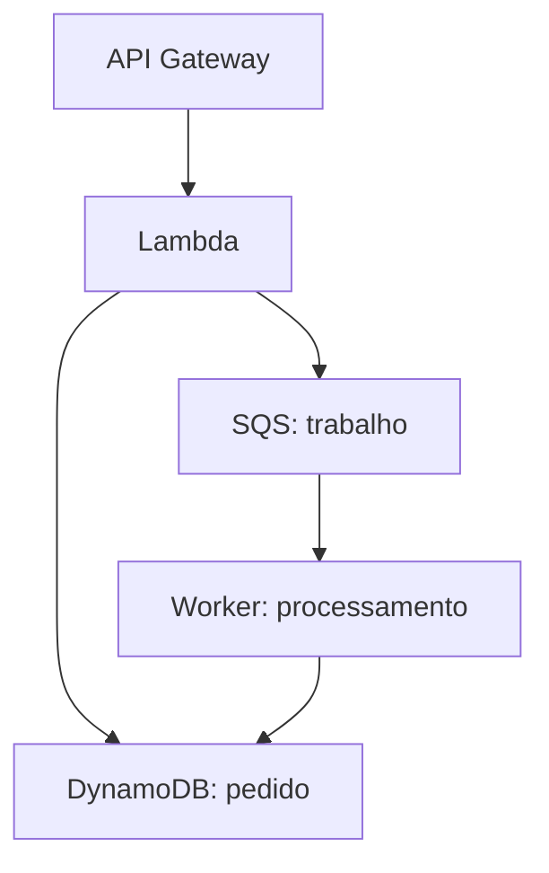

# Estudar AWS sem abrir o console

<!-- didatico:inicio -->
## 🧭 Antes de ler

**Por que esta página existe?** Você lê o nome e as opções de um serviço, mas ainda não consegue explicar qual trabalho ele faz sem ver uma tela.

**Como usar?** Este roteiro ensina a estudar pela necessidade, pelo recurso, pela ação e pelos limites. Primeiro entenda o problema; depois imagine o que é configurado e o que acontece.

**Exemplo:** Para EC2, explique que você recebe uma máquina virtual para executar seu programa. Para S3, explique que recebe armazenamento de objetos. Eles atendem trabalhos diferentes.
<!-- didatico:fim -->

O objetivo da CLF-C02 é reconhecer conceitos, posicionar serviços e escolher soluções para necessidades comuns.
O [guia oficial](https://docs.aws.amazon.com/aws-certification/latest/cloud-practitioner-02/cloud-practitioner-02.html)
exclui tarefas como implementação, programação, troubleshooting e testes de carga do perfil esperado.
Você não precisa decorar telas para entender os serviços. Precisa conseguir explicar recursos, ações e condições.

## Roteiro para cada tópico

1. Leia **Antes de começar** e explique os termos novos com suas palavras.
2. Leia o conteúdo e o **Aprofundamento para a prova**: funcionamento, decisão e limites.
3. Responda ao exercício antes de abrir a resposta comentada.
4. Nas fichas indicadas, leia a tabela **Ficha prática**. Imagine os recursos criados, as decisões tomadas e o caminho dos dados.
5. Diga por que escolheu o serviço e por que o serviço parecido não atende ao requisito.
6. Mude um requisito do cenário e explique se a resposta muda. Use os flashcards para revisar depois.

## Seis perguntas que substituem a memorização da tela

| Pergunta | Exemplo com EC2 |
|---|---|
| Qual recurso eu crio? | Uma instância, a partir de AMI e tipo, numa subnet/AZ |
| O que configuro? | Capacidade, rede, acesso, disco, role e opções de operação |
| O que entra e o que sai? | Requisições chegam à aplicação; ela processa e devolve/grava resultados |
| Quem pode acessar? | Rede permite conexão; identidade/credenciais autorizam ações; aplicação pode ter autenticação própria |
| Quem mantém cada camada? | AWS mantém infraestrutura; cliente mantém SO convidado, aplicação e dados |
| O que custa ou persiste quando paro? | EBS e outros recursos mantidos podem custar; parar não cancela compromissos |

## Quatro significados diferentes de “não pode”

| Situação | Como reconhecer | Exemplo |
|---|---|---|
| Não é capacidade do serviço | Outro tipo de recurso é necessário | S3 não executa código PHP de back-end |
| Pode, mas falta configuração | Serviço tem a capacidade e exige preparação | EC2 sem rota/endereço/regras apropriados não fica acessível pela internet |
| Pode, mas falta permissão | Rede funciona, mas ação é negada | Role sem acesso ao objeto/chave KMS não lê um objeto SSE-KMS |
| Depende de modalidade/limite | Só certas opções suportam a ação | EBS Multi-Attach exige tipos e condições específicos; não é EFS |

Não confunda **limite técnico**, **quota ajustável**, **restrição de plano** e **status de escopo da prova**.
Um pedido de aumento de quota pode ser analisado; um limite rígido exige outra solução.
“Serverless” significa que o provedor administra servidores; cliente ainda configura segurança, código e dados.

## Exemplo completo: loja com processamento de pedidos

O cliente chama uma API. API Gateway recebe a chamada; Lambda executa a lógica autorizada.
O pedido é persistido em DynamoDB e um trabalho pode ser colocado em SQS para processamento posterior.
CloudWatch observa execução; CloudTrail ajuda a auditar ações AWS cobertas. Cada parte exige configuração.

| Decisão | Por que ela importa |
|---|---|
| Autorizar a chamada da API | Publicar uma API não significa permitir qualquer pessoa executar a operação |
| Definir a role da função | A função precisa das ações específicas no banco, fila e logs |
| Escolher chaves e consultas | DynamoDB não é substituto automático de qualquer esquema relacional |
| Excluir mensagem após sucesso | Recebimento SQS não é exclusão; falhas podem levar a novo processamento |
| Tratar repetição com idempotência | Uma repetição não deve cobrar o mesmo pedido duas vezes |
| Considerar custos de cada parte | API, função, banco, fila, logs e rede têm unidades de cobrança próprias |

Este cenário explica relações; não é recomendação universal de arquitetura.
Persistir pedido e publicar mensagem em serviços distintos exige tratamento de falhas entre etapas em uma implementação real.
Para a prova, foque no papel de cada serviço; implementação detalhada fica para estudo posterior.

## Como saber se entendeu

- **Reconheço:** identifico o serviço por nome.
- **Explico:** descrevo recurso, configuração, responsabilidade e limite sem copiar o texto.
- **Escolho:** comparo alternativas usando o requisito, não apenas uma palavra-chave.
- **Transfiro:** mudo o cenário e justifico a nova decisão.

Os exercícios novos são autorais e não integram automaticamente os 302 flashcards nem as 65 questões do simulado.
Um bom desempenho nesse único banco não garante prontidão: use questões novas e revise as explicações dos erros.
700 é uma **nota escalonada**; não corresponde diretamente a 70% de acertos.

## Referências

- [Objetivo, tarefas e resultado da CLF-C02](https://docs.aws.amazon.com/aws-certification/latest/cloud-practitioner-02/cloud-practitioner-02.html)
- [Métodos de acesso e seleção de serviços](https://docs.aws.amazon.com/aws-certification/latest/cloud-practitioner-02/cloud-practitioner-02-domain3.html)
- [Responsabilidade e controle de acesso](https://docs.aws.amazon.com/aws-certification/latest/cloud-practitioner-02/cloud-practitioner-02-domain2.html)
- [Arquitetura e ciclo de mensagens SQS](https://docs.aws.amazon.com/AWSSimpleQueueService/latest/SQSDeveloperGuide/welcome.html)
- [Auditoria desta revisão](auditoria-conteudo-2026-10.md)

[Voltar ao índice principal](../../README.md)
