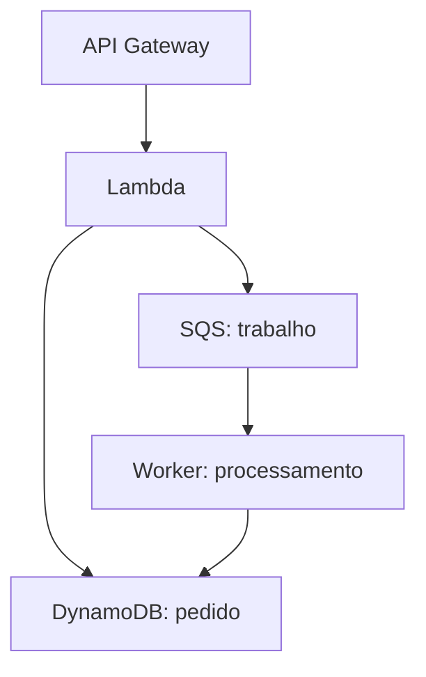

# Estudar AWS sem abrir o console

<!-- didatico:inicio -->
## 🧭 Antes de ler

**Por que esta página existe?** Você lê o nome e as opções de um serviço, mas ainda não consegue explicar qual trabalho ele faz sem ver uma tela.

**Como usar?** Este roteiro ensina a estudar pela necessidade, pelo recurso, pela ação e pelos limites. Primeiro entenda o problema; depois imagine o que é configurado e o que acontece.

**Exemplo:** Para EC2, explique que você recebe uma máquina virtual para executar seu programa. Para S3, explique que recebe armazenamento de objetos. Eles atendem trabalhos diferentes.
<!-- didatico:fim -->

O objetivo da CLF-C02 é reconhecer conceitos, posicionar serviços e escolher soluções para necessidades comuns.

O [guia oficial](https://docs.aws.amazon.com/aws-certification/latest/cloud-practitioner-02/cloud-practitioner-02.html)
**Antes de ler este trecho:**

- **carga:** Aplicação ou conjunto de tarefas com seus recursos e necessidades. Avaliar uma carga significa avaliar o trabalho completo, não uma única máquina isolada.

exclui tarefas como implementação, programação, troubleshooting e testes de carga do perfil esperado.

Você não precisa decorar telas para entender os serviços. Precisa conseguir explicar recursos, ações e condições.

## Roteiro para cada tópico

1. Leia **Antes de começar** e explique os termos novos com suas palavras.

2. Leia o conteúdo e o **Aprofundamento para a prova**: funcionamento, decisão e limites.

3. Responda ao exercício antes de abrir a resposta comentada.

4. Nas fichas indicadas, leia a tabela **Ficha prática**. Imagine os recursos criados, as decisões tomadas e o caminho dos dados.

5. Diga por que escolheu o serviço e por que o serviço parecido não atende ao requisito.

6. Mude um requisito do cenário e explique se a resposta muda. Use os flashcards para revisar depois.

## Seis perguntas que substituem a memorização da tela

**Antes de ler este trecho:**

- **EC2:** O EC2 permite alugar um computador que funciona no datacenter da AWS.
- **EBS:** O EBS fornece volumes, isto é, discos virtuais que podem ser conectados a máquinas EC2 compatíveis.
- **AWS:** Amazon Web Services: provedor dos serviços de nuvem estudados aqui. Uma conta pode criar recursos e recebe cobrança conforme os serviços utilizados.
- **recurso:** Algo criado ou administrado num serviço, como uma máquina, um bucket ou uma tabela. Criar um recurso não é o mesmo que contratar toda uma aplicação pronta.
- **SO:** Software básico da máquina, como Linux ou Windows. Ele administra arquivos, memória e execução de programas; atualizar esse software é diferente de atualizar a aplicação.
- **AZ:** Parte isolada da infraestrutura dentro de uma região, formada por um ou mais datacenters. Distribuir recursos entre zonas pode reduzir o impacto de uma falha localizada.
- **capacidade:** Recursos disponíveis para realizar trabalho, como processamento, memória, espaço ou quantidade de operações. A unidade depende do serviço.
- **rede:** Conjunto de caminhos e regras para computadores e recursos se comunicarem. Existir na mesma conta não garante comunicação entre dois recursos.
- **subnet:** Segmento de uma rede virtual. Na VPC, uma subnet pertence a uma zona de disponibilidade; suas rotas e controles ajudam a definir a conectividade.
- **identidade:** Quem realiza uma ação: pessoa, programa ou sessão. Identificar o autor é diferente de decidir se a ação está autorizada.
- **autenticação:** Verificação de quem está acessando. Confirmar a identidade não autoriza qualquer ação no sistema.
- **credenciais:** Informações usadas para comprovar ou representar uma identidade. Credenciais temporárias expiram; credenciais de longa duração precisam de proteção e administração.
- **role:** Papel que fornece permissões a uma sessão que o assume. O termo função IAM não significa um trecho de código como uma função Lambda.
- **AMI:** Imagem de máquina EC2: modelo com o software necessário para iniciar uma instância. A imagem precisa ser compatível com a configuração de execução escolhida.
- **instância:** Máquina virtual de um serviço de computação, ou unidade de execução indicada pelo serviço. Em EC2, ela pode estar executando, parada ou em outro estado; não deixa de ser instância ao parar.

| Pergunta | Exemplo com EC2 |
|---|---|
| Qual recurso eu crio? | Uma instância, a partir de AMI e tipo, numa subnet/AZ |
| O que configuro? | Capacidade, rede, acesso, disco, role e opções de operação |
| O que entra e o que sai? | Requisições chegam à aplicação; ela processa e devolve/grava resultados |
| Quem pode acessar? | Rede permite conexão; identidade/credenciais autorizam ações; aplicação pode ter autenticação própria |
| Quem mantém cada camada? | AWS mantém infraestrutura; cliente mantém SO convidado, aplicação e dados |
| O que custa ou persiste quando paro? | EBS e outros recursos mantidos podem custar; parar não cancela compromissos |

## Quatro significados diferentes de “não pode”

**Antes de ler este trecho:**

- **S3:** O S3 guarda dados como objetos: conteúdo, nome de identificação e informações associadas.
- **EFS:** O EFS oferece um sistema de arquivos compartilhado.
- **KMS:** Serviço AWS para gerenciar chaves e operações criptográficas. Ter uma chave não ativa automaticamente criptografia em todos os recursos.
- **SSE-KMS:** Formas de criptografia no servidor do S3, que diferem na origem e administração das chaves e, no último caso, nas camadas. A tabela da seção distingue essas escolhas.
- **objeto:** Unidade de dados guardada no armazenamento de objetos: conteúdo, identificação e informações associadas. Não é uma máquina nem um programa em execução.
- **chave:** Pode indicar identificação de um registro, identificação de um objeto ou elemento criptográfico. Leia o contexto: localizar um dado e protegê-lo são tarefas diferentes.
- **back-end:** Parte que processa regras e dados de uma aplicação. É diferente da interface que a pessoa vê no navegador ou aplicativo.
- **PHP:** Linguagem de programação usada em aplicações. A plataforma de hospedagem precisa de ambiente compatível para executar seu código.

| Situação | Como reconhecer | Exemplo |
|---|---|---|
| Não é capacidade do serviço | Outro tipo de recurso é necessário | S3 não executa código PHP de back-end |
| Pode, mas falta configuração | Serviço tem a capacidade e exige preparação | EC2 sem rota/endereço/regras apropriados não fica acessível pela internet |
| Pode, mas falta permissão | Rede funciona, mas ação é negada | Role sem acesso ao objeto/chave KMS não lê um objeto SSE-KMS |
| Depende de modalidade/limite | Só certas opções suportam a ação | EBS Multi-Attach exige tipos e condições específicos; não é EFS |

**Antes de ler este trecho:**

- **quota:** Limite de uso de um serviço ou recurso. Algumas quotas podem ser aumentadas mediante solicitação; limite não significa capacidade já reservada.

Não confunda **limite técnico**, **quota ajustável**, **restrição de plano** e **status de escopo da prova**.

Um pedido de aumento de quota pode ser analisado; um limite rígido exige outra solução.
**Antes de ler este trecho:**

- **serverless:** Modelo em que o cliente não administra diretamente os servidores da execução. Os servidores existem e há cobrança, configuração e limites.

“Serverless” significa que o provedor administra servidores; cliente ainda configura segurança, código e dados.

## Exemplo completo: loja com processamento de pedidos

**Antes de ler este trecho:**

- **Lambda:** No Lambda, você entrega uma função, isto é, um trecho de programa.
- **API Gateway:** API Gateway ajuda a publicar e administrar APIs.
- **API:** Interface pela qual um programa pede uma operação a outro sistema. Por exemplo, pedir ao S3 que guarde um arquivo é uma chamada de API.

O cliente chama uma API. API Gateway recebe a chamada; Lambda executa a lógica autorizada.
**Antes de ler este trecho:**

- **DynamoDB:** DynamoDB é um banco gerenciado que organiza dados em tabelas de itens.
- **SQS:** SQS guarda mensagens numa fila até que consumidores as recebam e processem.

O pedido é persistido em DynamoDB e um trabalho pode ser colocado em SQS para processamento posterior.
**Antes de ler este trecho:**

- **CloudWatch:** Ferramentas AWS para métricas, logs e alarmes, conforme a coleta e a configuração. Seu foco é observar comportamento e operação.
- **CloudTrail:** Registro de atividades e chamadas AWS compatíveis. Ajuda a analisar quem realizou uma operação, em vez de medir sozinho a velocidade da aplicação.

CloudWatch observa execução; CloudTrail ajuda a auditar ações AWS cobertas. Cada parte exige configuração.

**Antes de ler este trecho:**

- **worker:** Programa que recebe e processa dados ou tarefas. Ele precisa realizar o trabalho e tratar falhas, não apenas receber a mensagem.

**Antes de ler este trecho:**

- **idempotência:** Repetir uma operação sem duplicar seu efeito de negócio. Por exemplo, receber novamente o mesmo pedido não deve gerar uma segunda cobrança indevida.

| Decisão | Por que ela importa |
|---|---|
| Autorizar a chamada da API | Publicar uma API não significa permitir qualquer pessoa executar a operação |
| Definir a role da função | A função precisa das ações específicas no banco, fila e logs |
| Escolher chaves e consultas | DynamoDB não é substituto automático de qualquer esquema relacional |
| Excluir mensagem após sucesso | Recebimento SQS não é exclusão; falhas podem levar a novo processamento |
| Tratar repetição com idempotência | Uma repetição não deve cobrar o mesmo pedido duas vezes |
| Considerar custos de cada parte | API, função, banco, fila, logs e rede têm unidades de cobrança próprias |

Este cenário explica relações; não é recomendação universal de arquitetura.

Persistir pedido e publicar mensagem em serviços distintos exige tratamento de falhas entre etapas em uma implementação real.

Para a prova, foque no papel de cada serviço; implementação detalhada fica para estudo posterior.

## Como saber se entendeu

**Reconheço:** identifico o serviço por nome.

**Explico:** descrevo recurso, configuração, responsabilidade e limite sem copiar o texto.

**Escolho:** comparo alternativas usando o requisito, não apenas uma palavra-chave.

**Transfiro:** mudo o cenário e justifico a nova decisão.

Os exercícios novos são autorais e não integram automaticamente os 302 flashcards nem as 65 questões do simulado.

Um bom desempenho nesse único banco não garante prontidão: use questões novas e revise as explicações dos erros.

700 é uma **nota escalonada**; não corresponde diretamente a 70% de acertos.

## Referências

[Objetivo, tarefas e resultado da CLF-C02](https://docs.aws.amazon.com/aws-certification/latest/cloud-practitioner-02/cloud-practitioner-02.html)

[Métodos de acesso e seleção de serviços](https://docs.aws.amazon.com/aws-certification/latest/cloud-practitioner-02/cloud-practitioner-02-domain3.html)

[Responsabilidade e controle de acesso](https://docs.aws.amazon.com/aws-certification/latest/cloud-practitioner-02/cloud-practitioner-02-domain2.html)

[Arquitetura e ciclo de mensagens SQS](https://docs.aws.amazon.com/AWSSimpleQueueService/latest/SQSDeveloperGuide/welcome.html)

[Auditoria desta revisão](auditoria-conteudo-2026-10.md)

**Antes de ler este trecho:**

- **índice:** Estrutura adicional para apoiar consultas. Pode melhorar um padrão de acesso, mas possui condições de atualização, capacidade e custo.

[Voltar ao índice principal](../../README.md)
