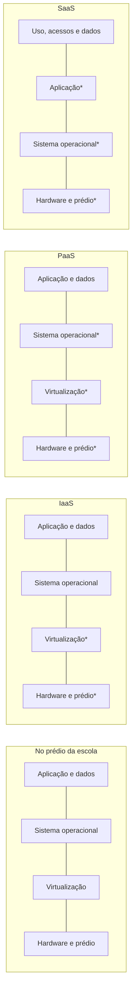

<!-- autoral -->

# 1.1 O que é computação em nuvem

> **Domínio 1 — Conceitos de Nuvem (24% da prova)** · Depende das aulas [0.1](../fundamentos/01-servidor-e-virtualizacao.md), [0.2](../fundamentos/02-rede.md) e [0.4](../fundamentos/04-api-e-filas.md)

> 🔎 **Fichas para aprofundar:** [EC2](../../servicos/computacao/ec2.md) · [Lambda](../../servicos/computacao/lambda.md)

🏠 [Índice do domínio](README.md) · [1.2 As 6 vantagens da computação em nuvem](02-vantagens-da-nuvem.md) ➡️

---

Até hoje, o sistema de matrícula da escola roda num computador guardado num armário da secretaria. Para colocá-lo de pé, a escola precisou comprar o servidor, esperar a entrega, achar um lugar com tomada e ventilação, instalar o sistema operacional e contratar alguém para cuidar de tudo. Se o disco queimar na semana de matrícula, alguém tem de comprar outro às pressas. E o servidor passa a maior parte do ano quase parado, porque a matrícula só lota o sistema em janeiro.

A **computação em nuvem** muda esse arranjo: em vez de comprar e manter o equipamento, a escola usa recursos de um provedor, como a AWS, pela internet, quando precisa, e paga pelo que usa. Esta aula explica o que essa definição quer dizer na prática, os níveis de serviço que um provedor pode oferecer, o que é serverless e onde os recursos podem ficar: só na nuvem, parte na nuvem e parte no prédio da empresa, ou só no prédio.

## O que a AWS chama de computação em nuvem

A AWS define computação em nuvem como a entrega **sob demanda** de capacidade de computação, bancos de dados, armazenamento, aplicações e outros recursos de TI, por meio de uma plataforma de serviços de nuvem, **pela internet**, com preço **pago pelo uso** (*pay-as-you-go*). Cada parte da definição resolve um pedaço do problema da escola.

**Sob demanda** quer dizer que o recurso aparece quando é pedido, em minutos, sem comprar nem esperar entrega. **Pela internet** quer dizer que tudo é pedido e usado à distância: o console no navegador, a linha de comando e os programas fazem chamadas de API, como você viu na [aula 0.4](../fundamentos/04-api-e-filas.md). **Pago pelo uso** quer dizer que não há investimento grande antes de começar: a escola paga pelos recursos enquanto os usa.

Por trás disso há uma divisão de tarefas. O provedor é dono do hardware conectado à rede e o mantém; o cliente escolhe e usa o que precisa. Os servidores físicos, a virtualização que os divide em máquinas virtuais e os prédios onde tudo fica, apresentados na [aula 0.1](../fundamentos/01-servidor-e-virtualizacao.md), continuam existindo, mas passam a ser trabalho da AWS. É por isso que a AWS descreve a nuvem como uma forma de evitar trabalho que não diferencia o negócio, como comprar equipamento, mantê-lo e planejar capacidade.

O limite da definição é importante: nuvem não quer dizer grátis nem pronto. Paga-se pelo que se usa, e o cliente continua configurando e protegendo o que coloca na nuvem. A divisão exata entre o que é da AWS e o que é do cliente é o assunto da [aula 2.1](../02-seguranca-e-conformidade/01-responsabilidade-compartilhada.md).

## IaaS, PaaS e SaaS: quanto o provedor administra

Os provedores oferecem recursos em níveis diferentes de controle e gerenciamento. O mercado agrupa esses níveis em três modelos tradicionais. A própria AWS usa esses nomes para ajudar na escolha, mas avisa que prefere pensar em soluções para cada necessidade, que podem misturar vários tipos de serviço. Leia os modelos como uma régua, não como caixas rígidas.

Na **infraestrutura como serviço** (IaaS), o provedor entrega os blocos básicos: rede, computadores (virtuais ou em hardware dedicado) e espaço de armazenamento. É o modelo com mais flexibilidade e controle, e o mais parecido com a TI tradicional. Uma instância do Amazon EC2, a máquina virtual da AWS que veremos na [aula 3.3](../03-tecnologia-e-servicos/03-ec2.md), é o exemplo clássico: a AWS cuida do hardware e da virtualização, e o cliente instala e atualiza o sistema operacional e tudo o que roda nele.

Na **plataforma como serviço** (PaaS), o provedor também cuida da infraestrutura por baixo, normalmente o hardware e o sistema operacional, e o cliente se concentra em implantar e administrar a própria aplicação. Somem tarefas como comprar recursos, planejar capacidade, manter software básico e aplicar patches. O cliente continua responsável pelo código, pela configuração da aplicação e pelos dados.

No **software como serviço** (SaaS), o provedor entrega um produto completo, executado e administrado por ele, em geral uma aplicação para o usuário final, como um e-mail pela web. O cliente não pensa em como o serviço é mantido nem na infraestrutura; pensa em como vai usar o software. Mesmo assim, decidir quem tem acesso e o que é guardado nele continua sendo tarefa de quem usa.

*Figura 1.1 — Da esquerda para a direita, o provedor assume mais camadas. As camadas marcadas com asterisco ficam com o provedor; as demais continuam com o cliente. Em todos os modelos, uso, acessos e dados continuam sendo decisões do cliente.*

## Serverless: sem administrar servidores

Uma ideia que aparece muito na prova não cabe bem em nenhuma das três caixas: **serverless** (sem servidor). Os servidores continuam existindo, mas o cliente não os provisiona nem os administra. O AWS Lambda é o exemplo mais citado: é um serviço de computação serverless que roda código sem que o cliente provisione ou gerencie servidores, e a AWS cuida da manutenção dos servidores, do provisionamento de capacidade, do escalonamento e dos patches. O cliente cuida do código e da configuração da função.

Há quem classifique o Lambda como PaaS, mas é mais útil reconhecê-lo pelo que ele é: computação serverless, cobrada pelo uso. O Lambda e os outros serviços serverless voltam na [aula 3.5](../03-tecnologia-e-servicos/05-containers-e-serverless.md).

## Onde os recursos ficam: nuvem, híbrido e on-premises

Além do nível de serviço, existe a pergunta de onde a aplicação roda. A AWS descreve três **modelos de implantação**.

Na implantação **em nuvem**, todas as partes da aplicação rodam na nuvem. A aplicação pode ter nascido lá ou ter sido migrada de uma infraestrutura existente, e pode usar desde peças de baixo nível, como máquinas virtuais, até serviços de nível mais alto que escondem o gerenciamento e o escalonamento.

Na implantação **híbrida**, recursos na nuvem e recursos fora dela são conectados. O caso mais comum é ligar a nuvem à infraestrutura que a empresa já tem no próprio prédio, para estender e fazer crescer essa infraestrutura na nuvem sem abandonar o que já existe. As formas de fazer essa conexão aparecem na [aula 3.10](../03-tecnologia-e-servicos/10-rede-e-entrega-de-conteudo.md).

Na implantação **on-premises** (nas instalações da própria empresa), os recursos ficam no datacenter da empresa, com ferramentas de virtualização e gerenciamento. Às vezes isso é chamado de **nuvem privada**. Esse modelo não oferece muitos dos benefícios da computação em nuvem, mas é escolhido por oferecer recursos dedicados.

## Na prova

- **Definição de nuvem = sob demanda, pela internet, pago pelo uso.** Enunciados que falam em "sem investimento antecipado em hardware" e "recursos em minutos" estão descrevendo essas três ideias.
- **"Mais controle sobre o sistema operacional" = IaaS, como o EC2.** Quanto mais o provedor administra, menos o cliente controla.
- **"Só implantar a aplicação, sem cuidar de hardware e sistema operacional" = PaaS.**
- **"Usar um software pronto, mantido pelo provedor" = SaaS.**
- **"Rodar código sem provisionar ou gerenciar servidores" = serverless, como o AWS Lambda.**
- **"Parte no datacenter próprio, parte na AWS, conectadas" = implantação híbrida.**
- **Nenhum modelo tira do cliente as decisões sobre dados e acessos.** Gerenciado não quer dizer que toda a responsabilidade passou para o provedor.

## Caso resolvido

**Situação.** A escola tem três sistemas: o sistema de matrícula, que precisa de uma versão específica do sistema operacional; um sistema de notas que só precisa receber o código novo a cada semestre; e o e-mail dos professores. Além disso, a diretora quer manter o arquivo antigo de documentos num servidor da secretaria por mais um ano, ligado aos sistemas novos na AWS.

**Raciocínio.** O sistema de matrícula precisa de controle sobre o sistema operacional: é um caso de IaaS, como uma instância EC2, em que a escola instala e atualiza o sistema. O sistema de notas só precisa que alguém rode o código: um serviço de plataforma ou um serviço serverless tira da escola o cuidado com servidores e patches. O e-mail dos professores pode ser um SaaS: a escola só usa o produto e decide quem tem conta. E, enquanto o arquivo antigo continuar no servidor da secretaria, ligado aos sistemas na AWS, a escola tem uma implantação híbrida.

**Por que as alternativas tentadoras falham.** Colocar o sistema de matrícula num SaaS não funciona, porque um produto pronto não deixa a escola escolher o sistema operacional. Achar que, no SaaS de e-mail, a escola não tem mais nenhuma responsabilidade também falha: criar e remover contas e cuidar do que é guardado continua sendo dela. E chamar de "nuvem" um arranjo em que parte dos dados fica na secretaria esquece que a ligação entre os dois lados é exatamente o que define o modelo híbrido.

## Revisão

Tente responder antes de abrir cada resposta.

### Como a AWS define computação em nuvem?

Ver resposta

Como a entrega sob demanda de recursos de TI, como computação, bancos de dados, armazenamento e aplicações, pela internet, com preço pago pelo uso.

Comentário: as três ideias (sob demanda, pela internet, pago pelo uso) aparecem de várias formas nos enunciados. O provedor é dono do hardware e o mantém; o cliente escolhe e usa o que precisa.

### Qual é a diferença entre IaaS, PaaS e SaaS?

Ver resposta

É quanto o provedor administra. No IaaS, o provedor entrega rede, computadores e armazenamento, e o cliente cuida do sistema operacional para cima. No PaaS, o provedor também cuida do hardware e do sistema operacional, e o cliente cuida da aplicação. No SaaS, o provedor entrega um produto completo, e o cliente só o usa.

Comentário: a AWS usa esses nomes como uma ajuda, não como categorias rígidas. Em todos os modelos, dados e acessos continuam com o cliente.

### O que quer dizer serverless?

Ver resposta

Que o cliente roda código ou usa um serviço sem provisionar nem administrar servidores. No AWS Lambda, a AWS cuida da manutenção dos servidores, da capacidade, do escalonamento e dos patches.

Comentário: os servidores existem, mas não são trabalho do cliente. O cliente continua cuidando do código e da configuração.

### Uma empresa mantém dados no próprio datacenter e usa a AWS para o resto, com os dois lados conectados. Qual é o modelo de implantação?

Ver resposta

Híbrido: recursos na nuvem e recursos fora dela, conectados.

Comentário: se tudo rodasse na AWS, seria implantação em nuvem; se tudo ficasse no datacenter, com virtualização, seria on-premises, também chamado de nuvem privada.

### Por que usar a nuvem não tira toda a responsabilidade do cliente?

Ver resposta

Porque o provedor assume o hardware e, dependendo do modelo, outras camadas, mas o cliente continua decidindo e configurando o que coloca na nuvem, como dados, acessos e, no IaaS, o sistema operacional.

Comentário: essa divisão é o modelo de responsabilidade compartilhada, detalhado na aula 2.1.

## Resumo

- Computação em nuvem é a entrega sob demanda de recursos de TI pela internet, com preço pago pelo uso.
- O provedor é dono do hardware e o mantém; o cliente escolhe e usa o que precisa.
- IaaS entrega infraestrutura; PaaS também cuida do sistema operacional; SaaS entrega um produto completo.
- Serverless é rodar código sem provisionar nem administrar servidores, como no AWS Lambda.
- Os modelos de implantação são nuvem, híbrido e on-premises (nuvem privada).
- Em todos os modelos, dados e acessos continuam sendo decisões do cliente.

## Fontes oficiais

Verificadas em 06/10/2026.

- [What is cloud computing? (Overview of Amazon Web Services)](https://docs.aws.amazon.com/whitepapers/latest/aws-overview/what-is-cloud-computing.html): definição de computação em nuvem; o provedor é dono do hardware e o mantém.
- [Types of cloud computing (Overview of Amazon Web Services)](https://docs.aws.amazon.com/whitepapers/latest/aws-overview/types-of-cloud-computing.html): modelos de implantação em nuvem, híbrido e on-premises (nuvem privada); evitar trabalho que não diferencia o negócio.
- [What is cloud computing? (página da AWS)](https://aws.amazon.com/what-is-cloud-computing/): definições de IaaS, PaaS e SaaS.
- [Types of cloud computing (página da AWS)](https://aws.amazon.com/types-of-cloud-computing/): a AWS usa IaaS, PaaS e SaaS como agrupamento tradicional, mas foca em soluções que podem misturar tipos de serviço.
- [What is AWS Lambda?](https://docs.aws.amazon.com/lambda/latest/dg/welcome.html): computação serverless; roda código sem provisionar ou gerenciar servidores; a AWS cuida de manutenção, capacidade, escalonamento e patches; cobrança pelo uso, sem compromisso antecipado.

<!-- notas:inicio -->
## 📝 Minhas anotações

<!-- Escreva aqui suas observações, dúvidas e as questões que você errou sobre o tema. -->
<!-- notas:fim -->

---

🏠 [Índice do domínio](README.md) · [1.2 As 6 vantagens da computação em nuvem](02-vantagens-da-nuvem.md) ➡️
