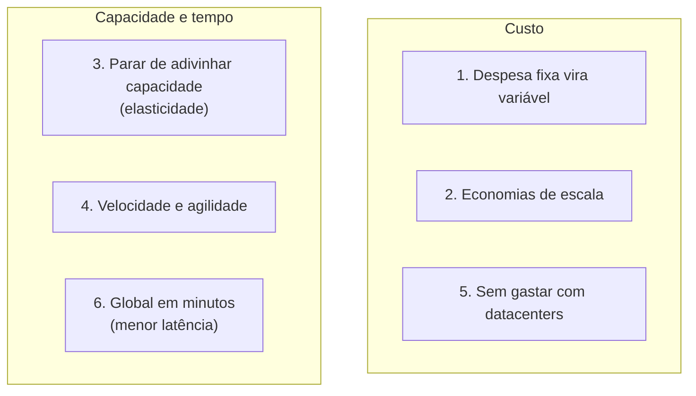

<!-- autoral -->

# 1.2 As 6 vantagens da computação em nuvem

> **Domínio 1 — Conceitos de Nuvem (24% da prova)** · Depende da aula [1.1](01-o-que-e-computacao-em-nuvem.md)

⬅️ [1.1 O que é computação em nuvem](01-o-que-e-computacao-em-nuvem.md) · 🏠 [Índice do domínio](README.md) · 🏫 [O caso da escola](../00-guia-do-exame/caso-da-escola.md) · [1.3 Conceitos de arquitetura que a prova cobra](03-conceitos-de-arquitetura.md) ➡️

---

Na reunião do conselho, a diretora precisa justificar a mudança do sistema de matrícula para a AWS. O tesoureiro pergunta por que não comprar um servidor novo, maior, que aguente janeiro inteiro. A coordenadora pedagógica quer saber se o sistema vai ficar mais rápido para os pais que moram longe. E o professor de informática lembra que, da última vez, demorou dois meses entre aprovar a compra do servidor e o sistema entrar no ar.

Cada pergunta toca numa vantagem diferente da nuvem. A AWS resume essas vantagens em seis frases que a prova usa quase palavra por palavra. Esta aula explica cada uma pelo problema que resolve e pelo limite que tem, e liga as seis às ideias de agilidade, elasticidade, alcance global e alta disponibilidade, que o guia do exame também cobra.

## Trocar despesa fixa por despesa variável

A primeira vantagem é **trocar despesa fixa por despesa variável**. No modelo antigo, a escola investe pesado em servidores e espaço antes de saber como vai usá-los. Na nuvem, ela paga quando consome recursos de computação, e só pelo quanto consome.

Na contabilidade, o investimento antecipado em equipamento costuma ser chamado de despesa de capital (CapEx) e o gasto contínuo com o uso, de despesa operacional (OpEx); por isso a vantagem também aparece como "trocar CapEx por OpEx". O limite é que despesa variável não quer dizer despesa pequena: um recurso esquecido ligado continua gerando cobrança. A [aula 1.7](07-economia-da-nuvem.md) aprofunda custos fixos e variáveis.

## Beneficiar-se de economias de escala

A segunda é **beneficiar-se de economias de escala massivas**. Como o uso de centenas de milhares de clientes é somado na nuvem, provedores como a AWS conseguem economias de escala maiores, que viram preços menores no pagamento por uso. A escola sozinha nunca compraria servidores, energia e rede pelo preço que a AWS consegue.

## Parar de adivinhar a capacidade

A terceira é **parar de adivinhar a capacidade**. Quando a decisão de capacidade é tomada antes de colocar a aplicação no ar, o resultado costuma ser um de dois problemas: recursos caros parados ou capacidade insuficiente. É o dilema do tesoureiro: um servidor que aguente janeiro fica ocioso de fevereiro a dezembro; um servidor do tamanho do resto do ano não aguenta janeiro. Na nuvem, a escola usa tanta ou tão pouca capacidade quanto precisa e aumenta ou diminui em poucos minutos.

Essa vantagem anda junto com a **elasticidade**: em vez de provisionar recursos a mais para picos futuros, provisiona-se o que realmente é necessário e aumenta-se ou reduz-se a capacidade à medida que a necessidade muda. A [aula 1.3](03-conceitos-de-arquitetura.md) diferencia elasticidade de escalabilidade.

## Aumentar a velocidade e a agilidade

A quarta é **aumentar a velocidade e a agilidade**. Na nuvem, um recurso novo está a um clique de distância, e o tempo para entregá-lo à equipe cai de semanas para minutos. Como experimentar e desenvolver fica muito mais barato e rápido, a organização ganha **agilidade**: pode testar uma ideia nova, ver se funciona e desligar se não funcionar. É a resposta ao professor de informática: os dois meses de espera viram minutos.

## Parar de gastar com datacenters

A quinta é **parar de gastar dinheiro para operar e manter datacenters**. Em vez de montar racks, empilhar e ligar servidores, trabalho pesado que a AWS chama de *heavy lifting*, a escola se concentra nos projetos que a diferenciam: o ensino e o atendimento às famílias.

O limite é que a escola não deixa de ter trabalho técnico: ela ainda configura e protege o que coloca na nuvem, como você viu na [aula 1.1](01-o-que-e-computacao-em-nuvem.md).

## Tornar-se global em minutos

A sexta é **tornar-se global em minutos**. A AWS tem infraestrutura no mundo todo, e uma aplicação pode ser implantada em várias Regiões com poucos cliques. Colocar a aplicação mais perto dos usuários reduz a **latência**, o tempo de ida e volta de um pedido pela rede, e melhora a experiência deles. É a resposta à coordenadora: se a escola abrir uma unidade em outro país, o sistema pode rodar perto dos novos alunos sem comprar um servidor lá.

As Regiões e as outras partes da infraestrutura global são o assunto da [aula 3.2](../03-tecnologia-e-servicos/02-infraestrutura-global.md). O guia do exame cobra esse benefício como velocidade de implantação e alcance global.

*Figura 1.2 — As seis vantagens agrupadas: três falam de custo e três de capacidade, tempo e alcance.*

## E a alta disponibilidade?

O guia do exame também pede que você entenda a vantagem da **alta disponibilidade**. **Disponibilidade** é a porcentagem do tempo em que uma aplicação está disponível para uso. Na nuvem, é mais fácil e barato montar uma aplicação que continua no ar quando uma peça falha, porque a infraestrutura da AWS oferece locais separados onde é possível rodar cópias da aplicação. Como isso é feito aparece nas aulas [1.3](03-conceitos-de-arquitetura.md) e [3.2](../03-tecnologia-e-servicos/02-infraestrutura-global.md). O limite é que a nuvem oferece os meios; uma aplicação rodando num único servidor continua caindo quando esse servidor cai.

## Na prova

- **A questão descreve uma situação e pede o nome oficial da vantagem.** Treine a tradução de volta: o cenário é o problema, a vantagem é a solução.
- **"Sem investimento antecipado em hardware" = trocar despesa fixa por variável (CapEx por OpEx).**
- **"Preços menores porque a AWS atende muitos clientes" = economias de escala.**
- **"Servidores ociosos fora do pico" ou "falta de capacidade no pico" = parar de adivinhar capacidade.**
- **"Recursos em minutos, experimentar barato" = velocidade e agilidade.**
- **"Foco no negócio e nos clientes, não em montar e ligar servidores" = parar de gastar com datacenters.**
- **"Atender clientes em outros países com baixa latência" = global em minutos.**

## Caso resolvido

**Situação.** O conselho da escola faz três objeções à nuvem: "vamos gastar mais, porque não teremos um servidor nosso"; "e se o número de alunos dobrar no ano que vem?"; e "abrir a unidade de Lisboa vai exigir comprar servidor lá". A diretora quer responder cada uma com a vantagem certa.

**Raciocínio.** A primeira objeção se responde com a troca de despesa fixa por variável e com as economias de escala: a escola paga pelo que usa, a preços que a AWS consegue por atender muitos clientes, e deixa de pagar por um servidor parado onze meses por ano. A segunda se responde com parar de adivinhar a capacidade: se os alunos dobrarem, a capacidade cresce quando for preciso, sem comprar equipamento antes. A terceira se responde com tornar-se global em minutos: o sistema pode ser implantado numa Região perto de Lisboa sem comprar servidor, com menor latência para as famílias de lá.

**Por que as alternativas tentadoras falham.** Responder à segunda objeção com "compramos agora um servidor duas vezes maior" é justamente adivinhar a capacidade, e deixa recursos parados se os alunos não dobrarem. Dizer que a nuvem é sempre mais barata também falha: a despesa variável depende do uso, e recursos esquecidos ligados continuam custando. E responder à terceira com "economias de escala" usa a vantagem errada: o ponto ali é alcance e latência.

## Revisão

Tente responder antes de abrir cada resposta.

### Quais são as seis vantagens da computação em nuvem segundo a AWS?

Ver resposta

Trocar despesa fixa por variável, beneficiar-se de economias de escala, parar de adivinhar a capacidade, aumentar a velocidade e a agilidade, parar de gastar com datacenters e tornar-se global em minutos.

Comentário: a prova raramente pede a lista; ela descreve uma situação e pede a vantagem que a resolve.

### Uma loja tem servidores ociosos o ano todo, exceto na Black Friday. Qual vantagem resolve isso?

Ver resposta

Parar de adivinhar a capacidade: na nuvem, a loja aumenta a capacidade no pico e reduz depois, pagando só pelo que usa.

Comentário: comprar um servidor maior continua sendo adivinhar. A elasticidade é a forma de aproveitar essa vantagem.

### Por que a AWS consegue preços menores que uma empresa sozinha?

Ver resposta

Pelas economias de escala: o uso de centenas de milhares de clientes é somado, o que permite custos menores, repassados no preço por uso.

Comentário: não confunda com trocar despesa fixa por variável, que fala da forma de pagar, não do preço.

### O que quer dizer trocar CapEx por OpEx?

Ver resposta

Trocar o investimento antecipado em equipamento (despesa de capital) por gastos contínuos de acordo com o uso (despesa operacional). É a vantagem de trocar despesa fixa por variável.

Comentário: despesa variável não quer dizer despesa pequena; recursos ligados sem uso continuam gerando cobrança.

### Como a nuvem ajuda a atender usuários em outros continentes?

Ver resposta

Permitindo implantar a aplicação em várias Regiões do mundo com poucos cliques, mais perto dos usuários, o que reduz a latência. É a vantagem de tornar-se global em minutos.

Comentário: latência é o tempo de ida e volta de um pedido pela rede; quanto mais perto, menor.

## Resumo

- Trocar despesa fixa por variável: pagar só quando e quanto se consome.
- Economias de escala: o uso somado de muitos clientes reduz o preço por uso.
- Parar de adivinhar capacidade: aumentar e reduzir em minutos, sem sobra nem falta.
- Velocidade e agilidade: recursos em minutos e experimentos baratos.
- Parar de gastar com datacenters: foco no que diferencia o negócio.
- Global em minutos: implantar em várias Regiões e reduzir a latência.
- Alta disponibilidade e elasticidade são benefícios ligados a essas vantagens e voltam nas aulas 1.3 e 3.2.

## Fontes oficiais

Verificadas em 06/10/2026.

- [Six advantages of cloud computing (Overview of Amazon Web Services)](https://docs.aws.amazon.com/whitepapers/latest/aws-overview/six-advantages-of-cloud-computing.html): as seis vantagens e a explicação de cada uma.
- [What is cloud computing? (página da AWS)](https://aws.amazon.com/what-is-cloud-computing/): benefícios de agilidade, elasticidade, economia e implantação global em minutos com menor latência.
- [Content Domain 1 do guia do exame CLF-C02](https://docs.aws.amazon.com/aws-certification/latest/cloud-practitioner-02/cloud-practitioner-02-domain1.html): benefícios da infraestrutura global (velocidade de implantação, alcance global) e vantagens de alta disponibilidade, elasticidade e agilidade.
- [Availability (Reliability Pillar)](https://docs.aws.amazon.com/wellarchitected/latest/reliability-pillar/availability.html): disponibilidade é a porcentagem do tempo em que uma carga de trabalho está disponível para uso.

<!-- notas:inicio -->
## 📝 Minhas anotações

<!-- Escreva aqui suas observações, dúvidas e as questões que você errou sobre o tema. -->
<!-- notas:fim -->

---

⬅️ [1.1 O que é computação em nuvem](01-o-que-e-computacao-em-nuvem.md) · 🏠 [Índice do domínio](README.md) · [1.3 Conceitos de arquitetura que a prova cobra](03-conceitos-de-arquitetura.md) ➡️
