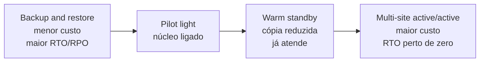

<!-- autoral -->

# 1.3 Conceitos de arquitetura que a prova cobra

> **Domínio 1 — Conceitos de Nuvem (24% da prova)** · Depende das aulas [0.1](../fundamentos/01-servidor-e-virtualizacao.md), [0.4](../fundamentos/04-api-e-filas.md) e [1.2](02-vantagens-da-nuvem.md)

> 🔎 **Fichas para aprofundar:** [EC2 Auto Scaling](../../servicos/computacao/ec2-auto-scaling.md) · [Elastic Load Balancing](../../servicos/computacao/elastic-load-balancing.md) · [SQS](../../servicos/integracao/sqs.md) · [AWS Backup](../../servicos/armazenamento/aws-backup.md)

⬅️ [1.2 As 6 vantagens da computação em nuvem](02-vantagens-da-nuvem.md) · 🏠 [Índice do domínio](README.md) · 🏫 [O caso da escola](../00-guia-do-exame/caso-da-escola.md) · [1.4 AWS Well-Architected Framework](04-well-architected-framework.md) ➡️

---

O sistema de matrícula da escola já está na nuvem, e a equipe de TI tem três medos diferentes. O primeiro: em janeiro, a procura triplica e o sistema fica lento. O segundo: o único servidor que roda o sistema quebra numa terça-feira à tarde. O terceiro: alguém apaga, por engano, a tabela de matrículas, ou uma enchente tira do ar o local onde o sistema roda.

Parecem o mesmo problema, "o sistema parou de atender", mas cada medo pede uma resposta diferente. O primeiro é de **capacidade**, o segundo é de **disponibilidade** e o terceiro é de **recuperação**. A prova mistura essas palavras de propósito, e a maior parte das questões deste assunto se resolve identificando qual dos três problemas o enunciado descreve.

## Escalabilidade: crescer para atender a demanda

**Escalabilidade** é a capacidade de um sistema crescer para atender a uma demanda maior. Há duas formas de crescer, e a AWS descreve as duas com o EC2:

- **Escalar verticalmente** (*scale up*) é usar uma instância maior, com mais processador e memória. É como trocar o computador da secretaria por um mais potente.
- **Escalar horizontalmente** (*scale out*) é adicionar mais instâncias e dividir o trabalho entre elas. É como abrir mais guichês de atendimento.

A escala vertical é simples, mas tem um teto (existe uma instância maior possível) e continua dependendo de uma única máquina. A escala horizontal não tem esse teto prático e ainda ajuda na disponibilidade: o pilar de confiabilidade do Well-Architected recomenda trocar um recurso grande por vários pequenos, para que a falha de um afete menos o conjunto. Para dividir o tráfego entre várias instâncias, entra um balanceador de carga, assunto da [aula 3.4](../03-tecnologia-e-servicos/04-escalabilidade-e-balanceamento.md).

## Elasticidade: crescer e diminuir sozinho

**Elasticidade** é ir além de crescer: é ajustar a capacidade para cima **e para baixo** à medida que a demanda muda, de preferência automaticamente. Na [aula 1.2](02-vantagens-da-nuvem.md) ela apareceu como a forma de parar de adivinhar a capacidade: em vez de provisionar para o pico, provisiona-se o necessário e ajusta-se depois.

O serviço que faz isso com servidores é o **Amazon EC2 Auto Scaling**: você define um grupo de instâncias com tamanho mínimo, máximo e desejado, e políticas de escala; o serviço inicia instâncias quando a demanda sobe e encerra quando cai, sempre dentro desses limites. Na escola, o grupo pode ter duas instâncias o ano todo e chegar a oito em janeiro.

A diferença que a prova cobra é esta: um sistema escalável **consegue** crescer; um sistema elástico **cresce e diminui** acompanhando a demanda, e por isso não paga por capacidade parada. O limite é que escalar uma camada não resolve gargalo em outra: se o banco de dados é o que trava, mais servidores de aplicação não ajudam.

## Alta disponibilidade e tolerância a falhas

**Disponibilidade** é a porcentagem do tempo em que a aplicação está disponível para uso. Uma aplicação de **alta disponibilidade** continua atendendo quando um componente falha, porque detecta o componente com defeito e passa a mandar o tráfego para outro igual. A condição é ter peças redundantes em locais que não falham juntos. A AWS dá o exemplo oposto: uma aplicação que roda em uma única instância EC2, em uma única Zona de Disponibilidade, **não** tem alta disponibilidade.

Cada Região da AWS tem três ou mais **Zonas de Disponibilidade** (AZs), próximas entre si mas fisicamente separadas e isoladas. Cada AZ tem infraestrutura física independente, com ligação de energia, energia de reserva e rede próprias, para que uma falha fique restrita à zona afetada. Rodar cópias da aplicação em mais de uma AZ é a forma mais comum de alta disponibilidade na AWS; a [aula 3.2](../03-tecnologia-e-servicos/02-infraestrutura-global.md) detalha as AZs.

**Tolerância a falhas** é a ideia mais forte: o sistema suporta a falha de uma parte e mantém a disponibilidade porque tem capacidade sobressalente, pronta para assumir 100% do trabalho da parte que falhou, quase sem que o usuário perceba. Na prática, alta disponibilidade aceita uma breve interrupção enquanto o tráfego é desviado; tolerância a falhas busca que a falha nem seja sentida, e custa mais porque mantém sobra.

## Acoplamento fraco e aplicações sem estado

Duas ideias de projeto ajudam a escalar e a conviver com falhas.

No **acoplamento fraco** (*loose coupling*), um componente não depende diretamente do outro estar respondendo naquele instante. Na [aula 0.4](../fundamentos/04-api-e-filas.md) você viu a fila: quem produz o pedido deixa a mensagem na fila, e quem processa busca quando puder. Se o processador cair, os pedidos esperam na fila em vez de se perderem. Na AWS, servem para isso o Amazon SQS (filas), o Amazon SNS (notificações), o Amazon EventBridge (eventos) e o AWS Step Functions (fluxos de trabalho), vistos na [aula 3.13](../03-tecnologia-e-servicos/13-integracao-de-aplicacoes.md). No **acoplamento forte**, ao contrário, a falha ou a mudança de uma parte se espalha para as que dependem dela.

Uma aplicação **sem estado** (*stateless*) não guarda no próprio servidor nada de que o próximo pedido dependa, como a sessão do usuário; esses dados ficam num serviço à parte, como um banco de dados. Assim, qualquer servidor pode atender qualquer pedido, o que permite adicionar e remover servidores à vontade e substituir um servidor que falhou sem que o usuário perca a sessão.

## Recuperação de desastres: RTO e RPO

O terceiro medo da escola é diferente. Alta disponibilidade protege contra a falha de componentes; **recuperação de desastres** (*disaster recovery*, DR) trata de eventos maiores, como um desastre natural, uma falha técnica em grande escala, um ataque ou um erro humano, e de como colocar de volta no ar uma cópia inteira da aplicação.

A AWS dá um exemplo de por que uma coisa não substitui a outra: se os dados são replicados continuamente para outro local, um arquivo apagado ou corrompido na origem também é apagado ou corrompido na cópia. Por isso, a recuperação exige também **backups** de um momento anterior. Replicação mantém o sistema no ar; backup permite voltar no tempo.

Dois objetivos, definidos pela própria organização, orientam a estratégia de DR:

- **RTO** (*Recovery Time Objective*, objetivo de tempo de recuperação): o atraso máximo aceitável entre a interrupção do serviço e sua restauração. Responde a "quanto tempo podemos ficar fora do ar?".
- **RPO** (*Recovery Point Objective*, objetivo de ponto de recuperação): o tempo máximo aceitável desde o último ponto de recuperação dos dados. Responde a "quantos minutos de dados podemos perder?".

## As quatro estratégias de DR

A AWS agrupa as estratégias de recuperação em quatro, do menor custo e complexidade para o maior:

| Estratégia | O que fica pronto na região de recuperação | RTO e RPO |
|---|---|---|
| **Backup and restore** | Cópias dos dados (e da infraestrutura descrita como código), restauradas só no desastre | Os maiores |
| **Pilot light** | Dados replicados e infraestrutura central ligados; servidores de aplicação "desligados", prontos para ser criados | Menores que backup |
| **Warm standby** | Uma cópia reduzida, mas totalmente funcional, da produção, sempre ligada | Menores ainda |
| **Multi-site active/active** | A aplicação rodando ao mesmo tempo em várias Regiões, todas atendendo usuários | Perto de zero |

A diferença entre pilot light e warm standby confunde até a AWS, que explica: o pilot light não consegue atender pedidos sem uma ação prévia, enquanto o warm standby já atende tráfego, com capacidade reduzida. O multi-site é a estratégia mais complexa e cara, e reduz o tempo de recuperação a quase zero na maioria dos desastres; mesmo assim, uma corrupção de dados pode exigir backup.

*Figura 1.3 — As quatro estratégias de recuperação de desastres: quanto mais à direita, mais cara e mais rápida a recuperação.*

## Na prova

- **"Instância maior" = escala vertical; "mais instâncias" = escala horizontal.**
- **"Aumenta e diminui sozinho acompanhando a demanda" = elasticidade**, e o serviço típico é o EC2 Auto Scaling.
- **"Continuar no ar se um datacenter falhar" = alta disponibilidade com várias AZs.**
- **"A falha de um componente não afeta os outros" = acoplamento fraco**, com SQS, SNS ou EventBridge.
- **RTO = tempo fora do ar; RPO = dados perdidos, medidos em tempo.**
- **DR mais barato = backup and restore; menor RTO e RPO = multi-site active/active.**
- **Replicação não substitui backup**: uma exclusão replicada só se desfaz com uma cópia anterior.

## Caso resolvido

**Situação.** A escola define que o sistema de matrícula pode ficar no máximo quatro horas fora do ar depois de um desastre e que pode perder no máximo uma hora de dados. O orçamento é apertado, mas a diretoria não aceita restaurar tudo do zero a cada desastre. Qual estratégia de DR atende e quais objetivos foram definidos?

**Raciocínio.** Quatro horas é o RTO; uma hora de dados é o RPO. Restaurar tudo do zero é o backup and restore, que a diretoria descartou. Manter a aplicação rodando em duas Regiões é o multi-site, caro demais para o orçamento. Entre as intermediárias, o pilot light mantém os dados replicados e o núcleo da infraestrutura ligado, com os servidores de aplicação prontos para serem criados no desastre: é a opção de menor custo que evita restaurar do zero. Se o RTO fosse de poucos minutos, o warm standby, que já atende tráfego, seria a escolha.

**Por que as alternativas tentadoras falham.** "Usar várias AZs" resolve a falha de um datacenter, mas não é uma estratégia de DR para a perda de uma Região nem para uma exclusão acidental. "Replicar o banco em tempo real" também não basta: a exclusão seria replicada. E confundir RTO com RPO inverte o problema: restaurar rapidamente uma cópia de ontem cumpre um RTO curto e descumpre um RPO de uma hora.

## Revisão

Tente responder antes de abrir cada resposta.

### Qual é a diferença entre escala vertical e horizontal?

Ver resposta

Escala vertical é usar uma instância maior; escala horizontal é adicionar mais instâncias e dividir o trabalho entre elas.

Comentário: a horizontal também melhora a disponibilidade, porque a falha de uma instância afeta só uma parte do conjunto.

### O que a elasticidade tem a mais que a escalabilidade?

Ver resposta

A elasticidade ajusta a capacidade para cima e para baixo acompanhando a demanda, de preferência automaticamente; a escalabilidade é só a capacidade de crescer.

Comentário: na AWS, o EC2 Auto Scaling inicia e encerra instâncias dentro de um mínimo e um máximo definidos.

### Uma aplicação roda em uma única instância EC2. Ela tem alta disponibilidade?

Ver resposta

Não. Alta disponibilidade exige componentes redundantes em locais que não falham juntos, como instâncias em mais de uma Zona de Disponibilidade.

Comentário: tolerância a falhas vai além: mantém capacidade sobressalente para que a falha quase não seja percebida.

### O que significam RTO e RPO?

Ver resposta

RTO é o tempo máximo aceitável entre a interrupção e a restauração do serviço; RPO é o tempo máximo aceitável desde o último ponto de recuperação dos dados, ou seja, quantos dados se aceita perder.

Comentário: os dois são definidos pela organização, e quanto menores, mais cara a estratégia de recuperação.

### Qual é a diferença entre pilot light e warm standby?

Ver resposta

No pilot light, só os dados e o núcleo da infraestrutura ficam ligados, e a aplicação precisa ser ativada antes de atender; no warm standby, uma cópia reduzida e funcional já atende tráfego.

Comentário: em ordem de custo e velocidade: backup and restore, pilot light, warm standby e multi-site active/active.

## Resumo

- Capacidade, disponibilidade e recuperação são problemas diferentes; identifique qual o enunciado descreve.
- Escala vertical = instância maior; horizontal = mais instâncias.
- Elasticidade = aumentar e diminuir com a demanda (EC2 Auto Scaling).
- Alta disponibilidade = continuar atendendo quando um componente falha, com redundância em várias AZs; tolerância a falhas = sobra pronta para assumir tudo.
- Acoplamento fraco (filas e eventos) isola falhas; aplicações sem estado facilitam escalar e substituir servidores.
- RTO = tempo fora do ar; RPO = dados perdidos. Replicação não substitui backup.
- DR, do mais barato ao mais rápido: backup and restore, pilot light, warm standby, multi-site active/active.

## Fontes oficiais

Verificadas em 06/10/2026.

- [Amazon EC2 with Auto Scaling (AWS Best Practices for DDoS Resiliency)](https://docs.aws.amazon.com/whitepapers/latest/aws-best-practices-ddos-resiliency/amazon-ec2-with-auto-scaling-bp7.html): escala horizontal adicionando instâncias ao grupo e vertical usando tipos de instância maiores.
- [What is Amazon EC2 Auto Scaling?](https://docs.aws.amazon.com/autoscaling/ec2/userguide/what-is-amazon-ec2-auto-scaling.html): grupos com mínimo, máximo e capacidade desejada; políticas que iniciam e encerram instâncias quando a demanda sobe ou cai.
- [Reliability Pillar: design principles](https://docs.aws.amazon.com/wellarchitected/latest/reliability-pillar/design-principles.html): escalar horizontalmente para reduzir o impacto de uma única falha.
- [Availability (Reliability Pillar)](https://docs.aws.amazon.com/wellarchitected/latest/reliability-pillar/availability.html): definição de disponibilidade.
- [Fault tolerance and fault isolation](https://docs.aws.amazon.com/whitepapers/latest/availability-and-beyond-improving-resilience/fault-tolerance-and-fault-isolation.html): tolerância a falhas com capacidade sobressalente que assume 100% do trabalho.
- [REL10-BP01 Deploy the workload to multiple locations](https://docs.aws.amazon.com/wellarchitected/latest/framework/rel_fault_isolation_multiaz_region_system.html): Regiões com três ou mais AZs fisicamente separadas, com infraestrutura independente que limita falhas à zona afetada.
- [REL04-BP02 Implement loosely coupled dependencies](https://docs.aws.amazon.com/wellarchitected/latest/framework/rel_prevent_interaction_failure_loosely_coupled_system.html): acoplamento fraco com SQS, Step Functions, EventBridge e SNS.
- [REL05-BP06 Make systems stateless where possible](https://docs.aws.amazon.com/wellarchitected/latest/framework/rel_mitigate_interaction_failure_stateless.html): aplicações sem estado e escala horizontal.
- [Disaster Recovery (DR) objectives](https://docs.aws.amazon.com/wellarchitected/latest/reliability-pillar/disaster-recovery-dr-objectives.html): definições de RTO e RPO e diferença entre DR e disponibilidade.
- [High availability is not disaster recovery](https://docs.aws.amazon.com/whitepapers/latest/disaster-recovery-workloads-on-aws/high-availability-is-not-disaster-recovery.html): instância única não tem alta disponibilidade; replicação propaga exclusões e exige backup.
- [Disaster recovery options in the cloud](https://docs.aws.amazon.com/whitepapers/latest/disaster-recovery-workloads-on-aws/disaster-recovery-options-in-the-cloud.html): as quatro estratégias e a diferença entre pilot light e warm standby.

<!-- notas:inicio -->
## 📝 Minhas anotações

<!-- Escreva aqui suas observações, dúvidas e as questões que você errou sobre o tema. -->
<!-- notas:fim -->

---

⬅️ [1.2 As 6 vantagens da computação em nuvem](02-vantagens-da-nuvem.md) · 🏠 [Índice do domínio](README.md) · [1.4 AWS Well-Architected Framework](04-well-architected-framework.md) ➡️
