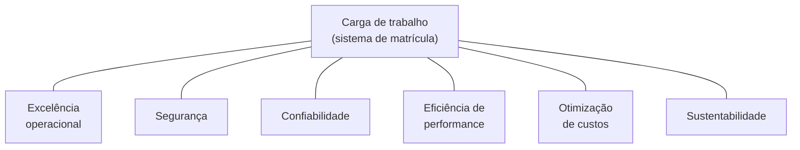

<!-- autoral -->

# 1.4 AWS Well-Architected Framework

> **Domínio 1 — Conceitos de Nuvem (24% da prova)** · Depende das aulas [1.2](02-vantagens-da-nuvem.md) e [1.3](03-conceitos-de-arquitetura.md)

> 🔎 **Fichas para aprofundar:** [AWS Trusted Advisor](../../servicos/gerenciamento/trusted-advisor.md)

⬅️ [1.3 Conceitos de arquitetura que a prova cobra](03-conceitos-de-arquitetura.md) · 🏠 [Índice do domínio](README.md) · 🏫 [O caso da escola](../00-guia-do-exame/caso-da-escola.md) · [1.5 AWS Cloud Adoption Framework (CAF)](05-cloud-adoption-framework.md) ➡️

---

O sistema de matrícula está no ar, e a diretora quer saber se ele está "bem feito". O professor de informática diz que sim, porque é rápido. A secretária reclama que ninguém sabe o que fazer quando ele trava. O tesoureiro acha a conta alta. E uma mãe, que é auditora, pergunta quem consegue ver os dados das crianças.

Cada um olha para um lado do mesmo sistema, e todos têm razão em parte. A AWS organizou essas perspectivas num conjunto de perguntas e boas práticas chamado **AWS Well-Architected Framework**. O guia do exame pede que você conheça os pilares do framework e saiba diferenciá-los: a prova descreve uma prática e pergunta a qual pilar ela pertence.

## O que é o framework

O Well-Architected Framework ajuda a entender os prós e os contras das decisões tomadas ao construir sistemas na AWS e reúne boas práticas para projetar e operar cargas de trabalho seguras, confiáveis, eficientes, econômicas e sustentáveis. Uma **carga de trabalho** (*workload*) é um conjunto de recursos e código que entrega valor ao negócio, como o sistema de matrícula.

O framework funciona como uma lista de perguntas: ele documenta perguntas básicas que mostram se uma arquitetura está alinhada às boas práticas da nuvem e oferece uma forma consistente de medir arquiteturas e encontrar o que melhorar. A AWS compara o sistema a um prédio: se a fundação não for sólida, problemas estruturais comprometem o resto. As fundações são os **seis pilares**.

O limite é que o framework orienta e avalia; ele não constrói nem corrige a arquitetura por você.

## Os seis pilares

| Pilar | Do que trata | Pergunta que ele faz à escola |
|---|---|---|
| **Excelência operacional** | Construir software corretamente e entregar uma boa experiência de forma consistente: organizar a equipe, projetar, operar em escala e evoluir a carga | "Quando o sistema trava, a equipe sabe o que fazer?" |
| **Segurança** | Proteger dados, sistemas e ativos | "Quem consegue ver os dados das crianças?" |
| **Confiabilidade** | A carga executar sua função corretamente e de forma consistente quando se espera que execute | "O sistema continua no ar em janeiro e se recupera de falhas?" |
| **Eficiência de performance** | Usar os recursos de forma eficiente para atender aos requisitos de desempenho, e manter essa eficiência quando a demanda e a tecnologia mudam | "Estamos usando o tipo certo de recurso para esse uso?" |
| **Otimização de custos** | Entregar valor ao negócio pelo menor preço | "Estamos pagando por algo que não usamos?" |
| **Sustentabilidade** | Impacto ambiental, principalmente consumo e eficiência de energia | "Dá para fazer o mesmo com menos recursos?" |

*Figura 1.4 — Os seis pilares olham para a mesma carga de trabalho, cada um por um ângulo.*

## Os princípios de design de cada pilar

Cada pilar tem princípios de design. A prova costuma citar um deles e pedir o pilar, então vale conhecer as frases.

**Excelência operacional:** organizar as equipes em torno de resultados de negócio; implementar observabilidade para ter informação que leve a ações; automatizar com segurança onde possível (a carga e suas operações definidas como código); fazer mudanças frequentes, pequenas e reversíveis; refinar os procedimentos de operação com frequência; antecipar falhas; aprender com todos os eventos e métricas de operação; usar serviços gerenciados.

**Segurança:** implementar uma base forte de identidade, com privilégio mínimo e separação de funções; manter a rastreabilidade (monitorar, alertar e auditar ações e mudanças); aplicar segurança em todas as camadas (defesa em profundidade); automatizar as boas práticas de segurança; proteger dados em trânsito e em repouso; manter as pessoas longe dos dados; preparar-se para eventos de segurança. Esses princípios são o domínio 2 inteiro, começando pela [aula 2.1](../02-seguranca-e-conformidade/01-responsabilidade-compartilhada.md).

**Confiabilidade:** recuperar-se automaticamente de falhas; testar os procedimentos de recuperação; escalar horizontalmente para aumentar a disponibilidade do conjunto; parar de adivinhar a capacidade; gerenciar mudanças com automação. São os conceitos da [aula 1.3](03-conceitos-de-arquitetura.md).

**Eficiência de performance:** democratizar tecnologias avançadas (consumir como serviço o que exigiria especialistas, como bancos NoSQL e machine learning); tornar-se global em minutos; usar arquiteturas serverless; experimentar com mais frequência; considerar a "simpatia mecânica", isto é, usar a abordagem de tecnologia que combina com os objetivos da carga, como escolher o banco pelo padrão de acesso aos dados.

**Otimização de custos:** implementar gestão financeira na nuvem; adotar um modelo de consumo (pagar só pelo que precisa e ajustar o uso ao negócio); medir a eficiência geral; parar de gastar com trabalho pesado que não diferencia o negócio, como montar e ligar servidores; analisar e atribuir os gastos a quem é dono de cada carga. O framework dá um exemplo: ambientes de desenvolvimento usados oito horas por dia nos dias úteis podem ser desligados fora desse horário, com economia potencial de 75% (40 horas em vez de 168 por semana).

**Sustentabilidade:** entender o seu impacto; definir metas de sustentabilidade; maximizar a utilização (dois servidores a 30% gastam mais energia que um a 60%); antecipar e adotar hardware e software mais eficientes; usar serviços gerenciados; reduzir o impacto para quem usa os seus serviços (*downstream*).

Além dos princípios de cada pilar, o framework tem **princípios gerais de design**: parar de adivinhar as necessidades de capacidade; testar sistemas em escala de produção; automatizar pensando em experimentar com a arquitetura; considerar arquiteturas evolutivas; guiar a arquitetura com dados; melhorar com *game days*, simulações de eventos em produção feitas regularmente.

O limite é que uma mesma prática pode servir a mais de um pilar. Usar serviços gerenciados aparece em excelência operacional e em sustentabilidade; parar de adivinhar a capacidade, em confiabilidade e nos princípios gerais. Na prova, decida pelo **objetivo** que o enunciado destaca.

## A AWS Well-Architected Tool

A **AWS Well-Architected Tool** é um serviço no console que oferece um processo consistente para revisar e medir uma carga de trabalho com base no framework. Ela ajuda a documentar as decisões, recomenda melhorias com base nas boas práticas e acompanha o progresso ao longo do tempo. Não há cobrança adicional pela ferramenta.

Na ferramenta, a revisão é feita com **lentes** (*lenses*). A lente do Well-Architected Framework é aplicada automaticamente a toda carga de trabalho. O **Lens Catalog** traz lentes oficiais da AWS para tecnologias e setores específicos, como aplicações serverless, SaaS, machine learning, IA generativa e serviços financeiros; também é possível criar lentes personalizadas com as próprias perguntas.

O limite é que a ferramenta não altera recursos: ela registra respostas, aponta riscos e sugere um plano de melhorias, e quem implementa é a equipe.

## Na prova

- **São seis pilares**: excelência operacional, segurança, confiabilidade, eficiência de performance, otimização de custos e sustentabilidade.
- **"Mudanças pequenas, frequentes e reversíveis", "operações como código", "observabilidade" = excelência operacional.**
- **"Privilégio mínimo", "rastreabilidade", "criptografia em trânsito e em repouso" = segurança.**
- **"Recuperar automaticamente de falhas", "escalar horizontalmente", "testar a recuperação" = confiabilidade.**
- **"Tipo de recurso certo para a carga", "serverless", "experimentar com frequência", "global em minutos" = eficiência de performance.**
- **"Desligar recursos ociosos", "modelo de consumo", "atribuir gastos" = otimização de custos.**
- **"Impacto ambiental", "maximizar a utilização", "hardware mais eficiente" = sustentabilidade.**
- **"Revisar uma carga contra as boas práticas, sem custo" = AWS Well-Architected Tool.**

## Caso resolvido

**Situação.** Depois de uma revisão, a equipe da escola lista quatro ações: ativar MFA e permissões mínimas para a secretaria; implantar o sistema em duas Zonas de Disponibilidade com recuperação automática; desligar à noite e nos fins de semana o ambiente de testes; e escrever procedimentos para quando o sistema travar, revisando-os depois de cada incidente. A diretora pergunta a qual pilar cada ação pertence.

**Raciocínio.** MFA e permissões mínimas implementam a base forte de identidade: segurança. Duas AZs e recuperação automática fazem o sistema continuar funcionando e se recuperar de falhas: confiabilidade. Desligar o ambiente de testes fora do horário é o modelo de consumo, pagar só pelo que se usa: otimização de custos. Procedimentos revisados a cada incidente são refinar procedimentos e aprender com os eventos: excelência operacional.

**Por que as alternativas tentadoras falham.** Desligar o ambiente de testes também reduz consumo de energia, mas o objetivo descrito é pagar menos, então o pilar é custos; se o enunciado falasse em reduzir o impacto ambiental, seria sustentabilidade. Duas AZs não são "eficiência de performance": o objetivo não é usar o recurso certo, é continuar no ar. E procedimentos para incidentes operacionais não são "segurança" só porque falam em incidente: segurança trata de incidentes de segurança, como acesso indevido.

## Revisão

Tente responder antes de abrir cada resposta.

### Quais são os seis pilares do Well-Architected Framework?

Ver resposta

Excelência operacional, segurança, confiabilidade, eficiência de performance, otimização de custos e sustentabilidade.

Comentário: a prova descreve uma prática e pede o pilar; decida pelo objetivo destacado no enunciado.

### "Escalar horizontalmente para reduzir o impacto de uma única falha" é princípio de qual pilar?

Ver resposta

Confiabilidade, que também inclui recuperar-se automaticamente de falhas, testar a recuperação, parar de adivinhar capacidade e gerenciar mudanças com automação.

Comentário: não confunda com eficiência de performance, que trata de usar o tipo certo de recurso para a carga.

### "Fazer mudanças frequentes, pequenas e reversíveis" pertence a qual pilar?

Ver resposta

Excelência operacional, o pilar de operar e evoluir a carga de trabalho, junto com observabilidade, automação e aprendizado com os eventos.

Comentário: mudanças pequenas reduzem o alcance de uma falha e são mais fáceis de desfazer.

### O que o pilar de sustentabilidade recomenda sobre utilização dos recursos?

Ver resposta

Maximizar a utilização: dimensionar corretamente e evitar recursos ociosos, porque poucos servidores bem usados gastam menos energia que muitos subutilizados.

Comentário: o framework compara dois servidores a 30% com um servidor a 60%; o segundo é mais eficiente.

### Para que serve a AWS Well-Architected Tool?

Ver resposta

Para revisar e medir uma carga de trabalho com base no framework, documentar decisões, receber recomendações e acompanhar melhorias, sem cobrança adicional.

Comentário: a ferramenta usa lentes, e a do Well-Architected Framework é aplicada automaticamente; ela não altera recursos.

## Resumo

- O Well-Architected Framework reúne perguntas e boas práticas para avaliar cargas de trabalho na AWS.
- Seis pilares: excelência operacional, segurança, confiabilidade, eficiência de performance, otimização de custos e sustentabilidade.
- Cada pilar tem princípios de design; a prova cita um princípio e pede o pilar.
- Uma prática pode servir a vários pilares; escolha pelo objetivo do enunciado.
- A Well-Architected Tool revisa cargas sem cobrança adicional, usando lentes oficiais ou personalizadas.

## Fontes oficiais

Verificadas em 06/10/2026.

- [AWS Well-Architected Framework (introdução)](https://docs.aws.amazon.com/wellarchitected/latest/framework/welcome.html): objetivo do framework e revisão de cargas pela Well-Architected Tool sem cobrança.
- [The pillars of the framework](https://docs.aws.amazon.com/wellarchitected/latest/framework/the-pillars-of-the-framework.html): os seis pilares e a comparação com a fundação de um prédio.
- Definições dos pilares: [Operational excellence](https://docs.aws.amazon.com/wellarchitected/latest/framework/operational-excellence.html), [Security](https://docs.aws.amazon.com/wellarchitected/latest/framework/security.html), [Reliability](https://docs.aws.amazon.com/wellarchitected/latest/framework/reliability.html), [Performance efficiency](https://docs.aws.amazon.com/wellarchitected/latest/framework/performance-efficiency.html), [Cost optimization](https://docs.aws.amazon.com/wellarchitected/latest/framework/cost-optimization.html), [Sustainability](https://docs.aws.amazon.com/wellarchitected/latest/framework/sustainability.html).
- Princípios de design: [Operational excellence](https://docs.aws.amazon.com/wellarchitected/latest/framework/oe-design-principles.html), [Security](https://docs.aws.amazon.com/wellarchitected/latest/framework/sec-design.html), [Reliability](https://docs.aws.amazon.com/wellarchitected/latest/framework/rel-dp.html), [Performance efficiency](https://docs.aws.amazon.com/wellarchitected/latest/framework/perf-dp.html), [Cost optimization](https://docs.aws.amazon.com/wellarchitected/latest/framework/cost-dp.html) (inclui o exemplo dos 75%), [Sustainability](https://docs.aws.amazon.com/wellarchitected/latest/framework/sus-design-principles.html) (inclui o exemplo de 30% e 60%).
- [General design principles](https://docs.aws.amazon.com/wellarchitected/latest/framework/general-design-principles.html): os seis princípios gerais.
- [What is AWS Well-Architected Tool?](https://docs.aws.amazon.com/wellarchitected/latest/userguide/tool.html) e [Workloads](https://docs.aws.amazon.com/wellarchitected/latest/userguide/workloads.html): função da ferramenta e definição de carga de trabalho.
- [Using lenses](https://docs.aws.amazon.com/wellarchitected/latest/userguide/lenses.html) e [Lens Catalog](https://docs.aws.amazon.com/wellarchitected/latest/userguide/lens-catalog.html): lente padrão, lentes oficiais e personalizadas.
- [AWS Well-Architected Tool pricing](https://aws.amazon.com/well-architected-tool/pricing/): sem cobrança adicional pela ferramenta.
- [Content Domain 1 do guia do exame CLF-C02](https://docs.aws.amazon.com/aws-certification/latest/cloud-practitioner-02/cloud-practitioner-02-domain1.html): pilares e diferenças entre eles (tarefa 1.2).

<!-- notas:inicio -->
## 📝 Minhas anotações

<!-- Escreva aqui suas observações, dúvidas e as questões que você errou sobre o tema. -->
<!-- notas:fim -->

---

⬅️ [1.3 Conceitos de arquitetura que a prova cobra](03-conceitos-de-arquitetura.md) · 🏠 [Índice do domínio](README.md) · [1.5 AWS Cloud Adoption Framework (CAF)](05-cloud-adoption-framework.md) ➡️
