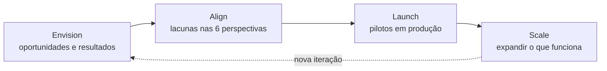

<!-- autoral -->

# 1.5 AWS Cloud Adoption Framework (CAF)

> **Domínio 1 — Conceitos de Nuvem (24% da prova)** · Depende das aulas [1.2](02-vantagens-da-nuvem.md) e [1.4](04-well-architected-framework.md)

⬅️ [1.4 AWS Well-Architected Framework](04-well-architected-framework.md) · 🏠 [Índice do domínio](README.md) · 🏫 [O caso da escola](../00-guia-do-exame/caso-da-escola.md) · [1.6 Estratégias de migração (os 7 Rs)](06-estrategias-de-migracao.md) ➡️

---

A rede de escolas decidiu levar todos os sistemas para a AWS, não só o de matrícula. Três meses depois, os servidores na nuvem funcionam, mas a mudança empacou. Os professores de informática não sabem operar o que foi criado. A diretoria financeira não sabe quanto vai gastar por mês nem quem aprova novos recursos. E ninguém definiu como medir se a mudança valeu a pena.

A tecnologia estava pronta; faltava o resto da organização. É esse problema que o **AWS Cloud Adoption Framework** (AWS CAF) ataca. O guia do exame pede que você conheça os componentes do CAF e os benefícios que ele promete.

## O que é o CAF

O AWS CAF reúne a experiência e as boas práticas da AWS para ajudar organizações a se transformarem digitalmente e acelerarem seus resultados de negócio usando a AWS. Ele serve para identificar e priorizar oportunidades de transformação, avaliar e melhorar a **prontidão para a nuvem** (a capacidade de usar a nuvem para se transformar) e evoluir o plano de transformação aos poucos.

A diferença para o [Well-Architected](04-well-architected-framework.md) é o alvo. O Well-Architected avalia uma carga de trabalho: se o sistema de matrícula está seguro, confiável e econômico. O CAF olha a organização inteira: se as pessoas, os processos e as decisões estão prontos para a nuvem. O limite é que o CAF é um guia de boas práticas, não um serviço que migra servidores.

## Os resultados de negócio

O CAF descreve uma cadeia de valor: a organização ganha **capacidades fundamentais**, que permitem a transformação, que acelera os resultados de negócio. Os principais resultados citados pela AWS são quatro, e o guia do exame cobra exatamente estes:

- **Redução do risco de negócio.**
- **Melhoria do desempenho ESG** (ambiental, social e de governança).
- **Aumento de receita.**
- **Aumento da eficiência operacional.**

## Os quatro domínios de transformação

A transformação acontece em quatro domínios, que a AWS apresenta como uma cadeia: a tecnológica permite a de processos, que permite a organizacional, que permite a de produto.

| Domínio | Foco | Na escola |
|---|---|---|
| **Tecnologia** | Migrar e modernizar infraestrutura, aplicações e plataformas de dados | Levar os sistemas para a AWS |
| **Processos** | Digitalizar, automatizar e otimizar as operações do negócio | Matrícula e rematrícula automáticas |
| **Organização** | Repensar o modelo operacional, com equipes organizadas por produtos e métodos ágeis | Uma equipe responsável pelo portal das famílias |
| **Produto** | Criar novas propostas de valor e modelos de receita | Oferecer cursos online pagos |

## As seis perspectivas

O CAF agrupa as capacidades fundamentais em **seis perspectivas**. Cada perspectiva reúne capacidades relacionadas e as pessoas que costumam cuidar delas (os *stakeholders*):

| Perspectiva | Para que serve | Exemplos de capacidades | Stakeholders comuns |
|---|---|---|---|
| **Negócio** (*Business*) | Garantir que os investimentos em nuvem acelerem a transformação e os resultados de negócio | Gestão de estratégia, gestão de portfólio, inovação, gestão de produto | CEO, CFO, COO, CIO, CTO |
| **Pessoas** (*People*) | Fazer a ponte entre tecnologia e negócio, com foco em cultura, estrutura organizacional, liderança e força de trabalho | Evolução da cultura, fluência em nuvem, transformação da força de trabalho, aceleração da mudança | CIO, COO, CTO, diretor de nuvem |
| **Governança** (*Governance*) | Orquestrar as iniciativas de nuvem, maximizando os benefícios e minimizando os riscos da transformação | Gestão de programas e projetos, gestão de benefícios, gestão de riscos, gestão financeira na nuvem | CIO, CTO, CFO, CDO, CRO |
| **Plataforma** (*Platform*) | Construir uma plataforma de nuvem escalável e híbrida, modernizar cargas existentes e criar soluções nativas da nuvem | Arquitetura de plataforma, engenharia de dados, provisionamento, CI/CD | CTO, arquitetos, engenheiros |
| **Segurança** (*Security*) | Garantir a confidencialidade, a integridade e a disponibilidade dos dados e das cargas | Gestão de identidade e acesso, detecção de ameaças, proteção de dados, resposta a incidentes | CISO, CCO, auditoria interna |
| **Operações** (*Operations*) | Garantir que os serviços de nuvem sejam entregues no nível combinado com o negócio | Observabilidade, gestão de incidentes e problemas, gestão de mudanças, gestão de patches | Líderes de infraestrutura e operações, SREs |

As siglas são cargos: CEO (presidente), CFO (finanças), COO (operações), CIO e CTO (tecnologia), CDO (dados), CRO (riscos), CISO (segurança da informação), CCO (conformidade). SRE é o engenheiro de confiabilidade de sites, que cuida de manter os sistemas funcionando.

Na escola, os professores que não sabem operar o ambiente são um problema de **Pessoas** (fluência em nuvem, treinamento). A diretoria que não sabe quanto vai gastar nem quem aprova é um problema de **Governança** (gestão financeira, gestão de programas). E não saber medir se a mudança valeu a pena é **Negócio** (estratégia) e **Governança** (gestão de benefícios).

O limite é que perspectivas não são departamentos fechados: uma capacidade pode envolver várias áreas. Na prova, decida pelo foco descrito: cultura e treinamento apontam para Pessoas; risco, orçamento e programa apontam para Governança.

## As quatro fases da jornada

O CAF recomenda uma jornada iterativa e incremental em quatro fases, para mostrar valor cedo sem precisar prever tudo de uma vez:

1. **Envision** (visualizar): mostrar como a nuvem vai acelerar os resultados de negócio, identificando e priorizando oportunidades de transformação nos quatro domínios.
2. **Align** (alinhar): identificar lacunas de capacidade nas seis perspectivas, dependências entre áreas e preocupações dos stakeholders.
3. **Launch** (lançar): entregar iniciativas-piloto em produção e demonstrar valor de forma incremental.
4. **Scale** (escalar): expandir os pilotos e o valor de negócio para a escala desejada e garantir que os benefícios se mantenham.

*Figura 1.5 — As quatro fases do CAF formam um ciclo: cada volta amplia a transformação.*

## Na prova

- **Benefícios do CAF**: reduzir risco de negócio, melhorar desempenho ESG, aumentar receita e aumentar eficiência operacional.
- **Seis perspectivas**: Negócio, Pessoas, Governança, Plataforma, Segurança e Operações.
- **"Cultura, treinamento, gestão da mudança" = Pessoas.**
- **"Riscos, orçamento, gestão do programa, benefícios" = Governança.**
- **"Estratégia e portfólio, resultados de negócio" = Negócio.**
- **"Arquitetura, engenharia, CI/CD" = Plataforma; "identidade, detecção, resposta a incidentes" = Segurança; "observabilidade, incidentes operacionais, patches" = Operações.**
- **Fases, em ordem: Envision, Align, Launch, Scale.**
- **CAF = organização inteira; Well-Architected = uma carga de trabalho.**

## Caso resolvido

**Situação.** Na fase de alinhamento da migração, a rede de escolas descobre três lacunas: os funcionários de TI resistem à mudança e não têm treinamento em nuvem; não existe um processo para aprovar e acompanhar o gasto com a AWS; e o ambiente na nuvem não tem monitoramento, então ninguém percebe quando algo para. Qual perspectiva do CAF cobre cada lacuna?

**Raciocínio.** Resistência à mudança e falta de treinamento são cultura e fluência em nuvem: perspectiva de Pessoas. Aprovar e acompanhar gastos é gestão financeira na nuvem: perspectiva de Governança. Monitorar o ambiente para perceber falhas é observabilidade: perspectiva de Operações. E identificar lacunas nas seis perspectivas é exatamente o que a fase Align faz.

**Por que as alternativas tentadoras falham.** Escolher Plataforma para a falta de treinamento só porque o assunto é técnico ignora que o problema é de pessoas e cultura. Escolher Negócio para o controle de gastos confunde estratégia com gestão financeira, que o CAF coloca em Governança. E escolher Segurança para o monitoramento erra o objetivo: perceber que um serviço parou é operação; detectar ameaças é segurança.

## Revisão

Tente responder antes de abrir cada resposta.

### Quais são as seis perspectivas do AWS CAF?

Ver resposta

Negócio, Pessoas, Governança, Plataforma, Segurança e Operações.

Comentário: cada perspectiva reúne capacidades relacionadas e os stakeholders que costumam cuidar delas.

### Qual perspectiva do CAF trata de cultura, treinamento e gestão da mudança?

Ver resposta

Pessoas, que faz a ponte entre tecnologia e negócio com foco em cultura, estrutura organizacional, liderança e força de trabalho.

Comentário: não confunda com Governança, que cuida de riscos, programas, benefícios e gestão financeira.

### Quais são as quatro fases da jornada de transformação do CAF?

Ver resposta

Envision (oportunidades e resultados), Align (lacunas e alinhamento), Launch (pilotos em produção) e Scale (expandir o que funcionou).

Comentário: a jornada é iterativa; cada ciclo amplia a transformação.

### Quais resultados de negócio o CAF promete?

Ver resposta

Redução do risco de negócio, melhoria do desempenho ESG, aumento de receita e aumento da eficiência operacional.

Comentário: esses quatro aparecem no guia do exame como exemplos de componentes do CAF.

### Qual é a diferença entre o CAF e o Well-Architected Framework?

Ver resposta

O CAF orienta a organização inteira na adoção da nuvem (pessoas, processos, decisões); o Well-Architected avalia a arquitetura de uma carga de trabalho.

Comentário: nenhum dos dois é um serviço que executa a migração.

## Resumo

- O AWS CAF orienta a transformação da organização na nuvem, não só a tecnologia.
- Resultados: menos risco, melhor ESG, mais receita, mais eficiência operacional.
- Domínios de transformação: tecnologia, processos, organização e produto.
- Seis perspectivas: Negócio, Pessoas, Governança, Plataforma, Segurança e Operações.
- Fases iterativas: Envision, Align, Launch e Scale.

## Fontes oficiais

Verificadas em 06/10/2026.

- [An Overview of the AWS Cloud Adoption Framework](https://docs.aws.amazon.com/whitepapers/latest/overview-aws-cloud-adoption-framework/welcome.html): objetivo do CAF.
- [Accelerating business outcomes](https://docs.aws.amazon.com/whitepapers/latest/overview-aws-cloud-adoption-framework/accelerating-business-outcomes.html): cadeia de valor, quatro domínios de transformação e principais resultados de negócio.
- [Foundational capabilities](https://docs.aws.amazon.com/whitepapers/latest/overview-aws-cloud-adoption-framework/foundational-capabilities.html): definição de capacidade, seis perspectivas e stakeholders.
- Perspectivas e suas capacidades: [Business](https://docs.aws.amazon.com/whitepapers/latest/overview-aws-cloud-adoption-framework/business-perspective.html), [People](https://docs.aws.amazon.com/whitepapers/latest/overview-aws-cloud-adoption-framework/people-perspective.html), [Governance](https://docs.aws.amazon.com/whitepapers/latest/overview-aws-cloud-adoption-framework/governance-perspective.html), [Platform](https://docs.aws.amazon.com/whitepapers/latest/overview-aws-cloud-adoption-framework/platform-perspective.html), [Security](https://docs.aws.amazon.com/whitepapers/latest/overview-aws-cloud-adoption-framework/security-perspective.html), [Operations](https://docs.aws.amazon.com/whitepapers/latest/overview-aws-cloud-adoption-framework/operations-perspective.html).
- [Your cloud transformation journey](https://docs.aws.amazon.com/whitepapers/latest/overview-aws-cloud-adoption-framework/your-cloud-transformation-journey.html): as fases Envision, Align, Launch e Scale.
- [Content Domain 1 do guia do exame CLF-C02](https://docs.aws.amazon.com/aws-certification/latest/cloud-practitioner-02/cloud-practitioner-02-domain1.html): componentes do CAF cobrados (tarefa 1.3).

<!-- notas:inicio -->
## 📝 Minhas anotações

<!-- Escreva aqui suas observações, dúvidas e as questões que você errou sobre o tema. -->
<!-- notas:fim -->

---

⬅️ [1.4 AWS Well-Architected Framework](04-well-architected-framework.md) · 🏠 [Índice do domínio](README.md) · [1.6 Estratégias de migração (os 7 Rs)](06-estrategias-de-migracao.md) ➡️
