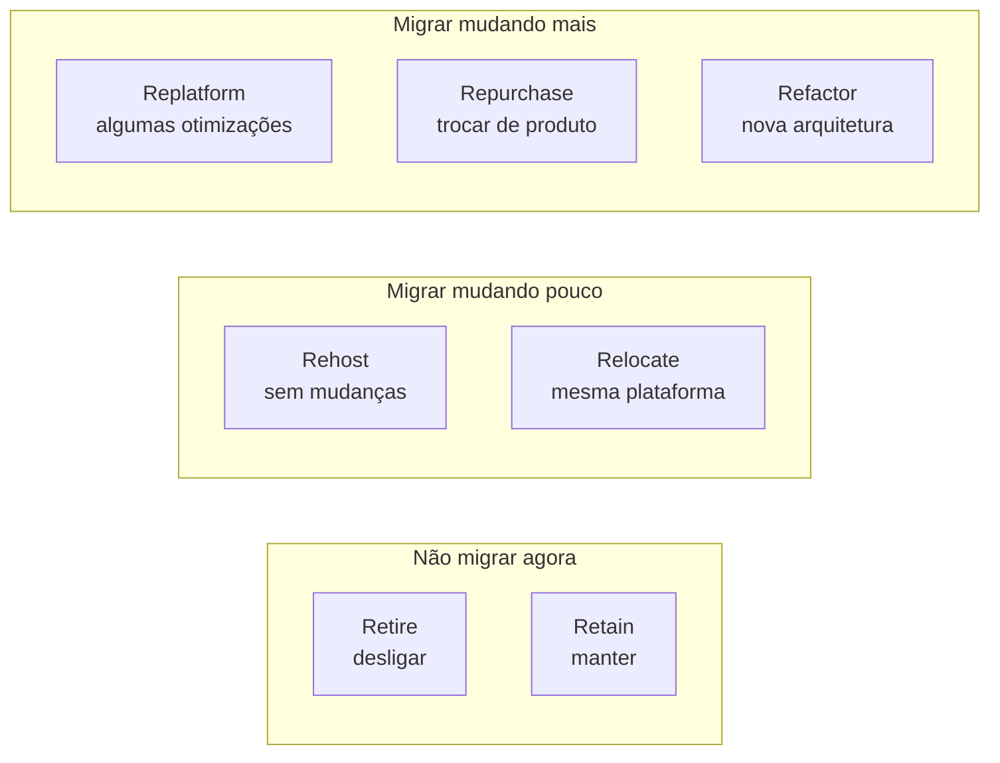

<!-- autoral -->

# 1.6 Estratégias de migração (os 7 Rs)

> **Domínio 1 — Conceitos de Nuvem (24% da prova)** · Depende das aulas [1.1](01-o-que-e-computacao-em-nuvem.md) e [1.5](05-cloud-adoption-framework.md)

> 🔎 **Fichas para aprofundar:** [AWS Transform MGN (antigo Application Migration Service)](../../servicos/migracao/application-migration-service.md) · [AWS DMS e SCT](../../servicos/migracao/dms-e-sct.md) · [Migration Evaluator, Discovery e Migration Hub](../../servicos/migracao/discovery-migration-hub-e-evaluator.md)

⬅️ [1.5 AWS Cloud Adoption Framework (CAF)](05-cloud-adoption-framework.md) · 🏠 [Índice do domínio](README.md) · [1.7 Economia da nuvem](07-economia-da-nuvem.md) ➡️

---

A rede de escolas fez o inventário do que roda no datacenter e encontrou de tudo: o sistema de matrícula; um banco de dados SQL Server instalado num servidor próprio; um sistema de RH feito por um ex-funcionário, que ninguém sabe manter; um site antigo de eventos que ninguém acessa há meses; e o controle das catracas, ligado a equipamentos físicos na portaria.

Seria um erro tratar tudo igual. Algumas aplicações podem ir para a nuvem como estão, outras merecem mudanças, outras devem ser trocadas ou simplesmente desligadas. A AWS chama a abordagem usada para levar uma carga de trabalho para a nuvem de **estratégia de migração**, e organiza as possibilidades em sete, conhecidas como **os 7 Rs**. O guia do exame pede que você identifique a estratégia adequada a cada situação.

## As sete estratégias

**Retire** (aposentar) é desativar ou arquivar a aplicação e desligar seus servidores. Serve para o que não tem mais valor para o negócio, para eliminar o custo de manter algo inútil ou para se livrar de um sistema com versões sem suporte. A AWS sugere olhar o uso: uma aplicação sem nenhuma conexão de entrada há 90 dias é candidata. É o caso do site de eventos.

**Retain** (manter) é deixar a aplicação no ambiente de origem, por enquanto. Os motivos típicos são exigências de residência de dados, risco alto que pede uma avaliação mais detalhada, dependência de outra aplicação que precisa migrar antes, um investimento recente no sistema atual ou dependência de hardware sem equivalente na nuvem. É o caso das catracas, presas a equipamentos físicos.

**Rehost** (re-hospedar), também chamado de *lift and shift*, é mover a aplicação para a AWS **sem alterá-la**. Permite migrar muitos servidores (físicos, virtuais ou de outra nuvem) rapidamente, mas não aplica nenhuma otimização da nuvem; a vantagem é que, já na nuvem, fica mais fácil otimizar depois. O serviço da AWS para automatizar o rehost é o **AWS Transform MGN**, que se chamava AWS Application Migration Service. É o caminho natural para o sistema de matrícula, se a meta for sair rápido do datacenter.

**Relocate** (realocar) é transferir de uma vez um grande número de servidores de uma plataforma local para a versão de nuvem da mesma plataforma, ou mover recursos para outra VPC, outra Região ou outra conta da AWS. Não exige comprar hardware, reescrever aplicações nem mudar a operação, e a AWS o descreve como a forma mais rápida de migrar, porque não altera a arquitetura da aplicação.

**Repurchase** (recomprar), também chamado de *drop and shop*, é trocar a aplicação por outra versão ou outro produto, muitas vezes um software como serviço (SaaS). Costuma reduzir custos de manutenção, infraestrutura e licenças, mas exige migrar os dados e treinar os usuários no sistema novo. É uma boa saída para o RH feito sob medida: em vez de reescrever, contratar um sistema de RH pronto.

**Replatform** (trocar a plataforma), também chamado de *lift, tinker and shift*, é mover a aplicação e introduzir **algum nível de otimização** para operá-la melhor, reduzir custos ou aproveitar recursos da nuvem. Dependendo dos objetivos, as mudanças podem ser poucas ou muitas, mas a aplicação não é redesenhada para a nuvem, como no refactor. O exemplo da própria AWS é levar um banco Microsoft SQL Server para o Amazon RDS for SQL Server, um serviço gerenciado que cuida de tarefas como backups e atualizações. É o caso do banco da escola.

**Refactor** ou **re-architect** (refatorar ou rearquitetar) é mudar a arquitetura da aplicação para aproveitar ao máximo os recursos nativos da nuvem e ganhar agilidade, desempenho e escala. É motivado por forte demanda de negócio, como um monolito que impede lançar novidades rápido. É a estratégia mais complexa e cara, porque moderniza a aplicação durante a migração; em migrações grandes, a AWS recomenda migrar primeiro (rehost, relocate ou replatform) e modernizar depois.

*Figura 1.6 — Os 7 Rs agrupados pelo tamanho da mudança.*

## Escolhendo a estratégia

A pergunta que separa as estratégias é **quanto a aplicação muda**. Nada: rehost (ou relocate, se a plataforma inteira vai junto). Um pouco, para aproveitar um serviço gerenciado: replatform. A arquitetura toda: refactor. Troca por outro produto: repurchase. E as duas que não movem a aplicação: retire (desligar) e retain (manter).

O limite é que a estratégia não sai pronta de uma ferramenta: ela depende do valor de negócio, do risco e das dependências de cada aplicação, avaliados antes. E a mesma organização usa várias estratégias ao mesmo tempo, como a escola.

## Recursos para a jornada de migração

O guia do exame também cobra os recursos que apoiam a migração, com o exemplo da replicação de bancos de dados. Os principais aparecem na [aula 3.17](../03-tecnologia-e-servicos/17-migracao-e-transferencia.md); aqui vale conhecer três:

- O **AWS Database Migration Service** (AWS DMS) migra bancos de dados relacionais, data warehouses, bancos NoSQL e outros armazenamentos de dados. Pode fazer uma migração única ou **replicar continuamente as mudanças** para manter origem e destino sincronizados, o que reduz o tempo fora do ar na virada. Para trocar de mecanismo de banco, a conversão do esquema é feita pelo DMS Schema Conversion ou pela AWS Schema Conversion Tool (AWS SCT).
- O **AWS Transform MGN** automatiza o rehost de servidores físicos, virtuais e de outras nuvens para o Amazon EC2, com replicação contínua e janelas de virada que costumam ser de minutos.
- O **Migration Evaluator** monta o caso de negócio da migração, comparando o custo do ambiente atual com cenários na AWS; ele volta na [aula 1.7](07-economia-da-nuvem.md).

## Na prova

- **"Mover sem mudar nada", "lift and shift" = Rehost.**
- **"Mover com pequenas otimizações, como banco para o RDS" = Replatform.**
- **"Trocar por um SaaS" = Repurchase.**
- **"Reescrever para microsserviços ou serverless" = Refactor**, a estratégia mais complexa e cara.
- **"Desligar o que não é usado" = Retire; "manter por enquanto" = Retain.**
- **"Levar a plataforma inteira de uma vez" ou "mover para outra VPC, Região ou conta" = Relocate.**
- **"Replicar o banco continuamente durante a migração" = AWS DMS.**

## Caso resolvido

**Situação.** A rede de escolas precisa sair do datacenter em seis meses, quando o contrato acaba. Ela quer, além disso, parar de administrar backups e atualizações do banco SQL Server, mas sem reescrever o sistema de matrícula, que depende dele. Que estratégias aplicar ao sistema de matrícula e ao banco?

**Raciocínio.** O prazo curto e a ordem de não reescrever o sistema de matrícula apontam para rehost: levá-lo para o EC2 como está, com o AWS Transform MGN. Para o banco, a meta de não administrar backups e atualizações pede um serviço gerenciado: replatform para o Amazon RDS for SQL Server. Como o banco não para de receber matrículas, o AWS DMS pode replicar as mudanças continuamente até a virada.

**Por que as alternativas tentadoras falham.** Refactor traria mais benefícios no longo prazo, mas é a estratégia mais complexa e cara e contraria a ordem de não reescrever. Rehost também para o banco (instalá-lo num EC2 igual ao servidor atual) cumpre o prazo, mas mantém a escola administrando backups e atualizações. E repurchase não se aplica: não há um produto pronto que substitua o sistema de matrícula próprio.

## Revisão

Tente responder antes de abrir cada resposta.

### Quais são os 7 Rs de migração?

Ver resposta

Retire, Retain, Rehost, Relocate, Repurchase, Replatform e Refactor (ou re-architect).

Comentário: a pergunta que separa as estratégias é quanto a aplicação muda.

### Qual é a diferença entre rehost e replatform?

Ver resposta

Rehost move a aplicação sem alterá-la; replatform move e faz algumas otimizações, como levar o banco para um serviço gerenciado como o Amazon RDS.

Comentário: refactor é a estratégia que muda a arquitetura para aproveitar os recursos nativos da nuvem.

### Uma empresa troca seu CRM próprio por um produto SaaS. Qual estratégia?

Ver resposta

Repurchase, também chamada de drop and shop: substituir a aplicação por outro produto ou versão.

Comentário: depois da compra ainda é preciso migrar os dados, integrar a autenticação e treinar os usuários.

### Por que a AWS não recomenda refactor em migrações grandes?

Ver resposta

Porque é a estratégia mais complexa e cara, já que moderniza a aplicação durante a migração; a recomendação é migrar primeiro e modernizar depois.

Comentário: refactor se justifica quando há forte demanda de negócio por agilidade e escala.

### Qual serviço replica continuamente um banco de dados durante a migração?

Ver resposta

O AWS Database Migration Service (AWS DMS), que faz migrações únicas ou replica as mudanças para manter origem e destino sincronizados.

Comentário: para trocar de mecanismo de banco, o esquema é convertido com o DMS Schema Conversion ou a AWS SCT.

## Resumo

- Estratégia de migração é a abordagem para levar uma carga de trabalho à nuvem; são sete (os 7 Rs).
- Retire desliga; Retain mantém por enquanto.
- Rehost move sem mudanças; Relocate leva a plataforma inteira e é a forma mais rápida.
- Replatform faz algumas otimizações; Repurchase troca de produto; Refactor muda a arquitetura e é o mais complexo e caro.
- AWS DMS replica bancos; AWS Transform MGN automatiza o rehost; Migration Evaluator monta o caso de negócio.

## Fontes oficiais

Verificadas em 06/10/2026.

- [About the migration strategies (AWS Prescriptive Guidance)](https://docs.aws.amazon.com/prescriptive-guidance/latest/large-migration-guide/migration-strategies.html): definição de estratégia de migração, os 7 Rs, casos de uso, relocate como a forma mais rápida e refactor como a mais complexa e cara.
- [What is AWS Transform MGN?](https://docs.aws.amazon.com/mgn/latest/ug/what-is-mgn.html) e [página do serviço](https://aws.amazon.com/application-migration-service/): automação do rehost e nome anterior (AWS Application Migration Service).
- [What is AWS Database Migration Service?](https://docs.aws.amazon.com/dms/latest/userguide/Welcome.html): tipos de bancos, migração única ou replicação contínua, conversão de esquema.
- [What is Amazon RDS?](https://docs.aws.amazon.com/AmazonRDS/latest/UserGuide/Welcome.html): o RDS gerencia backups, patches de software, detecção de falhas e recuperação.
- [Migration Evaluator](https://aws.amazon.com/migration-evaluator/): caso de negócio para a migração.
- [Content Domain 1 do guia do exame CLF-C02](https://docs.aws.amazon.com/aws-certification/latest/cloud-practitioner-02/cloud-practitioner-02-domain1.html): estratégias de migração e recursos de apoio (tarefa 1.3).

<!-- notas:inicio -->
## 📝 Minhas anotações

<!-- Escreva aqui suas observações, dúvidas e as questões que você errou sobre o tema. -->
<!-- notas:fim -->

---

⬅️ [1.5 AWS Cloud Adoption Framework (CAF)](05-cloud-adoption-framework.md) · 🏠 [Índice do domínio](README.md) · [1.7 Economia da nuvem](07-economia-da-nuvem.md) ➡️
