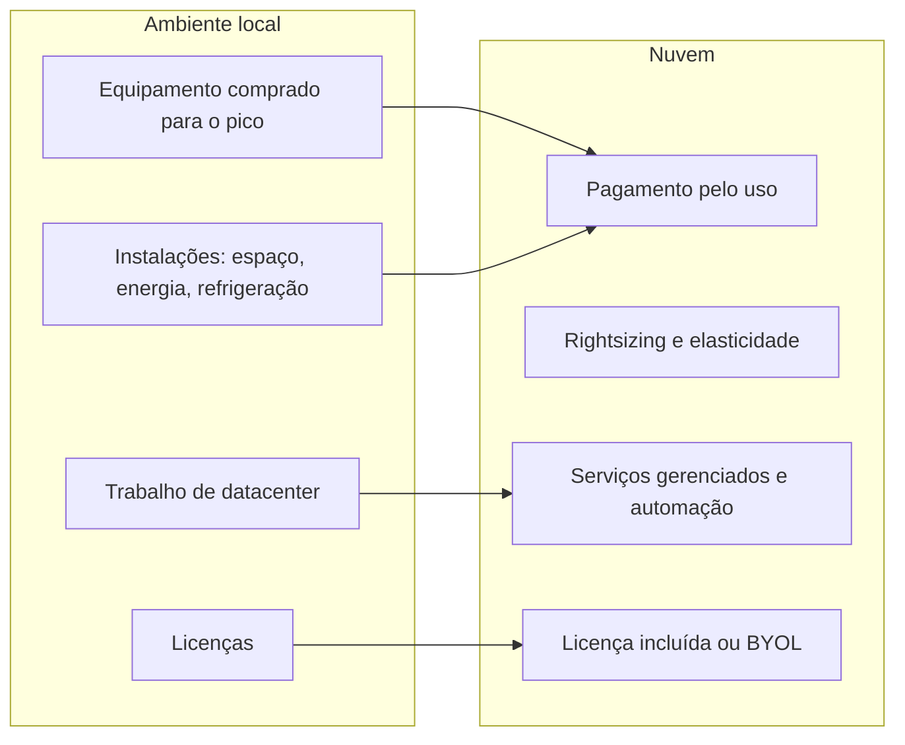

<!-- autoral -->

# 1.7 Economia da nuvem

> **Domínio 1 — Conceitos de Nuvem (24% da prova)** · Depende das aulas [1.2](02-vantagens-da-nuvem.md) e [1.6](06-estrategias-de-migracao.md)

> 🔎 **Fichas para aprofundar:** [Compute Optimizer, Service Quotas, License Manager e outros](../../servicos/gerenciamento/compute-optimizer-service-quotas-e-license-manager.md) · [Pricing Calculator, Cost and Usage Report e outras ferramentas](../../servicos/custos/pricing-calculator-cur-e-outras-ferramentas.md)

⬅️ [1.6 Estratégias de migração (os 7 Rs)](06-estrategias-de-migracao.md) · 🏠 [Índice do domínio](README.md) · 🏫 [O caso da escola](../00-guia-do-exame/caso-da-escola.md)

---

O tesoureiro da rede de escolas fez as contas: o servidor do datacenter custou R$ 40 mil há quatro anos, e a mesma capacidade na AWS sai por cerca de R$ 1.200 por mês. "Em três anos, a nuvem fica mais cara", concluiu. A conta parece certa, mas compara um preço isolado com outro. Ficaram de fora a energia, o ar-condicionado e o espaço da sala de servidores, as horas do técnico que troca peças e aplica atualizações, as licenças de software e o fato de o servidor ter sido comprado grande demais para aguentar janeiro.

Comparar custos de nuvem e de datacenter próprio exige olhar o conjunto. O guia do exame cobra essa visão: o papel dos custos fixos e variáveis, os custos de um ambiente local, as estratégias de licenciamento, o dimensionamento correto, os benefícios da automação e as economias de escala.

## Custos fixos e custos variáveis

Um **custo fixo** é pago independentemente do uso: o servidor comprado custa o mesmo trabalhando a 5% ou a 100%. Um **custo variável** acompanha o consumo. A primeira das seis vantagens da [aula 1.2](02-vantagens-da-nuvem.md) é justamente trocar despesa fixa por variável: em vez de investir pesado em datacenters e servidores antes de saber como vai usá-los, a organização paga quando consome recursos, e só pelo que consome.

A consequência prática é que, na nuvem, desligar economiza. O pilar de otimização de custos do Well-Architected dá o exemplo: ambientes de desenvolvimento e teste usados oito horas por dia nos dias úteis podem ser desligados fora desse horário, com economia potencial de 75% (40 horas em vez de 168 por semana). No datacenter, desligar o servidor não devolve o dinheiro já gasto na compra.

O limite é que o custo variável exige acompanhamento: recursos esquecidos ligados continuam gerando cobrança. As ferramentas para isso estão na [aula 4.4](../04-cobranca-precos-e-suporte/04-ferramentas-de-custo.md).

## Os custos de um ambiente local

O tesoureiro esqueceu os custos que não aparecem na nota fiscal do servidor. Num ambiente local (*on-premises*), a organização paga:

- **Equipamentos** comprados antes do uso: servidores, armazenamento e rede, dimensionados para o pico.
- **Instalações**: espaço, energia, refrigeração e segurança física da sala ou do datacenter.
- **Pessoas e trabalho operacional**: montar, ligar e trocar equipamentos, aplicar atualizações, fazer backups.
- **Licenças de software** e contratos de manutenção.
- **Capacidade ociosa**: o que foi comprado para o pico e fica parado no resto do ano.

A comparação justa soma tudo isso nos dois lados; ela costuma ser chamada de **custo total de propriedade** (TCO, *total cost of ownership*). Na nuvem, a AWS assume o trabalho pesado de datacenter, como montar, empilhar e ligar servidores, e os serviços gerenciados tiram da equipe parte do trabalho de administrar sistemas operacionais e aplicações. O que não desaparece é o trabalho de configurar, proteger e acompanhar o que se usa.

## Economias de escala

A AWS soma o uso de centenas de milhares de clientes, o que lhe permite economias de escala maiores que as de qualquer empresa sozinha e se traduz em preços menores no pagamento por uso. A escola nunca conseguiria comprar servidores, energia e rede pelo preço que a AWS consegue. É a segunda das seis vantagens da [aula 1.2](02-vantagens-da-nuvem.md), e o guia do exame cobra como exemplo de economia de custos.

## Estratégias de licenciamento

Muitos sistemas dependem de software licenciado, como o Windows Server e o SQL Server. Há dois caminhos:

- **Licença incluída** (*license included*): a licença vem embutida no preço da instância do Amazon EC2 ou do Amazon RDS e é paga pelo uso, sem custo antecipado nem investimento de longo prazo. Simplifica a compra.
- **Traga sua própria licença** (*BYOL, bring your own license*): a organização reaproveita licenças que já possui, dentro dos termos de cada licença. Os **Hosts Dedicados do EC2** (*Dedicated Hosts*), servidores físicos inteiros dedicados ao cliente, dão suporte a licenças por soquete, por núcleo ou por máquina virtual, como Windows Server e SQL Server.

O **AWS License Manager** ajuda a controlar as licenças em várias Regiões e contas, com regras que limitam o uso para evitar exceder o que foi contratado. O limite é que ele controla o uso; não concede o direito de usar uma licença. Se a escola já pagou licenças de SQL Server por vários anos, o BYOL pode reduzir o custo da migração; se não tem licenças, a licença incluída evita comprá-las antes de usar.

## Dimensionamento correto (rightsizing)

**Dimensionamento correto** (*rightsizing*) é ajustar o tipo e o tamanho dos recursos ao uso real. O servidor da escola foi comprado para janeiro e passa o resto do ano quase parado; na nuvem, a escola pode escolher uma instância menor e usar a [elasticidade](03-conceitos-de-arquitetura.md) para os picos. O **AWS Compute Optimizer** analisa a configuração e as métricas de uso dos recursos e recomenda tamanhos mais adequados, além de apontar recursos ociosos.

O limite é a ordem das decisões: assumir um compromisso de uso com desconto antes de ajustar o tamanho prende a organização ao desperdício. Primeiro ajusta-se o tamanho, depois compram-se os descontos, assunto da [aula 4.2](../04-cobranca-precos-e-suporte/02-modelos-de-compra-ec2.md).

## Benefícios da automação

Automatizar também é economia. Segundo o Well-Architected, a automação permite criar e replicar cargas de trabalho a baixo custo, evitando o gasto do esforço manual, e permite acompanhar as mudanças e voltar a uma configuração anterior quando preciso. Exemplos: descrever a infraestrutura como código, para recriar um ambiente inteiro em minutos; desligar ambientes de teste automaticamente à noite; e escalar automaticamente com a demanda. Menos tarefas manuais significam menos horas de trabalho e menos erros.

*Figura 1.7 — Como cada custo do ambiente local muda na nuvem.*

## Ferramentas para estimar

Duas ferramentas ajudam a fazer a conta antes de migrar:

- A **AWS Pricing Calculator** é uma ferramenta web gratuita para estimar o custo de usar serviços da AWS: modelar uma solução antes de construí-la, explorar preços e planejar gastos.
- O **Migration Evaluator** monta o caso de negócio da migração a partir do inventário do ambiente atual (coletado sem agentes nos servidores ou importado de arquivos) e pode considerar o reaproveitamento de licenças Microsoft (BYOL).

## Na prova

- **"Sem investimento antecipado, pagar pelo uso" = trocar custo fixo por variável.**
- **Custos que diminuem ou somem ao migrar**: compra de hardware, espaço, energia, refrigeração e trabalho físico de datacenter.
- **Custos que continuam com o cliente**: configurar e proteger o que usa, administrar seus dados e pagar pelo uso.
- **"Reaproveitar licenças que a empresa já tem" = BYOL**, com Hosts Dedicados para licenças por soquete ou núcleo; **"licença no preço da instância" = licença incluída.**
- **"Ajustar o tamanho do recurso ao uso real" = rightsizing**, com recomendações do Compute Optimizer.
- **"Estimar o custo de uma arquitetura na AWS" = Pricing Calculator; "caso de negócio da migração" = Migration Evaluator.**
- **"Preço menor porque a AWS atende muitos clientes" = economias de escala.**

## Caso resolvido

**Situação.** A rede de escolas vai migrar um sistema que roda em Windows Server com SQL Server. Ela tem licenças de SQL Server por núcleo ainda válidas por dois anos. O servidor atual usa, em média, 15% da capacidade, com picos em janeiro. A diretoria pede três ações para reduzir o custo na AWS.

**Raciocínio.** Primeiro, rightsizing: escolher uma instância menor que o servidor atual, apoiada nas recomendações do Compute Optimizer, e usar escalabilidade automática para os picos de janeiro, em vez de pagar pelo pico o ano inteiro. Segundo, licenças: como as licenças de SQL Server são por núcleo e ainda valem, o BYOL em Hosts Dedicados evita pagar de novo pela licença, dentro dos termos dela. Terceiro, automação: desligar automaticamente os ambientes de teste fora do horário de trabalho.

**Por que as alternativas tentadoras falham.** Comprar logo um compromisso de uso de três anos para uma instância do tamanho do servidor atual trava o desperdício: o desconto incide sobre capacidade que fica 85% parada. Usar o License Manager achando que ele fornece licenças também falha: ele controla o uso, não concede direitos. E comparar só o preço da instância com o do servidor, como fez o tesoureiro, ignora energia, espaço, pessoas e capacidade ociosa.

## Revisão

Tente responder antes de abrir cada resposta.

### Qual é a diferença entre custo fixo e custo variável na nuvem?

Ver resposta

Custo fixo é pago independentemente do uso, como um servidor comprado; custo variável acompanha o consumo, como pagar por hora de instância ligada.

Comentário: por isso desligar recursos ociosos economiza na nuvem, e no datacenter não.

### Que custos de um ambiente local costumam ficar de fora de uma comparação simples?

Ver resposta

Espaço, energia, refrigeração, trabalho de montar e manter servidores, licenças e a capacidade ociosa comprada para o pico.

Comentário: a comparação justa soma tudo nos dois lados, o que se chama custo total de propriedade (TCO).

### O que é BYOL e quando ele ajuda?

Ver resposta

É trazer as próprias licenças de software para a AWS, dentro dos termos de cada licença; ajuda quando a organização já tem licenças válidas, como de Windows Server ou SQL Server.

Comentário: licenças por soquete ou núcleo pedem Hosts Dedicados; a alternativa é a licença incluída no preço da instância.

### O que é rightsizing e qual serviço recomenda tamanhos?

Ver resposta

É ajustar o tipo e o tamanho dos recursos ao uso real; o AWS Compute Optimizer analisa métricas de uso e recomenda tamanhos, além de apontar recursos ociosos.

Comentário: ajuste o tamanho antes de comprar descontos por compromisso.

### Qual ferramenta estima o custo de uma arquitetura na AWS antes de construí-la?

Ver resposta

A AWS Pricing Calculator, ferramenta web gratuita para criar estimativas de custo dos serviços da AWS.

Comentário: para o caso de negócio de uma migração, a partir do inventário atual, a ferramenta é o Migration Evaluator.

## Resumo

- Na nuvem, custos fixos e antecipados viram custos variáveis pelo uso; desligar economiza.
- Uma comparação justa soma equipamentos, instalações, pessoas, licenças e capacidade ociosa (TCO).
- Economias de escala da AWS se traduzem em preços menores.
- Licença incluída simplifica; BYOL reaproveita licenças, com Hosts Dedicados para licenças por soquete ou núcleo; License Manager controla o uso.
- Rightsizing ajusta recursos ao uso real (Compute Optimizer); automação reduz trabalho manual e erros.
- Pricing Calculator estima custos; Migration Evaluator monta o caso de negócio da migração.

## Fontes oficiais

Verificadas em 06/10/2026.

- [Six advantages of cloud computing](https://docs.aws.amazon.com/whitepapers/latest/aws-overview/six-advantages-of-cloud-computing.html): despesa fixa por variável, economias de escala e trabalho pesado de datacenter.
- [Cost optimization: design principles](https://docs.aws.amazon.com/wellarchitected/latest/framework/cost-dp.html): modelo de consumo com o exemplo dos 75% e serviços gerenciados que reduzem o trabalho operacional.
- [General design principles](https://docs.aws.amazon.com/wellarchitected/latest/framework/general-design-principles.html): automação para criar e replicar cargas a baixo custo e evitar esforço manual.
- [Microsoft licensing on AWS](https://aws.amazon.com/windows/resources/licensing/): instâncias com licença incluída no EC2 e no RDS e uso de licenças próprias.
- [Amazon EC2 Dedicated Hosts](https://docs.aws.amazon.com/AWSEC2/latest/UserGuide/dedicated-hosts-overview.html): suporte a BYOL com licenças por soquete, núcleo ou VM.
- [What is AWS License Manager?](https://docs.aws.amazon.com/license-manager/latest/userguide/license-manager.html): gestão de licenças, BYOL e regras de limite de uso.
- [What is AWS Compute Optimizer?](https://docs.aws.amazon.com/compute-optimizer/latest/ug/what-is-compute-optimizer.html): recomendações de rightsizing e identificação de recursos ociosos.
- [What is AWS Pricing Calculator?](https://docs.aws.amazon.com/pricing-calculator/latest/userguide/what-is-pricing-calculator.html): ferramenta web gratuita para estimar custos.
- [Migration Evaluator](https://aws.amazon.com/migration-evaluator/) e [perguntas frequentes](https://aws.amazon.com/migration-evaluator/faqs/): caso de negócio, coletor sem agentes ou importação de inventário e modelagem de BYOL.
- [Content Domain 1 do guia do exame CLF-C02](https://docs.aws.amazon.com/aws-certification/latest/cloud-practitioner-02/cloud-practitioner-02-domain1.html): conceitos de economia da nuvem cobrados (tarefa 1.4).

<!-- notas:inicio -->
## 📝 Minhas anotações

<!-- Escreva aqui suas observações, dúvidas e as questões que você errou sobre o tema. -->
<!-- notas:fim -->

---

⬅️ [1.6 Estratégias de migração (os 7 Rs)](06-estrategias-de-migracao.md) · 🏠 [Índice do domínio](README.md)
