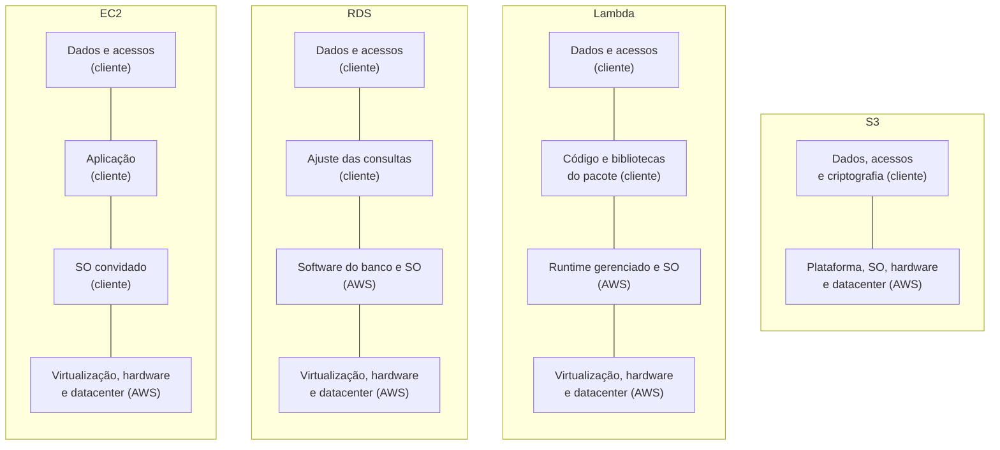

<!-- autoral -->

# 2.1 Modelo de responsabilidade compartilhada

> **Domínio 2 — Segurança e Conformidade (30% da prova)** · Depende das aulas [0.1](../fundamentos/01-servidor-e-virtualizacao.md), [0.3](../fundamentos/03-dados.md) e [0.5](../fundamentos/05-seguranca-basica.md)

> 🔎 **Fichas para aprofundar:** [EC2](../../servicos/computacao/ec2.md) · [RDS](../../servicos/banco-de-dados/rds.md) · [Lambda](../../servicos/computacao/lambda.md) · [S3](../../servicos/armazenamento/s3.md) · [DynamoDB](../../servicos/banco-de-dados/dynamodb.md)

🏠 [Índice do domínio](README.md) · 🏫 [O caso da escola](../00-guia-do-exame/caso-da-escola.md) · [2.2 Usuário root](02-usuario-root.md) ➡️

---

Quando o sistema de matrícula da escola rodava num computador da secretaria, a pergunta "quem cuida da segurança?" tinha uma resposta só: a própria escola. Ela trancava a sala, trocava o disco com defeito, atualizava o sistema operacional, criava as senhas e decidia quem via os documentos dos alunos. Agora o sistema está mudando para a AWS: o formulário vai rodar numa instância EC2, os dados de alunos e turmas num banco RDS, os documentos dos pais no S3, e uma função pequena vai gerar o comprovante de matrícula em PDF.

A sala da secretaria deixa de existir, mas o trabalho de segurança não some. Parte dele passa para a AWS e parte continua com a escola. Se cada lado achar que uma tarefa é do outro, ela fica sem dono: o patch que ninguém aplicou, a pasta de documentos que ficou aberta para qualquer pessoa. O **modelo de responsabilidade compartilhada** é a regra que diz quem faz o quê. Esta aula explica a divisão básica, por que ela muda de um serviço para outro e como a prova cobra isso.

## Segurança da nuvem e segurança na nuvem

O modelo separa duas responsabilidades. A AWS cuida da **segurança da nuvem**: proteger a infraestrutura que roda todos os serviços, isto é, o hardware, o software que opera essa infraestrutura, a rede e os prédios dos datacenters. O cliente cuida da **segurança na nuvem**: tudo o que ele coloca e configura dentro dos serviços que usa.

Na prática, a AWS controla e opera as camadas que vão do sistema operacional da máquina física e da camada de virtualização para baixo, até a segurança física das instalações. Você viu essas camadas na [aula 0.1](../fundamentos/01-servidor-e-virtualizacao.md): o hardware, o hipervisor que divide a máquina em máquinas virtuais e o prédio onde tudo fica. Ninguém da escola entra num datacenter da AWS, troca uma peça ou aplica patch no hipervisor. Até o fim da vida de um disco é tarefa da AWS: quando um dispositivo de armazenamento deixa de ser útil, a AWS o descarta com técnicas da norma NIST 800-88, e a mídia que guardou dados de clientes não sai do controle da AWS antes disso.

Do outro lado, o que a escola coloca na nuvem continua sendo dela. Os dados dos alunos, quem pode acessá-los, se eles são cifrados e como a rede deixa o tráfego entrar são decisões que a AWS não toma pelo cliente. A AWS oferece as ferramentas, como o IAM e o KMS da [aula 0.5](../fundamentos/05-seguranca-basica.md), mas configurá-las é tarefa de quem usa a conta.

A divisão existe porque cada lado só consegue proteger o que controla. A AWS não sabe quais funcionários da escola devem ver as notas dos alunos; a escola não tem acesso físico aos servidores da AWS. O limite do modelo é que ele não diz, sozinho, quem faz cada tarefa num caso concreto: a resposta depende do serviço usado, e é isso que a próxima seção explica.

## A divisão muda com o serviço

A responsabilidade do cliente é definida pelos serviços que ele escolhe. Quanto mais camadas o serviço administra, menos trabalho de configuração e manutenção fica com o cliente. Os quatro serviços do sistema de matrícula mostram isso em degraus.

**EC2: o cliente cuida do sistema operacional para cima.** Uma instância EC2 é um servidor virtual, e a AWS classifica o EC2 como infraestrutura como serviço (IaaS). A AWS entrega a máquina virtual funcionando sobre o hardware dela; da instância para cima, o trabalho é da escola. Ela administra o sistema operacional convidado, incluindo atualizações e patches de segurança, os programas que instala, as credenciais usadas para entrar na instância, as permissões dadas à instância e o **security group**, o firewall virtual que define quais portas e origens podem chegar até ela (você viu na [aula 0.2](../fundamentos/02-rede.md)). Se o Linux da instância ficar sem patch por um ano, a falha é da escola.

**RDS: a AWS assume também o sistema operacional e o software do banco.** No RDS, o banco relacional gerenciado da [aula 0.3](../fundamentos/03-dados.md), a AWS instala e aplica patches no sistema operacional e no software do banco, faz os backups e cuida da alta disponibilidade e da escala. A escola não entra no servidor do banco. Continua com ela o que depende do uso: quem pode administrar o banco (pelo IAM), quais endereços e instâncias podem se conectar (pelo security group do banco), se as conexões usam TLS, se o banco e as cópias de backup dele (os snapshots) são cifrados, e o ajuste das consultas, que depende do desenho dos dados e da aplicação.

**Lambda: a AWS cuida até o ambiente que roda o código.** O Lambda executa funções, trechos de código que rodam quando são chamados, sem que você administre servidores; ele volta na aula [3.5](../03-tecnologia-e-servicos/05-containers-e-serverless.md). A AWS mantém a infraestrutura, incluindo a manutenção e os patches dos servidores. O ambiente de execução da linguagem, chamado **runtime**, também é atualizado pelo Lambda: no modo padrão, as correções de segurança do runtime são aplicadas automaticamente às funções. Mas o código da função e as bibliotecas que a escola empacota junto com ele são dela. Se uma biblioteca de geração de PDF incluída no pacote tiver uma falha, a atualização do runtime não a corrige, porque o que está no pacote tem prioridade sobre o que vem no runtime.

**S3: a AWS opera até a plataforma; o cliente cuida dos dados e do acesso.** Em serviços que a AWS chama de abstratos, como o S3 e o DynamoDB, a AWS opera a infraestrutura, o sistema operacional e a plataforma, e o cliente só usa o serviço para guardar e ler dados. Mesmo assim, ficam com o cliente a gestão dos dados, incluindo as opções de criptografia, a classificação do que é sensível e as permissões no IAM. No S3, os objetos ficam guardados em **buckets**, os contêineres onde os objetos ficam, e cada bucket tem suas próprias regras de acesso. Se um bucket com documentos dos alunos ficar aberto ao público por uma permissão mal configurada, a falha é do cliente, não da AWS.

*Figura 2.1 — As mesmas camadas em quatro serviços, de cima (mais perto dos dados) para baixo (mais perto do prédio). Do EC2 para o S3, a AWS assume cada vez mais camadas, mas os dados e o controle de acesso continuam com o cliente em todos.*

O que não muda em nenhum degrau é a camada de cima. Dados, identidades e permissões são sempre do cliente. Por isso "serviço gerenciado" não quer dizer "serviço que se protege sozinho": o RDS aplica o patch do banco, mas não decide quem pode ler a tabela de alunos.

## Controles herdados, compartilhados e específicos do cliente

A mesma divisão vale para os **controles de TI**, as práticas que uma auditoria verifica, como controle de acesso físico ou gestão de patches. A AWS agrupa esses controles em três tipos.

Os **controles herdados** são os que o cliente recebe prontos da AWS, sem fazer nada. Os controles físicos e ambientais dos datacenters, como acesso ao prédio, energia e refrigeração, são o exemplo principal. Numa auditoria, a escola pode apresentar os relatórios da AWS para esses controles em vez de provar que ela mesma os executa.

Os **controles compartilhados** valem para as duas camadas, cada lado na sua. Na **gestão de patches**, a AWS corrige a infraestrutura e o cliente corrige o SO convidado e as aplicações. Na **gestão de configuração**, a AWS configura os equipamentos da infraestrutura e o cliente configura os próprios sistemas operacionais, bancos e aplicações. Em **conscientização e treinamento**, a AWS treina os funcionários dela e o cliente treina os seus.

Os **controles específicos do cliente** dependem só dele, porque tratam do que ele implanta. Um exemplo é exigir que certos dados trafeguem ou fiquem só em ambientes de segurança específicos.

O limite dessa classificação é o mesmo do modelo: ela depende do serviço, da região escolhida, de como os serviços se integram ao ambiente do cliente e das leis que se aplicam a ele. Uma escola sujeita a uma lei de proteção de dados de alunos precisa verificar o que essa lei exige dela, e nenhum controle herdado faz isso por ela.

## Na prova

O guia oficial do exame pede, nesta tarefa, que você reconheça as partes do modelo, descreva as responsabilidades da AWS, as do cliente e as compartilhadas, e explique como elas mudam de um serviço para outro, citando RDS, Lambda e EC2 como exemplos. As armadilhas mais comuns são estas:

- **Físico é sempre da AWS.** Datacenter, energia, refrigeração, hardware, descarte de discos e hipervisor não são do cliente em nenhum serviço.
- **Patch do SO depende do serviço.** No EC2, o cliente aplica patch no SO convidado. No RDS, a AWS aplica patch no SO e no software do banco.
- **Security group é sempre configurado pelo cliente.** A AWS oferece o firewall virtual; quais portas e origens ele libera é decisão de quem usa a conta.
- **Dados e permissões nunca passam para a AWS.** Mesmo no S3 e no DynamoDB, o cliente decide quem acessa, se os dados são cifrados e o que é sensível.
- **No Lambda, o código é do cliente.** A AWS atualiza o runtime gerenciado; as bibliotecas que vão no pacote da função são responsabilidade de quem escreveu a função.
- **Herdado, compartilhado e específico não são sinônimos.** "Controles físicos e ambientais" é herdado; "gestão de patches", "gestão de configuração" e "treinamento" são compartilhados.

## Caso resolvido

**Situação.** Depois da migração, uma auditoria encontra três problemas no sistema de matrícula: a instância EC2 do formulário está com o sistema operacional desatualizado há oito meses; um bucket do S3 com documentos dos pais permite leitura pública; e não há registro de como são destruídos os discos que guardaram os dados do banco RDS quando deixam de ser usados. A direção pergunta de quem é cada ponto.

**Raciocínio.** Na instância EC2, o sistema operacional é o SO convidado, que pertence à camada do cliente: o patch atrasado é responsabilidade da escola. No S3, a AWS opera a plataforma, mas as permissões de acesso são configuração do cliente: o bucket público também é problema da escola. O descarte de discos é segurança física, da camada da AWS: ela destrói a mídia com técnicas da NIST 800-88 e, como esse é um controle herdado, a escola atende a auditoria com a documentação de conformidade da AWS, sem executar nada.

**Por que as alternativas tentadoras falham.** "A AWS é responsável por tudo o que roda na nuvem dela" confunde segurança da nuvem com segurança na nuvem. "Como o S3 é gerenciado, a AWS deveria ter bloqueado o acesso público" ignora que permissões são configuração do cliente em qualquer serviço. "Então a escola precisa provar como os discos do RDS são destruídos" esquece que controles físicos são herdados: a escola usa a documentação da AWS, mas continua responsável por quem acessa o banco e se os dados dele são cifrados.

## Revisão

Tente responder antes de abrir cada resposta.

### Qual é a diferença entre segurança da nuvem e segurança na nuvem?

Ver resposta

Segurança da nuvem é proteger a infraestrutura que roda os serviços, e é da AWS; segurança na nuvem é proteger o que o cliente coloca e configura nos serviços, e é do cliente.

A preposição é a pista. "Da nuvem" fala do prédio, do hardware, da rede e da virtualização. "Na nuvem" fala de dados, identidades, permissões, criptografia e, quando o cliente administra, sistema operacional e aplicação.

### Por que a escola tem menos trabalho de segurança no RDS do que num banco instalado numa instância EC2?

Ver resposta

Porque no RDS a AWS assume o sistema operacional e o software do banco, incluindo instalação, patches e backups, que no EC2 seriam da escola.

No EC2, a AWS só entrega a máquina virtual. O que continua igual nos dois casos é a camada de cima: quem acessa o banco, como a rede chega até ele e se os dados são cifrados.

### Uma biblioteca empacotada numa função Lambda tem uma falha de segurança. Quem corrige?

Ver resposta

O cliente, que precisa atualizar a biblioteca e publicar a função de novo.

A AWS mantém a infraestrutura e atualiza o runtime gerenciado, mas o que vai dentro do pacote da função tem prioridade sobre o runtime e não é alterado pelas atualizações dele. A pergunta testa se você separa runtime (AWS) de código e dependências (cliente).

### O que é um controle compartilhado? Dê um exemplo.

Ver resposta

É um controle que vale para as duas camadas, com cada lado fazendo a sua parte; a gestão de patches é o exemplo clássico: a AWS corrige a infraestrutura e o cliente corrige o SO convidado e as aplicações.

Gestão de configuração e treinamento também são compartilhados. Não confunda com controle herdado, como os controles físicos e ambientais, que o cliente recebe prontos sem fazer nada.

### Num serviço como o S3, o que continua sendo responsabilidade do cliente?

Ver resposta

Os dados e o acesso a eles: as opções de criptografia, a classificação do que é sensível e as permissões que dizem quem pode ler e gravar.

A AWS opera infraestrutura, sistema operacional e plataforma, então não há patch nem servidor para o cliente cuidar. Mas um bucket aberto ao público por uma permissão mal configurada é falha do cliente.

## Resumo

- A AWS cuida da segurança **da** nuvem: hardware, software da infraestrutura, rede, datacenters e virtualização.
- O cliente cuida da segurança **na** nuvem: dados, identidades, permissões, criptografia e configuração dos serviços.
- A divisão depende do serviço: no EC2, o cliente cuida do SO convidado para cima; no RDS, a AWS assume SO e software do banco; no Lambda, também o runtime; no S3, até a plataforma.
- Dados, acessos e security groups ficam com o cliente em qualquer serviço.
- Controles herdados (físicos e ambientais) vêm prontos da AWS; compartilhados (patches, configuração, treinamento) têm uma parte de cada lado; específicos dependem só do cliente.
- Leis, regiões e integração com o ambiente do cliente também mudam o que cabe a ele.

## Fontes oficiais

Verificadas em 06/10/2026.

- [Shared Responsibility Model](https://aws.amazon.com/compliance/shared-responsibility-model/): segurança da nuvem e na nuvem; a AWS opera do SO do host e da virtualização até a segurança física; EC2 como IaaS, com o cliente cuidando do SO convidado, das aplicações e do security group; S3 e DynamoDB como serviços abstratos, com o cliente cuidando dos dados, da criptografia, da classificação e das permissões; controles herdados, compartilhados e específicos do cliente; responsabilidade que varia com serviços, regiões, integração e leis.
- [AWS Certified Cloud Practitioner (CLF-C02), Domínio 2](https://docs.aws.amazon.com/aws-certification/latest/cloud-practitioner-02/cloud-practitioner-02-domain2.html): habilidades da tarefa 2.1, com RDS, Lambda e EC2 como exemplos.
- [Security in Amazon EC2](https://docs.aws.amazon.com/AWSEC2/latest/UserGuide/ec2-security.html): o cliente controla o acesso de rede (VPC e security groups), as credenciais das instâncias, o SO convidado com seus patches e as funções do IAM ligadas à instância.
- [What is Amazon RDS?](https://docs.aws.amazon.com/AmazonRDS/latest/UserGuide/Welcome.html): no RDS, escala, alta disponibilidade, backups, patch e instalação do software do banco e do SO ficam com a AWS; otimização da aplicação e ajuste de consultas ficam com o cliente.
- [Security in Amazon RDS](https://docs.aws.amazon.com/AmazonRDS/latest/UserGuide/UsingWithRDS.html): o cliente controla o acesso com IAM, security groups e VPC, usa TLS nas conexões e ativa a criptografia do banco e dos snapshots.
- [What is AWS Lambda?](https://docs.aws.amazon.com/lambda/latest/dg/welcome.html): o Lambda gerencia a infraestrutura, incluindo manutenção e patches dos servidores.
- [Shared responsibility model for Lambda runtime management](https://docs.aws.amazon.com/lambda/latest/dg/runtime-management-shared.html): no modo automático (o padrão), o Lambda aplica os patches do runtime às funções; com imagens de contêiner, o cliente refaz a imagem.
- [Understanding how Lambda manages runtime version updates](https://docs.aws.amazon.com/lambda/latest/dg/runtimes-update.html): as bibliotecas do pacote da função têm prioridade, e as atualizações do runtime não as alteram.
- [General purpose buckets overview](https://docs.aws.amazon.com/AmazonS3/latest/userguide/UsingBucket.html): os dados do S3 ficam em buckets, cada um com suas permissões e seu controle de acesso público.
- [Data Center Controls](https://aws.amazon.com/compliance/data-center/controls/): a AWS descarta a mídia de armazenamento com técnicas da NIST 800-88, e a mídia com dados de clientes não sai do controle da AWS antes disso.

<!-- notas:inicio -->
## 📝 Minhas anotações

<!-- Escreva aqui suas observações, dúvidas e as questões que você errou sobre o tema. -->
<!-- notas:fim -->

---

🏠 [Índice do domínio](README.md) · [2.2 Usuário root](02-usuario-root.md) ➡️
