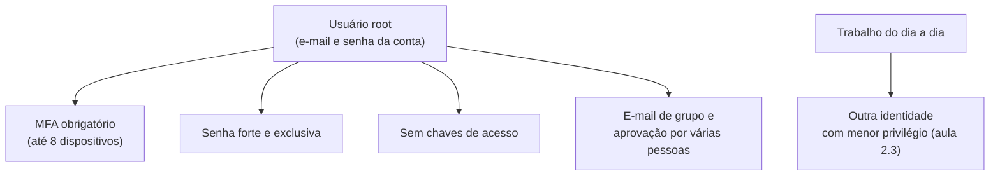

<!-- autoral -->

# 2.2 Usuário root

> **Domínio 2 — Segurança e Conformidade (30% da prova)** · Depende das aulas [0.5](../fundamentos/05-seguranca-basica.md) e [2.1](01-responsabilidade-compartilhada.md)

> 🔎 **Fichas para aprofundar:** [AWS IAM e AWS STS](../../servicos/seguranca/iam.md)

⬅️ [2.1 Modelo de responsabilidade compartilhada](01-responsabilidade-compartilhada.md) · 🏠 [Índice do domínio](README.md) · [2.3 AWS IAM](03-iam.md) ➡️

---

Para levar o sistema de matrícula para a AWS, a diretora da escola abriu uma conta. Ela informou o e-mail da secretaria, escolheu uma senha e cadastrou um cartão de pagamento. A partir desse momento a conta passou a ter uma identidade capaz de fazer qualquer coisa nela: criar e apagar servidores, ler todos os documentos dos alunos, mudar a forma de pagamento e até encerrar a conta. Na primeira semana, para não perder tempo, a diretora passou esse e-mail e essa senha para o técnico que vai montar o sistema e para a funcionária que acompanha a fatura.

Parece prático, mas agora três pessoas usam a mesma identidade, ninguém sabe quem fez cada ação e qualquer descuido de qualquer uma delas expõe a conta inteira. Esta aula explica o que é essa identidade inicial, o **usuário root**, por que ela é perigosa no uso diário, como protegê-la e quais tarefas realmente exigem entrar com ela.

## O que é o usuário root

Quando alguém cria uma conta AWS, começa com uma única identidade de login: o **usuário root** da conta. Ele entra com o endereço de e-mail e a senha usados na criação da conta e tem acesso completo a todos os serviços e recursos dela. Ninguém concede essas permissões ao root; elas vêm com a conta. Na [aula 0.5](../fundamentos/05-seguranca-basica.md) você viu que a autorização decide o que cada identidade pode fazer. No caso do root, a resposta padrão é "tudo": a AWS nega por padrão os pedidos de qualquer identidade que não tenha permissão explícita, com a exceção do usuário root, que tem acesso total.

Esse poder existe por um motivo prático. Alguém precisa conseguir administrar a conta antes de existir qualquer outra identidade, e precisa haver uma forma de recuperar o controle quando algo dá muito errado, como um administrador que retirou as próprias permissões por engano. O root é essa chave mestra.

O limite é o mesmo de uma chave mestra de um prédio: ela abre todas as portas, então perder uma cópia é muito mais grave do que perder a chave de uma sala. Se a senha do root vazar, quem a tiver controla a conta inteira, incluindo a cobrança e o encerramento. Por isso a AWS recomenda com ênfase não usar o root nas tarefas do dia a dia e guardá-lo para as tarefas que só ele pode fazer.

## Como proteger o root

A AWS publica um conjunto de boas práticas para o usuário root. Elas atacam o problema por dois lados: dificultar que alguém entre como root e reduzir as ocasiões em que é preciso entrar.

A primeira proteção é a **autenticação multifator** (MFA) da [aula 0.5](../fundamentos/05-seguranca-basica.md): além do e-mail e da senha, o login pede um segundo fator, como um código no celular ou uma chave de segurança física. Hoje a AWS exige MFA no usuário root de todos os tipos de conta. Se o MFA ainda não estiver ativo, o usuário precisa registrá-lo em até 35 dias depois da primeira tentativa de login no console. A conta aceita até oito dispositivos de MFA para o root, o que permite guardar um reserva caso o principal se perca. Entre os tipos aceitos, a AWS recomenda chaves de acesso (passkeys) e chaves de segurança físicas, que resistem melhor a páginas falsas que tentam roubar o código.

A segunda proteção é a senha. A senha do root precisa ter de 8 a 128 caracteres e misturar pelo menos três tipos de caractere (letras maiúsculas, minúsculas, números e símbolos), e a AWS recomenda uma senha forte e exclusiva, guardada num gerenciador de senhas.

A terceira é não criar **chaves de acesso** para o root. Chave de acesso é a credencial que programas usam para chamar a AWS pela linha de comando ou por código, em vez de digitar senha no console; a [aula 2.3](03-iam.md) explica esse tipo de credencial. Uma chave de acesso do root dá a um programa o poder total da conta e não expira sozinha. Quando for mesmo preciso usar o root pela linha de comando, a AWS recomenda o comando `aws login`, que gera credenciais temporárias.

Há ainda duas práticas de organização. Uma é usar um **endereço de e-mail de grupo** para o root, gerenciado pela empresa, para que a recuperação de senha não dependa de uma única pessoa que pode sair da organização. A outra é a **aprovação por várias pessoas**: uma pessoa guarda a senha e outra guarda o dispositivo de MFA, de modo que ninguém consegue entrar sozinho como root.

Por último, quem trabalha na conta todos os dias usa outra identidade, com só as permissões de que precisa. A AWS recomenda configurar um usuário administrativo no IAM Identity Center para as tarefas diárias. As identidades do IAM e o Identity Center são o assunto da [aula 2.3](03-iam.md).

*Figura 2.2 — O root fica guardado atrás de várias proteções e só é usado nas tarefas que o exigem; o trabalho diário passa por outras identidades.*

## As tarefas que exigem o root

A AWS mantém uma lista de tarefas que só podem ser feitas por quem entra como root. Ela é curta e muda com o tempo, então vale mais entender o padrão do que decorar cada item. Quase todas as tarefas da lista mexem com a própria conta, com a recuperação de controle ou com cobrança:

- **Credenciais do root numa conta independente:** mudar o e-mail, a senha do root e as chaves de acesso do root. Outras configurações da conta, como nome da conta, dados de contato, contatos alternativos, moeda de pagamento e Regiões habilitadas, não exigem o root.
- **Encerrar uma conta independente** e reabrir uma conta encerrada.
- **Recuperar o controle:** restaurar as permissões de um administrador do IAM que revogou as próprias permissões por engano.
- **Cobrança:** ativar o acesso de identidades do IAM ao console de faturamento, algumas tarefas de faturamento e a visualização de certas faturas de impostos.
- **Políticas que trancam todo mundo do lado de fora:** editar ou apagar uma política de um bucket S3 ou de uma fila SQS que nega acesso a todos. Bucket é o contêiner onde o S3 guarda objetos, e fila é o serviço de mensagens da [aula 0.4](../fundamentos/04-api-e-filas.md).
- **Tarefas específicas de alguns serviços:** configurar a exclusão com MFA (MFA Delete) num bucket S3, registrar-se como vendedor no Reserved Instance Marketplace, inscrever-se no AWS GovCloud (US) e vincular a conta ao Amazon Mechanical Turk, entre outras.

A palavra "independente" importa. Uma conta que faz parte do AWS Organizations, o serviço que reúne várias contas sob uma administração central (assunto da [aula 2.4](04-governanca-multi-conta.md)), pode ter o acesso root **centralizado**. Nesse caso a conta de gerenciamento da organização pode remover as credenciais root das contas-membro e fazer por elas algumas tarefas privilegiadas, como destravar uma política de bucket S3 que nega acesso a todos. Contas-membro novas criadas no Organizations já nascem sem credenciais de root.

## Na prova

- **"Qual identidade tem acesso total desde a criação da conta?"** É o usuário root, que entra com o e-mail e a senha usados na criação da conta.
- **Proteger o root = MFA, senha forte, sem chaves de acesso e sem uso diário.** Enunciados que pedem "a melhor prática para a conta recém-criada" quase sempre apontam para ativar MFA no root e criar outra identidade para o trabalho diário.
- **Desconfie de listas antigas de tarefas do root.** Mudar o nome da conta, os contatos ou as Regiões não exige mais o root. Mudar o e-mail ou a senha do root, encerrar uma conta independente e destravar uma política de bucket que nega tudo exigem.
- **Compartilhar o root nunca é a resposta.** Cada pessoa recebe a própria identidade, o que permite dar só as permissões necessárias e saber quem fez cada ação.
- **Tarefa de cobrança é pista de root.** Ativar o acesso do IAM ao console de faturamento é tarefa do root.

## Caso resolvido

**Situação.** A diretora percebeu o risco de ter passado a senha da conta para o técnico e para a funcionária da fatura. Ela quer corrigir isso e pergunta o que fazer, sabendo que a funcionária precisa ver as faturas no console de faturamento e que o técnico precisa criar servidores.

**Raciocínio.** O primeiro passo é trocar a senha do root, que só o root pode fazer, e ativar MFA nele, já que três pessoas conheceram a senha antiga. Depois, cada pessoa recebe a própria identidade com permissões limitadas ao seu trabalho, assunto da próxima aula. Para que a funcionária veja as faturas com uma identidade do IAM, a diretora entra uma vez como root e ativa o acesso do IAM ao console de faturamento, outra tarefa reservada ao root. Daí em diante, o root fica guardado e só volta a ser usado nas tarefas da lista.

**Por que as alternativas tentadoras falham.** Manter a senha compartilhada e só ativar MFA ainda deixa três pessoas usando a mesma identidade, sem saber quem fez o quê e com poder total. Criar chaves de acesso do root para o técnico automatizar o trabalho entrega a um programa o poder da conta inteira, com credenciais que não expiram. Achar que a funcionária precisa do root para ver as faturas também é um erro: o root só é necessário uma vez, para ativar o acesso; depois ela usa a própria identidade.

## Revisão

Tente responder antes de abrir cada resposta.

### O que é o usuário root de uma conta AWS?

Ver resposta

É a identidade criada junto com a conta, que entra com o e-mail e a senha usados na criação e tem acesso completo a todos os serviços e recursos da conta.

Comentário: as permissões do root não vêm de nenhuma política; vêm da própria conta. É por isso que ele é tão perigoso no uso diário.

### Por que a AWS recomenda não usar o root nas tarefas do dia a dia?

Ver resposta

Porque ele tem poder total sobre a conta: qualquer erro ou vazamento da credencial afeta tudo, inclusive a cobrança e o encerramento da conta. O trabalho diário deve usar identidades com só as permissões necessárias.

Comentário: a pergunta testa a ligação entre o root e o menor privilégio da aula 0.5. O root é exatamente o oposto do menor privilégio.

### Quais são as principais proteções do root?

Ver resposta

Ativar MFA (hoje exigido em todos os tipos de conta), usar uma senha forte e exclusiva, não criar chaves de acesso para o root e usar e-mail de grupo e aprovação por várias pessoas.

Comentário: chave de acesso é a proteção mais esquecida. Uma chave do root dá poder total a um programa e não expira; quando é preciso usar o root na linha de comando, a AWS recomenda `aws login`, que gera credenciais temporárias.

### Mudar o nome da conta exige entrar como root?

Ver resposta

Não. Nome da conta, dados de contato, contatos alternativos, moeda de pagamento e Regiões podem ser mudados sem o root. Mudar o e-mail, a senha e as chaves de acesso do root de uma conta independente exige o root.

Comentário: a lista de tarefas do root encolheu com o tempo, e materiais antigos ainda dizem o contrário. Confira sempre a lista atual da AWS.

### Cite três tarefas que exigem o root.

Ver resposta

Encerrar uma conta independente, restaurar as permissões de um administrador do IAM que se trancou do lado de fora e ativar o acesso do IAM ao console de faturamento. Também valem destravar uma política de bucket S3 ou de fila SQS que nega acesso a todos e configurar MFA Delete num bucket S3.

Comentário: o padrão comum é mexer na própria conta, recuperar o controle ou tratar de cobrança. Em contas do AWS Organizations com acesso root centralizado, a conta de gerenciamento faz algumas dessas tarefas pelas contas-membro.

## Resumo

- O usuário root é a identidade criada com a conta: entra com o e-mail e a senha da criação e tem acesso total.
- Ele não é para o dia a dia; o trabalho diário usa outras identidades com menor privilégio.
- MFA no root é obrigatório em todos os tipos de conta e deve ser registrado em até 35 dias.
- Senha forte, nenhuma chave de acesso, e-mail de grupo e aprovação por várias pessoas completam a proteção.
- Só algumas tarefas exigem o root: credenciais do próprio root, encerrar conta independente, recuperar permissões, parte da cobrança e destravar políticas que negam tudo.
- No AWS Organizations, o acesso root das contas-membro pode ser centralizado e as credenciais removidas.

## Fontes oficiais

Verificadas em 06/10/2026.

- [AWS account root user](https://docs.aws.amazon.com/IAM/latest/UserGuide/id_root-user.html): o root entra com o e-mail e a senha da criação e tem acesso completo; lista de tarefas que exigem o root, incluindo as configurações que não o exigem; gerenciamento centralizado do root no Organizations e contas-membro novas sem credenciais de root.
- [Root user best practices for your AWS account](https://docs.aws.amazon.com/IAM/latest/UserGuide/root-user-best-practices.html): MFA exigido em todos os tipos de conta e registro em até 35 dias; até oito dispositivos de MFA; senha de 8 a 128 caracteres; não criar chaves de acesso e usar `aws login`; e-mail de grupo e aprovação por várias pessoas.
- [Multi-factor authentication for AWS account root user](https://docs.aws.amazon.com/IAM/latest/UserGuide/enable-mfa-for-root.html): tipos de MFA aceitos para o root, com chaves de acesso e chaves de segurança recomendadas.
- [Policy evaluation logic: deny and allow](https://docs.aws.amazon.com/IAM/latest/UserGuide/reference_policies_evaluation-logic_policy-eval-denyallow.html): os pedidos são negados por padrão, com exceção do usuário root, que tem acesso total.

<!-- notas:inicio -->
## 📝 Minhas anotações

<!-- Escreva aqui suas observações, dúvidas e as questões que você errou sobre o tema. -->
<!-- notas:fim -->

---

⬅️ [2.1 Modelo de responsabilidade compartilhada](01-responsabilidade-compartilhada.md) · 🏠 [Índice do domínio](README.md) · [2.3 AWS IAM](03-iam.md) ➡️
