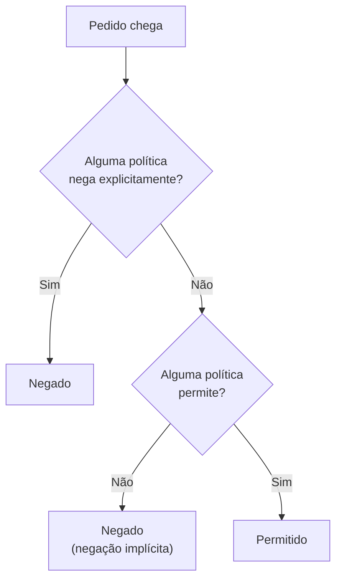

<!-- autoral -->

# 2.3 AWS IAM (Identity and Access Management)

> **Domínio 2 — Segurança e Conformidade (30% da prova)** · Depende das aulas [0.5](../fundamentos/05-seguranca-basica.md) e [2.2](02-usuario-root.md)

> 🔎 **Fichas para aprofundar:** [AWS IAM e AWS STS](../../servicos/seguranca/iam.md) · [IAM Identity Center](../../servicos/seguranca/iam-identity-center.md) · [Amazon Cognito](../../servicos/seguranca/cognito.md) · [AWS Directory Service](../../servicos/seguranca/directory-service.md) · [Secrets Manager e Parameter Store](../../servicos/seguranca/secrets-manager-e-parameter-store.md)

⬅️ [2.2 Usuário root](02-usuario-root.md) · 🏠 [Índice do domínio](README.md) · [2.4 Governança multi-conta](04-governanca-multi-conta.md) ➡️

---

Depois de trocar a senha do root e ativar MFA, a diretora da escola precisa resolver o resto: o técnico precisa criar servidores, a funcionária da fatura precisa ver os custos, duas professoras vão consultar relatórios, e o próprio sistema de matrícula, rodando numa instância EC2, precisa gravar os documentos dos pais no S3. São pessoas e programas diferentes, cada um com uma necessidade diferente. Dar a todos o mesmo acesso seria repetir o erro do root compartilhado.

Na [aula 0.5](../fundamentos/05-seguranca-basica.md) você viu as duas perguntas de qualquer pedido: quem é você (autenticação) e o que você pode fazer (autorização). O **AWS IAM** (Identity and Access Management) é o serviço que responde essas duas perguntas dentro de uma conta AWS. Esta aula explica as identidades do IAM, as políticas que dão permissões, como a AWS decide se um pedido passa, que credenciais cada identidade usa e quais serviços vizinhos cuidam de funcionários, clientes e senhas de aplicações.

## Identidades: usuários, grupos e funções

O IAM controla quem pode ser autenticado e quem é autorizado a usar cada recurso da conta. O IAM, o IAM Identity Center e o AWS STS (que veremos adiante) não têm cobrança adicional; paga-se apenas pelos outros serviços que essas identidades usam.

Um **usuário do IAM** é uma identidade criada na conta que representa uma pessoa ou um programa. Ele tem um nome e **credenciais de longo prazo**: uma senha para entrar no console e, se necessário, chaves de acesso para chamar a AWS por código. "Longo prazo" quer dizer que a credencial vale até alguém trocá-la ou apagá-la.

Um **grupo de usuários** é um conjunto de usuários do IAM. Ele existe para simplificar a administração: em vez de dar as mesmas permissões a cada professora, a diretora cria um grupo "Professoras", dá as permissões ao grupo, e toda usuária colocada nele as recebe. Um usuário pode estar em vários grupos. Grupos têm limites que caem na prova: um grupo contém só usuários, não outros grupos; não existe um grupo padrão que inclua todos os usuários da conta; e um grupo não é uma identidade que faz pedidos, então não pode aparecer como o "quem" de uma política.

Uma **função do IAM** (em inglês, *role*) também é uma identidade com permissões, mas não pertence a uma pessoa: ela é **assumida** por quem precisar dela, seja um usuário, um serviço da AWS ou alguém de fora autenticado por outro sistema. A função não tem senha nem chaves de acesso. Quando alguém a assume, recebe **credenciais temporárias**, que expiram sozinhas depois de um tempo configurável, de minutos a algumas horas. Quem gera essas credenciais é o **AWS STS** (Security Token Service).

Credenciais temporárias existem porque credenciais permanentes são o que mais vaza: ficam esquecidas em arquivos, em código e em computadores antigos. Uma credencial que expira sozinha não precisa ser revogada quando deixa de ser usada e perde o valor rapidamente se vazar. Por isso a AWS recomenda que pessoas acessem a conta com credenciais temporárias e reserva os usuários do IAM com credenciais de longo prazo para casos que não conseguem usar funções, como uma ferramenta de terceiros que não oferece outra forma de login.

## Políticas: onde as permissões ficam escritas

As permissões do IAM são escritas em **políticas**: documentos em formato JSON que dizem quais ações são permitidas ou negadas, em quais recursos. Uma política anexada a um usuário, grupo ou função é uma **política baseada em identidade**: ela diz o que aquela identidade pode fazer. Alguns serviços aceitam também **políticas baseadas em recurso**, anexadas ao próprio recurso, como a política de um bucket S3 que diz quem pode ler os objetos dele.

As políticas baseadas em identidade vêm em três tipos:

| Tipo | Quem cria e mantém | Pode ser editada por você | Anexada a |
|---|---|---|---|
| Gerenciada pela AWS | AWS | Não | Muitas identidades |
| Gerenciada pelo cliente | Você | Sim | Muitas identidades |
| Em linha (*inline*) | Você | Sim | Uma única identidade |

As **políticas gerenciadas pela AWS** são prontas, como a `AdministratorAccess`, que dá acesso total, ou políticas por função de trabalho. São o jeito mais rápido de começar, mas costumam dar mais permissões do que cada caso precisa. As **gerenciadas pelo cliente** são escritas por você, sob medida, e podem ser reaproveitadas em várias identidades; é aqui que se aplica o **menor privilégio** da aula 0.5. As **em linha** pertencem a uma única identidade e somem quando ela é apagada; servem para permissões que não devem ser reaproveitadas por engano.

## Como a AWS decide se um pedido passa

Toda vez que alguém chama a AWS, o pedido é avaliado contra as políticas que se aplicam a ele. A lógica tem três regras, e a ordem importa:

1. **Tudo começa negado.** Sem nenhuma política que permita, o pedido é recusado. Isso se chama **negação implícita**. A única exceção é o usuário root da [aula 2.2](02-usuario-root.md), que tem acesso total.
2. **Uma permissão explícita libera.** Se uma política baseada em identidade ou baseada em recurso da mesma conta permite a ação, o pedido pode passar. As permissões dos dois tipos se somam.
3. **Uma negação explícita vence tudo.** Se qualquer política aplicável negar a ação, o pedido é recusado, mesmo que outra política permita.

*Figura 2.3 — Avaliação simplificada de um pedido numa conta: uma negação explícita sempre vence; sem permissão explícita, o pedido é negado por padrão.*

A figura é uma simplificação para uma conta só. Existem outros tipos de política que funcionam como teto: elas não dão permissão, só limitam o máximo que as outras podem dar. As políticas de controle de serviço do AWS Organizations são o exemplo mais cobrado e aparecem na [aula 2.4](04-governanca-multi-conta.md). Outro detalhe prático é que o IAM é **eventualmente consistente**: uma permissão recém-criada pode levar um instante para valer em todos os lugares.

## Credenciais: senhas, chaves de acesso e funções

Usuários do IAM que entram no console usam senha. A **política de senhas da conta** define as regras para essas senhas: tamanho mínimo, tipos de caractere, se a senha expira e se senhas antigas podem ser reutilizadas. Ela não vale para a senha do root nem para chaves de acesso. Quando a regra de tamanho muda, ela só é cobrada na próxima troca de senha; já a expiração vale na hora, e quem tem senha mais antiga que o prazo precisa trocá-la no próximo login.

**Chaves de acesso** são credenciais de longo prazo para programas: um identificador da chave e uma chave secreta, usados juntos para assinar pedidos pela linha de comando, por SDKs ou pela API. A chave secreta só pode ser vista ou baixada no momento da criação; se for perdida, cria-se outra. Cada usuário pode ter no máximo duas chaves de acesso, o que permite trocar uma por outra sem parar o programa. A AWS recomenda não colocar chaves de acesso no código e preferir funções com credenciais temporárias sempre que possível.

O caso mais comum é um programa rodando numa instância EC2, como o sistema de matrícula. Em vez de gravar chaves de acesso dentro do servidor, a diretora cria uma função com permissão para gravar no bucket dos documentos e a anexa à instância por meio de um **perfil de instância**, que é o contêiner que leva a função até a máquina. O programa recebe credenciais temporárias que são renovadas automaticamente, e ninguém precisa copiar ou trocar chaves.

Funções também resolvem o **acesso entre contas**. Muitas organizações separam o ambiente de testes do ambiente de produção em contas diferentes. Em vez de criar um segundo usuário com outra senha na conta de produção, cria-se nela uma função que usuários da conta de testes podem assumir quando precisam publicar uma atualização.

## Funcionários, clientes e diretórios

O IAM não é o único lugar onde identidades podem morar, e a prova cobra a escolha certa para cada tipo de pessoa.

**Federação** é deixar que pessoas autenticadas por outro sistema de identidade entrem na AWS sem ter um usuário do IAM. O sistema externo, chamado provedor de identidade, confirma quem a pessoa é usando padrões como SAML 2.0 ou OpenID Connect (OIDC), e a AWS entrega credenciais temporárias. Assim a escola pode usar as mesmas contas de login que os funcionários já têm na rede da escola.

O **AWS IAM Identity Center** (antigo AWS Single Sign-On) é a solução da AWS para dar a funcionários acesso a várias contas AWS e a aplicações. Os usuários podem ser criados no próprio Identity Center ou sincronizados de um provedor de identidade que a empresa já usa, e entram por um portal de acesso, onde veem as contas e aplicações liberadas para eles. É a opção indicada quando há várias contas no AWS Organizations; a AWS recomenda, inclusive, criar no Identity Center o usuário administrativo do dia a dia, em vez de usar o root.

O **Amazon Cognito** resolve outro problema: os usuários de uma aplicação, como os pais que fazem a matrícula pelo site. Um **pool de usuários** do Cognito (*user pool*) é um diretório que cuida do cadastro e do login no aplicativo, inclusive com contas sociais como Google e Apple. Um **pool de identidades** (*identity pool*) troca esse login por credenciais temporárias e limitadas, para o aplicativo acessar serviços como o S3 em nome do usuário. A regra prática: funcionários acessando a AWS, Identity Center; clientes de um aplicativo, Cognito.

O **AWS Directory Service** oferece formas de usar o Microsoft Active Directory, o diretório de usuários e computadores muito comum em empresas, com os serviços da AWS, seja com um diretório gerenciado pela AWS, seja conectado a um diretório que a empresa já tem.

## Onde guardar senhas de aplicações

O sistema de matrícula também precisa da senha do banco de dados. Deixá-la no código ou num arquivo de configuração tem o mesmo problema das chaves de acesso: ela vaza junto com o código e nunca é trocada. Dois serviços aparecem no guia do exame para isso.

O **AWS Secrets Manager** guarda, recupera e faz a **rotação** de segredos como credenciais de banco de dados, chaves de API e tokens. Rotação é trocar o segredo periodicamente; com o Secrets Manager ela pode ser automática, num calendário, e o programa sempre busca o valor atual em vez de guardar uma cópia.

O **AWS Systems Manager Parameter Store** guarda parâmetros de configuração, em texto simples ou cifrados (o tipo `SecureString`). A própria AWS recomenda o Parameter Store para configurações e o Secrets Manager para segredos como credenciais de banco, chaves de API e tokens, porque ele traz rotação automática.

## Ferramentas para revisar o acesso

Permissões se acumulam com o tempo. O IAM oferece três ferramentas para revisar o que existe:

- O **relatório de credenciais** lista todos os usuários da conta e a situação de cada credencial: senha, chaves de acesso e dispositivos de MFA.
- As **informações de último acesso** mostram quando cada identidade usou cada serviço, para encontrar permissões que nunca são usadas e removê-las.
- O **IAM Access Analyzer** identifica recursos, como buckets S3 e funções, que estão compartilhados com alguém de fora da conta ou da organização, analisando as políticas baseadas em recurso.

## Na prova

- **Grupo junta usuários; função é assumida.** Permissões iguais para várias pessoas pedem grupo. Um serviço ou alguém de fora que precisa de acesso temporário pede função.
- **Instância EC2 acessando outro serviço = função do IAM.** Gravar chaves de acesso no servidor é sempre a alternativa errada.
- **Negação explícita vence permissão.** E, sem permissão explícita, o pedido é negado.
- **Credenciais temporárias vêm do STS.** Funções e federação usam credenciais temporárias; usuários do IAM têm credenciais de longo prazo.
- **Identity Center para funcionários, Cognito para clientes.** Acesso de funcionários a várias contas da organização é Identity Center; cadastro e login de usuários de um aplicativo é Cognito.
- **Rotação automática de segredos = Secrets Manager.** O Parameter Store guarda configurações, inclusive cifradas, mas a AWS indica o Secrets Manager para segredos.
- **"Quem tem chave de acesso sem MFA?" = relatório de credenciais.** "Que recurso está compartilhado com outra conta?" = IAM Access Analyzer.

## Caso resolvido

**Situação.** A diretora quer organizar o acesso da escola: as duas professoras precisam das mesmas permissões de leitura de relatórios; o sistema de matrícula, numa instância EC2, precisa gravar documentos no S3 e conectar no banco de dados com usuário e senha; os pais vão entrar no site para acompanhar a matrícula.

**Raciocínio.** As professoras recebem usuários próprios num grupo com uma política gerenciada pelo cliente que só permite ler os relatórios: grupo para permissões iguais, menor privilégio na política. O sistema de matrícula recebe uma função anexada à instância por um perfil de instância, com permissão para gravar só no bucket dos documentos; as credenciais são temporárias e renovadas sozinhas. A senha do banco vai para o Secrets Manager com rotação automática, e a função da instância ganha permissão para ler esse segredo. Os pais se cadastram e entram pelo Amazon Cognito, sem nenhum usuário do IAM.

**Por que as alternativas tentadoras falham.** Criar chaves de acesso de um usuário do IAM e gravá-las na instância funciona, mas deixa uma credencial permanente num servidor, que precisa ser trocada à mão e vaza junto com o disco ou o código. Anexar a política `AdministratorAccess` às professoras "para não dar problema" contraria o menor privilégio. Criar um usuário do IAM para cada pai confunde clientes de aplicativo com pessoas que administram a conta; esse é o papel do Cognito. Guardar a senha do banco no Parameter Store em texto simples deixa o segredo legível e sem rotação.

## Revisão

Tente responder antes de abrir cada resposta.

### Qual é a diferença entre um usuário do IAM e uma função do IAM?

Ver resposta

O usuário representa uma pessoa ou programa e tem credenciais de longo prazo (senha e chaves de acesso). A função não pertence a ninguém: é assumida por quem precisa dela e entrega credenciais temporárias, geradas pelo AWS STS.

Comentário: a AWS prefere credenciais temporárias porque expiram sozinhas. É por isso que serviços como o EC2 e o acesso entre contas usam funções.

### Uma política permite ler um bucket e outra nega a mesma ação. O que acontece?

Ver resposta

O pedido é negado, porque uma negação explícita sempre vence uma permissão.

Comentário: guarde também o outro lado da regra: sem nenhuma permissão explícita, o pedido é negado por padrão (negação implícita). A exceção é o usuário root.

### Como dar a uma aplicação numa instância EC2 acesso a um bucket S3 sem gravar credenciais no servidor?

Ver resposta

Criar uma função do IAM com a permissão necessária e anexá-la à instância por meio de um perfil de instância. A aplicação recebe credenciais temporárias renovadas automaticamente.

Comentário: chaves de acesso gravadas no servidor são a alternativa tentadora e errada; elas não expiram e precisam ser trocadas à mão.

### Quando usar o IAM Identity Center e quando usar o Amazon Cognito?

Ver resposta

O Identity Center dá a funcionários acesso a várias contas AWS e aplicações, com login único. O Cognito cuida do cadastro e do login dos usuários de um aplicativo, como clientes de um site.

Comentário: a pergunta testa o tipo de pessoa. Quem administra ou trabalha na AWS é funcionário; quem usa o produto da empresa é cliente.

### Qual serviço guarda a senha de um banco de dados com rotação automática?

Ver resposta

O AWS Secrets Manager, que guarda, recupera e troca segredos automaticamente num calendário.

Comentário: o Systems Manager Parameter Store também guarda valores cifrados, mas a AWS o indica para configurações e recomenda o Secrets Manager para credenciais por causa da rotação automática.

## Resumo

- O IAM responde quem é você e o que você pode fazer dentro da conta, sem cobrança adicional.
- Usuários têm credenciais de longo prazo; grupos juntam usuários; funções são assumidas e dão credenciais temporárias do STS.
- Políticas JSON dão permissões: gerenciadas pela AWS, gerenciadas pelo cliente ou em linha; o ideal é o menor privilégio.
- Tudo começa negado, uma permissão explícita libera e uma negação explícita vence.
- Aplicações no EC2 usam funções por perfil de instância; acesso entre contas também usa funções.
- Identity Center é para funcionários em várias contas; Cognito é para clientes de aplicativos; Directory Service leva o Active Directory para a AWS.
- Secrets Manager guarda segredos com rotação automática; Parameter Store guarda configurações.
- Relatório de credenciais, último acesso e Access Analyzer ajudam a revisar o acesso.

## Fontes oficiais

Verificadas em 06/10/2026.

- [What is IAM?](https://docs.aws.amazon.com/IAM/latest/UserGuide/introduction.html): o IAM controla autenticação e autorização; IAM, Identity Center e STS sem cobrança adicional; o IAM é eventualmente consistente.
- [IAM users](https://docs.aws.amazon.com/IAM/latest/UserGuide/id_users.html): usuário com nome e credenciais de longo prazo; recomendação de federação com credenciais temporárias para pessoas.
- [IAM user groups](https://docs.aws.amazon.com/IAM/latest/UserGuide/id_groups.html): grupos contêm só usuários, um usuário pode estar em vários grupos, não há grupo padrão e grupo não pode ser `Principal`.
- [IAM roles](https://docs.aws.amazon.com/IAM/latest/UserGuide/id_roles.html): função assumível, sem credenciais de longo prazo, que entrega credenciais temporárias; usuários do IAM para cargas que não usam funções.
- [Temporary security credentials in IAM](https://docs.aws.amazon.com/IAM/latest/UserGuide/id_credentials_temp.html): o STS gera credenciais temporárias que duram de minutos a horas e expiram sozinhas.
- [Managed policies and inline policies](https://docs.aws.amazon.com/IAM/latest/UserGuide/access_policies_managed-vs-inline.html): comparação entre políticas gerenciadas pela AWS, gerenciadas pelo cliente e em linha.
- [Policy evaluation logic](https://docs.aws.amazon.com/IAM/latest/UserGuide/reference_policies_evaluation-logic.html) e [deny and allow](https://docs.aws.amazon.com/IAM/latest/UserGuide/reference_policies_evaluation-logic_policy-eval-denyallow.html): negação implícita por padrão (exceto root), soma de permissões de identidade e de recurso na mesma conta e negação explícita vencendo.
- [Set an account password policy for IAM users](https://docs.aws.amazon.com/IAM/latest/UserGuide/id_credentials_passwords_account-policy.html): a política não vale para o root nem para chaves de acesso; quando valem as mudanças de tamanho e de expiração.
- [Manage access keys for IAM users](https://docs.aws.amazon.com/IAM/latest/UserGuide/id_credentials_access-keys.html): identificador e chave secreta, secreta visível só na criação, no máximo duas por usuário, não colocar no código.
- [Use an IAM role to grant permissions to applications running on Amazon EC2 instances](https://docs.aws.amazon.com/IAM/latest/UserGuide/id_roles_use_switch-role-ec2.html): função entregue à instância por perfil de instância, com credenciais temporárias.
- [Access for an IAM user in another AWS account that you own](https://docs.aws.amazon.com/IAM/latest/UserGuide/id_roles_common-scenarios_aws-accounts.html): acesso entre contas de desenvolvimento e produção com funções.
- [Identity providers and federation into AWS](https://docs.aws.amazon.com/IAM/latest/UserGuide/id_roles_providers.html): federação com SAML 2.0 e OIDC, e Identity Center para várias contas.
- [What is IAM Identity Center?](https://docs.aws.amazon.com/singlesignon/latest/userguide/what-is.html): acesso de funcionários a várias contas e aplicações, portal de acesso e o nome antigo AWS Single Sign-On.
- [What is Amazon Cognito?](https://docs.aws.amazon.com/cognito/latest/developerguide/what-is-amazon-cognito.html): pools de usuários para cadastro e login, inclusive social, e pools de identidades para credenciais temporárias.
- [What is AWS Directory Service?](https://docs.aws.amazon.com/directoryservice/latest/admin-guide/what_is.html): formas de usar o Microsoft Active Directory com serviços da AWS.
- [What is AWS Secrets Manager?](https://docs.aws.amazon.com/secretsmanager/latest/userguide/intro.html): guarda, recupera e faz rotação automática de segredos.
- [AWS Systems Manager Parameter Store](https://docs.aws.amazon.com/systems-manager/latest/userguide/systems-manager-parameter-store.html): parâmetros em texto ou `SecureString`; recomendação do Secrets Manager para segredos com rotação automática.
- [Generate credential reports](https://docs.aws.amazon.com/IAM/latest/UserGuide/id_credentials_getting-report.html), [last accessed information](https://docs.aws.amazon.com/IAM/latest/UserGuide/access_policies_last-accessed.html) e [IAM Access Analyzer](https://docs.aws.amazon.com/IAM/latest/UserGuide/what-is-access-analyzer.html): as três ferramentas de revisão de acesso.

<!-- notas:inicio -->
## 📝 Minhas anotações

<!-- Escreva aqui suas observações, dúvidas e as questões que você errou sobre o tema. -->
<!-- notas:fim -->

---

⬅️ [2.2 Usuário root](02-usuario-root.md) · 🏠 [Índice do domínio](README.md) · [2.4 Governança multi-conta](04-governanca-multi-conta.md) ➡️
