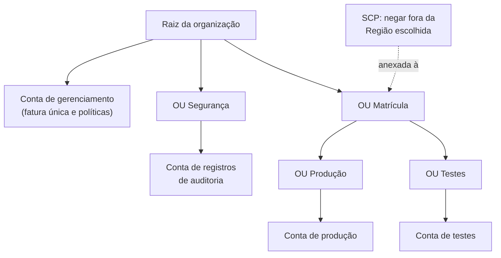

<!-- autoral -->

# 2.4 Governança multi-conta

> **Domínio 2 — Segurança e Conformidade (30% da prova)** · Depende das aulas [2.2](02-usuario-root.md) e [2.3](03-iam.md)

> 🔎 **Fichas para aprofundar:** [AWS Organizations](../../servicos/gerenciamento/organizations.md) · [AWS Control Tower](../../servicos/gerenciamento/control-tower.md) · [AWS Service Catalog e AWS RAM](../../servicos/gerenciamento/service-catalog-e-ram.md)

⬅️ [2.3 AWS IAM](03-iam.md) · 🏠 [Índice do domínio](README.md) · 🏫 [O caso da escola](../00-guia-do-exame/caso-da-escola.md) · [2.5 Criptografia](05-criptografia.md) ➡️

---

O sistema de matrícula deu certo, e o técnico da escola quer testar uma versão nova antes de colocá-la no ar. Se ele testar na mesma conta onde estão os dados reais dos alunos, um erro no teste pode apagar documentos de verdade, e qualquer permissão dada para "facilitar o teste" vale também para a produção. A solução mais segura é ter contas separadas: uma para produção, outra para testes, talvez uma só para guardar os registros de auditoria. Mas aí surgem novos problemas: três contas com três roots para proteger, três faturas, e nenhuma forma de garantir que todas sigam as mesmas regras.

Esta aula explica por que a AWS recomenda usar várias contas, como o **AWS Organizations** reúne essas contas sob uma administração central, como as **políticas de controle de serviço** limitam o que cada conta pode fazer e o que o **AWS Control Tower**, o **AWS Service Catalog** e o **AWS Resource Access Manager** acrescentam.

## Por que usar várias contas

Uma conta AWS é uma fronteira natural de permissões, de segurança, de custos e de cargas de trabalho. O que está numa conta não é acessível por outra, a não ser que alguém libere de propósito, como no acesso entre contas por funções da [aula 2.3](03-iam.md). Por isso a AWS recomenda um ambiente com várias contas quando o uso da nuvem cresce.

O guia da AWS sobre organizar ambientes lista os motivos. Separar produção e testes permite aplicar controles de segurança diferentes em cada ambiente. Guardar dados sensíveis numa conta à parte restringe quem chega perto deles. Um incidente numa conta tem seu impacto limitado àquela conta. Os custos ficam separados por projeto ou setor sem esforço extra. E as cotas de serviço, os limites de uso que a AWS aplica por conta, deixam de ser disputadas por equipes diferentes.

O custo dessa separação é administrativo: cada conta precisa ser criada, protegida, faturada e mantida dentro das regras da empresa. É esse custo que os serviços desta aula reduzem.

## AWS Organizations: uma administração para várias contas

O **AWS Organizations** permite gerenciar várias contas de forma central. Com ele é possível criar contas por código, agrupá-las, aplicar políticas de governança e pagar uma fatura única.

Uma **organização** tem uma estrutura em árvore. No topo fica a **raiz** da organização, criada automaticamente (não confunda com o usuário root da [aula 2.2](02-usuario-root.md); são coisas diferentes com nome parecido). Abaixo dela ficam as **unidades organizacionais** (OUs, de *organizational units*), que são grupos de contas, como pastas. Uma OU pode conter outras OUs, por exemplo uma OU "Matrícula" com uma OU de produção e outra de testes dentro. A hierarquia pode ter até cinco níveis de OUs abaixo da raiz.

As contas da organização têm dois papéis. A **conta de gerenciamento** é a que criou a organização: ela convida ou cria as outras contas, aplica políticas e paga a fatura. As demais são **contas-membro**, e cada uma pertence a uma única organização por vez. Uma conta-membro pode ser designada **administradora delegada** de algum serviço, para que a equipe de segurança, por exemplo, administre ferramentas de segurança da organização inteira sem usar a conta de gerenciamento.

O **faturamento consolidado** é o recurso de cobrança do Organizations e não tem custo adicional. Ele junta as contas numa fatura e soma o uso de todas elas, de modo que a organização compartilha descontos por volume, descontos de Instâncias Reservadas e Savings Plans (modelos de compra com desconto da [aula 4.2](../04-cobranca-precos-e-suporte/02-modelos-de-compra-ec2.md)). Assim, várias contas pequenas podem pagar menos do que pagariam separadas. Juntar a cobrança não junta os dados: cada conta continua isolada das outras.

*Figura 2.4 — Uma organização em árvore: a raiz, a conta de gerenciamento, OUs aninhadas e contas-membro. Uma SCP anexada à OU Matrícula vale para todas as contas abaixo dela.*

## Políticas de controle de serviço: o teto das contas

Uma **política de controle de serviço** (SCP, de *service control policy*) define o máximo de permissões que os usuários e funções do IAM de uma conta-membro podem ter. Ela é anexada à raiz, a uma OU ou a uma conta, e vale para tudo o que está abaixo: uma SCP numa OU afeta todas as contas daquela OU e das OUs dentro dela.

O ponto mais cobrado é que **uma SCP não concede permissão nenhuma**. Ela só estabelece um limite. Para alguém fazer algo, ainda é preciso uma política do IAM que permita a ação. A permissão efetiva é a interseção: a ação precisa estar liberada pela SCP **e** pelas políticas do IAM. Se a SCP bloquear uma ação, nem um usuário com a política `AdministratorAccess` consegue executá-la naquela conta, e o bloqueio vale até para o usuário root da conta-membro.

Há duas exceções importantes. As SCPs não afetam usuários e funções da conta de gerenciamento, só das contas-membro; por isso a AWS recomenda usar a conta de gerenciamento só para as tarefas que precisam dela e guardar os recursos nas contas-membro. E as SCPs só existem numa organização com **todos os recursos** habilitados; uma organização criada só para faturamento consolidado não as tem.

As SCPs limitam as identidades de dentro da organização. Para limitar o acesso aos recursos da organização por identidades de fora, existem as **políticas de controle de recursos** (RCPs, de *resource control policies*), que também funcionam como teto.

O limite das SCPs é que elas não substituem o IAM nem funcionam como firewall de rede: elas dizem quais ações da AWS são possíveis numa conta, não quem entra nem que tráfego passa. A AWS também recomenda testar uma SCP numa OU pequena antes de anexá-la à raiz, porque uma política errada pode bloquear todas as contas de uma vez.

## Control Tower, Service Catalog e RAM

Montar uma organização bem configurada dá trabalho: criar a conta de registros de auditoria, ligar o login central, escrever SCPs, verificar se as contas continuam seguindo as regras. O **AWS Control Tower** automatiza isso. Ele orquestra outros serviços, como o Organizations, o Service Catalog e o IAM Identity Center, para montar uma **landing zone**, um ambiente com várias contas configurado segundo boas práticas de segurança e conformidade.

O Control Tower aplica **controles** (também chamados de *guardrails*), regras escritas em linguagem simples que mantêm as contas dentro das boas práticas. Eles são de três tipos:

- **Preventivos** impedem ações que violariam a regra. São implementados com políticas do Organizations, como SCPs e RCPs.
- **Detectivos** encontram recursos fora da regra e mostram alertas no painel. São implementados com regras do AWS Config, serviço que acompanha a configuração dos recursos ([aula 2.7](07-logs-monitoramento-e-auditoria.md)).
- **Proativos** verificam os recursos antes de serem criados pelo AWS CloudFormation e impedem a criação dos que não cumprem a regra.

O **Account Factory** do Control Tower é um modelo configurável de conta: equipes podem pedir contas novas que já nascem com a configuração aprovada pela empresa.

O **AWS Service Catalog** resolve um problema parecido em outro nível: em vez de contas, ele oferece um catálogo de produtos de TI aprovados, como servidores, bancos de dados ou arquiteturas completas. As equipes escolhem e criam sozinhas o que precisam, dentro das restrições definidas pela empresa, como o tipo de instância permitido.

O **AWS Resource Access Manager** (RAM) permite compartilhar recursos entre contas. Em vez de criar o mesmo recurso em cada conta, cria-se uma vez e compartilha-se com a organização inteira, com algumas OUs ou com contas específicas, para os tipos de recurso que o RAM aceita.

## Na prova

- **"Gerenciar várias contas de forma central" ou "fatura única" = AWS Organizations.** O faturamento consolidado soma o uso das contas para compartilhar descontos e não tem custo adicional.
- **SCP só limita, nunca concede.** Uma SCP que permite o S3 não dá acesso ao S3 a quem não tem política do IAM para isso.
- **SCP não afeta a conta de gerenciamento.** E afeta todos os usuários e funções das contas-membro, inclusive o root delas.
- **"Impedir que todas as contas de um grupo usem determinado serviço ou Região" = SCP numa OU.**
- **"Montar rapidamente um ambiente com várias contas seguindo boas práticas" = Control Tower.** Landing zone, guardrails e Account Factory são palavras do Control Tower.
- **"Deixar equipes criarem só recursos aprovados" = Service Catalog. "Compartilhar um recurso com outra conta" = RAM.**

## Caso resolvido

**Situação.** A escola tem agora três contas: produção, testes e registros de auditoria. A diretora quer uma fatura só, quer impedir que qualquer pessoa da conta de testes apague os registros guardados na conta de auditoria e quer que nenhuma conta da matrícula crie recursos fora da Região escolhida, nem por engano de um administrador.

**Raciocínio.** As três contas entram numa organização do AWS Organizations, com a conta da diretora como conta de gerenciamento; o faturamento consolidado gera uma fatura única. As contas de produção e de testes ficam numa OU "Matrícula", e uma SCP anexada a essa OU nega ações fora da Região escolhida. Como a SCP é um teto, ela vale mesmo para quem tem `AdministratorAccess` nessas contas. A conta de auditoria fica numa OU separada, e o isolamento entre contas já impede que identidades da conta de testes mexam nos registros, a não ser que alguém crie esse acesso de propósito.

**Por que as alternativas tentadoras falham.** Criar uma política do IAM proibindo outras Regiões em cada conta funciona até um administrador da conta removê-la; a SCP fica acima dele. Anexar uma SCP que "permite" tudo à conta de testes não dá permissão a ninguém, porque SCP não concede. Colocar a SCP na raiz sem testar pode bloquear a organização inteira. E usar o Control Tower não é obrigatório para isso: ele automatiza a montagem do ambiente, mas a fatura única e a SCP são recursos do Organizations.

## Revisão

Tente responder antes de abrir cada resposta.

### Por que a AWS recomenda usar várias contas?

Ver resposta

Porque cada conta é uma fronteira de permissões, segurança, custos e cargas de trabalho. Separar ambientes isola dados sensíveis, limita o impacto de incidentes, separa custos e distribui as cotas de serviço.

Comentário: a pergunta testa a ideia de isolamento. O preço é a administração de várias contas, que o Organizations e o Control Tower reduzem.

### Uma SCP permite o S3, mas o usuário não tem nenhuma política do IAM para o S3. Ele consegue acessar?

Ver resposta

Não. A SCP só define o máximo possível; ela não concede permissão. O acesso exige que a SCP e uma política do IAM liberem a ação.

Comentário: a permissão efetiva é a interseção entre o que a SCP permite e o que as políticas do IAM concedem. Esta é a confusão mais cobrada sobre SCP.

### Uma SCP nega uma ação numa OU. Um usuário com AdministratorAccess numa conta dessa OU consegue fazer a ação?

Ver resposta

Não. O bloqueio da SCP vale para todos os usuários e funções das contas-membro abaixo da OU, inclusive o root delas. A exceção é a conta de gerenciamento, que as SCPs não afetam.

Comentário: é por isso que a SCP serve para regras que nenhum administrador de conta deve conseguir desfazer.

### O que o faturamento consolidado faz?

Ver resposta

Junta as contas da organização numa fatura e soma o uso de todas para compartilhar descontos por volume, de Instâncias Reservadas e de Savings Plans, sem custo adicional.

Comentário: juntar a cobrança não junta os dados nem as permissões; cada conta continua isolada.

### Qual é a diferença entre o AWS Organizations e o AWS Control Tower?

Ver resposta

O Organizations é a base: agrupa contas em OUs, aplica SCPs e consolida a fatura. O Control Tower usa o Organizations e outros serviços para montar automaticamente uma landing zone com boas práticas, controles e criação padronizada de contas.

Comentário: enunciados com "rapidamente", "boas práticas" ou "guardrails" apontam para o Control Tower; "fatura única" e "SCP" apontam para o Organizations.

## Resumo

- Cada conta AWS é uma fronteira de permissões, segurança e custos; a AWS recomenda várias contas quando o uso cresce.
- O Organizations organiza contas em OUs sob uma raiz, com uma conta de gerenciamento e contas-membro.
- O faturamento consolidado gera uma fatura e compartilha descontos, sem custo adicional.
- SCPs definem o teto das contas-membro: não concedem permissão e não afetam a conta de gerenciamento.
- O Control Tower monta uma landing zone com controles preventivos, detectivos e proativos e o Account Factory.
- O Service Catalog oferece produtos aprovados para autoatendimento; o RAM compartilha recursos entre contas.

## Fontes oficiais

Verificadas em 06/10/2026.

- [What is AWS Organizations?](https://docs.aws.amazon.com/organizations/latest/userguide/orgs_introduction.html): contas como fronteiras de permissão, segurança e custo; criação de contas por código; fatura consolidada.
- [Terminology and concepts for AWS Organizations](https://docs.aws.amazon.com/organizations/latest/userguide/orgs_getting-started_concepts.html): raiz única, OUs aninhadas com até cinco níveis, conta de gerenciamento, contas-membro numa única organização, administrador delegado e a recomendação de usar a conta de gerenciamento só para as tarefas que precisam dela.
- [Service control policies (SCPs)](https://docs.aws.amazon.com/organizations/latest/userguide/orgs_manage_policies_scps.html): SCPs definem o máximo de permissões, não concedem permissão, exigem todos os recursos habilitados, não afetam a conta de gerenciamento, afetam o root das contas-membro e devem ser testadas antes de ir para a raiz.
- [Resource control policies (RCPs)](https://docs.aws.amazon.com/organizations/latest/userguide/orgs_manage_policies_rcps.html): RCPs limitam o acesso de identidades externas aos recursos da organização.
- [Consolidating billing for AWS Organizations](https://docs.aws.amazon.com/awsaccountbilling/latest/aboutv2/consolidated-billing.html): fatura única, uso combinado com descontos por volume, de Instâncias Reservadas e Savings Plans, sem custo adicional.
- [Benefits of using multiple AWS accounts](https://docs.aws.amazon.com/whitepapers/latest/organizing-your-aws-environment/benefits-of-using-multiple-aws-accounts.html): motivos para separar contas, como controles por ambiente, dados sensíveis, impacto limitado, custos e cotas.
- [What Is AWS Control Tower?](https://docs.aws.amazon.com/controltower/latest/userguide/what-is-control-tower.html): orquestra Organizations, Service Catalog e IAM Identity Center; landing zone; controles; Account Factory.
- [About controls in AWS Control Tower](https://docs.aws.amazon.com/controltower/latest/controlreference/controls.html) e [Control behavior](https://docs.aws.amazon.com/controltower/latest/controlreference/control-behavior.html): controles preventivos, detectivos e proativos; preventivos implementados com SCPs, RCPs e políticas declarativas; proativos com hooks do CloudFormation.
- [Detective controls](https://docs.aws.amazon.com/controltower/latest/controlreference/detective-controls.html): controles detectivos implementados com regras do AWS Config.
- [What Is Service Catalog?](https://docs.aws.amazon.com/servicecatalog/latest/adminguide/introduction.html): catálogo de serviços de TI aprovados, com autoatendimento dentro das restrições da organização.
- [What is AWS Resource Access Manager?](https://docs.aws.amazon.com/ram/latest/userguide/what-is.html): compartilhamento de recursos com a organização, OUs ou contas específicas, para os tipos de recurso aceitos.

<!-- notas:inicio -->
## 📝 Minhas anotações

<!-- Escreva aqui suas observações, dúvidas e as questões que você errou sobre o tema. -->
<!-- notas:fim -->

---

⬅️ [2.3 AWS IAM](03-iam.md) · 🏠 [Índice do domínio](README.md) · [2.5 Criptografia](05-criptografia.md) ➡️
