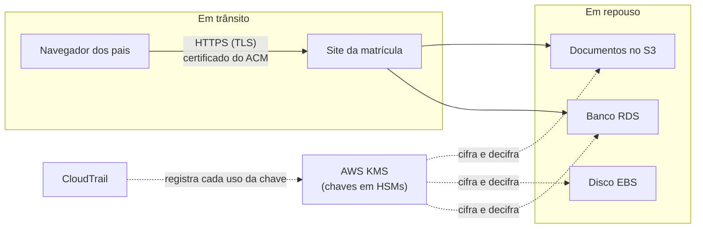

<!-- autoral -->

# 2.5 Criptografia

> **Domínio 2 — Segurança e Conformidade (30% da prova)** · Depende das aulas [0.5](../fundamentos/05-seguranca-basica.md), [2.1](01-responsabilidade-compartilhada.md) e [2.3](03-iam.md)

> 🔎 **Fichas para aprofundar:** [AWS KMS](../../servicos/seguranca/kms.md) · [AWS CloudHSM](../../servicos/seguranca/cloudhsm.md) · [AWS Certificate Manager e AWS Private CA](../../servicos/seguranca/certificate-manager.md) · [Amazon S3](../../servicos/armazenamento/s3.md)

⬅️ [2.4 Governança multi-conta](04-governanca-multi-conta.md) · 🏠 [Índice do domínio](README.md) · 🏫 [O caso da escola](../00-guia-do-exame/caso-da-escola.md) · [2.6 Compliance e governança](06-compliance-e-governanca.md) ➡️

---

O sistema de matrícula guarda certidões de nascimento, comprovantes de endereço e laudos médicos de alunos. A escola recebeu uma pergunta de um conselho de pais: "e se alguém copiar esses arquivos, ou interceptar o envio pelo site, consegue ler?". A resposta passa pela criptografia que você viu na [aula 0.5](../fundamentos/05-seguranca-basica.md): dados cifrados em trânsito e em repouso, com chaves bem protegidas.

Aquela aula terminou com um alerta: a criptografia move o problema dos dados para as chaves. Esta aula mostra como a AWS ajuda a resolver esse novo problema. Você vai ver o **AWS KMS**, que guarda e controla chaves; o **AWS CloudHSM**, para quem precisa de hardware exclusivo; o **AWS Certificate Manager**, que cuida dos certificados do HTTPS; e o que os serviços de armazenamento já cifram sozinhos.

## AWS KMS: o lugar onde as chaves ficam

O **AWS Key Management Service** (KMS) é um serviço gerenciado para criar e controlar as chaves usadas para cifrar e assinar dados. As chaves criadas nele, chamadas **chaves do KMS**, são protegidas por **módulos de segurança de hardware** (HSMs, de *hardware security modules*): equipamentos feitos para guardar chaves e fazer operações criptográficas, validados pela norma americana FIPS 140-3 nível 3. A chave nunca sai do KMS sem estar cifrada. Para usá-la, um programa ou serviço pede ao KMS que cifre ou decifre algo; ninguém leva a chave embora.

Na prática, o KMS não cifra os arquivos grandes diretamente. Ele usa uma técnica chamada **criptografia de envelope**: os dados são cifrados com uma **chave de dados** gerada para aquela tarefa, e a chave de dados, por sua vez, é cifrada pela chave do KMS. Guardar a chave de dados cifrada ao lado do arquivo é seguro, porque só quem tem permissão de usar a chave do KMS consegue abri-la.

Muitos serviços da AWS, como o S3, o EBS (os discos das instâncias EC2) e o RDS, usam o KMS para cifrar o que guardam. As chaves que esses serviços usam podem ser de três tipos:

| Tipo de chave | Onde fica | Quem controla | Custo para o cliente |
|---|---|---|---|
| Chave pertencente à AWS (*AWS owned key*) | Numa conta da AWS, fora da sua | O serviço da AWS | Nenhum |
| Chave gerenciada pela AWS (*AWS managed key*) | Na sua conta, com nome `aws/serviço` | A AWS; só serve para aquele serviço na sua conta | Sem custo mensal; paga-se pelo uso |
| Chave gerenciada pelo cliente (*customer managed key*) | Na sua conta | Você: política, rotação, ativação e exclusão | Custo mensal por chave e custo por uso |

A **chave gerenciada pelo cliente** é a recomendada para quem quer controle total sobre o ciclo de vida e o uso das chaves. As chaves gerenciadas pela AWS são um tipo antigo, que deixou de ser criado para serviços novos desde 2021; os serviços passaram a usar chaves pertencentes à AWS quando cifram dados por padrão.

## Quem pode usar a chave

Uma chave do KMS tem uma **política de chave**, que diz quem pode administrá-la e quem pode usá-la. Essa política funciona junto com as políticas do IAM da [aula 2.3](03-iam.md). A consequência prática é que, para ler um dado cifrado com uma chave gerenciada pelo cliente, não basta ter permissão no serviço que guarda o dado: é preciso também ter permissão para usar a chave. No S3, por exemplo, baixar um objeto cifrado com uma chave do KMS exige a permissão `kms:Decrypt` naquela chave.

Esse detalhe cria uma segunda camada de controle. Se alguém da conta de testes conseguisse permissão de leitura num bucket de produção por engano, ainda não leria os documentos sem permissão na chave.

Duas outras funções do KMS aparecem na prova. A primeira é a **auditoria**: o KMS é integrado ao AWS CloudTrail, o serviço que registra as chamadas de API da conta (assunto da [aula 2.7](07-logs-monitoramento-e-auditoria.md)), e todas as chamadas ao KMS ficam registradas, inclusive as feitas por outros serviços. Assim dá para saber quem usou cada chave e quando. A segunda é a **rotação**: ao ativar a rotação automática numa chave, o KMS gera material criptográfico novo para ela todo ano, por padrão, ou no período que você definir.

## CloudHSM: um HSM só seu

O KMS usa HSMs gerenciados e compartilhados pela AWS. Algumas empresas, por regra interna ou exigência regulatória, precisam de um HSM dedicado, sob seu próprio controle. Para isso existe o **AWS CloudHSM**: ele oferece HSMs de uso exclusivo de um cliente (*single-tenant*), na nuvem, com validação FIPS 140-2 ou 140-3 nível 3 nos clusters em modo FIPS.

A AWS cuida do hardware, das cópias de segurança e da manutenção dos HSMs, mas a comunicação com eles é cifrada de ponta a ponta e não é visível para a AWS. O próprio cliente cria e administra os usuários do HSM, fora do IAM. O preço desse controle é mais responsabilidade para o cliente do que num serviço totalmente gerenciado como o KMS.

A regra prática é: chaves gerenciadas e integradas aos serviços, KMS; hardware dedicado com controle exclusivo do cliente, CloudHSM. As duas coisas podem ser combinadas: o KMS aceita um repositório de chaves apoiado num cluster do CloudHSM do próprio cliente.

*Figura 2.5 — O ACM fornece o certificado que protege o caminho até o site; o KMS guarda as chaves que cifram os dados guardados; o CloudTrail registra cada uso das chaves.*

## Certificados para dados em trânsito

O HTTPS da [aula 0.2](../fundamentos/02-rede.md) usa o protocolo **TLS** para cifrar a conexão. Para isso, o site precisa de um **certificado**: um arquivo que prova que o site é quem diz ser e que carrega a chave usada para iniciar a conexão cifrada. Certificados expiram e precisam ser renovados, e um certificado vencido deixa o site fora do ar ou com alerta de segurança no navegador.

O **AWS Certificate Manager** (ACM) cria, guarda e renova certificados SSL/TLS públicos e privados. Ele se integra a serviços como o Elastic Load Balancing, o Amazon CloudFront e o Amazon API Gateway, que veremos no domínio 3, e instala o certificado neles. Quando o domínio é validado por DNS, o ACM renova o certificado automaticamente; com validação por e-mail, ele avisa quando o vencimento se aproxima. Certificados públicos não exportáveis, usados nos serviços integrados, não têm custo. Certificados públicos exportáveis, que podem ser instalados fora desses serviços, são cobrados por domínio.

Certificado e chave do KMS não se confundem: o certificado protege a conexão; a chave do KMS protege o dado guardado. Configurar um não configura o outro.

## O que já vem cifrado

Alguns serviços cifram os dados em repouso sem que ninguém precise pedir. Desde 5 de janeiro de 2023, todo objeto novo enviado ao S3 é cifrado automaticamente com **SSE-S3** (criptografia no servidor com chaves gerenciadas pelo S3), sem custo adicional. Quem quiser mais controle pode escolher **SSE-KMS**, com uma chave do KMS, que traz a auditoria e o controle de acesso da chave; **DSSE-KMS**, com duas camadas de criptografia; ou **SSE-C**, com uma chave fornecida pelo cliente a cada pedido. Também é possível cifrar no próprio computador antes de enviar, a chamada criptografia no lado do cliente.

No EBS e no RDS, a criptografia usa chaves do KMS, e a escolha da chave importa desde o início: depois de criar uma instância RDS cifrada, não dá para trocar a chave do KMS que ela usa. No EBS, é possível ativar a criptografia por padrão para os volumes novos da conta.

Isso conversa com a [aula 2.1](01-responsabilidade-compartilhada.md): a AWS oferece as ferramentas e alguns padrões seguros, mas decidir quais dados cifrar, com que tipo de chave e quem pode usá-la continua sendo responsabilidade do cliente. A criptografia também não substitui as permissões: um usuário autorizado a ler o objeto e a usar a chave lê o dado decifrado normalmente.

## Na prova

- **Em trânsito = TLS/HTTPS; em repouso = criptografia com chaves, normalmente do KMS.**
- **"Criar e controlar chaves integradas a S3, EBS e RDS" = AWS KMS.** As chaves ficam em HSMs gerenciados pela AWS e nunca saem do KMS sem cifra.
- **"HSM dedicado" ou "controle exclusivo das chaves em hardware" = AWS CloudHSM.**
- **"Certificado SSL/TLS com renovação automática para o load balancer ou o CloudFront" = ACM.** Certificados públicos não exportáveis usados nos serviços integrados não têm custo.
- **"Quem usou a chave?" = CloudTrail.** Todas as chamadas ao KMS são registradas.
- **Ler dado cifrado com chave do cliente exige permissão na chave.** Permissão no bucket sozinha não basta.
- **Objetos novos no S3 já são cifrados com SSE-S3 por padrão.** Escolher SSE-KMS é decisão do cliente quando ele quer controlar a chave.

## Caso resolvido

**Situação.** O conselho de pais exige três coisas: que o envio dos documentos pelo site seja protegido; que a escola consiga mostrar quem acessou a chave que protege os laudos médicos; e que a equipe de testes, mesmo com algum acesso ao bucket de produção, não consiga ler os laudos.

**Raciocínio.** O site passa a usar HTTPS com um certificado público do ACM instalado no balanceador de carga, com renovação automática por validação DNS: isso protege os dados em trânsito. Os laudos vão para um bucket com SSE-KMS usando uma chave gerenciada pelo cliente. A política dessa chave só permite o uso pela função do sistema de matrícula e pela diretora; assim, a equipe de testes não tem `kms:Decrypt` e não lê os laudos mesmo que tenha permissão no bucket. Como todas as chamadas ao KMS ficam no CloudTrail, a escola consegue mostrar quem usou a chave e quando.

**Por que as alternativas tentadoras falham.** Contar só com o SSE-S3 padrão protege o disco, mas a chave é gerenciada pelo S3, então quem tiver permissão no bucket lê o objeto e não há a segunda camada de controle pela política da chave. Contratar o CloudHSM resolve uma exigência que ninguém fez (hardware exclusivo) e traz mais trabalho, como administrar os usuários do HSM. Achar que o certificado do ACM cifra os arquivos guardados confunde trânsito com repouso.

## Revisão

Tente responder antes de abrir cada resposta.

### Qual é a diferença entre o AWS KMS e o AWS CloudHSM?

Ver resposta

O KMS é um serviço gerenciado de chaves, com HSMs compartilhados e gerenciados pela AWS e integração com muitos serviços. O CloudHSM oferece HSMs dedicados a um único cliente, que administra os próprios usuários e chaves.

Comentário: as palavras "dedicado", "single-tenant" e "controle exclusivo" apontam para o CloudHSM. Sem essa exigência, o KMS é a resposta mais simples.

### Um usuário tem permissão de leitura num bucket, mas o objeto está cifrado com SSE-KMS e uma chave gerenciada pelo cliente. Ele consegue ler?

Ver resposta

Só se também tiver permissão para usar a chave (`kms:Decrypt`). Permissão no bucket sozinha não basta.

Comentário: a política da chave é uma segunda camada de controle, separada das permissões do S3. É um dos motivos para escolher SSE-KMS em vez do SSE-S3 padrão.

### Para que serve o AWS Certificate Manager?

Ver resposta

Para criar, guardar e renovar certificados SSL/TLS usados no HTTPS de serviços como o Elastic Load Balancing, o CloudFront e o API Gateway. Com validação por DNS, a renovação é automática.

Comentário: o certificado protege os dados em trânsito. Ele não cifra dados guardados; isso é trabalho das chaves do KMS.

### Como saber quem usou uma chave do KMS?

Ver resposta

Pelo AWS CloudTrail, que registra todas as chamadas ao KMS, inclusive as feitas por outros serviços em nome do cliente.

Comentário: a auditoria do uso das chaves é uma das vantagens de usar o KMS. O CloudTrail é aprofundado na aula 2.7.

### Um objeto enviado hoje ao S3 sem nenhuma configuração fica cifrado?

Ver resposta

Sim. Desde 5 de janeiro de 2023, todo objeto novo no S3 é cifrado automaticamente com SSE-S3, sem custo adicional.

Comentário: o padrão protege o disco, mas a chave é gerenciada pelo S3. Para controlar quem usa a chave e auditar seu uso, o cliente escolhe SSE-KMS.

## Resumo

- Em trânsito, os dados são protegidos com TLS; em repouso, com chaves de criptografia.
- O KMS cria e controla chaves em HSMs gerenciados pela AWS; as chaves nunca saem dele sem cifra.
- Chaves pertencentes à AWS, gerenciadas pela AWS e gerenciadas pelo cliente diferem em quem controla e quanto custa.
- Usar um dado cifrado com chave do cliente exige permissão na chave; o CloudTrail registra todo uso.
- O CloudHSM oferece HSMs dedicados, com usuários administrados pelo cliente.
- O ACM cria e renova certificados SSL/TLS para serviços integrados.
- O S3 cifra todo objeto novo com SSE-S3; escolher chaves e quem as usa é responsabilidade do cliente.

## Fontes oficiais

Verificadas em 06/10/2026.

- [AWS Key Management Service](https://docs.aws.amazon.com/kms/latest/developerguide/overview.html): serviço gerenciado para criar e controlar chaves; HSMs validados FIPS 140-3 nível 3; chaves nunca saem sem cifra; políticas de chave.
- [AWS KMS keys](https://docs.aws.amazon.com/kms/latest/developerguide/concepts.html): chaves gerenciadas pelo cliente, gerenciadas pela AWS (legadas desde 2021) e pertencentes à AWS, com controle e custo de cada tipo.
- [AWS KMS cryptography essentials](https://docs.aws.amazon.com/kms/latest/developerguide/kms-cryptography.html): criptografia de envelope com chave de dados.
- [Rotate AWS KMS keys](https://docs.aws.amazon.com/kms/latest/developerguide/rotate-keys.html): rotação automática anual por padrão ou em período definido.
- [Logging AWS KMS API calls with AWS CloudTrail](https://docs.aws.amazon.com/kms/latest/developerguide/logging-using-cloudtrail.html): o CloudTrail registra todas as chamadas ao KMS.
- [AWS CloudHSM key stores](https://docs.aws.amazon.com/kms/latest/developerguide/keystore-cloudhsm.html): repositório de chaves do KMS apoiado num cluster do CloudHSM.
- [What is AWS CloudHSM?](https://docs.aws.amazon.com/cloudhsm/latest/userguide/introduction.html): HSMs single-tenant, FIPS 140-2 ou 140-3 nível 3 no modo FIPS, comunicação não visível para a AWS e usuários administrados pelo cliente.
- [What is AWS Certificate Manager?](https://docs.aws.amazon.com/acm/latest/userguide/acm-overview.html): certificados SSL/TLS públicos e privados para serviços integrados.
- [Managed certificate renewal](https://docs.aws.amazon.com/acm/latest/userguide/managed-renewal.html): renovação automática com validação DNS e aviso por e-mail nos demais casos.
- [Managed automation with integrated services](https://docs.aws.amazon.com/acm/latest/userguide/acm-services.html): integração com Elastic Load Balancing, CloudFront e API Gateway.
- [AWS Certificate Manager pricing](https://aws.amazon.com/certificate-manager/pricing/): certificados públicos não exportáveis para serviços integrados sem custo; exportáveis cobrados por domínio.
- [Protecting data with encryption (Amazon S3)](https://docs.aws.amazon.com/AmazonS3/latest/userguide/UsingEncryption.html): SSE-S3 automático para objetos novos desde 05/01/2023, opções SSE-KMS, DSSE-KMS, SSE-C e no lado do cliente.
- [Using server-side encryption with AWS KMS keys (SSE-KMS)](https://docs.aws.amazon.com/AmazonS3/latest/userguide/UsingKMSEncryption.html): baixar objeto cifrado exige `kms:Decrypt` na chave.
- [Amazon EBS encryption](https://docs.aws.amazon.com/ebs/latest/userguide/ebs-encryption.html): criptografia com chaves do KMS e criptografia por padrão.
- [Encrypting Amazon RDS resources](https://docs.aws.amazon.com/AmazonRDS/latest/UserGuide/Overview.Encryption.html): criptografia com chave do KMS que não pode ser trocada depois de criar a instância.

<!-- notas:inicio -->
## 📝 Minhas anotações

<!-- Escreva aqui suas observações, dúvidas e as questões que você errou sobre o tema. -->
<!-- notas:fim -->

---

⬅️ [2.4 Governança multi-conta](04-governanca-multi-conta.md) · 🏠 [Índice do domínio](README.md) · [2.6 Compliance e governança](06-compliance-e-governanca.md) ➡️
