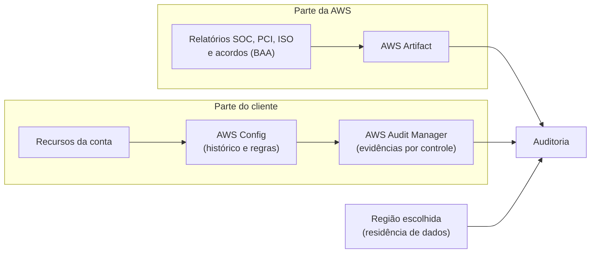

<!-- autoral -->

# 2.6 Compliance e governança

> **Domínio 2 — Segurança e Conformidade (30% da prova)** · Depende das aulas [2.1](01-responsabilidade-compartilhada.md), [2.4](04-governanca-multi-conta.md) e [2.5](05-criptografia.md)

> 🔎 **Fichas para aprofundar:** [AWS Artifact](../../servicos/seguranca/artifact.md) · [AWS Audit Manager](../../servicos/seguranca/audit-manager.md) · [AWS Config](../../servicos/gerenciamento/config.md)

⬅️ [2.5 Criptografia](05-criptografia.md) · 🏠 [Índice do domínio](README.md) · [2.7 Logs, monitoramento e auditoria](07-logs-monitoramento-e-auditoria.md) ➡️

---

A secretaria de educação que supervisiona a escola marcou uma auditoria. A auditora quer três coisas: um documento que mostre que os datacenters onde ficam os dados dos alunos seguem padrões reconhecidos de segurança; a prova de que os dados não saem do país; e evidências de que a própria escola mantém suas configurações seguras ao longo do tempo, não só no dia da visita.

A primeira exigência fala da parte da AWS; as outras duas falam da parte da escola. É a divisão da [aula 2.1](01-responsabilidade-compartilhada.md) aplicada a regras externas. **Compliance** (ou conformidade) é atender a requisitos definidos por leis, normas do setor ou políticas internas, e conseguir provar isso. Esta aula mostra onde encontrar as provas da parte da AWS, como a escolha de Região ajuda nos requisitos de localização, e quais serviços ajudam o cliente a avaliar e documentar a própria parte.

## Compliance também é responsabilidade compartilhada

A AWS participa de vários **programas de compliance**: auditores independentes avaliam a segurança da infraestrutura e de cada serviço segundo normas como SOC (relatórios de controles de organizações de serviço), PCI DSS (padrão do setor de cartões de pagamento), ISO e, nos Estados Unidos, FedRAMP e HIPAA. A AWS publica uma lista, atualizada com frequência, de quais serviços estão no escopo de cada programa. Nem todo serviço está em todo programa, e isso importa: se a escola precisasse seguir uma norma específica, deveria usar serviços que estão no escopo dela.

A certificação da AWS cobre a parte da AWS. A responsabilidade de compliance do cliente depende da sensibilidade dos dados, dos objetivos de compliance da organização e das leis que se aplicam a ela. Usar um serviço que está no escopo do PCI DSS não coloca a aplicação da escola em conformidade com o PCI DSS: a escola ainda precisa configurar acesso, criptografia e registros do jeito que a norma pede. Essa é a confusão mais comum sobre o tema.

## AWS Artifact: os documentos da parte da AWS

O **AWS Artifact** é o portal de autoatendimento onde se baixam os documentos de segurança e compliance da AWS, como relatórios SOC, relatórios de conformidade com o PCI e com normas ISO, e certificações de órgãos de acreditação. Os documentos e acordos do Artifact são gratuitos. É ali que a escola obtém o documento da primeira exigência da auditora.

O Artifact também gerencia **acordos** com a AWS. O exemplo clássico é o BAA (*Business Associate Addendum*), exigido de empresas sujeitas à lei americana de saúde HIPAA para tratar informações de saúde protegidas. Pelo Artifact a empresa revisa e aceita o acordo; numa organização do AWS Organizations da [aula 2.4](04-governanca-multi-conta.md), a conta de gerenciamento pode aceitá-lo em nome de todas as contas, inclusive as que forem criadas depois. O Artifact também oferece documentos de compliance de vendedores de software do AWS Marketplace.

O limite do Artifact é que ele só fala da AWS. Nenhum relatório dele prova que a escola configurou bem os seus recursos.

## Onde os dados ficam

A segunda exigência é de **residência de dados**: alguns dados precisam ficar num país ou numa região geográfica. Na AWS, o cliente escolhe as Regiões onde guarda seu conteúdo e pode replicá-lo em mais de uma Região se quiser. A AWS se compromete a não mover nem replicar o conteúdo para fora das Regiões escolhidas, exceto quando necessário para prestar um serviço que o próprio cliente iniciou ou para cumprir a lei ou uma ordem vinculante. Assim, a escola atende à exigência guardando os dados apenas na Região de São Paulo, por exemplo. As Regiões são detalhadas na [aula 3.2](../03-tecnologia-e-servicos/02-infraestrutura-global.md).

Alguns setores precisam de mais isolamento. O **AWS GovCloud (US)** é um conjunto de Regiões isoladas nos Estados Unidos, operadas por cidadãos americanos, para clientes com necessidades elevadas de compliance, como órgãos do governo americano.

## Audit Manager e Config: a parte do cliente

A terceira exigência é a mais trabalhosa: mostrar que os controles da escola funcionam continuamente. Dois serviços ajudam.

O **AWS Config** registra a configuração dos recursos da conta, como eles se relacionam e como estavam configurados no passado, para mostrar as mudanças ao longo do tempo. Sobre esse registro, as **regras do Config** representam a configuração desejada e avaliam cada recurso: por exemplo, "todo bucket S3 deve bloquear acesso público". A AWS oferece regras prontas, chamadas regras gerenciadas, e o cliente pode escrever as suas. Recursos fora da regra podem ser corrigidos com **remediação**, que executa automações do AWS Systems Manager. Um **pacote de conformidade** (*conformance pack*) é um conjunto de regras e remediações implantado de uma vez numa conta e Região ou na organização inteira. O Config volta na [aula 2.7](07-logs-monitoramento-e-auditoria.md), ao lado dos outros serviços de registro.

O **AWS Audit Manager** automatiza a coleta de evidências para auditorias. Ele oferece **frameworks** prontos, conjuntos de controles organizados segundo uma norma ou regulamento, e coleta continuamente dados das contas escolhidas, transformando-os em evidências ligadas a cada controle. Também aceita evidências enviadas à mão, de sistemas fora da AWS. O limite é explícito na documentação: o Audit Manager coleta evidências, mas não avalia se o cliente está em conformidade. A conclusão continua sendo da auditoria.

*Figura 2.6 — A auditoria recebe provas de dois lados: os documentos da AWS vêm do Artifact; as evidências do cliente vêm do registro e das regras do Config, organizadas pelo Audit Manager.*

## Na prova

- **"O auditor pede o relatório SOC ou o atestado PCI da AWS" = AWS Artifact.** Também é no Artifact que se aceita um acordo como o BAA.
- **"Coletar evidências continuamente para a auditoria da empresa" = AWS Audit Manager.** Ele coleta evidências, mas não declara conformidade.
- **"Verificar continuamente se os recursos seguem regras" = AWS Config com regras.** Conjuntos de regras implantados juntos são pacotes de conformidade.
- **Serviço certificado não coloca a aplicação em conformidade.** A responsabilidade de compliance é compartilhada e depende dos dados, dos objetivos e das leis do cliente.
- **Residência de dados = escolher a Região.** A AWS não move o conteúdo para fora das Regiões escolhidas sem necessidade do serviço iniciado pelo cliente ou exigência legal.
- **Nem todo serviço está em todo programa de compliance.** A AWS publica a lista de serviços no escopo de cada programa.

## Caso resolvido

**Situação.** Na auditoria da secretaria de educação, a escola precisa entregar o relatório de segurança dos datacenters da AWS, provar que os dados dos alunos ficam no Brasil e mostrar evidências, mês a mês, de que nenhum bucket com documentos ficou público.

**Raciocínio.** O relatório dos datacenters é um relatório SOC da AWS, baixado no AWS Artifact. A localização dos dados é resolvida pela escolha da Região: os recursos ficam só na Região de São Paulo, e a AWS não move o conteúdo para outra Região sem que a escola peça. Para os buckets, a escola ativa o AWS Config com uma regra que verifica o bloqueio de acesso público e uma remediação automática; o histórico do Config mostra a situação de cada bucket ao longo do tempo. Se quiser organizar tudo por controle, no formato que a auditora espera, a escola usa o Audit Manager para coletar essas evidências continuamente.

**Por que as alternativas tentadoras falham.** Entregar só o relatório do Artifact não responde à terceira exigência, porque ele cobre a infraestrutura da AWS, não a configuração dos buckets da escola. Dizer que "a AWS é certificada, então a escola também é" ignora a responsabilidade compartilhada. Esperar que o Audit Manager emita um parecer de conformidade também falha: ele junta evidências, e quem conclui é a auditora.

## Revisão

Tente responder antes de abrir cada resposta.

### Onde baixar o relatório SOC 2 da AWS?

Ver resposta

No AWS Artifact, portal gratuito de autoatendimento com os documentos de segurança e compliance da AWS, como relatórios SOC, PCI e ISO.

Comentário: o Artifact só tem documentos sobre a AWS (e de vendedores do Marketplace). Ele não prova nada sobre a configuração do cliente.

### Qual é a diferença entre o AWS Artifact e o AWS Audit Manager?

Ver resposta

O Artifact fornece os relatórios e acordos de compliance da própria AWS. O Audit Manager coleta continuamente evidências das contas do cliente e as organiza por controle, para as auditorias do cliente.

Comentário: a pergunta testa de quem é a prova. Prova sobre a AWS vem do Artifact; prova sobre o ambiente do cliente vem do Audit Manager.

### Usar apenas serviços que estão no escopo do PCI DSS coloca a aplicação em conformidade com o PCI DSS?

Ver resposta

Não. A AWS cobre a parte dela; o cliente ainda precisa configurar e operar sua aplicação do jeito que a norma exige. A responsabilidade de compliance é compartilhada.

Comentário: estar no escopo é condição para usar o serviço numa carga regulada, mas não substitui o trabalho do cliente.

### Como garantir que os dados de clientes fiquem num país específico?

Ver resposta

Escolhendo uma Região nesse país para guardar os dados. A AWS não move nem replica o conteúdo para fora das Regiões escolhidas, exceto quando necessário para o serviço iniciado pelo cliente ou para cumprir a lei.

Comentário: a decisão de onde guardar é do cliente; a AWS se compromete a respeitá-la.

### Para que servem as regras do AWS Config?

Ver resposta

Para avaliar continuamente se a configuração dos recursos segue a configuração desejada, como "nenhum bucket público". Recursos fora da regra podem ser corrigidos com remediação automática.

Comentário: regras prontas da AWS e regras próprias podem ser agrupadas em pacotes de conformidade e implantadas na organização inteira.

## Resumo

- Compliance é atender a requisitos externos ou internos e conseguir provar isso; a responsabilidade é compartilhada.
- A AWS participa de programas como SOC, PCI DSS e ISO e publica quais serviços estão no escopo de cada um.
- O Artifact oferece, sem custo, os relatórios de compliance da AWS e acordos como o BAA.
- O cliente escolhe as Regiões dos dados; a AWS não os move para fora delas sem necessidade do serviço ou exigência legal.
- O GovCloud (US) oferece Regiões isoladas para cargas com exigências elevadas.
- O Config registra a configuração e avalia regras; o Audit Manager coleta evidências por controle, sem declarar conformidade.

## Fontes oficiais

Verificadas em 06/10/2026.

- [What is AWS Artifact?](https://docs.aws.amazon.com/artifact/latest/ug/what-is-aws-artifact.html): download sob demanda de relatórios SOC, PCI e ISO e certificações; documentos de vendedores do Marketplace; documentos e acordos gratuitos.
- [Managing agreements in AWS Artifact](https://docs.aws.amazon.com/artifact/latest/ug/managing-agreements.html): BAA para HIPAA e aceite em nome de todas as contas da organização.
- [Compliance validation for Amazon S3](https://docs.aws.amazon.com/AmazonS3/latest/userguide/s3-compliance.html): auditores independentes, lista de serviços no escopo, relatórios no Artifact e responsabilidade de compliance do cliente.
- [AWS Services in Scope by Compliance Program](https://aws.amazon.com/compliance/services-in-scope/) e [AWS Compliance Programs](https://aws.amazon.com/compliance/programs/): programas e serviços cobertos por cada um.
- [Data Privacy FAQ](https://aws.amazon.com/compliance/data-privacy-faq/): o cliente escolhe as Regiões e a AWS não move nem replica o conteúdo para fora delas, salvo as exceções citadas.
- [AWS GovCloud (US)](https://aws.amazon.com/govcloud-us/): Regiões isoladas, operadas por cidadãos americanos, para necessidades elevadas de compliance.
- [What Is AWS Config?](https://docs.aws.amazon.com/config/latest/developerguide/WhatIsConfig.html): registro da configuração, das relações e do histórico dos recursos.
- [Evaluating Resources with AWS Config Rules](https://docs.aws.amazon.com/config/latest/developerguide/evaluate-config.html), [Conformance Packs](https://docs.aws.amazon.com/config/latest/developerguide/conformance-packs.html) e [Remediation](https://docs.aws.amazon.com/config/latest/developerguide/remediation.html): regras gerenciadas e personalizadas, pacotes de conformidade e remediação com automações do Systems Manager.
- [What is AWS Audit Manager?](https://docs.aws.amazon.com/audit-manager/latest/userguide/what-is.html): frameworks prontos, coleta contínua de evidências, evidências enviadas à mão e o limite de não avaliar a conformidade.

<!-- notas:inicio -->
## 📝 Minhas anotações

<!-- Escreva aqui suas observações, dúvidas e as questões que você errou sobre o tema. -->
<!-- notas:fim -->

---

⬅️ [2.5 Criptografia](05-criptografia.md) · 🏠 [Índice do domínio](README.md) · [2.7 Logs, monitoramento e auditoria](07-logs-monitoramento-e-auditoria.md) ➡️
