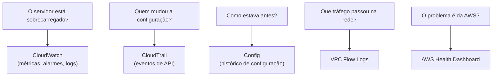

<!-- autoral -->

# 2.7 Logs, monitoramento e auditoria

> **Domínio 2 — Segurança e Conformidade (30% da prova)** · Depende das aulas [0.2](../fundamentos/02-rede.md), [0.4](../fundamentos/04-api-e-filas.md), [2.3](03-iam.md) e [2.6](06-compliance-e-governanca.md)

> 🔎 **Fichas para aprofundar:** [AWS CloudTrail](../../servicos/gerenciamento/cloudtrail.md) · [AWS Config](../../servicos/gerenciamento/config.md) · [Amazon CloudWatch](../../servicos/gerenciamento/cloudwatch.md) · [Amazon VPC](../../servicos/redes/vpc.md) · [AWS Health Dashboard](../../servicos/gerenciamento/health-dashboard.md)

⬅️ [2.6 Compliance e governança](06-compliance-e-governanca.md) · 🏠 [Índice do domínio](README.md) · [2.8 Proteção de rede e aplicações](08-protecao-de-rede-e-aplicacoes.md) ➡️

---

Numa segunda-feira de matrícula, o site da escola ficou lento de manhã e, à tarde, a pasta de documentos dos pais apareceu aberta para a internet. A diretora fez quatro perguntas ao técnico: o servidor estava sobrecarregado? Quem mudou a configuração da pasta? Como ela estava antes da mudança? O problema foi da escola ou da própria AWS?

Cada pergunta tem uma ferramenta diferente, e misturá-las é a confusão mais comum deste tema. Esta aula mostra o **AWS CloudTrail**, que registra quem fez cada ação; o **AWS Config**, que guarda como cada recurso estava configurado; o **Amazon CloudWatch**, que mede o funcionamento e dispara alarmes; os **VPC Flow Logs**, que registram o tráfego de rede; e o **AWS Health Dashboard**, que avisa sobre problemas do lado da AWS.

## CloudTrail: quem fez o quê

Na [aula 0.4](../fundamentos/04-api-e-filas.md) você viu que tudo na AWS é feito por chamadas de API, seja pelo console, pela linha de comando ou por código. O **AWS CloudTrail** registra essas ações como **eventos**: cada evento diz qual identidade agiu, o que fez, quando, de onde e em qual recurso. É a ferramenta de auditoria e governança da atividade na conta, e responde à pergunta "quem mudou a configuração da pasta?".

O CloudTrail já vem ativo em toda conta. O **histórico de eventos** guarda, sem nenhuma configuração, os **últimos 90 dias** de eventos de gerenciamento de cada Região, num registro que pode ser pesquisado e baixado, mas não alterado.

Os eventos se dividem em tipos. **Eventos de gerenciamento** são operações sobre os recursos, como criar uma instância, mudar uma política ou apagar um bucket. **Eventos de dados** são operações dentro dos recursos, em geral de alto volume, como ler ou gravar objetos no S3 (`GetObject`, `PutObject`) ou executar uma função Lambda. Por padrão, só os eventos de gerenciamento são registrados; eventos de dados precisam ser ativados.

Para guardar eventos por mais de 90 dias, cria-se uma **trilha** (*trail*), que entrega os eventos num bucket S3, com cópia opcional para o CloudWatch Logs. Uma cópia dos eventos de gerenciamento é entregue sem cobrança do CloudTrail; paga-se o armazenamento no S3. A trilha pode cobrir todas as Regiões, e, numa organização da [aula 2.4](04-governanca-multi-conta.md), uma **trilha da organização** criada pela conta de gerenciamento registra os eventos de todas as contas, sem que as contas-membro possam alterá-la ou apagá-la.

Dois recursos adicionais aparecem nos enunciados. O **CloudTrail Insights** analisa o volume normal de chamadas e de erros de API e gera um evento quando algo foge do padrão. O **CloudTrail Lake** permite consultas em SQL sobre os eventos, mas deixou de aceitar clientes novos em 31 de maio de 2026; quem já usava continua usando.

## Config: como estava configurado

O **AWS Config**, apresentado na [aula 2.6](06-compliance-e-governanca.md) pelo lado das regras de compliance, responde a outra pergunta: "como a pasta estava antes da mudança?". Ele registra a configuração dos recursos, as relações entre eles e o histórico de mudanças. Com ele dá para ver, por exemplo, qual política do IAM um usuário tinha numa data passada, desde que o Config estivesse registrando naquele momento.

CloudTrail e Config se completam. O CloudTrail mostra o evento: a identidade que mudou a política do bucket e quando. O Config mostra o estado: como a política estava antes e depois, e se o recurso seguia as regras.

## CloudWatch: como está funcionando

O **Amazon CloudWatch** monitora os recursos e as aplicações em tempo real. Ele trabalha com três peças principais.

**Métricas** são medidas numéricas ao longo do tempo, como o uso de CPU de uma instância. Por padrão, as instâncias EC2 usam o **monitoramento básico**, sem custo, com métricas a cada 5 minutos (as verificações de status saem a cada minuto). O **monitoramento detalhado**, ativado à parte e cobrado por métrica, envia métricas a cada minuto. A lista de métricas que o EC2 envia inclui CPU, rede e operações de leitura e gravação em disco, mas não a memória usada nem o espaço ocupado em disco dentro do sistema operacional: para coletar essas métricas internas, instala-se o **agente do CloudWatch** na instância.

**Alarmes** observam uma métrica e agem quando ela passa de um limite por um período. A ação pode ser enviar uma notificação por um tópico do Amazon SNS, executar uma ação no EC2, como parar ou reiniciar a instância, ou acionar o Auto Scaling para criar mais instâncias. Um caso clássico de prova é o **alarme de cobrança**: o CloudWatch recebe a estimativa de gastos da conta várias vezes por dia, e o alarme avisa quando ela passa de um valor. Essa métrica fica na Região Leste dos EUA (Norte da Virgínia), que precisa estar selecionada para criar o alarme.

**Logs** ficam no **CloudWatch Logs**, que centraliza os registros de sistemas, aplicações e serviços da AWS num só lugar. O **CloudWatch Logs Insights** permite pesquisar e analisar esses registros com uma linguagem de consulta. Painéis (*dashboards*) reúnem métricas e alarmes numa tela.

## Flow Logs e Health Dashboard

Os **VPC Flow Logs** registram informações sobre o tráfego IP que entra e sai das interfaces de rede de uma VPC, a rede virtual da [aula 0.2](../fundamentos/02-rede.md). Os registros podem ir para o CloudWatch Logs, para o S3 ou para o Amazon Data Firehose. Eles ajudam, por exemplo, a descobrir uma regra de firewall restritiva demais que está bloqueando conexões legítimas. Cada registro descreve um fluxo de tráfego com dados como endereços de origem e destino, portas e protocolo; os Flow Logs descrevem as conexões, sem guardar o conteúdo trafegado.

O **AWS Health Dashboard** responde à última pergunta da diretora: o problema foi da AWS? Ele mostra eventos de serviço e de recursos que podem afetar as aplicações do cliente, inclusive manutenções planejadas. Não precisa de configuração e está disponível para todos os clientes sem custo adicional. O Health aparece de novo na [aula 3.16](../03-tecnologia-e-servicos/16-gestao-e-governanca.md).

*Figura 2.7 — Cada pergunta de investigação leva a uma ferramenta: funcionamento ao CloudWatch, autoria ao CloudTrail, estado anterior ao Config, tráfego aos Flow Logs e problemas da AWS ao Health Dashboard.*

## Na prova

- **Leia o verbo da pergunta.** "Quem apagou" ou "quem alterou" = CloudTrail. "Como estava configurado" = Config. "Alertar quando a CPU passar de 80%" = alarme do CloudWatch.
- **CloudTrail guarda 90 dias sem configuração.** Para guardar por mais tempo, cria-se uma trilha que entrega os eventos no S3.
- **Eventos de dados não vêm por padrão.** Leitura de objetos no S3 e execução de Lambda precisam ser ativadas na trilha.
- **Memória e espaço em disco do EC2 exigem o agente do CloudWatch.** CPU, rede e operações de disco já vêm nas métricas padrão.
- **Monitoramento básico = 5 minutos, sem custo; detalhado = 1 minuto, cobrado.**
- **Alerta de gastos = alarme de cobrança do CloudWatch.** As ferramentas de custo, como o AWS Budgets, aparecem no domínio 4.
- **Tráfego de rede da VPC = VPC Flow Logs. Problema do lado da AWS = AWS Health Dashboard.**

## Caso resolvido

**Situação.** Voltando à segunda-feira da matrícula: a diretora quer saber se a lentidão foi por sobrecarga, quem deixou a pasta de documentos pública e como ela estava antes, e quer ser avisada da próxima vez que a CPU do servidor passar de 80%.

**Raciocínio.** A lentidão se investiga nas métricas do CloudWatch: o gráfico de CPU da instância mostra se houve pico. Quem mudou a política do bucket aparece no histórico de eventos do CloudTrail, que guarda os últimos 90 dias de eventos de gerenciamento sem configuração. O estado anterior da política aparece no histórico do Config, se ele estava registrando. O aviso futuro é um alarme do CloudWatch na métrica de CPU, com notificação por um tópico do SNS. Para ter registros por mais tempo, a escola cria uma trilha que guarda os eventos num bucket S3.

**Por que as alternativas tentadoras falham.** Procurar no CloudWatch quem mudou a política confunde métrica com evento de API. Esperar que o CloudTrail mostre o uso de CPU confunde auditoria com monitoramento. Abrir o Health Dashboard para descobrir quem alterou o bucket também não ajuda: ele mostra eventos da AWS, não ações dos usuários da conta. E se a pergunta fosse sobre quem baixou um documento específico, o histórico padrão não teria a resposta, porque leituras de objetos são eventos de dados e precisam ser ativadas numa trilha.

## Revisão

Tente responder antes de abrir cada resposta.

### Qual serviço registra quem encerrou uma instância e quando?

Ver resposta

O AWS CloudTrail, que registra as chamadas de API da conta como eventos, com a identidade, a ação, o horário, a origem e o recurso.

Comentário: encerrar uma instância é um evento de gerenciamento, que já fica no histórico de eventos por 90 dias sem configuração.

### Como guardar os eventos do CloudTrail por anos?

Ver resposta

Criando uma trilha que entrega os eventos num bucket S3, onde ficam pelo tempo que a escola quiser. A trilha pode cobrir todas as Regiões e, numa organização, todas as contas.

Comentário: sem trilha, o histórico de eventos guarda só os últimos 90 dias de eventos de gerenciamento.

### Qual é a diferença entre o CloudTrail e o Config?

Ver resposta

O CloudTrail registra ações: quem fez cada chamada de API e quando. O Config registra estados: como cada recurso estava configurado ao longo do tempo e se seguia as regras.

Comentário: numa investigação, os dois se completam. O CloudTrail diz quem mudou a política; o Config mostra a política antes e depois.

### Como coletar o uso de memória de uma instância EC2 no CloudWatch?

Ver resposta

Instalando o agente do CloudWatch na instância. A memória usada dentro do sistema operacional não está entre as métricas que o EC2 envia por padrão.

Comentário: CPU, rede e operações de disco vêm por padrão. Memória e espaço ocupado em disco são a pegadinha clássica.

### Como ser avisado quando os gastos da conta passarem de um valor?

Ver resposta

Criando um alarme de cobrança no CloudWatch, com notificação por um tópico do SNS. A métrica de gastos estimados fica na Região Leste dos EUA (Norte da Virgínia).

Comentário: o domínio 4 apresenta outras ferramentas de custo, como o AWS Budgets, que também podem avisar sobre gastos.

## Resumo

- O CloudTrail registra as ações (chamadas de API) e guarda 90 dias de eventos de gerenciamento sem configuração.
- Trilhas guardam os eventos no S3 por mais tempo; eventos de dados precisam ser ativados.
- O Config registra a configuração dos recursos e seu histórico; completa o CloudTrail numa investigação.
- O CloudWatch trabalha com métricas, alarmes, logs e painéis; memória e espaço em disco do EC2 exigem o agente.
- Monitoramento básico do EC2 a cada 5 minutos sem custo; detalhado a cada minuto, cobrado.
- VPC Flow Logs registram o tráfego IP das interfaces de rede da VPC.
- O Health Dashboard mostra eventos da AWS que afetam a conta, sem custo adicional.

## Fontes oficiais

Verificadas em 06/10/2026.

- [What Is AWS CloudTrail?](https://docs.aws.amazon.com/awscloudtrail/latest/userguide/cloudtrail-user-guide.html): auditoria e governança; ações registradas como eventos; histórico de 90 dias.
- [Working with CloudTrail event history](https://docs.aws.amazon.com/awscloudtrail/latest/userguide/view-cloudtrail-events.html): histórico ativo por padrão, 90 dias de eventos de gerenciamento por Região, imutável.
- [CloudTrail concepts](https://docs.aws.amazon.com/awscloudtrail/latest/userguide/cloudtrail-concepts.html): eventos de gerenciamento e de dados; por padrão, só os de gerenciamento são registrados.
- [Working with CloudTrail trails](https://docs.aws.amazon.com/awscloudtrail/latest/userguide/cloudtrail-trails.html): entrega no S3 com cópia opcional no CloudWatch Logs, uma cópia de eventos de gerenciamento sem cobrança, trilhas multi-Região e da organização.
- [Working with CloudTrail Insights](https://docs.aws.amazon.com/awscloudtrail/latest/userguide/logging-insights-events-with-cloudtrail.html) e [CloudTrail Lake](https://docs.aws.amazon.com/awscloudtrail/latest/userguide/cloudtrail-lake.html): detecção de atividade incomum; consultas SQL e fechamento a novos clientes em 31/05/2026.
- [What Is AWS Config?](https://docs.aws.amazon.com/config/latest/developerguide/WhatIsConfig.html): histórico de configuração e de relações, inclusive a política do IAM de um usuário numa data passada.
- [What is Amazon CloudWatch?](https://docs.aws.amazon.com/AmazonCloudWatch/latest/monitoring/WhatIsCloudWatch.html): monitoramento em tempo real com métricas, alarmes e painéis.
- [Manage detailed monitoring for your EC2 instances](https://docs.aws.amazon.com/AWSEC2/latest/UserGuide/manage-detailed-monitoring.html): monitoramento básico de 5 minutos sem custo e detalhado de 1 minuto cobrado.
- [CloudWatch metrics available for your instances](https://docs.aws.amazon.com/AWSEC2/latest/UserGuide/viewing_metrics_with_cloudwatch.html) e [Metrics collected by the CloudWatch agent](https://docs.aws.amazon.com/AmazonCloudWatch/latest/monitoring/metrics-collected-by-CloudWatch-agent.html): métricas padrão do EC2, sem memória; memória e espaço em disco coletados pelo agente.
- [Using Amazon CloudWatch alarms](https://docs.aws.amazon.com/AmazonCloudWatch/latest/monitoring/CloudWatch_Alarms.html): alarmes com ações no SNS, no EC2 e no Auto Scaling.
- [Create a billing alarm](https://docs.aws.amazon.com/AmazonCloudWatch/latest/monitoring/monitor_estimated_charges_with_cloudwatch.html): gastos estimados enviados várias vezes por dia; métrica na Região Leste dos EUA (Norte da Virgínia).
- [What is Amazon CloudWatch Logs?](https://docs.aws.amazon.com/AmazonCloudWatch/latest/logs/WhatIsCloudWatchLogs.html): centralização de logs e consultas com o Logs Insights.
- [Logging IP traffic using VPC Flow Logs](https://docs.aws.amazon.com/vpc/latest/userguide/flow-logs.html): tráfego IP das interfaces de rede, entregue no CloudWatch Logs, no S3 ou no Data Firehose. [Flow log records](https://docs.aws.amazon.com/vpc/latest/userguide/flow-log-records.html): campos de cada registro, como origem, destino, porta e protocolo.
- [What is AWS Health?](https://docs.aws.amazon.com/health/latest/ug/what-is-aws-health.html): eventos que afetam as aplicações, inclusive planejados; Health Dashboard sem configuração e sem custo adicional.

<!-- notas:inicio -->
## 📝 Minhas anotações

<!-- Escreva aqui suas observações, dúvidas e as questões que você errou sobre o tema. -->
<!-- notas:fim -->

---

⬅️ [2.6 Compliance e governança](06-compliance-e-governanca.md) · 🏠 [Índice do domínio](README.md) · [2.8 Proteção de rede e aplicações](08-protecao-de-rede-e-aplicacoes.md) ➡️
