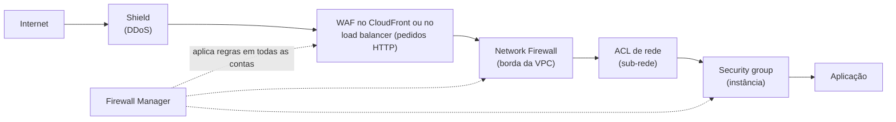

<!-- autoral -->

# 2.8 Proteção de rede e aplicações

> **Domínio 2 — Segurança e Conformidade (30% da prova)** · Depende das aulas [0.2](../fundamentos/02-rede.md), [2.1](01-responsabilidade-compartilhada.md) e [2.4](04-governanca-multi-conta.md)

> 🔎 **Fichas para aprofundar:** [Amazon VPC](../../servicos/redes/vpc.md) · [AWS Shield](../../servicos/seguranca/shield.md) · [AWS WAF](../../servicos/seguranca/waf.md) · [AWS Firewall Manager e AWS Network Firewall](../../servicos/seguranca/firewall-manager-e-network-firewall.md)

⬅️ [2.7 Logs, monitoramento e auditoria](07-logs-monitoramento-e-auditoria.md) · 🏠 [Índice do domínio](README.md) · 🏫 [O caso da escola](../00-guia-do-exame/caso-da-escola.md) · [2.9 Detecção de ameaças](09-deteccao-de-ameacas.md) ➡️

---

O site de matrícula está no ar, e com ele chegam visitantes que a escola não convidou. Os registros mostram um endereço IP tentando entrar pela porta de acesso remoto do servidor a noite toda. No formulário de busca de alunos, alguém digitou trechos de comandos de banco de dados no lugar do nome. E, no primeiro dia de matrícula, uma enxurrada de pedidos falsos deixou o site lento justamente quando os pais tentavam se inscrever.

Na [aula 0.2](../fundamentos/02-rede.md) você viu que a VPC é a rede privada da conta, dividida em sub-redes, e que os security groups decidem quais portas e origens chegam a uma instância. Esta aula aprofunda essa proteção em camadas: **security groups** e **ACLs de rede** dentro da VPC, o **AWS Network Firewall** na borda da VPC, o **AWS WAF** para ataques às aplicações web, o **AWS Shield** contra ataques de negação de serviço e o **AWS Firewall Manager** para aplicar tudo isso em várias contas.

## Security groups: o firewall de cada recurso

Um **security group** controla o tráfego que pode chegar e sair dos recursos associados a ele, como uma instância EC2. Ele funciona como um firewall virtual: só chega à instância o tráfego que uma regra permite. Cada regra diz o protocolo, a porta e a origem (para entrada) ou o destino (para saída).

Três características caem na prova. Primeira: security groups só têm regras de **permissão**; não é possível escrever uma regra que negue um endereço. Segunda: um security group novo não tem regras de entrada, então nada entra até alguém liberar, e tem uma regra de saída que permite todo o tráfego de saída. Terceira: security groups são **stateful** (com estado): se um pedido saiu da instância, a resposta volta mesmo sem regra de entrada para ela, e a resposta a um pedido de entrada permitido sai mesmo sem regra de saída.

O limite é justamente a falta de negação. Para bloquear o endereço IP que tenta entrar a noite toda, basta não liberar a porta para ele; mas se a porta precisa ficar aberta para o resto da internet, o security group não consegue abrir uma exceção só para aquele endereço.

## ACLs de rede: o filtro da sub-rede

Uma **ACL de rede** (NACL, de *network access control list*) permite ou nega tráfego de entrada e de saída no nível da **sub-rede**. Toda sub-rede está associada a uma ACL de rede; se ninguém escolher, ela usa a ACL padrão da VPC, que permite todo o tráfego de entrada e de saída.

As ACLs de rede funcionam de modo diferente dos security groups. Elas aceitam regras de **permitir e de negar**. As regras são avaliadas em ordem, começando pelo menor número, e a primeira que combina com o tráfego é aplicada, mesmo que uma regra de número maior diga o contrário. E elas são **stateless** (sem estado): liberar a entrada de um tráfego não libera automaticamente a resposta, que precisa de uma regra própria na saída.

| | Security group | ACL de rede |
|---|---|---|
| Onde atua | No recurso (por exemplo, a instância) | Na sub-rede |
| Tipos de regra | Só permitir | Permitir e negar |
| Estado | Stateful: a resposta volta sozinha | Stateless: a resposta precisa de regra |
| Avaliação | Todas as regras juntas | Em ordem numérica; vale a primeira que combina |
| Padrão | Novo: nada entra, tudo sai | ACL padrão da VPC: tudo entra e sai |

As duas camadas se somam: a ACL de rede é um filtro grosso na entrada da sub-rede, e o security group é o filtro fino de cada recurso. O endereço IP insistente é um caso para uma regra de negação na ACL de rede.

Para inspecionar o tráfego com mais profundidade na borda da VPC, existe o **AWS Network Firewall**: um firewall de rede gerenciado e stateful, com detecção e prevenção de intrusões, que filtra o tráfego que entra e sai da VPC, por exemplo pelo internet gateway, e pode inspecionar o conteúdo dos pacotes.

## WAF: protegendo a aplicação web

Security groups e ACLs olham endereços, portas e protocolos. Eles não entendem o que vai dentro de um pedido HTTP. O texto malicioso digitado no formulário de busca chega pela porta 443, que precisa estar aberta para todos. Para isso existe o **AWS WAF** (*web application firewall*): ele observa os pedidos HTTP e HTTPS enviados à aplicação e, segundo regras definidas pelo cliente, deixa passar, bloqueia com o código 403 ou devolve uma resposta personalizada.

As regras ficam num **web ACL** (no console novo, chamado de *protection pack*) e podem verificar, entre outras coisas:

- **Injeção de SQL:** código SQL malicioso inserido no pedido para alterar ou extrair dados do banco, como no formulário de busca.
- **Cross-site scripting (XSS):** scripts maliciosos inseridos para serem executados no navegador de outras pessoas.
- **Endereço IP e país de origem**, para bloquear origens específicas.
- **Limite de taxa** (*rate-based*): bloqueia quem faz pedidos demais num intervalo.

A AWS também oferece grupos de regras gerenciadas prontos, como um conjunto básico de proteções comuns, um grupo para bancos de dados SQL e uma lista de endereços com má reputação. O WAF protege recursos que recebem pedidos web, como distribuições do Amazon CloudFront, Application Load Balancers, APIs REST do Amazon API Gateway, APIs do AWS AppSync e pools de usuários do Amazon Cognito; os serviços de rede e entrega de conteúdo são o assunto da [aula 3.10](../03-tecnologia-e-servicos/10-rede-e-entrega-de-conteudo.md).

## Shield: contra negação de serviço

A enxurrada de pedidos do primeiro dia de matrícula é um **ataque de negação de serviço distribuído** (DDoS, de *distributed denial of service*): muitas máquinas enviam tráfego ao mesmo tempo para esgotar a capacidade do alvo e tirá-lo do ar para os usuários legítimos.

O **AWS Shield** protege contra DDoS em dois níveis. O **Shield Standard** protege automaticamente todos os clientes da AWS, sem custo adicional e sem precisar ativar nada, contra os ataques de rede e de transporte mais comuns. O **Shield Advanced** é uma assinatura paga, com compromisso de um ano e taxa mensal, que acrescenta proteção contra ataques maiores e mais sofisticados, inclusive na camada de aplicação, visibilidade quase em tempo real dos ataques, acesso 24 horas ao **Shield Response Team** (SRT), a equipe de resposta a DDoS da AWS, e proteção contra aumentos de cobrança causados por DDoS em serviços como EC2, ELB, CloudFront, Global Accelerator e Route 53. Para acionar o SRT, a conta precisa de um plano de suporte Business ou Enterprise (os planos são assunto da [aula 4.5](../04-cobranca-precos-e-suporte/05-planos-de-suporte.md)). A assinatura do Shield Advanced também cobre as taxas padrão do WAF nos recursos protegidos por ela.

*Figura 2.8 — Defesa em camadas: o tráfego atravessa a proteção contra DDoS, o filtro de pedidos web, o firewall da VPC, a ACL da sub-rede e o security group da instância. O Firewall Manager administra várias dessas camadas em todas as contas da organização.*

## Firewall Manager: as mesmas regras em todas as contas

Com várias contas, como na [aula 2.4](04-governanca-multi-conta.md), manter as mesmas regras de WAF e de security groups em cada conta vira trabalho repetitivo e sujeito a esquecimento. O **AWS Firewall Manager** resolve isso: ele administra de forma central as proteções do WAF, do Shield Advanced, dos security groups e das ACLs de rede, do Network Firewall e do Route 53 Resolver DNS Firewall nas contas de uma organização do AWS Organizations. As regras são configuradas uma vez e aplicadas automaticamente, inclusive às contas e recursos novos.

Tudo isso se encaixa na responsabilidade compartilhada da [aula 2.1](01-responsabilidade-compartilhada.md): a AWS protege a infraestrutura e oferece o Shield Standard a todos, mas configurar security groups, ACLs, regras do WAF e decidir pelo Shield Advanced é trabalho do cliente.

## Na prova

- **"Bloquear um endereço IP específico" = regra de negação numa ACL de rede.** Security group não tem regra de negação.
- **Security group: recurso, só permitir, stateful. ACL de rede: sub-rede, permitir e negar, stateless, em ordem numérica.**
- **"Injeção de SQL" ou "cross-site scripting" = AWS WAF.** O WAF atua nos pedidos HTTP, em recursos como CloudFront, Application Load Balancer e API Gateway.
- **"DDoS" = AWS Shield.** O Standard é automático e sem custo adicional para todos; o Advanced é pago e traz o SRT, visibilidade e proteção de custo.
- **"Equipe especialista durante um ataque DDoS" ou "reembolso de custos causados por DDoS" = Shield Advanced.**
- **"Aplicar regras de firewall em todas as contas da organização" = AWS Firewall Manager.**
- **"Inspeção profunda de pacotes e prevenção de intrusões na VPC" = AWS Network Firewall.**

## Caso resolvido

**Situação.** A escola quer resolver os três incidentes: o endereço IP que tenta acessar a porta de acesso remoto do servidor, o texto com comandos SQL no formulário de busca e a enxurrada de pedidos do primeiro dia de matrícula. O site fica atrás de um Application Load Balancer.

**Raciocínio.** O acesso remoto não precisa estar aberto para a internet: o security group do servidor deixa de liberar essa porta para qualquer origem, e uma regra de negação na ACL de rede da sub-rede bloqueia o endereço insistente. O texto com comandos SQL é um ataque à aplicação: um web ACL do WAF associado ao load balancer, com a regra de injeção de SQL e o grupo gerenciado para bancos SQL, bloqueia esses pedidos. Para a enxurrada, a escola já conta com o Shield Standard contra ataques de rede comuns, e uma regra de limite de taxa no WAF barra endereços que fazem pedidos demais. Se a escola precisar de apoio especializado durante ataques e de proteção contra a cobrança extra causada por eles, avalia o Shield Advanced.

**Por que as alternativas tentadoras falham.** Tentar bloquear o endereço com uma regra de negação no security group não funciona, porque security groups só permitem. Usar a ACL de rede contra a injeção de SQL também não: ela vê endereços e portas, não o conteúdo do pedido. E contratar o Shield Advanced achando que ele bloqueia injeção de SQL confunde DDoS com ataques à lógica da aplicação; isso é trabalho do WAF.

## Revisão

Tente responder antes de abrir cada resposta.

### Qual é a diferença entre um security group e uma ACL de rede?

Ver resposta

O security group atua no recurso, só tem regras de permitir e é stateful (a resposta volta sozinha). A ACL de rede atua na sub-rede, tem regras de permitir e negar, avaliadas em ordem numérica, e é stateless (a resposta precisa de regra própria).

Comentário: a diferença decide a resposta quando o enunciado pede para negar um endereço específico; só a ACL de rede faz isso.

### Um security group novo deixa algum tráfego entrar?

Ver resposta

Não. Um security group novo não tem regras de entrada, então nada entra até alguém liberar; ele já vem com uma regra que permite todo o tráfego de saída.

Comentário: não confunda com a ACL de rede padrão da VPC, que permite todo o tráfego de entrada e saída.

### Qual serviço protege contra injeção de SQL num site atrás de um load balancer?

Ver resposta

O AWS WAF, com um web ACL associado ao Application Load Balancer e regras que inspecionam os pedidos HTTP em busca de código SQL malicioso.

Comentário: security groups, ACLs de rede e Shield não leem o conteúdo dos pedidos web; por isso não resolvem esse ataque.

### Qual é a diferença entre o Shield Standard e o Shield Advanced?

Ver resposta

O Standard protege todos os clientes automaticamente, sem custo adicional, contra os ataques DDoS de rede e transporte mais comuns. O Advanced é pago, com compromisso de um ano, e acrescenta proteção contra ataques maiores e na camada de aplicação, acesso 24 horas ao Shield Response Team e proteção contra aumentos de cobrança causados por DDoS.

Comentário: para acionar o Shield Response Team, a conta precisa de um plano de suporte Business ou Enterprise.

### Para que serve o AWS Firewall Manager?

Ver resposta

Para administrar de forma central regras do WAF, do Shield Advanced, de security groups, de ACLs de rede e do Network Firewall em todas as contas de uma organização, aplicando-as também às contas e recursos novos.

Comentário: ele não é um firewall a mais; ele gerencia os outros firewalls em escala.

## Resumo

- Security groups filtram o tráfego de cada recurso: só permitem, são stateful, e um grupo novo não deixa nada entrar.
- ACLs de rede filtram a sub-rede: permitem e negam, são stateless e avaliam as regras em ordem numérica.
- O Network Firewall inspeciona o tráfego na borda da VPC, com prevenção de intrusões.
- O WAF filtra pedidos HTTP: injeção de SQL, XSS, IP, país e limite de taxa.
- O Shield Standard protege todos contra DDoS sem custo adicional; o Advanced acrescenta SRT, visibilidade e proteção de custo.
- O Firewall Manager aplica essas proteções em todas as contas da organização.

## Fontes oficiais

Verificadas em 06/10/2026.

- [Control traffic to your AWS resources using security groups](https://docs.aws.amazon.com/vpc/latest/userguide/vpc-security-groups.html): security group como firewall virtual do recurso, stateful.
- [Security group rules](https://docs.aws.amazon.com/vpc/latest/userguide/security-group-rules.html): só regras de permitir; grupo novo sem regras de entrada e com saída liberada.
- [Control subnet traffic with network access control lists](https://docs.aws.amazon.com/vpc/latest/userguide/vpc-network-acls.html): ACL de rede no nível da sub-rede, permite ou nega, stateless, toda sub-rede associada a uma ACL.
- [Network ACL rules](https://docs.aws.amazon.com/vpc/latest/userguide/nacl-rules.html) e [Default network ACL](https://docs.aws.amazon.com/vpc/latest/userguide/default-network-acl.html): avaliação a partir do menor número; ACL padrão libera todo o tráfego.
- [What is AWS Network Firewall?](https://docs.aws.amazon.com/network-firewall/latest/developerguide/what-is-aws-network-firewall.html): firewall stateful gerenciado, com detecção e prevenção de intrusões e inspeção profunda de pacotes na borda da VPC.
- [AWS WAF](https://docs.aws.amazon.com/waf/latest/developerguide/waf-chapter.html): monitora pedidos HTTP(S), recursos protegidos e respostas (403 ou personalizada).
- [SQL injection](https://docs.aws.amazon.com/waf/latest/developerguide/waf-rule-statement-type-sqli-match.html), [cross-site scripting](https://docs.aws.amazon.com/waf/latest/developerguide/waf-rule-statement-type-xss-match.html), [geographic match](https://docs.aws.amazon.com/waf/latest/developerguide/waf-rule-statement-type-geo-match.html) e [rate-based](https://docs.aws.amazon.com/waf/latest/developerguide/waf-rule-statement-type-rate-based.html): tipos de regra do WAF.
- [AWS Managed Rules rule groups list](https://docs.aws.amazon.com/waf/latest/developerguide/aws-managed-rule-groups-list.html): grupos gerenciados, como o conjunto básico, o de bancos SQL e o de reputação de IP.
- [AWS Shield Standard overview](https://docs.aws.amazon.com/waf/latest/developerguide/ddos-standard-summary.html): proteção automática, sem custo adicional, contra ataques comuns de rede e transporte.
- [AWS Shield Advanced overview](https://docs.aws.amazon.com/waf/latest/developerguide/ddos-advanced-summary.html): assinatura cobre as taxas padrão do WAF nos recursos protegidos.
- [AWS Shield features](https://aws.amazon.com/shield/features/) e [AWS Shield pricing](https://aws.amazon.com/shield/pricing/): visibilidade, SRT 24 horas, proteção contra aumentos de cobrança, compromisso de um ano e plano Business ou Enterprise para acionar o SRT.
- [Managed DDoS event response with Shield Response Team (SRT) support](https://docs.aws.amazon.com/waf/latest/developerguide/ddos-srt-support.html): exigência de plano Business ou Enterprise para o SRT.
- [AWS Firewall Manager](https://docs.aws.amazon.com/waf/latest/developerguide/fms-chapter.html): administração central de WAF, Shield Advanced, security groups, ACLs de rede, Network Firewall e DNS Firewall nas contas da organização.

<!-- notas:inicio -->
## 📝 Minhas anotações

<!-- Escreva aqui suas observações, dúvidas e as questões que você errou sobre o tema. -->
<!-- notas:fim -->

---

⬅️ [2.7 Logs, monitoramento e auditoria](07-logs-monitoramento-e-auditoria.md) · 🏠 [Índice do domínio](README.md) · [2.9 Detecção de ameaças](09-deteccao-de-ameacas.md) ➡️
