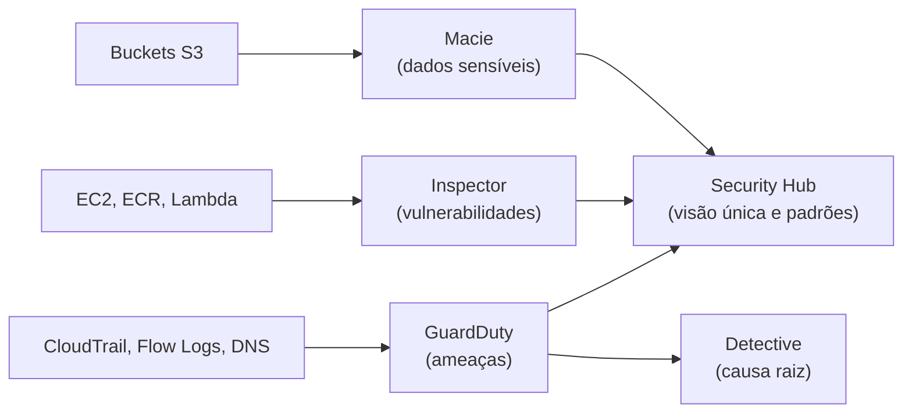

<!-- autoral -->

# 2.9 Detecção de ameaças

> **Domínio 2 — Segurança e Conformidade (30% da prova)** · Depende das aulas [2.6](06-compliance-e-governanca.md), [2.7](07-logs-monitoramento-e-auditoria.md) e [2.8](08-protecao-de-rede-e-aplicacoes.md)

> 🔎 **Fichas para aprofundar:** [Amazon GuardDuty](../../servicos/seguranca/guardduty.md) · [Amazon Inspector](../../servicos/seguranca/inspector.md) · [Amazon Macie](../../servicos/seguranca/macie.md) · [Amazon Detective](../../servicos/seguranca/detective.md) · [AWS Security Hub](../../servicos/seguranca/security-hub.md) · [AWS Trusted Advisor](../../servicos/gerenciamento/trusted-advisor.md)

⬅️ [2.8 Proteção de rede e aplicações](08-protecao-de-rede-e-aplicacoes.md) · 🏠 [Índice do domínio](README.md) · 🏫 [O caso da escola](../00-guia-do-exame/caso-da-escola.md) · [2.10 Outros pontos de segurança](10-outros-pontos-de-seguranca.md) ➡️

---

Firewalls, permissões e criptografia diminuem as chances de um incidente, mas não garantem que ele não vá acontecer. Uma chave de acesso pode vazar, um pacote de software instalado no servidor pode ter uma falha recém-descoberta, um funcionário pode subir para um bucket público uma planilha com os dados de saúde dos alunos. A escola precisa descobrir esses problemas cedo, de preferência antes que alguém de fora os explore.

O técnico da escola não tem tempo de ler milhões de registros do CloudTrail e dos Flow Logs da [aula 2.7](07-logs-monitoramento-e-auditoria.md) procurando sinais de ataque. Esta aula apresenta os serviços que fazem essa vigilância: o **Amazon GuardDuty** detecta ameaças, o **Amazon Inspector** encontra vulnerabilidades, o **Amazon Macie** encontra dados sensíveis, o **Amazon Detective** ajuda a investigar, o **AWS Security Hub** reúne tudo num lugar e o **AWS Trusted Advisor** recomenda boas práticas.

## GuardDuty: ameaças em andamento

O **Amazon GuardDuty** é um serviço de detecção de ameaças que monitora e analisa continuamente fontes de dados e registros do ambiente AWS. Ele usa listas de inteligência de ameaças, como endereços IP e domínios maliciosos conhecidos, e modelos de aprendizado de máquina para identificar atividade suspeita, como uma instância conversando com um servidor de mineração de criptomoeda ou chamadas de API vindas de um endereço malicioso com uma credencial da escola.

Ao ativar o GuardDuty numa conta, ele passa a analisar automaticamente as **fontes de dados básicas**: eventos de gerenciamento do CloudTrail, VPC Flow Logs das instâncias EC2 e registros de consultas DNS do Route 53 Resolver. Não é preciso ativar esses registros à parte para o GuardDuty usá-los. Recursos opcionais ampliam a vigilância, por exemplo para eventos de dados do S3, volumes EBS e execução de contêineres. Na primeira ativação numa Região há um período de teste gratuito de 30 dias.

Quando encontra algo, o GuardDuty gera um **achado** (*finding*), um relatório do problema com o recurso afetado e a gravidade. O limite é que ele detecta e avisa; ele não bloqueia o ataque por conta própria. A resposta fica com o cliente, que pode automatizá-la com outros serviços.

## Inspector: falhas conhecidas no software

Uma ameaça em andamento é diferente de uma porta deixada aberta. O **Amazon Inspector** é um serviço de gerenciamento de **vulnerabilidades**: ele descobre automaticamente instâncias EC2, imagens de contêiner no Amazon ECR e funções Lambda e as examina continuamente em busca de falhas conhecidas de software e de exposição de rede não intencional. As falhas conhecidas são catalogadas publicamente como CVEs (*Common Vulnerabilities and Exposures*).

A varredura acompanha a vida do recurso: o Inspector volta a examinar quando um pacote novo é instalado, quando um patch é aplicado e quando uma nova CVE que afeta o recurso é publicada. Cada problema vira um achado com detalhes da falha, do recurso afetado e da correção recomendada. Aplicar a correção continua sendo tarefa do cliente, como na [aula 2.1](01-responsabilidade-compartilhada.md): o sistema operacional de uma instância EC2 é responsabilidade de quem a usa.

## Macie: dados sensíveis no S3

O **Amazon Macie** é um serviço de segurança de dados que descobre **dados sensíveis** usando aprendizado de máquina e reconhecimento de padrões. Ele trabalha com o S3: mantém um inventário dos buckets, avalia continuamente a segurança e o controle de acesso de cada um e gera um achado se, por exemplo, um bucket se torna público. Também analisa o conteúdo dos objetos para encontrar dados sensíveis, como dados pessoais ou financeiros, usando critérios prontos ou definidos pelo cliente.

É o serviço que encontraria a planilha de saúde dos alunos num bucket que não deveria tê-la. O limite é o escopo: o Macie olha o S3, não bancos de dados nem discos de instâncias.

## Detective e Security Hub: investigar e centralizar

Um achado diz "algo suspeito aconteceu"; a pergunta seguinte é "o que exatamente, desde quando e o que mais foi afetado?". O **Amazon Detective** ajuda a analisar e investigar a **causa raiz** de achados de segurança e atividades suspeitas. Ele coleta automaticamente dados de registros dos recursos e usa aprendizado de máquina, estatística e teoria de grafos para montar visualizações que mostram como identidades, recursos e endereços se relacionaram ao longo do tempo, ligando essas mudanças aos achados do GuardDuty.

Com vários serviços gerando achados, alguém precisa de uma visão única. O **AWS Security Hub** é a solução unificada de segurança da AWS: ele correlaciona e prioriza sinais de várias fontes, como o gerenciamento de postura, o Inspector, o Macie e o GuardDuty. A parte de gerenciamento de postura chama-se **Security Hub CSPM** (*cloud security posture management*): ela verifica as contas contra padrões de segurança, como o AWS Foundational Security Best Practices, criado pela AWS, e padrões externos como CIS, PCI DSS e NIST, e recebe também achados de produtos de parceiros. A maioria dessas verificações usa regras do AWS Config, da [aula 2.6](06-compliance-e-governanca.md).

*Figura 2.9 — Cada serviço vigia uma coisa diferente e gera achados; o Security Hub reúne e prioriza os achados, e o Detective ajuda a investigar a causa raiz dos achados do GuardDuty.*

## Trusted Advisor: recomendações de boas práticas

O **AWS Trusted Advisor** examina o ambiente AWS e faz recomendações quando há oportunidade de economizar, melhorar disponibilidade e desempenho ou fechar brechas de segurança. Suas verificações se dividem em seis categorias: otimização de custos, desempenho, segurança, tolerância a falhas, limites de serviço e excelência operacional. Entre as verificações de segurança estão permissões de buckets S3, security groups com portas liberadas sem restrição e MFA na conta root.

Quem tem o plano de suporte Basic acessa todas as verificações de limites de serviço e verificações selecionadas de segurança e tolerância a falhas, com atualização manual. O conjunto completo depende do plano de suporte, assunto da [aula 4.5](../04-cobranca-precos-e-suporte/05-planos-de-suporte.md). Diferente do GuardDuty, o Trusted Advisor não procura ataques: ele aponta configurações que fogem das boas práticas.

## Na prova

- **"Detectar atividade maliciosa ou credencial comprometida" = GuardDuty.** Ele analisa CloudTrail, Flow Logs e DNS automaticamente.
- **"Vulnerabilidades de software ou CVEs em EC2, ECR ou Lambda" = Inspector.**
- **"Encontrar dados pessoais ou sensíveis no S3" = Macie.**
- **"Investigar a causa raiz de um achado" = Detective.**
- **"Visão única dos achados e verificação contra padrões como CIS ou PCI DSS" = Security Hub.**
- **"Recomendações de custo, desempenho, segurança, tolerância a falhas, limites e excelência operacional" = Trusted Advisor.**
- **Detectar não é bloquear.** GuardDuty, Inspector e Macie geram achados; a correção é do cliente.

## Caso resolvido

**Situação.** A diretora recebeu três alertas numa semana: chamadas de API com uma credencial da escola vindas de um endereço conhecido por ataques; a notícia de uma falha grave numa biblioteca usada pelo servidor de matrícula; e a suspeita de que alguém guardou laudos médicos num bucket errado. Ela quer saber que serviço cobre cada caso e onde acompanhar tudo junto.

**Raciocínio.** As chamadas de API suspeitas são uma ameaça em andamento: o GuardDuty, analisando os eventos do CloudTrail, gera um achado, e o Detective ajuda a reconstruir o que aquela credencial fez e quais recursos tocou. A falha na biblioteca é uma vulnerabilidade: o Inspector examina a instância, identifica a CVE e recomenda a correção, que o técnico aplica. Os laudos no bucket errado são dados sensíveis no S3: o Macie analisa os objetos e gera um achado. O Security Hub reúne os achados dos três serviços num único lugar e mostra a postura geral contra os padrões escolhidos.

**Por que as alternativas tentadoras falham.** Usar o Inspector para descobrir o uso da credencial roubada falha: ele procura falhas de software, não atividade suspeita. Usar o GuardDuty para encontrar laudos no bucket confunde ameaça com dado sensível; isso é trabalho do Macie. E esperar que o Trusted Advisor detecte o ataque também falha: ele recomenda boas práticas de configuração, não analisa ameaças em andamento.

## Revisão

Tente responder antes de abrir cada resposta.

### Qual serviço detecta uma instância EC2 se comunicando com um servidor de mineração de criptomoeda?

Ver resposta

O Amazon GuardDuty, que analisa continuamente fontes como Flow Logs, eventos do CloudTrail e consultas DNS, usando inteligência de ameaças e aprendizado de máquina.

Comentário: o GuardDuty usa essas fontes automaticamente, sem que o cliente precise ativá-las à parte para ele.

### Qual é a diferença entre o GuardDuty e o Inspector?

Ver resposta

O GuardDuty detecta ameaças e atividade maliciosa em andamento. O Inspector encontra vulnerabilidades de software e exposição de rede em instâncias EC2, imagens no ECR e funções Lambda.

Comentário: ameaça é alguém agindo; vulnerabilidade é uma brecha que alguém poderia usar. A pergunta testa essa distinção.

### Qual serviço encontra dados pessoais guardados no S3?

Ver resposta

O Amazon Macie, que usa aprendizado de máquina e reconhecimento de padrões para descobrir dados sensíveis nos objetos do S3 e também avalia a segurança dos buckets.

Comentário: o escopo do Macie é o S3; ele não analisa bancos de dados nem discos de instâncias.

### Para que serve o Amazon Detective?

Ver resposta

Para investigar a causa raiz de achados de segurança e atividades suspeitas, com visualizações que mostram como identidades e recursos se relacionaram ao longo do tempo.

Comentário: o GuardDuty encontra o problema; o Detective ajuda a entender o que aconteceu e qual foi o alcance.

### O que o AWS Security Hub faz?

Ver resposta

Reúne, correlaciona e prioriza os achados de serviços como GuardDuty, Inspector e Macie e verifica as contas contra padrões de segurança, como AWS Foundational Security Best Practices, CIS e PCI DSS.

Comentário: ele não substitui os detectores; ele dá uma visão única do que todos encontraram.

## Resumo

- GuardDuty detecta ameaças analisando CloudTrail, Flow Logs e DNS, com teste gratuito de 30 dias.
- Inspector encontra vulnerabilidades de software e exposição de rede em EC2, ECR e Lambda.
- Macie descobre dados sensíveis e avalia a segurança dos buckets S3.
- Detective investiga a causa raiz de achados.
- Security Hub centraliza achados e verifica padrões como CIS e PCI DSS.
- Trusted Advisor recomenda boas práticas em seis categorias; o conjunto completo depende do plano de suporte.
- Esses serviços detectam e recomendam; corrigir é responsabilidade do cliente.

## Fontes oficiais

Verificadas em 06/10/2026.

- [What is Amazon GuardDuty?](https://docs.aws.amazon.com/guardduty/latest/ug/what-is-guardduty.html): detecção contínua de ameaças com inteligência de ameaças e aprendizado de máquina; fontes básicas e recursos opcionais.
- [GuardDuty foundational data sources](https://docs.aws.amazon.com/guardduty/latest/ug/guardduty_data-sources.html): CloudTrail, VPC Flow Logs e DNS do Route 53 Resolver analisados sem ativação adicional; teste gratuito de 30 dias.
- [GuardDuty EC2 finding types](https://docs.aws.amazon.com/guardduty/latest/ug/guardduty_finding-types-ec2.html): achados como `CryptoCurrency:EC2/BitcoinTool.B`, de instância se comunicando com atividade de criptomoeda.
- [What is Amazon Inspector?](https://docs.aws.amazon.com/inspector/latest/user/what-is-inspector.html): varredura contínua de EC2, ECR e Lambda em busca de vulnerabilidades e exposição de rede; nova varredura após mudanças e novas CVEs.
- [What is Amazon Macie?](https://docs.aws.amazon.com/macie/latest/user/what-is-macie.html): descoberta de dados sensíveis com aprendizado de máquina e padrões; inventário e avaliação de buckets S3.
- [What is Amazon Detective?](https://docs.aws.amazon.com/detective/latest/userguide/what-is-detective.html): investigação da causa raiz com aprendizado de máquina, estatística e grafos, ligada aos achados do GuardDuty.
- [Introduction to AWS Security Hub](https://docs.aws.amazon.com/securityhub/latest/userguide/what-is-securityhub-v2.html): solução unificada que correlaciona sinais de postura, Inspector, Macie e GuardDuty.
- [Introduction to AWS Security Hub CSPM](https://docs.aws.amazon.com/securityhub/latest/userguide/what-is-securityhub.html): padrões FSBP, CIS, PCI DSS e NIST; achados de serviços da AWS e de parceiros.
- [AWS Trusted Advisor](https://docs.aws.amazon.com/awssupport/latest/user/trusted-advisor.html): recomendações e acesso no plano Basic.
- [AWS Trusted Advisor check reference](https://docs.aws.amazon.com/awssupport/latest/user/trusted-advisor-check-reference.html): as seis categorias e verificações de segurança como permissões de buckets S3, portas liberadas em security groups e MFA na conta root.

<!-- notas:inicio -->
## 📝 Minhas anotações

<!-- Escreva aqui suas observações, dúvidas e as questões que você errou sobre o tema. -->
<!-- notas:fim -->

---

⬅️ [2.8 Proteção de rede e aplicações](08-protecao-de-rede-e-aplicacoes.md) · 🏠 [Índice do domínio](README.md) · [2.10 Outros pontos de segurança](10-outros-pontos-de-seguranca.md) ➡️
