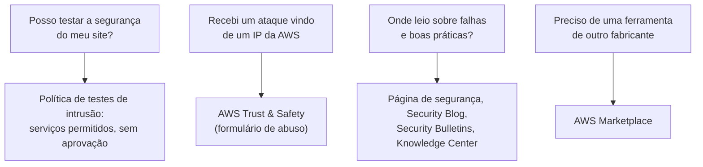

<!-- autoral -->

# 2.10 Outros pontos de segurança

> **Domínio 2 — Segurança e Conformidade (30% da prova)** · Depende das aulas [2.1](01-responsabilidade-compartilhada.md), [2.8](08-protecao-de-rede-e-aplicacoes.md) e [2.9](09-deteccao-de-ameacas.md)

> 🔎 **Fichas para aprofundar:** [Amazon GuardDuty](../../servicos/seguranca/guardduty.md) · [AWS Security Hub](../../servicos/seguranca/security-hub.md) · [Recursos de ajuda, parceiros e serviços ao cliente](../../servicos/custos/recursos-de-ajuda-e-parceiros.md)

⬅️ [2.9 Detecção de ameaças](09-deteccao-de-ameacas.md) · 🏠 [Índice do domínio](README.md)

---

O sistema de matrícula está protegido e monitorado. Restam perguntas que não cabem num único serviço. Um pai que trabalha com segurança se ofereceu para fazer um teste de invasão no site: a escola pode deixar? A secretaria recebeu um e-mail de golpe vindo de um endereço IP que pertence à AWS: a quem reclamar? E o técnico quer acompanhar falhas novas e comprar uma ferramenta de segurança de outra empresa: onde procurar?

Esta aula fecha o domínio de segurança com esses pontos: a política da AWS para **testes de intrusão**, o papel da equipe **AWS Trust & Safety** contra abuso de recursos da AWS, os lugares oficiais onde a AWS publica **informação de segurança** e o **AWS Marketplace** como fonte de produtos de segurança de terceiros.

## Testes de intrusão

Um **teste de intrusão** (*penetration test*, ou pentest) é um ataque autorizado e controlado contra os próprios sistemas, feito para descobrir brechas antes de alguém mal-intencionado. Como os recursos de um cliente rodam numa infraestrutura compartilhada, a AWS precisa separar o que o cliente pode testar do que poderia afetar outros clientes.

A política da AWS permite que o cliente faça avaliações de segurança e testes de intrusão na **própria infraestrutura AWS**, sem aprovação prévia, para uma lista de serviços permitidos. A lista inclui, entre outros, instâncias EC2, WAF, NAT Gateways e Elastic Load Balancers, RDS, Aurora, CloudFront, API Gateway, AppSync, Lambda, Lightsail, Elastic Beanstalk, ECS, Fargate, OpenSearch, FSx, Transit Gateway e Global Accelerator. Testar serviços fora da lista exige tratar diretamente com o AWS Support ou com o representante da conta. Qualquer teste que inclua comando e controle (C2), a técnica de controlar remotamente máquinas comprometidas, exige aprovação prévia.

Alguns testes são proibidos, como varrer zonas de DNS ou sequestrar e falsificar resoluções de DNS pelo Route 53, inundar portas, protocolos ou pedidos e tomar buckets S3 ou subdomínios alheios. Ataques de **negação de serviço** (DoS e DDoS), reais ou simulados, também estão na lista de proibições e seguem uma política própria de simulação de DDoS. E o cliente nunca pode testar a infraestrutura ou os serviços da própria AWS: o teste é sempre sobre os recursos dele.

A divisão segue a responsabilidade compartilhada da [aula 2.1](01-responsabilidade-compartilhada.md): a escola pode testar o que configurou, como o site na instância EC2 e o load balancer, mas não a infraestrutura que a AWS opera. O pai voluntário pode testar o site da matrícula, desde que fique nos serviços permitidos e longe das atividades proibidas.

## AWS Trust & Safety: abuso de recursos da AWS

O caminho inverso também existe: alguém pode usar recursos da AWS para atacar outras pessoas, enviando spam, hospedando páginas de golpe ou fazendo varreduras e ataques de rede. O guia do exame cobra o papel da equipe **AWS Trust & Safety** em receber denúncias de abuso de recursos da AWS.

A denúncia é feita pelo formulário de abuso da AWS, ou por e-mail para sistemas automatizados. A equipe Trust & Safety usa as informações enviadas para investigar e tentar resolver o incidente e pode pedir mais dados a quem denunciou. Ela trata, entre outros, conteúdo impróprio hospedado num recurso da AWS, e-mails abusivos ou spam enviados de recursos da AWS e atividade de rede abusiva, como DDoS e varredura de portas. O AWS Support não atende denúncias de abuso; o canal é o da Trust & Safety. Para a escola, o e-mail de golpe vindo de um IP da AWS vira uma denúncia nesse formulário, com o endereço, o horário e trechos dos registros.

## Onde a AWS publica informação de segurança

O guia do exame espera que você saiba onde procurar informação de segurança da AWS. Os principais lugares são:

- A **página de segurança da AWS** (AWS Cloud Security), que reúne boas práticas, boletins, blog, compliance e recursos de aprendizado. O guia do exame cita esse tipo de fonte como AWS Security Center.
- O **AWS Security Blog**, com artigos sobre serviços, práticas e novidades de segurança.
- Os **Security Bulletins**, a página onde a AWS publica seus boletins de segurança.
- O **AWS Knowledge Center**, no AWS re:Post, com artigos e vídeos oficiais que respondem às dúvidas mais comuns dos clientes, inclusive sobre segurança.
- A **documentação** de cada serviço, que tem um capítulo de segurança explicando a responsabilidade compartilhada naquele serviço, como o capítulo de segurança do S3.

Junto com essas fontes, o [AWS Trusted Advisor](09-deteccao-de-ameacas.md) aponta problemas de segurança na própria conta, e os planos de suporte e outros recursos de ajuda aparecem no domínio 4.

## Produtos de segurança de terceiros

Nem toda necessidade de segurança é atendida por um serviço da AWS: a escola pode querer um antivírus específico, um firewall de um fabricante que já conhece ou uma ferramenta de gestão de vulnerabilidades de outra empresa. O **AWS Marketplace** é um catálogo curado onde se encontra, compra, implanta e gerencia software, dados e serviços de terceiros, com milhares de produtos em categorias como segurança, rede e armazenamento. A compra é cobrada na fatura da AWS.

O limite é o da responsabilidade compartilhada: um produto de terceiros comprado no Marketplace roda na conta do cliente e precisa ser configurado e mantido por ele, como qualquer outro software.

*Figura 2.10 — Quatro perguntas comuns e onde cada uma é resolvida: a política de testes de intrusão, a equipe Trust & Safety, as fontes oficiais de informação e o Marketplace.*

## Na prova

- **"Fazer pentest numa instância EC2 exige autorização?" Não.** EC2, RDS, Lambda, CloudFront e outros serviços da lista podem ser testados sem aprovação prévia.
- **DoS e DDoS, reais ou simulados, são proibidos pela política de pentest.** Simulações de DDoS seguem uma política própria.
- **O cliente testa os próprios recursos, nunca a infraestrutura ou os serviços da AWS.**
- **"Recebi spam, phishing ou ataque vindo de um IP da AWS" = AWS Trust & Safety.** A denúncia é feita pelo formulário de abuso, não pelo AWS Support.
- **"Onde encontrar informação de segurança da AWS" = página de segurança da AWS, Security Blog, Security Bulletins e Knowledge Center.**
- **"Produto de segurança de outro fabricante" = AWS Marketplace.**

## Caso resolvido

**Situação.** O pai voluntário quer testar a segurança do site da matrícula, que roda numa instância EC2 atrás de um Elastic Load Balancer, e propõe incluir no teste uma simulação de ataque DDoS. No mesmo dia, a secretaria recebe um e-mail de golpe cujo cabeçalho mostra um endereço IP da AWS.

**Raciocínio.** O teste de intrusão no site pode ser feito sem aprovação prévia, porque EC2 e Elastic Load Balancing estão na lista de serviços permitidos e o alvo são recursos da própria escola. A simulação de DDoS fica de fora: DoS e DDoS estão entre as atividades proibidas pela política de pentest e só podem seguir a política específica de simulação de DDoS. O e-mail de golpe vira uma denúncia no formulário de abuso da AWS, com o endereço IP, o horário e o cabeçalho do e-mail, para a equipe Trust & Safety investigar.

**Por que as alternativas tentadoras falham.** Pedir autorização à AWS para testar a instância EC2 é desnecessário. Achar que, por não precisar de aprovação, qualquer teste vale, incluindo inundar o site de pedidos, ignora as atividades proibidas. Abrir um caso no AWS Support para denunciar o golpe também falha: o Support não atende denúncias de abuso, que vão para a Trust & Safety.

## Revisão

Tente responder antes de abrir cada resposta.

### O cliente precisa de aprovação da AWS para fazer um teste de intrusão na própria instância EC2?

Ver resposta

Não. EC2 está na lista de serviços que o cliente pode testar na própria infraestrutura sem aprovação prévia.

Comentário: testes com comando e controle (C2) exigem aprovação, e atividades como DoS, DDoS e inundação de pedidos são proibidas.

### Um teste de intrusão pode incluir uma simulação de DDoS livremente?

Ver resposta

Não. DoS e DDoS, reais ou simulados, estão entre as atividades proibidas pela política de testes de intrusão e só podem seguir a política específica de simulação de DDoS.

Comentário: "não precisa de aprovação" vale para a lista de serviços permitidos, não para qualquer tipo de ataque.

### A quem denunciar spam ou ataques vindos de um endereço IP da AWS?

Ver resposta

À equipe AWS Trust & Safety, pelo formulário de abuso da AWS.

Comentário: o AWS Support não atende denúncias de abuso. A Trust & Safety investiga conteúdo impróprio, spam e atividade de rede abusiva vinda de recursos da AWS.

### Onde a AWS publica avisos sobre vulnerabilidades que afetam seus serviços?

Ver resposta

Nos Security Bulletins, a página de boletins de segurança da AWS. Outras fontes oficiais de informação de segurança são a página de segurança da AWS, o AWS Security Blog e o AWS Knowledge Center.

Comentário: o guia do exame cita Security Center, Security Blog e Knowledge Center como lugares de informação de segurança.

### Onde encontrar produtos de segurança de outros fabricantes para usar na AWS?

Ver resposta

No AWS Marketplace, catálogo curado de software, dados e serviços de terceiros, com categoria própria de segurança.

Comentário: o produto comprado roda na conta do cliente, que continua responsável por configurá-lo e mantê-lo.

## Resumo

- O cliente pode testar a segurança dos próprios recursos sem aprovação prévia nos serviços permitidos, como EC2, RDS e Lambda.
- Testes com comando e controle exigem aprovação; DoS, DDoS, inundações e tomada de buckets ou subdomínios são proibidos.
- A infraestrutura e os serviços da própria AWS nunca podem ser testados pelo cliente.
- Abuso vindo de recursos da AWS é denunciado à equipe Trust & Safety pelo formulário de abuso.
- Informação de segurança: página de segurança da AWS, Security Blog, Security Bulletins, Knowledge Center e documentação.
- Produtos de segurança de terceiros ficam no AWS Marketplace.

## Fontes oficiais

Verificadas em 06/10/2026.

- [Penetration Testing](https://aws.amazon.com/security/penetration-testing/): testes sem aprovação prévia nos serviços permitidos, aprovação para C2, atividades proibidas e proibição de testar a infraestrutura e os serviços da AWS.
- [Content Domain 4 do guia do exame CLF-C02](https://docs.aws.amazon.com/aws-certification/latest/cloud-practitioner-02/cloud-practitioner-02-domain4.html): papel da equipe AWS Trust and Safety em receber denúncias de abuso.
- [Content Domain 2 do guia do exame CLF-C02](https://docs.aws.amazon.com/aws-certification/latest/cloud-practitioner-02/cloud-practitioner-02-domain2.html): fontes de informação de segurança (Knowledge Center, Security Center, Security Blog) e produtos de terceiros no Marketplace.
- [How do I report abuse of AWS resources?](https://repost.aws/knowledge-center/report-aws-abuse): formulário de abuso, ações da Trust & Safety, tipos de abuso tratados e o AWS Support fora desse canal.
- [AWS Acceptable Use Policy](https://aws.amazon.com/aup/): violações denunciadas pelo processo de denúncia de abuso.
- [AWS Cloud Security](https://aws.amazon.com/security/), [AWS Security Blog](https://aws.amazon.com/blogs/security/) e [Security Bulletins](https://aws.amazon.com/security/security-bulletins/): fontes oficiais de informação de segurança.
- [AWS Knowledge Center](https://repost.aws/knowledge-center): artigos e vídeos oficiais com as dúvidas mais comuns dos clientes.
- [What is AWS Marketplace?](https://docs.aws.amazon.com/marketplace/latest/buyerguide/what-is-marketplace.html): catálogo curado de software, dados e serviços de terceiros, com categoria de segurança e cobrança na fatura da AWS.
- [Security in Amazon S3](https://docs.aws.amazon.com/AmazonS3/latest/userguide/security.html): exemplo de capítulo de segurança da documentação, com a responsabilidade compartilhada no serviço.

<!-- notas:inicio -->
## 📝 Minhas anotações

<!-- Escreva aqui suas observações, dúvidas e as questões que você errou sobre o tema. -->
<!-- notas:fim -->

---

⬅️ [2.9 Detecção de ameaças](09-deteccao-de-ameacas.md) · 🏠 [Índice do domínio](README.md)
