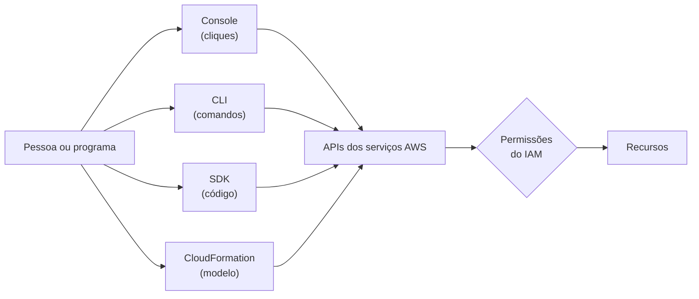

<!-- autoral -->

# 3.1 Formas de acessar e implantar na AWS

> **Domínio 3 — Tecnologia e Serviços de Nuvem (34% da prova)** · Depende das aulas [0.4](../fundamentos/04-api-e-filas.md), [1.1](../01-conceitos-de-nuvem/01-o-que-e-computacao-em-nuvem.md) e [2.3](../02-seguranca-e-conformidade/03-iam.md)

> 🔎 **Fichas para aprofundar:** [Console, CLI, SDKs e CloudShell](../../servicos/desenvolvimento/cli-sdk-e-cloudshell.md) · [AWS CloudFormation](../../servicos/gerenciamento/cloudformation.md) · [AWS VPN](../../servicos/redes/site-to-site-vpn-e-client-vpn.md) · [AWS Direct Connect](../../servicos/redes/direct-connect.md)

🏠 [Índice do domínio](README.md) · 🏫 [O caso da escola](../00-guia-do-exame/caso-da-escola.md) · [3.2 Infraestrutura global](02-infraestrutura-global.md) ➡️

---

Na escola, três pessoas trabalham com a AWS de jeitos diferentes. A coordenadora de TI entra pelo navegador uma vez por mês para conferir a conta. O professor de informática escreve pequenos roteiros que fazem backup de arquivos toda noite. E a empresa que mantém o sistema de matrícula precisa montar, a cada semestre, um ambiente de testes idêntico ao de produção.

As três estão pedindo coisas à AWS, mas cada uma escolheu a forma que combina com a tarefa. O guia do exame cobra essa escolha: quando usar o console, quando usar acesso programático (APIs, SDKs, CLI) e quando usar infraestrutura como código; quando uma operação pode ser feita uma vez e quando precisa ser repetível; e como a rede da empresa se conecta à AWS.

## Tudo é uma chamada de API

Na [aula 0.4](../fundamentos/04-api-e-filas.md), você viu que uma API é o conjunto de operações que um programa oferece a outros programas. Cada serviço da AWS tem a sua: criar uma instância, listar arquivos, apagar um banco. Todas as formas de acesso desta aula acabam fazendo chamadas a essas APIs; o que muda é quem monta a chamada e como.

Isso tem uma consequência importante para a segurança. Como toda chamada chega à AWS com uma identidade, ela é avaliada pelas mesmas permissões do IAM, vistas na [aula 2.3](../02-seguranca-e-conformidade/03-iam.md). Trocar o console pela linha de comando não dá a ninguém mais poder do que as permissões já dão.

## O console: a tela no navegador

O **AWS Management Console** é a aplicação web que reúne os consoles de cada serviço num só lugar. Nele você procura serviços, vê notificações e cuida da conta e da cobrança. É a forma mais fácil de começar, de explorar um serviço ou de fazer uma tarefa pontual, como a conferência mensal da coordenadora.

O limite é a repetição: clicar é lento quando a tarefa se repete, e duas pessoas que fazem o mesmo procedimento à mão podem chegar a resultados diferentes.

## Acesso programático: CLI e SDKs

Acesso programático é pedir as operações por meio de comandos ou de código, em vez de cliques.

A **AWS Command Line Interface** (AWS CLI) é uma ferramenta de código aberto para usar os serviços da AWS por comandos no terminal, no Linux, no macOS ou no Windows. Ela dá acesso direto às APIs públicas dos serviços e permite escrever *scripts*, pequenos roteiros de comandos, para gerenciar recursos. A AWS informa que as funções de administração de infraestrutura disponíveis no console também estão na API e na CLI. É o que o professor usa para o backup noturno.

Os **AWS SDKs** (*software development kits*, kits de desenvolvimento) são bibliotecas que permitem chamar as APIs da AWS de dentro de um programa, em linguagens como Python, JavaScript e Java. Servem quando a própria aplicação precisa usar a AWS, por exemplo, o sistema de matrícula gravando o comprovante de cada aluno num serviço de armazenamento.

Existe também o **AWS CloudShell**, um terminal no navegador, aberto a partir do console, que já vem com a CLI instalada e com as credenciais de quem entrou no console; não há cobrança adicional por ele. Vale saber que existe, mas ele está na lista de serviços **fora do escopo** do exame atual.

## Infraestrutura como código

**Infraestrutura como código** (IaC, *infrastructure as code*) é descrever num arquivo os recursos que um ambiente precisa e deixar que uma ferramenta os crie. Em vez de uma lista de cliques ou uma sequência de comandos, o arquivo diz o resultado desejado.

O **AWS CloudFormation** é o serviço de IaC da AWS. Você escreve um **modelo** (*template*) que descreve os recursos e suas propriedades, como instâncias, balanceadores de carga e bancos de dados, e o CloudFormation cria e configura tudo como uma **pilha** (*stack*). Apagar a pilha apaga todos os recursos dela. O mesmo modelo pode ser usado de novo para criar os mesmos recursos de forma consistente em várias Regiões, e as mudanças no modelo podem ser controladas e acompanhadas como qualquer arquivo.

O **AWS Cloud Development Kit** (AWS CDK) é uma alternativa para quem prefere escrever a infraestrutura em uma linguagem de programação, como TypeScript, Python ou Java; o CDK transforma esse código e implanta os recursos pelo próprio CloudFormation.

É a resposta para a empresa do sistema de matrícula: com um modelo, o ambiente de testes sai idêntico ao de produção a cada semestre, sem depender da memória de quem clica. O limite é que o modelo só descreve; os recursos criados continuam sujeitos às permissões e são cobrados normalmente. A [aula 3.16](16-gestao-e-governanca.md) volta ao CloudFormation.

## Operação única ou processo repetível?

A pergunta que decide a ferramenta é se a tarefa vai se repetir:

| Situação | Forma adequada |
|---|---|
| Explorar um serviço ou fazer uma tarefa uma única vez | Console |
| Repetir uma tarefa com comandos, em roteiros | CLI |
| A aplicação precisa usar a AWS no seu próprio código | SDK |
| Criar ambientes inteiros iguais, várias vezes, em várias Regiões ou contas | Infraestrutura como código (CloudFormation, CDK) |

*Figura 3.1 — Todas as formas de acesso chegam às mesmas APIs e passam pelas mesmas permissões.*

## Modelos de implantação e conectividade

Na [aula 1.1](../01-conceitos-de-nuvem/01-o-que-e-computacao-em-nuvem.md) você viu os modelos de implantação: **nuvem** (tudo na AWS), **híbrido** (parte na AWS, parte no datacenter próprio, conectados) e **on-premises** (tudo no datacenter próprio). O modelo híbrido levanta uma pergunta prática: como a rede da empresa conversa com a rede na AWS? Há três caminhos:

- **Internet pública**: o mais simples, sem nada a contratar, sujeito às variações da internet.
- **AWS Site-to-Site VPN**: uma conexão criptografada (IPsec) entre a rede local e uma rede virtual na AWS (VPC), que passa pela internet. O **AWS Client VPN** faz algo parecido para pessoas: cada usuário conecta seu computador, de qualquer lugar, com um cliente de VPN.
- **AWS Direct Connect**: um cabo de fibra ligando a rede da empresa a um local do Direct Connect, que dá acesso à AWS sem passar pelos provedores de internet no caminho.

A escolha entre VPN e Direct Connect, e o que é uma VPC, são assunto da [aula 3.10](10-rede-e-entrega-de-conteudo.md).

## Na prova

- **"Tarefa pontual, explorar um serviço" = Console.**
- **"Automatizar com scripts no terminal" = CLI; "chamar a AWS de dentro do código da aplicação" = SDK.**
- **"Criar o mesmo ambiente de forma repetível, em várias Regiões ou contas" = infraestrutura como código, com CloudFormation.**
- **Console, CLI e SDK usam as mesmas APIs e as mesmas permissões do IAM.**
- **"Conexão criptografada pela internet entre o datacenter e a AWS" = Site-to-Site VPN; "conexão dedicada que não passa por provedores de internet" = Direct Connect.**
- **CloudShell está fora do escopo do exame**; não o escolha como resposta para "automatizar".

## Caso resolvido

**Situação.** A empresa que mantém o sistema de matrícula monta todo semestre um ambiente de testes com servidores, balanceador de carga e banco de dados. Da última vez, alguém esqueceu de configurar uma regra, e os testes passaram num ambiente diferente do de produção. A escola quer evitar isso e, no futuro, criar o mesmo ambiente em outra Região.

**Raciocínio.** O problema é repetir à mão um conjunto de recursos e esquecer um passo. Infraestrutura como código resolve: descrever o ambiente num modelo do CloudFormation e criar uma pilha a cada semestre. O modelo é o mesmo, então o resultado também; e o mesmo modelo cria os recursos em outra Região quando for preciso. Ao fim dos testes, apagar a pilha remove todos os recursos e para a cobrança.

**Por que as alternativas tentadoras falham.** Fazer pelo console com um roteiro escrito continua dependendo de alguém seguir cada passo. Um script na CLI repete comandos, mas a equipe precisa tratar sozinha erros e passos que falharam no meio; o modelo descreve o resultado desejado. E usar o SDK dentro do sistema de matrícula não faz sentido: o SDK serve para a aplicação usar a AWS, não para montar o ambiente de testes.

## Revisão

Tente responder antes de abrir cada resposta.

### Quais são as formas de acessar e operar os serviços da AWS?

Ver resposta

O AWS Management Console (navegador), a AWS CLI (comandos), os AWS SDKs (código da aplicação) e a infraestrutura como código, com o AWS CloudFormation.

Comentário: todas chegam às APIs dos serviços e passam pelas permissões do IAM.

### Quando usar o console e quando automatizar?

Ver resposta

O console serve para explorar e para tarefas pontuais; tarefas que se repetem devem ser automatizadas com CLI, SDK ou infraestrutura como código.

Comentário: repetir à mão é lento e leva a resultados diferentes entre uma vez e outra.

### O que é infraestrutura como código?

Ver resposta

É descrever em um arquivo os recursos de um ambiente e deixar que uma ferramenta os crie; na AWS, o CloudFormation cria os recursos de um modelo como uma pilha.

Comentário: o mesmo modelo cria ambientes iguais em várias Regiões, e apagar a pilha apaga os recursos dela.

### Qual é a diferença entre a AWS CLI e um AWS SDK?

Ver resposta

A CLI executa comandos no terminal e em scripts; o SDK é uma biblioteca para chamar as APIs da AWS de dentro do código de uma aplicação.

Comentário: as duas são acesso programático e usam as mesmas APIs.

### Como a rede de uma empresa pode se conectar à AWS num modelo híbrido?

Ver resposta

Pela internet pública, por uma Site-to-Site VPN (conexão criptografada que passa pela internet) ou pelo Direct Connect (conexão dedicada, sem passar pelos provedores de internet).

Comentário: o Client VPN conecta usuários individuais, não a rede inteira.

## Resumo

- Todas as formas de acesso fazem chamadas às APIs da AWS, avaliadas pelas permissões do IAM.
- Console para tarefas pontuais; CLI para scripts; SDK para o código da aplicação.
- Infraestrutura como código (CloudFormation, CDK) cria ambientes iguais de forma repetível.
- CloudShell é um terminal no navegador, mas está fora do escopo do exame.
- Conectividade híbrida: internet, Site-to-Site VPN (ou Client VPN para usuários) e Direct Connect.

## Fontes oficiais

Verificadas em 06/10/2026.

- [Content Domain 3 do guia do exame CLF-C02](https://docs.aws.amazon.com/aws-certification/latest/cloud-practitioner-02/cloud-practitioner-02-domain3.html): tarefa 3.1 (formas de acesso, operações únicas ou repetíveis, modelos de implantação).
- [In-Scope AWS Services](https://docs.aws.amazon.com/aws-certification/latest/cloud-practitioner-02/clf-02-in-scope-services.html) e [Out-of-Scope AWS Services](https://docs.aws.amazon.com/aws-certification/latest/cloud-practitioner-02/clf-02-out-of-scope-services.html): Console, CLI, CloudFormation, VPN e Direct Connect no escopo; CloudShell fora.
- [What is the AWS Management Console?](https://docs.aws.amazon.com/awsconsolehelpdocs/latest/gsg/what-is.html): aplicação web que reúne os consoles dos serviços.
- [What is the AWS CLI?](https://docs.aws.amazon.com/cli/latest/userguide/cli-chap-welcome.html): ferramenta de código aberto, acesso às APIs públicas, funções de administração disponíveis na API e na CLI.
- [What's the AWS SDK for JavaScript?](https://docs.aws.amazon.com/sdk-for-javascript/v3/developer-guide/welcome.html): exemplo de SDK que oferece uma API para os serviços da AWS dentro de aplicações.
- [What is AWS CloudShell?](https://docs.aws.amazon.com/cloudshell/latest/userguide/welcome.html): terminal no navegador, pré-autenticado, com a CLI instalada e sem cobrança adicional.
- [What is CloudFormation?](https://docs.aws.amazon.com/AWSCloudFormation/latest/UserGuide/Welcome.html): modelos, pilhas, replicação em várias Regiões e controle de mudanças.
- [What is the AWS CDK?](https://docs.aws.amazon.com/cdk/v2/guide/home.html): infraestrutura em linguagem de programação, implantada pelo CloudFormation.
- [AWS Site-to-Site VPN (Amazon VPC Connectivity Options)](https://docs.aws.amazon.com/whitepapers/latest/aws-vpc-connectivity-options/aws-site-to-site-vpn.html): conexão VPN IPsec entre a rede remota e a VPC pela internet.
- [What is AWS Site-to-Site VPN?](https://docs.aws.amazon.com/vpn/latest/s2svpn/VPC_VPN.html), [What is AWS Client VPN?](https://docs.aws.amazon.com/vpn/latest/clientvpn-admin/what-is.html) e [What is Direct Connect?](https://docs.aws.amazon.com/directconnect/latest/UserGuide/Welcome.html): opções de conectividade.

<!-- notas:inicio -->
## 📝 Minhas anotações

<!-- Escreva aqui suas observações, dúvidas e as questões que você errou sobre o tema. -->
<!-- notas:fim -->

---

🏠 [Índice do domínio](README.md) · [3.2 Infraestrutura global](02-infraestrutura-global.md) ➡️
