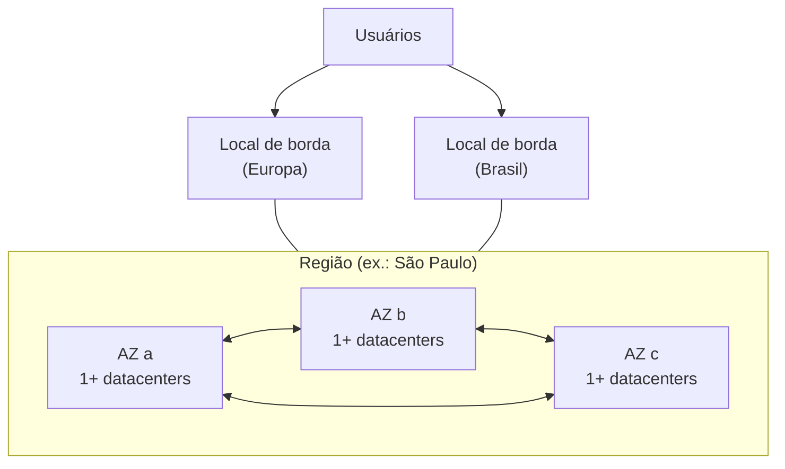

<!-- autoral -->

# 3.2 Infraestrutura global

> **Domínio 3 — Tecnologia e Serviços de Nuvem (34% da prova)** · Depende das aulas [1.3](../01-conceitos-de-nuvem/03-conceitos-de-arquitetura.md) e [3.1](01-formas-de-acesso-e-implantacao.md)

> 🔎 **Fichas para aprofundar:** [AWS Outposts, Local Zones e Wavelength](../../servicos/computacao/outposts-local-zones-wavelength.md) · [Amazon CloudFront](../../servicos/redes/cloudfront.md) · [AWS Global Accelerator](../../servicos/redes/global-accelerator.md)

⬅️ [3.1 Formas de acessar e implantar na AWS](01-formas-de-acesso-e-implantacao.md) · 🏠 [Índice do domínio](README.md) · 🏫 [O caso da escola](../00-guia-do-exame/caso-da-escola.md) · [3.3 Amazon EC2](03-ec2.md) ➡️

---

A rede de escolas vai criar seu primeiro servidor na AWS, e o console pede logo de cara: "em qual Região?". A coordenadora de TI não sabe o que responder. As escolas ficam em São Paulo, a lei de proteção de dados preocupa a diretoria, a unidade que vai abrir em Lisboa terá alunos do outro lado do oceano, e ninguém quer que o sistema caia se um prédio da AWS ficar sem energia.

Cada uma dessas preocupações se resolve com uma peça diferente da **infraestrutura global** da AWS: Regiões, Zonas de Disponibilidade e locais de borda. O guia do exame cobra a relação entre essas peças, como obter alta disponibilidade com várias Zonas de Disponibilidade e quando usar várias Regiões.

## Regiões

Uma **Região** da AWS é uma área geográfica com várias Zonas de Disponibilidade independentes e fisicamente separadas. Hoje a AWS tem 39 Regiões geográficas, com outras anunciadas; o número muda, e a prova cobra o conceito, não a contagem.

As Regiões são isoladas e independentes entre si. Isso tem duas consequências:

- **Uma falha fica restrita a uma Região**: se um serviço tiver problemas numa Região, as outras continuam funcionando normalmente.
- **Os dados ficam onde você os colocou**: recursos e dados criados numa Região não existem em nenhuma outra, a menos que você use explicitamente um recurso de replicação ou cópia.

A segunda consequência é o que permite atender a leis de **soberania de dados** (a exigência de manter dados num país ou território): basta escolher uma Região no país e não copiar os dados para fora.

### Como escolher a Região

O blog de arquitetura da AWS resume a escolha em quatro fatores:

1. **Conformidade**: se os dados estão sujeitos a uma lei local, escolher uma Região que a atenda passa à frente de todos os outros fatores.
2. **Latência**: uma Região perto dos usuários reduz o tempo de resposta.
3. **Custo**: os preços dos serviços variam de uma Região para outra.
4. **Serviços e recursos disponíveis**: serviços e recursos novos chegam às Regiões aos poucos, então nem tudo existe em todas.

Para a escola, a Região de São Paulo resolve conformidade e latência, porque fica no país e perto das famílias; falta conferir se oferece todos os serviços necessários e comparar os preços.

## Zonas de Disponibilidade

Uma **Zona de Disponibilidade** (AZ, *Availability Zone*) é um ou mais datacenters separados, com energia, rede e conectividade redundantes e independentes, dentro de uma Região. Todas as Regiões atuais têm três ou mais AZs.

As AZs de uma Região ficam a uma distância significativa umas das outras, de até cerca de 100 km, para que um mesmo evento, como uma falha de energia, uma enchente ou um corte de fibra, não atinja duas ao mesmo tempo. E ficam perto o bastante para se comunicarem por uma rede dedicada de alta capacidade e baixa latência, o que permite replicação síncrona de dados entre elas, com latência de poucos milissegundos. Em resumo: **as AZs não compartilham pontos únicos de falha**.

É por isso que várias AZs são a forma de obter **alta disponibilidade** na AWS, conceito que você viu na [aula 1.3](../01-conceitos-de-nuvem/03-conceitos-de-arquitetura.md): se a escola rodar cópias do sistema em duas AZs, a perda de uma delas não derruba o sistema. O limite é que isso não acontece sozinho. Duas instâncias na mesma AZ caem juntas; é preciso distribuir as cópias entre AZs e ter algo que desvie o tráfego para as que estão funcionando, como um balanceador de carga ([aula 3.4](04-escalabilidade-e-balanceamento.md)).

## Quando usar várias Regiões

Várias AZs protegem contra a falha de um local dentro da Região. Várias Regiões atendem a outras necessidades, e o guia do exame cita quatro:

- **Recuperação de desastres**: ter onde recuperar o sistema se uma Região inteira ficar indisponível, com as estratégias da [aula 1.3](../01-conceitos-de-nuvem/03-conceitos-de-arquitetura.md).
- **Continuidade de negócios**: manter a operação funcionando mesmo em eventos de grande escala.
- **Baixa latência para usuários finais**: rodar a aplicação perto de usuários em outros continentes, como os alunos de Lisboa.
- **Soberania de dados**: manter os dados de cada país numa Região dentro dele.

O limite é o custo e a complexidade: como uma Região não copia nada para outra por conta própria, usar várias Regiões exige decidir como replicar dados, como direcionar os usuários e como pagar pelos recursos duplicados.

## Locais de borda

Além das Regiões, a AWS opera uma rede mundial de **pontos de presença** (PoPs), também chamados de **locais de borda** (*edge locations*). Eles são muito mais numerosos que as Regiões e ficam em cidades do mundo todo, perto dos usuários. Cada ponto de presença é isolado dos outros, e todos se ligam às Regiões pela rede própria da AWS.

Nos locais de borda rodam serviços que precisam estar perto de quem acessa:

- O **Amazon CloudFront**, rede de entrega de conteúdo (CDN), que guarda cópias de arquivos perto dos usuários.
- O **Amazon Route 53**, serviço de DNS, que traduz nomes como `escola.com.br` em endereços.
- O **AWS Global Accelerator**, que leva o tráfego dos usuários pela rede da AWS até a aplicação.

O benefício é a **menor latência**: o vídeo de boas-vindas da escola pode ser entregue a um aluno de Lisboa a partir de um local de borda na Europa, em vez de atravessar o oceano até São Paulo. O limite é que um local de borda não é uma AZ: não é onde você cria seus servidores. Os três serviços aparecem na [aula 3.10](10-rede-e-entrega-de-conteudo.md).

*Figura 3.2 — Uma Região reúne três ou mais AZs ligadas por rede de baixa latência; os locais de borda ficam perto dos usuários e se ligam às Regiões pela rede da AWS.*

## Serviços regionais e globais

A maioria dos serviços da AWS é **regional**: você escolhe a Região e os recursos existem só nela. Alguns são chamados de **globais**, porque seus recursos não pertencem a uma Região específica. Entre eles estão o AWS IAM e o AWS Organizations, e os serviços que rodam nos locais de borda, como o CloudFront, o Route 53 e o Global Accelerator. Por isso o usuário do IAM criado pela escola vale em todas as Regiões, enquanto um servidor criado em São Paulo só existe em São Paulo.

## Infraestrutura fora das Regiões

A AWS também leva parte da sua infraestrutura para mais perto do cliente:

- O **AWS Outposts** instala capacidade de computação e armazenamento da AWS **no local do cliente**, operada e gerenciada pela AWS como parte de uma Região, com as mesmas APIs e ferramentas. Serve para baixa latência e processamento local de dados. Está no escopo do exame.
- As **AWS Local Zones** colocam computação, armazenamento e outros recursos perto de grandes centros populacionais e industriais, para baixa latência, por exemplo em jogos e transmissões ao vivo. Não aparecem na lista de serviços do exame.
- O **AWS Wavelength** coloca computação e armazenamento na borda das redes das operadoras de telecomunicações, para baixa latência em dispositivos móveis. Está na lista de serviços **fora do escopo**.

## Na prova

- **Região = área geográfica com três ou mais AZs; AZ = um ou mais datacenters com energia e rede independentes.**
- **"Continuar no ar se uma AZ ou um datacenter falhar" = distribuir em várias AZs.**
- **"AZs não compartilham pontos únicos de falha"** é a razão pela qual várias AZs dão alta disponibilidade.
- **Várias Regiões = recuperação de desastres, continuidade de negócios, baixa latência para usuários distantes e soberania de dados.**
- **"Lei exige dados no país" = escolher a Região**; dados não saem dela sem replicação explícita.
- **Fatores para escolher Região: conformidade, latência, custo e serviços disponíveis.**
- **"Entregar conteúdo com baixa latência no mundo todo" = locais de borda, com CloudFront.**
- **"Serviços da AWS dentro do datacenter da empresa" = Outposts.**

## Caso resolvido

**Situação.** A rede de escolas quer três coisas: que o sistema de matrícula continue funcionando se um datacenter da AWS ficar sem energia; que os dados dos alunos brasileiros fiquem no Brasil; e que os alunos da nova unidade em Lisboa recebam rápido os vídeos das aulas. Que peças da infraestrutura global atendem a cada pedido?

**Raciocínio.** Para o datacenter sem energia, rodar o sistema em duas ou mais AZs da Região de São Paulo: as AZs não compartilham pontos únicos de falha, então a perda de uma não derruba as outras. Para os dados no Brasil, usar a Região de São Paulo e não replicar os dados dos alunos brasileiros para outras Regiões, já que nada sai da Região sem replicação explícita. Para os vídeos em Lisboa, entregá-los pelo CloudFront, que guarda cópias em locais de borda perto dos alunos.

**Por que as alternativas tentadoras falham.** Criar duas instâncias na mesma AZ não protege contra a falha daquela AZ. Usar uma segunda Região só para o problema do datacenter é mais caro e complexo que o necessário, porque várias AZs já resolvem. E "criar servidores num local de borda em Lisboa" não existe: locais de borda rodam serviços como o CloudFront, não as instâncias da escola.

## Revisão

Tente responder antes de abrir cada resposta.

### Qual é a relação entre Região, Zona de Disponibilidade e local de borda?

Ver resposta

Uma Região é uma área geográfica com três ou mais AZs; cada AZ é um ou mais datacenters independentes; os locais de borda são pontos de presença espalhados pelo mundo, perto dos usuários, ligados às Regiões pela rede da AWS.

Comentário: você cria servidores em AZs de uma Região; os locais de borda rodam serviços como CloudFront e Route 53.

### Por que distribuir uma aplicação em várias AZs aumenta a disponibilidade?

Ver resposta

Porque as AZs não compartilham pontos únicos de falha: têm energia e rede independentes e ficam distantes o bastante para um mesmo evento não atingir duas.

Comentário: é preciso distribuir as cópias e desviar o tráfego das que falharem, por exemplo com um balanceador de carga.

### Quando usar várias Regiões?

Ver resposta

Para recuperação de desastres, continuidade de negócios, baixa latência para usuários em outros lugares do mundo e soberania de dados.

Comentário: para a falha de um datacenter, várias AZs bastam; várias Regiões custam mais e exigem decidir como replicar os dados.

### Quais fatores pesam na escolha de uma Região?

Ver resposta

Conformidade com leis e regras sobre os dados, latência para os usuários, custo e disponibilidade dos serviços e recursos necessários.

Comentário: quando uma lei exige que os dados fiquem num país, esse fator passa à frente dos outros.

### Para que servem os locais de borda?

Ver resposta

Para rodar serviços perto dos usuários, como o CloudFront (entrega de conteúdo), o Route 53 (DNS) e o Global Accelerator, reduzindo a latência.

Comentário: um local de borda não é uma AZ; não é onde se criam instâncias.

## Resumo

- Região: área geográfica isolada, com três ou mais AZs; dados não saem dela sem replicação explícita.
- Escolha da Região: conformidade, latência, custo e serviços disponíveis.
- AZ: um ou mais datacenters com energia e rede independentes; AZs não compartilham pontos únicos de falha.
- Várias AZs dão alta disponibilidade; várias Regiões servem a DR, continuidade, latência global e soberania de dados.
- Locais de borda aproximam CloudFront, Route 53 e Global Accelerator dos usuários.
- Outposts leva a AWS ao local do cliente (no escopo); Local Zones não aparecem na lista; Wavelength está fora do escopo.

## Fontes oficiais

Verificadas em 06/10/2026.

- [Content Domain 3 do guia do exame CLF-C02](https://docs.aws.amazon.com/aws-certification/latest/cloud-practitioner-02/cloud-practitioner-02-domain3.html): tarefa 3.2 (Regiões, AZs, locais de borda, alta disponibilidade e usos de várias Regiões).
- [AWS Global Infrastructure](https://aws.amazon.com/about-aws/global-infrastructure/): número atual de Regiões e AZs.
- [Regions (AWS Fault Isolation Boundaries)](https://docs.aws.amazon.com/whitepapers/latest/aws-fault-isolation-boundaries/regions.html): Regiões isoladas, três ou mais AZs, dados que não saem da Região sem replicação.
- [Availability Zones (AWS Fault Isolation Boundaries)](https://docs.aws.amazon.com/whitepapers/latest/aws-fault-isolation-boundaries/availability-zones.html): definição de AZ, distância de até cerca de 100 km e rede de baixa latência entre AZs.
- [Points of presence](https://docs.aws.amazon.com/whitepapers/latest/aws-fault-isolation-boundaries/points-of-presence.html): rede de pontos de presença com CloudFront, Route 53 e Global Accelerator.
- [Global services](https://docs.aws.amazon.com/whitepapers/latest/aws-fault-isolation-boundaries/global-services.html): IAM, Organizations e serviços de borda como serviços globais.
- [What to Consider when Selecting a Region for your Workloads (AWS Architecture Blog)](https://aws.amazon.com/blogs/architecture/what-to-consider-when-selecting-a-region-for-your-workloads/): os quatro fatores de escolha.
- [What is AWS Outposts?](https://docs.aws.amazon.com/outposts/latest/userguide/what-is-outposts.html), [What is AWS Local Zones?](https://docs.aws.amazon.com/local-zones/latest/ug/what-is-aws-local-zones.html) e [What is AWS Wavelength?](https://docs.aws.amazon.com/wavelength/latest/developerguide/what-is-wavelength.html): infraestrutura fora das Regiões.
- [In-Scope AWS Services](https://docs.aws.amazon.com/aws-certification/latest/cloud-practitioner-02/clf-02-in-scope-services.html) e [Out-of-Scope AWS Services](https://docs.aws.amazon.com/aws-certification/latest/cloud-practitioner-02/clf-02-out-of-scope-services.html): Outposts no escopo; Wavelength fora.

<!-- notas:inicio -->
## 📝 Minhas anotações

<!-- Escreva aqui suas observações, dúvidas e as questões que você errou sobre o tema. -->
<!-- notas:fim -->

---

⬅️ [3.1 Formas de acessar e implantar na AWS](01-formas-de-acesso-e-implantacao.md) · 🏠 [Índice do domínio](README.md) · [3.3 Amazon EC2](03-ec2.md) ➡️
