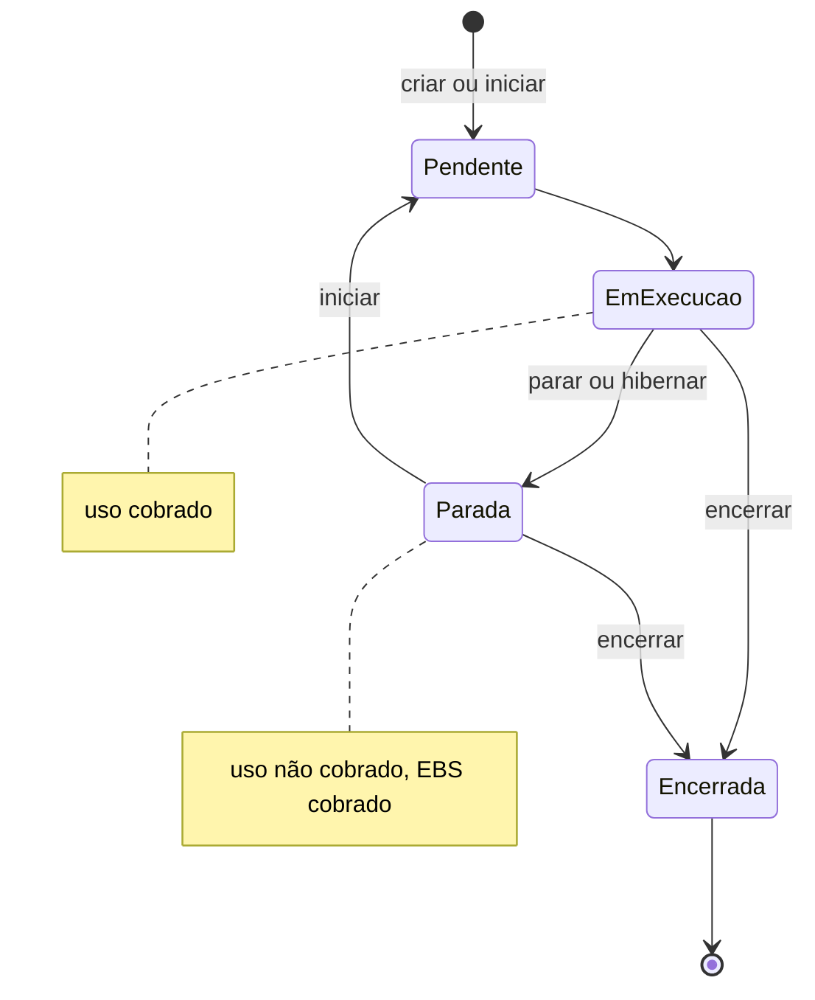

<!-- autoral -->

# 3.3 Amazon EC2

> **Domínio 3 — Tecnologia e Serviços de Nuvem (34% da prova)** · Depende das aulas [0.1](../fundamentos/01-servidor-e-virtualizacao.md), [2.1](../02-seguranca-e-conformidade/01-responsabilidade-compartilhada.md) e [3.2](02-infraestrutura-global.md)

> 🔎 **Fichas para aprofundar:** [Amazon EC2](../../servicos/computacao/ec2.md) · [Amazon EBS e instance store](../../servicos/armazenamento/ebs.md)

⬅️ [3.2 Infraestrutura global](02-infraestrutura-global.md) · 🏠 [Índice do domínio](README.md) · 🏫 [O caso da escola](../00-guia-do-exame/caso-da-escola.md) · [3.4 Escalabilidade e balanceamento de carga](04-escalabilidade-e-balanceamento.md) ➡️

---

O sistema de matrícula da escola roda num servidor velho na sala de TI. Ele usa um programa que precisa de um sistema operacional específico, com configurações que o professor de informática ajustou ao longo dos anos. A escola quer levá-lo para a AWS sem reescrever nada: precisa de um computador na nuvem onde possa instalar e configurar o que quiser.

Esse computador é uma instância do **Amazon EC2**. O guia do exame cobra principalmente uma habilidade: reconhecer o tipo de instância adequado a cada uso, como os otimizados para computação ou para armazenamento. Para chegar lá, esta aula explica o que é uma instância, do que ela é feita e o que acontece com ela, e com a cobrança, quando é parada ou encerrada.

## O que é o EC2

O **Amazon Elastic Compute Cloud** (Amazon EC2) oferece capacidade de computação sob demanda e escalável na nuvem da AWS. Uma **instância** do EC2 é um servidor virtual, como os da [aula 0.1](../fundamentos/01-servidor-e-virtualizacao.md): você pode criar quantas precisar, configurar segurança e rede, gerenciar o armazenamento e desligá-las quando não precisar mais.

O EC2 é o exemplo clássico de IaaS ([aula 1.1](../01-conceitos-de-nuvem/01-o-que-e-computacao-em-nuvem.md)): a AWS cuida do hardware e da virtualização; o cliente controla o sistema operacional e tudo o que instala nele. Pelo [modelo de responsabilidade compartilhada](../02-seguranca-e-conformidade/01-responsabilidade-compartilhada.md), isso quer dizer que atualizar o sistema operacional, configurar o firewall da instância e proteger a aplicação são tarefas da escola. É o preço do controle total.

## Do que uma instância é feita

Ao criar uma instância, a escola faz algumas escolhas:

- A **AMI** (*Amazon Machine Image*) é a imagem com o software necessário para iniciar a instância, como o sistema operacional. Pode ser uma AMI da AWS, uma pública, uma compartilhada por outra conta, uma comprada no AWS Marketplace ou uma criada pela própria escola. Uma AMI pertence a uma Região.
- O **tipo de instância** determina o hardware disponível: quanto de processamento, memória, rede e armazenamento a instância tem. É a escolha mais cobrada na prova, e a próxima seção trata dela.
- O **par de chaves** (*key pair*) é a credencial para se conectar à instância: a AWS guarda a chave pública na instância, e você guarda a chave privada. No Linux, a chave privada permite entrar por SSH; no Windows, ela decifra a senha do administrador. Quem tiver a chave privada consegue entrar, então ela precisa ser bem guardada.
- Os **dados de usuário** (*user data*) são comandos ou scripts passados na criação para configurar a instância automaticamente quando ela inicia, como instalar o programa de matrícula.
- O **armazenamento**, explicado mais adiante.

A rede e o firewall da instância (os grupos de segurança) foram vistos na [aula 2.8](../02-seguranca-e-conformidade/08-protecao-de-rede-e-aplicacoes.md), e a forma de dar permissões da AWS a programas que rodam na instância (as funções do IAM), na [aula 2.3](../02-seguranca-e-conformidade/03-iam.md). Uma alternativa ao SSH é o Session Manager, do AWS Systems Manager, que permite administrar instâncias sem abrir portas de entrada nem gerenciar chaves SSH ([aula 3.16](16-gestao-e-governanca.md)).

## Tipos de instância

Cada tipo de instância oferece um equilíbrio diferente de computação, memória, rede e armazenamento, e os tipos são agrupados em famílias pela finalidade. A regra é escolher pelo que mais limita a aplicação:

| Categoria | Para que serve | Exemplos de uso |
|---|---|---|
| **Uso geral** | Equilíbrio entre computação, memória e rede | Servidores web, repositórios de código, bancos pequenos e médios |
| **Otimizada para computação** | Aplicações limitadas pelo processador, que se beneficiam de processadores de alto desempenho | Processamento em lote, transcodificação de mídia, servidores de jogos |
| **Otimizada para memória** | Processar grandes volumes de dados na memória | Bancos de dados em memória, análise de dados |
| **Computação acelerada** | Aceleradores de hardware, como GPUs, para certas funções | Cálculos de ponto flutuante, processamento gráfico, machine learning |
| **Otimizada para armazenamento** | Muitas leituras e gravações rápidas em grandes volumes de dados no armazenamento local | Bancos de alta vazão, processamento e streaming de dados |

Dentro do uso geral, as instâncias **T** são de **desempenho com intermitência** (*burstable*): oferecem um nível básico de processamento e podem passar dele por um tempo, gastando créditos acumulados quando ficaram abaixo da base. Servem para cargas que ficam quase sempre tranquilas, como o sistema de matrícula fora de janeiro.

A AWS também tem processadores próprios, os **AWS Graviton**, feitos para dar a melhor relação entre preço e desempenho no EC2; o pilar de sustentabilidade do Well-Architected os cita como as instâncias com melhor desempenho por watt de energia no EC2.

O limite é que o tipo escolhido não é definitivo nem garante desempenho se o gargalo estiver em outro lugar: uma instância maior não resolve um banco de dados lento. Para ajustar o tamanho ao uso real existe o rightsizing da [aula 1.7](../01-conceitos-de-nuvem/07-economia-da-nuvem.md).

## Armazenamento: EBS ou instance store

Uma instância pode guardar dados de duas formas:

- Um **volume do Amazon EBS** (*Elastic Block Store*) é um disco durável, que a instância usa como usaria um disco rígido. Ele **existe independentemente da instância**: os dados continuam lá quando a instância para, e o volume pode ser ligado a outra instância. Volume e instância precisam estar na mesma Zona de Disponibilidade.
- O **instance store** é um disco **temporário**, fisicamente ligado ao computador que hospeda a instância. É rápido e serve para dados que mudam muito e podem ser perdidos, como caches e arquivos temporários. Os dados do instance store **são apagados quando a instância é parada** ou encerrada.

O sistema de matrícula guarda as matrículas, então o disco precisa ser EBS. A [aula 3.9](09-outros-armazenamentos.md) volta aos tipos de armazenamento.

## Estados da instância e cobrança

Uma instância passa por estados, e a cobrança depende deles:

- **Em execução** (*running*): a instância está ligada e o uso é cobrado.
- **Parada** (*stopped*): a instância está desligada e pode ser iniciada a qualquer momento. O uso da instância não é cobrado, mas os volumes EBS continuam existindo e continuam sendo cobrados. Ao ser iniciada de novo, ela costuma ir para outro computador físico e recebe um novo endereço IPv4 público.
- **Hibernada**: antes de parar, o conteúdo da memória é salvo no volume EBS; ao iniciar, a memória é recarregada e os programas continuam de onde estavam.
- **Encerrada** (*terminated*): a instância é apagada de forma permanente e irreversível. Os volumes EBS configurados para serem apagados no encerramento também são apagados, e os dados do instance store se perdem.

O uso do EC2 é cobrado por segundo, com mínimo de 60 segundos, para sistemas como Amazon Linux, Windows e Ubuntu. As formas de compra (sob demanda, Spot, Savings Plans, reservas) estão na [aula 4.2](../04-cobranca-precos-e-suporte/02-modelos-de-compra-ec2.md).

Alguns recursos são cobrados qualquer que seja o estado da instância. Os principais são os volumes EBS e os endereços IPv4 públicos: todo **Elastic IP** (um IPv4 público fixo, que fica na conta até ser liberado e pode ser passado de uma instância para outra) é cobrado, em uso ou parado, assim como os demais IPv4 públicos usados na VPC.

*Figura 3.3 — Estados de uma instância do EC2 e o que é cobrado em cada um.*

## Na prova

- **EC2 = servidores virtuais com controle do sistema operacional (IaaS)**; o cliente atualiza e protege o sistema operacional.
- **Escolha a categoria pelo gargalo**: processador = otimizada para computação; memória = otimizada para memória; GPU, machine learning ou gráficos = computação acelerada; muitas leituras e gravações locais = otimizada para armazenamento; equilíbrio = uso geral.
- **AMI = imagem para criar a instância; user data = configuração automática ao iniciar; key pair = credencial de acesso.**
- **EBS = persistente, independente da instância; instance store = temporário, perdido ao parar ou encerrar.**
- **Parar ≠ encerrar**: parada pode voltar; encerrada é permanente.
- **Instância parada não cobra uso, mas EBS e IPv4 públicos continuam cobrados.**
- **"Administrar sem abrir a porta SSH" = Session Manager.**

## Caso resolvido

**Situação.** A escola levou o sistema de matrícula para uma instância do EC2 de uso geral. Em janeiro, o processador fica no limite o tempo todo, enquanto a memória sobra. Em julho, a coordenadora para a instância durante as férias, achando que a conta vai zerar, e um técnico sugere usar instance store "porque é mais rápido" para o banco de matrículas.

**Raciocínio.** Processador no limite com memória sobrando aponta para uma instância otimizada para computação. Parar a instância nas férias interrompe a cobrança de uso, mas o volume EBS e qualquer Elastic IP continuam sendo cobrados, então a conta não zera. E o banco de matrículas não pode ficar em instance store: os dados seriam apagados na primeira vez que a instância fosse parada, justamente o que acontece nas férias.

**Por que as alternativas tentadoras falham.** Escolher "otimizada para memória" ignora o sintoma: o gargalo é o processador. Encerrar a instância nas férias para economizar mais apagaria a instância de forma irreversível, junto com os volumes marcados para apagar no encerramento. E escolher instance store pela velocidade troca desempenho por perda de dados, aceitável só para caches e arquivos temporários.

## Revisão

Tente responder antes de abrir cada resposta.

### Qual tipo de instância usar para uma aplicação limitada pelo processador?

Ver resposta

Uma instância otimizada para computação, indicada para processamento em lote, transcodificação de mídia e servidores de jogos.

Comentário: para dados em memória, otimizada para memória; para GPU e machine learning, computação acelerada; para muita leitura e gravação local, otimizada para armazenamento.

### O que é uma AMI?

Ver resposta

É a imagem com o software necessário para iniciar uma instância, como o sistema operacional; pode vir da AWS, do Marketplace, de outra conta ou ser criada por você.

Comentário: uma AMI pertence a uma Região; user data complementa a configuração quando a instância inicia.

### Qual é a diferença entre EBS e instance store?

Ver resposta

O EBS é um disco durável que existe independentemente da instância; o instance store é um disco temporário do computador hospedeiro, cujos dados se perdem quando a instância é parada ou encerrada.

Comentário: instance store serve para caches e dados temporários; dados que precisam ficar vão para o EBS.

### O que é cobrado quando uma instância está parada?

Ver resposta

O uso da instância não é cobrado, mas os volumes EBS e os endereços IPv4 públicos, como Elastic IPs, continuam sendo cobrados.

Comentário: encerrar apaga a instância de forma permanente; parar permite iniciar de novo.

### Quem atualiza o sistema operacional de uma instância do EC2?

Ver resposta

O cliente, porque o EC2 é IaaS: a AWS cuida do hardware e da virtualização, e o cliente controla o sistema operacional e o que roda nele.

Comentário: o Systems Manager ajuda a administrar instâncias, inclusive pelo Session Manager, sem abrir portas SSH.

## Resumo

- EC2 oferece servidores virtuais sob demanda; o cliente cuida do sistema operacional e da aplicação.
- AMI, tipo de instância, par de chaves, user data e armazenamento definem a instância.
- Categorias: uso geral, computação, memória, computação acelerada e armazenamento; escolha pelo gargalo.
- EBS persiste independentemente da instância; instance store é temporário.
- Parada não cobra uso, mas EBS e IPv4 públicos seguem cobrados; encerrada é permanente.
- Cobrança por segundo, com mínimo de 60 segundos, nos sistemas mais comuns.

## Fontes oficiais

Verificadas em 06/10/2026.

- [Content Domain 3 do guia do exame CLF-C02](https://docs.aws.amazon.com/aws-certification/latest/cloud-practitioner-02/cloud-practitioner-02-domain3.html): tarefa 3.3 (tipos de instância).
- [What is Amazon EC2?](https://docs.aws.amazon.com/AWSEC2/latest/UserGuide/concepts.html): definição, instância e tipo de instância.
- [Amazon EC2 instance types](https://docs.aws.amazon.com/ec2/latest/instancetypes/instance-types.html) e [página de tipos de instância](https://aws.amazon.com/ec2/instance-types/): categorias, usos e instâncias T com créditos de CPU.
- [Amazon Machine Images](https://docs.aws.amazon.com/AWSEC2/latest/UserGuide/AMIs.html), [Key pairs](https://docs.aws.amazon.com/AWSEC2/latest/UserGuide/ec2-key-pairs.html) e [User data](https://docs.aws.amazon.com/AWSEC2/latest/UserGuide/user-data.html): componentes da instância.
- [Amazon EBS volumes](https://docs.aws.amazon.com/ebs/latest/userguide/ebs-volumes.html) e [Instance store](https://docs.aws.amazon.com/AWSEC2/latest/UserGuide/InstanceStorage.html): armazenamento persistente e temporário.
- [Instance state changes](https://docs.aws.amazon.com/AWSEC2/latest/UserGuide/ec2-instance-lifecycle.html), [Stop and start](https://docs.aws.amazon.com/AWSEC2/latest/UserGuide/Stop_Start.html), [Hibernate](https://docs.aws.amazon.com/AWSEC2/latest/UserGuide/Hibernate.html) e [Terminate](https://docs.aws.amazon.com/AWSEC2/latest/UserGuide/terminating-instances.html): estados e cobrança.
- [Amazon EC2 pricing](https://aws.amazon.com/ec2/pricing/): cobrança por segundo com mínimo de 60 segundos.
- [Elastic IP addresses](https://docs.aws.amazon.com/AWSEC2/latest/UserGuide/elastic-ip-addresses-eip.html) e [Amazon VPC pricing](https://aws.amazon.com/vpc/pricing/): cobrança de Elastic IPs e de IPv4 públicos.
- [AWS Graviton](https://aws.amazon.com/ec2/graviton/) e [SUS05-BP02 (Well-Architected)](https://docs.aws.amazon.com/wellarchitected/latest/framework/sus_sus_hardware_a3.html): preço e desempenho; desempenho por watt.
- [Session Manager](https://docs.aws.amazon.com/systems-manager/latest/userguide/session-manager.html): administração sem portas de entrada abertas nem chaves SSH.

<!-- notas:inicio -->
## 📝 Minhas anotações

<!-- Escreva aqui suas observações, dúvidas e as questões que você errou sobre o tema. -->
<!-- notas:fim -->

---

⬅️ [3.2 Infraestrutura global](02-infraestrutura-global.md) · 🏠 [Índice do domínio](README.md) · [3.4 Escalabilidade e balanceamento de carga](04-escalabilidade-e-balanceamento.md) ➡️
