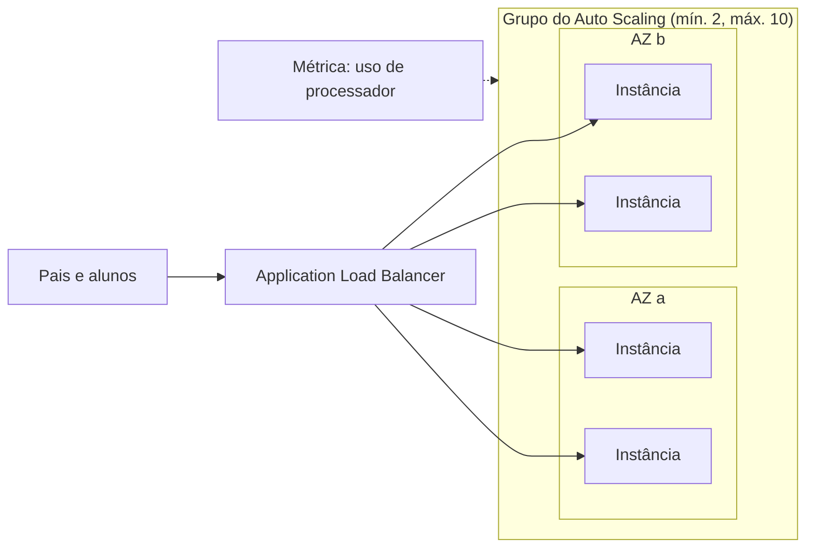

<!-- autoral -->

# 3.4 Escalabilidade e balanceamento de carga

> **Domínio 3 — Tecnologia e Serviços de Nuvem (34% da prova)** · Depende das aulas [1.3](../01-conceitos-de-nuvem/03-conceitos-de-arquitetura.md), [3.2](02-infraestrutura-global.md) e [3.3](03-ec2.md)

> 🔎 **Fichas para aprofundar:** [Amazon EC2 Auto Scaling](../../servicos/computacao/ec2-auto-scaling.md) · [Elastic Load Balancing](../../servicos/computacao/elastic-load-balancing.md)

⬅️ [3.3 Amazon EC2](03-ec2.md) · 🏠 [Índice do domínio](README.md) · 🏫 [O caso da escola](../00-guia-do-exame/caso-da-escola.md) · [3.5 Containers e serverless](05-containers-e-serverless.md) ➡️

---

Na primeira semana de janeiro, o sistema de matrícula recebe dez vezes mais acessos que no resto do ano. Uma única instância do EC2 não aguenta, e duas instâncias criadas à mão resolvem só em parte: alguém precisa lembrar de criá-las em dezembro e apagá-las em fevereiro, e os pais precisam de um único endereço para acessar o sistema, qualquer que seja a instância que os atenda.

São dois problemas diferentes. Um é de **capacidade**: quantas instâncias devem existir em cada momento. O outro é de **distribuição**: para qual instância vai cada acesso. Na AWS, o primeiro é resolvido pelo **Amazon EC2 Auto Scaling** e o segundo pelo **Elastic Load Balancing**. O guia do exame cobra que o auto scaling fornece elasticidade e para que servem os balanceadores de carga.

## Auto Scaling: quantas instâncias

Na [aula 1.3](../01-conceitos-de-nuvem/03-conceitos-de-arquitetura.md), você viu que elasticidade é aumentar e diminuir a capacidade acompanhando a demanda. O EC2 Auto Scaling é o serviço que faz isso com instâncias.

As instâncias ficam organizadas num **grupo do Auto Scaling** (*Auto Scaling group*), tratado como uma unidade. O grupo usa um **modelo de execução** (*launch template*) que diz como criar cada instância: a AMI, o tipo de instância e as demais configurações da [aula 3.3](03-ec2.md). E o grupo tem três números:

- **Capacidade mínima**: o grupo nunca fica abaixo dela.
- **Capacidade máxima**: o grupo nunca passa dela.
- **Capacidade desejada**: quantas instâncias o grupo deve ter agora; o serviço inicia ou encerra instâncias para chegar a ela.

Na escola, o grupo pode ter mínimo de 2, máximo de 10 e desejada de 2 no resto do ano. Além de escalar, o grupo cuida da saúde: o EC2 Auto Scaling verifica as instâncias e **substitui as que foram encerradas ou estão com defeito** para manter a capacidade desejada. Se o grupo usar várias Zonas de Disponibilidade, ele distribui as instâncias de forma equilibrada entre elas, o que protege contra a falha de um local.

Não há cobrança adicional pelo EC2 Auto Scaling; paga-se pelos recursos usados, como as instâncias. Na lista de serviços do exame, ele aparece como **AWS Auto Scaling**.

### Formas de escalar

O grupo pode mudar de tamanho de várias formas:

- **Manual**: alguém muda a capacidade desejada.
- **Programada** (*scheduled*): ações em horários definidos, para mudanças de carga previsíveis. Exemplo: aumentar a capacidade no dia 2 de janeiro e reduzir no dia 15.
- **Dinâmica**: reage à carga atual. Na política de **rastreamento de destino** (*target tracking*), você escolhe uma métrica e um valor, como 50% de uso médio de processador, e o serviço adiciona ou remove instâncias para manter esse valor, como um termostato. Na política **em etapas** (*step scaling*), os ajustes variam de acordo com o tamanho do desvio medido por um alarme.
- **Preditiva** (*predictive*): analisa o histórico para detectar padrões diários ou semanais e aumenta a capacidade antes da carga prevista.

O limite é que o Auto Scaling só adiciona instâncias até o máximo, e a aplicação precisa funcionar em várias cópias: se cada instância guardar a sessão do usuário no próprio disco, o usuário perde a sessão quando cai em outra instância. É a ideia de aplicação sem estado da [aula 1.3](../01-conceitos-de-nuvem/03-conceitos-de-arquitetura.md).

## Elastic Load Balancing: para onde vai cada acesso

O **Elastic Load Balancing** (ELB) distribui automaticamente o tráfego que chega entre vários destinos, como instâncias do EC2, containers e endereços IP, em uma ou mais Zonas de Disponibilidade. Para os pais, o balanceador de carga é o **único ponto de contato**: eles acessam um endereço, e o balanceador escolhe a instância.

O balanceador faz três coisas que importam na prova:

- **Verifica a saúde dos destinos** e envia tráfego só para os saudáveis. Se uma instância trava, os acessos vão para as outras.
- **Escala a própria capacidade** automaticamente quando o tráfego muda.
- **Pode cuidar da criptografia**: ele pode receber as conexões HTTPS, usando certificados do AWS Certificate Manager, e decifrar os pedidos, liberando as instâncias desse trabalho.

O ELB e o Auto Scaling trabalham juntos: quando o Auto Scaling cria uma instância, ela é registrada no balanceador automaticamente; quando encerra, é retirada. O resultado é alta disponibilidade e elasticidade ao mesmo tempo. O limite é que o balanceador distribui a capacidade que existe; sozinho, ele não cria instâncias.

### Tipos de balanceador

| Tipo | Camada | Quando usar |
|---|---|---|
| **Application Load Balancer** (ALB) | Aplicação (camada 7), HTTP e HTTPS | Rotear pelo conteúdo do pedido: pelo caminho da URL (`/matricula` para um serviço, `/boletim` para outro) ou pelo nome do site |
| **Network Load Balancer** (NLB) | Transporte (camada 4), TCP, UDP e TLS | Milhões de pedidos por segundo e endereço IP fixo em cada Zona de Disponibilidade |
| **Gateway Load Balancer** (GWLB) | Rede (camada 3) | Distribuir o tráfego para appliances virtuais, como firewalls e sistemas de detecção e prevenção de intrusão |
| **Classic Load Balancer** | — | Geração anterior; a AWS recomenda migrar para os atuais |

As camadas vêm do modelo OSI, que divide a comunicação em rede em sete níveis, do cabo (camada 1) até a aplicação (camada 7). Quanto mais alta a camada, mais o balanceador "entende" do pedido: o ALB lê o pedido HTTP e pode decidir pelo caminho da URL; o NLB olha só conexões, endereços e portas, como na [aula 0.2](../fundamentos/02-rede.md), e por isso é mais simples e aguenta volumes enormes.

*Figura 3.4 — O balanceador distribui os acessos entre instâncias saudáveis em duas AZs; o Auto Scaling ajusta quantas instâncias existem a partir da métrica.*

## Na prova

- **"Aumentar e diminuir o número de instâncias acompanhando a demanda" = Auto Scaling (elasticidade).**
- **"Substituir automaticamente instâncias com defeito" = Auto Scaling, com verificações de saúde.**
- **"Pico em data conhecida" = escala programada; "manter a CPU média em 50%" = rastreamento de destino; "prever a demanda pelo histórico" = escala preditiva.**
- **"Distribuir o tráfego entre instâncias em várias AZs, só para as saudáveis" = Elastic Load Balancing.**
- **"Rotear por caminho da URL ou nome do site" = ALB; "milhões de pedidos por segundo, IP fixo, TCP/UDP" = NLB; "appliances de firewall de terceiros" = GWLB.**
- **Auto Scaling não tem cobrança adicional**; paga-se pelas instâncias.
- **Balanceador não cria capacidade; Auto Scaling não distribui tráfego.** Juntos dão elasticidade e alta disponibilidade.

## Caso resolvido

**Situação.** Para janeiro, a escola quer que o sistema de matrícula: aguente o pico sem ninguém criar instâncias à mão; continue funcionando se uma Zona de Disponibilidade falhar; tenha um único endereço para os pais; e envie os pedidos de `/boletim` para um serviço separado do de `/matricula`. O que montar?

**Raciocínio.** Um grupo do Auto Scaling em duas AZs, com mínimo de duas instâncias, resolve a capacidade e a falha de uma AZ: o grupo distribui as instâncias entre as zonas e substitui as que falharem. Uma escala programada aumenta a capacidade antes do início das matrículas, e uma política de rastreamento de destino cuida das variações durante o dia. Na frente, um Application Load Balancer dá o endereço único, envia tráfego só para instâncias saudáveis e roteia `/boletim` e `/matricula` para serviços diferentes pelo caminho da URL.

**Por que as alternativas tentadoras falham.** Um Network Load Balancer não lê o caminho da URL, então não separa `/boletim` de `/matricula`. Só um balanceador, sem Auto Scaling, distribui o tráfego entre as instâncias que existem, mas não cria novas no pico. E um grupo do Auto Scaling numa única AZ escala, mas cai junto com aquela zona.

## Revisão

Tente responder antes de abrir cada resposta.

### O que o Amazon EC2 Auto Scaling faz?

Ver resposta

Ajusta o número de instâncias de um grupo à demanda, entre a capacidade mínima e a máxima, e substitui instâncias com defeito para manter a capacidade desejada.

Comentário: é a forma de obter elasticidade com instâncias; não há cobrança adicional pelo serviço.

### Qual é a diferença entre escala programada, dinâmica e preditiva?

Ver resposta

A programada muda a capacidade em horários definidos; a dinâmica reage à carga atual, como manter 50% de CPU; a preditiva usa o histórico para aumentar a capacidade antes da carga prevista.

Comentário: picos em datas conhecidas pedem escala programada.

### Para que serve um balanceador de carga?

Ver resposta

Para distribuir o tráfego entre vários destinos, em uma ou mais AZs, enviando-o só para os que estão saudáveis, com um único ponto de contato para os clientes.

Comentário: ele também pode cuidar da criptografia HTTPS com certificados do ACM.

### Quando usar um Application Load Balancer e quando usar um Network Load Balancer?

Ver resposta

O ALB, que trabalha na camada 7, serve para rotear pedidos HTTP pelo caminho da URL ou pelo nome do site; o NLB, na camada 4, serve para milhões de pedidos por segundo e IP fixo por AZ.

Comentário: o Gateway Load Balancer, na camada 3, distribui tráfego para appliances como firewalls.

### Por que Auto Scaling e balanceador de carga costumam ser usados juntos?

Ver resposta

Porque o Auto Scaling cria e remove instâncias, e o balanceador distribui o tráfego entre elas; as instâncias criadas são registradas no balanceador automaticamente.

Comentário: juntos dão elasticidade e alta disponibilidade.

## Resumo

- Capacidade (quantas instâncias) é trabalho do Auto Scaling; distribuição (para onde vai cada acesso), do Elastic Load Balancing.
- Grupo do Auto Scaling: modelo de execução e capacidades mínima, desejada e máxima; substitui instâncias com defeito e equilibra entre AZs.
- Formas de escalar: manual, programada, dinâmica (rastreamento de destino, etapas) e preditiva.
- ELB: único ponto de contato, verificação de saúde, escala própria e criptografia HTTPS.
- ALB (camada 7, rota por caminho ou nome), NLB (camada 4, alto volume, IP fixo), GWLB (appliances de rede).

## Fontes oficiais

Verificadas em 06/10/2026.

- [Content Domain 3 do guia do exame CLF-C02](https://docs.aws.amazon.com/aws-certification/latest/cloud-practitioner-02/cloud-practitioner-02-domain3.html): tarefa 3.3 (auto scaling e elasticidade; finalidade dos balanceadores de carga).
- [What is Amazon EC2 Auto Scaling?](https://docs.aws.amazon.com/autoscaling/ec2/userguide/what-is-amazon-ec2-auto-scaling.html): grupos, capacidades, verificações de saúde, equilíbrio entre AZs, integração com o ELB e ausência de cobrança adicional.
- [Scaling](https://docs.aws.amazon.com/autoscaling/ec2/userguide/scale-your-group.html), [Scheduled scaling](https://docs.aws.amazon.com/autoscaling/ec2/userguide/ec2-auto-scaling-scheduled-scaling.html), [Dynamic scaling](https://docs.aws.amazon.com/autoscaling/ec2/userguide/as-scale-based-on-demand.html) e [Predictive scaling](https://docs.aws.amazon.com/autoscaling/ec2/userguide/ec2-auto-scaling-predictive-scaling.html): formas de escalar.
- [What is Elastic Load Balancing?](https://docs.aws.amazon.com/elasticloadbalancing/latest/userguide/what-is-load-balancing.html): distribuição entre destinos e AZs, verificação de saúde, escala própria, criptografia com ACM, Classic como geração anterior.
- [Application Load Balancer](https://docs.aws.amazon.com/elasticloadbalancing/latest/application/introduction.html), [Network Load Balancer](https://docs.aws.amazon.com/elasticloadbalancing/latest/network/introduction.html) e [Gateway Load Balancer](https://docs.aws.amazon.com/elasticloadbalancing/latest/gateway/introduction.html): camadas e usos de cada tipo.
- [In-Scope AWS Services](https://docs.aws.amazon.com/aws-certification/latest/cloud-practitioner-02/clf-02-in-scope-services.html): AWS Auto Scaling na lista.

<!-- notas:inicio -->
## 📝 Minhas anotações

<!-- Escreva aqui suas observações, dúvidas e as questões que você errou sobre o tema. -->
<!-- notas:fim -->

---

⬅️ [3.3 Amazon EC2](03-ec2.md) · 🏠 [Índice do domínio](README.md) · [3.5 Containers e serverless](05-containers-e-serverless.md) ➡️
