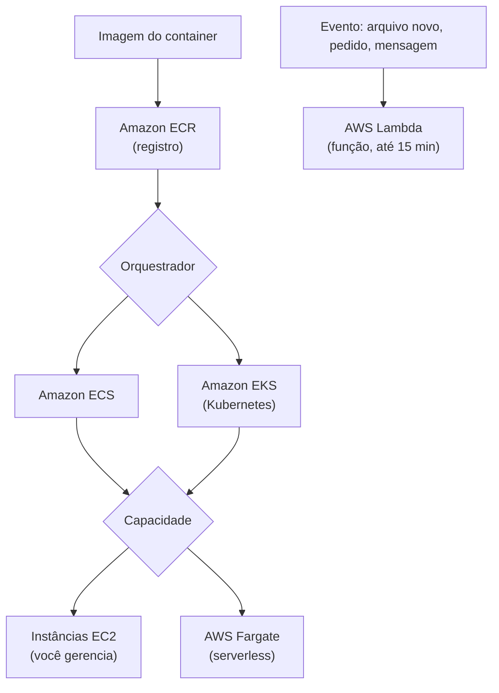

<!-- autoral -->

# 3.5 Containers e serverless

> **Domínio 3 — Tecnologia e Serviços de Nuvem (34% da prova)** · Depende das aulas [0.1](../fundamentos/01-servidor-e-virtualizacao.md), [1.1](../01-conceitos-de-nuvem/01-o-que-e-computacao-em-nuvem.md) e [3.3](03-ec2.md)

> 🔎 **Fichas para aprofundar:** [Amazon ECS](../../servicos/computacao/ecs.md) · [Amazon EKS](../../servicos/computacao/eks.md) · [AWS Fargate](../../servicos/computacao/fargate.md) · [Amazon ECR](../../servicos/computacao/ecr.md) · [AWS Lambda](../../servicos/computacao/lambda.md)

⬅️ [3.4 Escalabilidade e balanceamento de carga](04-escalabilidade-e-balanceamento.md) · 🏠 [Índice do domínio](README.md) · 🏫 [O caso da escola](../00-guia-do-exame/caso-da-escola.md) · [3.6 Outros serviços de computação](06-outros-servicos-de-computacao.md) ➡️

---

A empresa que mantém o sistema de matrícula quer modernizá-lo. Hoje, cada atualização exige instalar o programa à mão nas instâncias do EC2, e muitas vezes "funciona no computador do desenvolvedor, mas não no servidor". Além disso, há tarefas pequenas que só acontecem de vez em quando, como gerar uma miniatura sempre que um pai envia a foto do aluno, e que hoje deixam uma instância ligada o dia todo esperando.

Os dois problemas têm respostas diferentes. Para empacotar a aplicação e rodá-la igual em qualquer lugar, existem os **containers**. Para rodar um pedaço de código só quando algo acontece, sem nenhum servidor para cuidar, existe a computação **serverless**. O guia do exame cobra quando usar as opções de containers (Amazon ECS e Amazon EKS) e as opções serverless (AWS Fargate e AWS Lambda).

## O que é um container

**Conteinerização** é empacotar o código de uma aplicação junto com todos os arquivos e bibliotecas de que ela precisa para rodar em qualquer infraestrutura. O pacote resultante é o **container**. Ele resolve o "funciona na minha máquina": o mesmo pacote roda igual no computador do desenvolvedor, no teste e na produção.

Na [aula 0.1](../fundamentos/01-servidor-e-virtualizacao.md), você viu que uma máquina virtual copia um computador inteiro, com seu próprio sistema operacional. O container é mais leve: ele não carrega um sistema operacional completo, então inicia rápido, e vários containers cabem numa mesma máquina.

Três peças aparecem sempre:

- A **imagem** é o pacote pronto, a partir do qual os containers são criados.
- O **registro** guarda as imagens. Na AWS, é o **Amazon Elastic Container Registry** (Amazon ECR), um registro gerenciado de imagens de container, com repositórios privados cujo acesso é controlado pelo IAM.
- O **orquestrador** decide onde e quantos containers rodam, reinicia os que falham e os distribui entre máquinas.

O limite é que guardar a imagem no ECR não põe nada no ar: alguém precisa executá-la.

## Orquestradores: ECS e EKS

A AWS oferece dois orquestradores:

- O **Amazon Elastic Container Service** (Amazon ECS) é o serviço de orquestração de containers totalmente gerenciado da própria AWS, com configurações e boas práticas da AWS embutidas e integração com o ECR e com ferramentas como o Docker.
- O **Amazon Elastic Kubernetes Service** (Amazon EKS) é um serviço gerenciado de **Kubernetes**, um orquestrador de containers de código aberto. A AWS gerencia a parte central do Kubernetes (o plano de controle). Faz sentido quando a empresa já usa Kubernetes ou quer as mesmas ferramentas em vários ambientes; o EKS também roda em datacenters do cliente.

A regra prática da prova: **"já usa Kubernetes" aponta para EKS**; orquestração de containers sem esse requisito aponta para ECS.

## Onde os containers rodam: EC2 ou Fargate

O orquestrador decide o que rodar; falta decidir **em que capacidade**. No ECS, há duas formas principais na nuvem:

- Em **instâncias do EC2**: você escolhe o tipo e o número de instâncias e gerencia essa capacidade, como na [aula 3.3](03-ec2.md).
- No **AWS Fargate**: um mecanismo de computação serverless para containers. Você empacota a aplicação, define quanto de processador e memória ela precisa, configura rede e permissões, e o Fargate roda o container. Não há servidores para escolher, escalar ou atualizar.

O Fargate funciona com o ECS e com o EKS. Cobra-se pela quantidade de vCPU, memória e armazenamento que os containers consomem, sem custo antecipado. Na escola, rodar o sistema de matrícula no ECS com Fargate tiraria da equipe o trabalho de manter instâncias.

## AWS Lambda: código que roda quando algo acontece

Na [aula 1.1](../01-conceitos-de-nuvem/01-o-que-e-computacao-em-nuvem.md), o AWS Lambda apareceu como o exemplo de serverless: ele roda código sem que você provisione ou gerencie servidores, e a AWS cuida da manutenção, da capacidade, do escalonamento e dos patches.

Uma **função Lambda** roda em resposta a **eventos** ou chamadas de API. Você escreve o código e o liga a um gatilho, como um arquivo novo no Amazon S3, um pedido no Amazon API Gateway, uma mensagem numa fila do Amazon SQS ou uma regra do Amazon EventBridge, entre mais de 200 serviços. Cada execução é independente, e o Lambda escala sozinho para acompanhar a quantidade de eventos.

É o encaixe perfeito para as miniaturas: quando a foto chega ao armazenamento, uma função gera a miniatura e termina. Não há instância ligada esperando.

A cobrança é pelo **número de pedidos** e pela **duração** da execução, medida em GB-segundo (a memória escolhida vezes o tempo); o processador acompanha a memória configurada. O nível gratuito inclui 1 milhão de pedidos e 400.000 GB-segundo por mês. Quando a função não roda, não há cobrança de computação.

O limite que a prova cobra: uma função Lambda roda por **até 15 minutos** em cada execução. O Lambda foi pensado para tarefas curtas que não guardam estado entre uma execução e outra. Uma conversão de vídeo de duas horas não é tarefa para uma função Lambda comum; ela cabe melhor em containers com Fargate, no AWS Batch ([aula 3.6](06-outros-servicos-de-computacao.md)) ou no EC2. A AWS lançou opções mais novas no Lambda com durações maiores, mas o padrão de 15 minutos é o que define a função Lambda tradicional.

## Como escolher

| Necessidade | Opção |
|---|---|
| Controle total do sistema operacional | EC2 ([aula 3.3](03-ec2.md)) |
| Containers orquestrados pela AWS | ECS |
| Containers com Kubernetes | EKS |
| Containers sem gerenciar servidores | Fargate (com ECS ou EKS) |
| Código curto disparado por eventos, sem servidores | Lambda |
| Guardar imagens de container | ECR |

*Figura 3.5 — Containers passam por registro, orquestrador e capacidade; o Lambda roda funções disparadas por eventos.*

## Na prova

- **"Empacotar a aplicação para rodar igual em qualquer ambiente" = containers.**
- **"Guardar imagens de container" = ECR.**
- **"Orquestrar containers" = ECS; "já usa Kubernetes" = EKS.**
- **"Containers sem gerenciar servidores" = Fargate**, que funciona com ECS e EKS.
- **"Rodar código quando um arquivo chega ou um evento acontece, sem servidores" = Lambda.**
- **Lambda cobra por pedido e por duração; função roda até 15 minutos.** Tarefa de horas não é Lambda.
- **Serverless não quer dizer sem servidores**: eles existem, mas a AWS os gerencia.

## Caso resolvido

**Situação.** A empresa do sistema de matrícula quer três coisas: rodar o sistema principal, que já está empacotado em containers, sem cuidar de instâncias; gerar uma miniatura cada vez que um pai envia uma foto; e converter, uma vez por mês, os vídeos das reuniões de pais, que levam cerca de duas horas cada. A equipe não usa Kubernetes. O que escolher para cada tarefa?

**Raciocínio.** O sistema principal em containers, sem cuidar de instâncias e sem Kubernetes, vai para o ECS com Fargate, com as imagens guardadas no ECR. A miniatura é uma tarefa curta disparada por um evento (a foto chegando ao armazenamento): uma função Lambda, cobrada só quando roda. A conversão de vídeos de duas horas passa do limite de 15 minutos de uma função Lambda; ela pode rodar como uma tarefa de container no Fargate.

**Por que as alternativas tentadoras falham.** EKS funcionaria, mas acrescenta o Kubernetes sem que a equipe precise dele. Usar Lambda para os vídeos esbarra no limite de 15 minutos por execução. E deixar uma instância do EC2 ligada esperando as fotos paga por horas paradas, o oposto do que o Lambda oferece.

## Revisão

Tente responder antes de abrir cada resposta.

### O que é um container e que problema ele resolve?

Ver resposta

É um pacote com o código da aplicação e todos os arquivos e bibliotecas de que ela precisa; resolve o problema de a aplicação funcionar num ambiente e não em outro.

Comentário: é mais leve que uma máquina virtual porque não carrega um sistema operacional completo.

### Qual é a diferença entre ECS e EKS?

Ver resposta

Os dois orquestram containers; o ECS é o orquestrador da própria AWS, e o EKS é Kubernetes gerenciado.

Comentário: "já usa Kubernetes" aponta para EKS.

### O que é o AWS Fargate?

Ver resposta

É um mecanismo de computação serverless para containers, usado com ECS ou EKS: você define CPU e memória, e não gerencia servidores.

Comentário: a alternativa é rodar os containers em instâncias do EC2, cuja capacidade você gerencia.

### Como o AWS Lambda é cobrado?

Ver resposta

Pelo número de pedidos e pela duração das execuções em GB-segundo; quando a função não roda, não há cobrança de computação.

Comentário: o nível gratuito inclui 1 milhão de pedidos e 400.000 GB-segundo por mês.

### Uma tarefa leva duas horas para terminar. Ela serve para uma função Lambda?

Ver resposta

Não, porque uma função Lambda roda por até 15 minutos em cada execução; a tarefa cabe melhor em containers com Fargate, no AWS Batch ou no EC2.

Comentário: o Lambda foi pensado para tarefas curtas disparadas por eventos.

## Resumo

- Container empacota a aplicação com suas dependências; o ECR guarda as imagens.
- ECS orquestra containers à moda da AWS; EKS é Kubernetes gerenciado.
- A capacidade pode ser EC2 (você gerencia) ou Fargate (serverless).
- Lambda roda funções disparadas por eventos, cobra por pedido e duração e tem limite de 15 minutos por execução.
- Serverless: os servidores existem, mas a AWS cuida deles.

## Fontes oficiais

Verificadas em 06/10/2026.

- [Content Domain 3 do guia do exame CLF-C02](https://docs.aws.amazon.com/aws-certification/latest/cloud-practitioner-02/cloud-practitioner-02-domain3.html): tarefa 3.3 (opções de containers e serverless).
- [What is containerization? (página da AWS)](https://aws.amazon.com/what-is/containerization/): definição de conteinerização e comparação com máquinas virtuais.
- [What is Amazon ECR?](https://docs.aws.amazon.com/AmazonECR/latest/userguide/what-is-ecr.html): registro gerenciado, repositórios privados com permissões do IAM.
- [What is Amazon ECS?](https://docs.aws.amazon.com/AmazonECS/latest/developerguide/Welcome.html): orquestração gerenciada e opções de capacidade (EC2, Fargate).
- [What is Amazon EKS?](https://docs.aws.amazon.com/eks/latest/userguide/what-is-eks.html): Kubernetes gerenciado, na nuvem e em datacenters do cliente.
- [AWS Fargate for Amazon ECS](https://docs.aws.amazon.com/AmazonECS/latest/developerguide/AWS_Fargate.html) e [AWS Fargate pricing](https://aws.amazon.com/fargate/pricing/): containers sem gerenciar servidores; cobrança por vCPU, memória e armazenamento.
- [What is AWS Lambda?](https://docs.aws.amazon.com/lambda/latest/dg/welcome.html): serverless, funções disparadas por eventos de mais de 200 serviços.
- [Lambda quotas](https://docs.aws.amazon.com/lambda/latest/dg/gettingstarted-limits.html): até 15 minutos por execução e tarefas de curta duração.
- [AWS Lambda pricing](https://aws.amazon.com/lambda/pricing/): cobrança por pedidos e GB-segundo; nível gratuito mensal.

<!-- notas:inicio -->
## 📝 Minhas anotações

<!-- Escreva aqui suas observações, dúvidas e as questões que você errou sobre o tema. -->
<!-- notas:fim -->

---

⬅️ [3.4 Escalabilidade e balanceamento de carga](04-escalabilidade-e-balanceamento.md) · 🏠 [Índice do domínio](README.md) · [3.6 Outros serviços de computação](06-outros-servicos-de-computacao.md) ➡️
