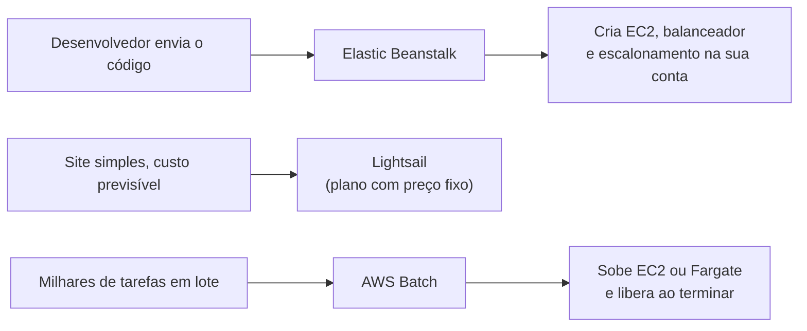

<!-- autoral -->

# 3.6 Outros serviços de computação

> **Domínio 3 — Tecnologia e Serviços de Nuvem (34% da prova)** · Depende das aulas [1.1](../01-conceitos-de-nuvem/01-o-que-e-computacao-em-nuvem.md), [3.3](03-ec2.md), [3.4](04-escalabilidade-e-balanceamento.md) e [3.5](05-containers-e-serverless.md)

> 🔎 **Fichas para aprofundar:** [AWS Elastic Beanstalk](../../servicos/computacao/elastic-beanstalk.md) · [Amazon Lightsail](../../servicos/computacao/lightsail.md) · [AWS Batch](../../servicos/computacao/batch.md) · [AWS Outposts, Local Zones e Wavelength](../../servicos/computacao/outposts-local-zones-wavelength.md)

⬅️ [3.5 Containers e serverless](05-containers-e-serverless.md) · 🏠 [Índice do domínio](README.md) · [3.7 Bancos de dados](07-bancos-de-dados.md) ➡️

---

Nas aulas anteriores, a rede de escolas montou o sistema de matrícula peça por peça: instâncias do EC2, um Auto Scaling group, um balanceador de carga, containers e funções Lambda. Funciona, mas exige conhecer cada peça. Agora surgem três pedidos diferentes. Um desenvolvedor quer só enviar o código de um portal novo e vê-lo no ar. A unidade de Lisboa quer um site simples para divulgar eventos, com um custo mensal fácil de prever. E a secretaria quer reprocessar, uma vez por semestre, milhares de boletins em PDF.

Cada pedido tem um serviço feito para ele: o **AWS Elastic Beanstalk**, o **Amazon Lightsail** e o **AWS Batch**. Todos estão na lista de serviços do exame, na categoria de computação.

## AWS Elastic Beanstalk: envie o código, ele monta o ambiente

Na [aula 1.1](../01-conceitos-de-nuvem/01-o-que-e-computacao-em-nuvem.md), você viu a plataforma como serviço (PaaS): o provedor cuida da infraestrutura, e o cliente cuida da aplicação. O Elastic Beanstalk traz essa ideia para dentro da AWS.

Você cria uma aplicação, envia o pacote com o código, e o Elastic Beanstalk cria e configura os recursos para rodá-lo: provisiona instâncias do EC2 (ou um cluster do Amazon EKS), configura o balanceamento de carga, monitora a saúde do ambiente e o escala com a demanda. São as peças das [aulas 3.3](03-ec2.md) e [3.4](04-escalabilidade-e-balanceamento.md), montadas para você.

Ele aceita aplicações em Go, Java, .NET, Node.js, PHP, Python e Ruby, além de containers Docker. Há dois modos: o **Standard**, que roda a aplicação direto em instâncias do EC2, e o **Cluster**, que roda a aplicação no Amazon EKS.

Não há cobrança adicional pelo Elastic Beanstalk: você paga só os recursos da AWS que a aplicação consome, como as instâncias e o balanceador. Os recursos ficam na sua conta, então você continua podendo vê-los e ajustá-los.

O limite é que o Elastic Beanstalk organiza recursos que continuam existindo e sendo cobrados. Ele reduz o trabalho de montar o ambiente, mas não é serverless.

## Amazon Lightsail: o jeito mais simples de começar

O Lightsail é, nas palavras da AWS, o jeito mais fácil de começar na AWS para quem precisa criar sites ou aplicações web. Ele reúne num só lugar o necessário para pôr um projeto no ar: instâncias (servidores privados virtuais), containers, bancos de dados gerenciados, distribuição de conteúdo, balanceadores de carga, armazenamento e endereços IP estáticos.

O ponto central é o **preço baixo e previsível**. As instâncias vêm em **planos** que juntam processador, memória, armazenamento e uma franquia de transferência de dados por um valor fixo por hora, com um teto mensal. Ao criar a instância, você pode escolher uma imagem pronta, como WordPress ou LAMP, e ter o site no ar em minutos.

O Lightsail é voltado a desenvolvedores individuais, projetos pessoais e quem está aprendendo. Para o site de eventos de Lisboa, é a resposta natural. O limite é que ele troca opções por simplicidade: quando o projeto cresce e precisa de controle fino, os serviços completos (EC2, ELB, RDS) oferecem mais.

## AWS Batch: milhares de tarefas em lote

**Processamento em lote** é rodar um grande volume de tarefas que não precisam de alguém interagindo, como converter arquivos, gerar relatórios ou fazer cálculos científicos. Montar e manter a infraestrutura para isso dá trabalho: alguém precisa ligar máquinas, distribuir as tarefas e desligar tudo no fim.

O AWS Batch é um serviço totalmente gerenciado para cargas em lote de qualquer escala. Você envia as tarefas, e ele provisiona automaticamente a capacidade de computação e distribui o trabalho de acordo com a quantidade e o tamanho das tarefas. Por baixo, ele usa o Amazon ECS ou o Amazon EKS ([aula 3.5](05-containers-e-serverless.md)) e escala instâncias do EC2 ou o AWS Fargate.

Para os boletins da secretaria, o Batch recebe as milhares de tarefas, sobe a capacidade necessária e a libera quando acaba. Também é uma saída para tarefas longas demais para uma função Lambda.

## AWS Outposts: a AWS no local do cliente

O AWS Outposts, visto na [aula 3.2](02-infraestrutura-global.md), também é um serviço de computação da lista do exame. Ele instala capacidade da AWS no datacenter do cliente, operada pela AWS, para baixa latência ou processamento local de dados.

## Como escolher

| Pedido | Serviço |
|---|---|
| "Só quero enviar o código e ver a aplicação no ar" | Elastic Beanstalk |
| "Site simples com preço mensal previsível" | Lightsail |
| "Milhares de tarefas em lote, sem montar infraestrutura" | Batch |
| "Serviços da AWS dentro do meu datacenter" | Outposts |
| "Controle total do servidor" | EC2 ([aula 3.3](03-ec2.md)) |
| "Código curto disparado por eventos" | Lambda ([aula 3.5](05-containers-e-serverless.md)) |

*Figura 3.6 — Três pedidos, três serviços: Elastic Beanstalk monta o ambiente, Lightsail empacota o projeto num plano, Batch processa lotes.*

## Na prova

- **"Desenvolvedor quer implantar a aplicação web sem cuidar da infraestrutura" = Elastic Beanstalk.**
- **Elastic Beanstalk não cobra nada a mais**: você paga os recursos que ele cria.
- **"Jeito mais simples de começar", "preço mensal previsível", "site WordPress" = Lightsail.**
- **"Processamento em lote", "milhares de jobs" = Batch.**
- **"AWS no datacenter do cliente" = Outposts.**

## Caso resolvido

**Situação.** Uma pequena escola de idiomas parceira da rede quer um blog em WordPress. A dona tem pouca experiência com nuvem e quer saber, antes de começar, quanto vai pagar por mês. Uma colega sugere montar uma instância do EC2 com um balanceador e um Auto Scaling group; outra sugere o Elastic Beanstalk. O que usar?

**Raciocínio.** O pedido junta três sinais: projeto simples, pouca experiência e custo previsível. O Lightsail oferece imagens prontas de WordPress e planos com preço fixo que reúnem processador, memória, armazenamento e transferência de dados. É a opção feita para esse perfil.

**Por que as alternativas tentadoras falham.** EC2 com balanceador e Auto Scaling funciona, mas exige montar e entender várias peças e tem cobrança por uso de cada uma, mais difícil de prever. O Elastic Beanstalk monta o ambiente para quem traz o próprio código; aqui não há código próprio, só um WordPress pronto, e os recursos criados são cobrados um a um.

## Revisão

Tente responder antes de abrir cada resposta.

### O que o AWS Elastic Beanstalk faz com o código que você envia?

Ver resposta

Cria e configura os recursos para rodá-lo: instâncias do EC2 (ou um cluster do EKS), balanceamento de carga, monitoramento de saúde e escalonamento.

Comentário: é a plataforma como serviço dentro da AWS; você cuida da aplicação.

### Quanto custa o AWS Elastic Beanstalk?

Ver resposta

Não há cobrança adicional pelo serviço; você paga os recursos da AWS que a aplicação consome.

Comentário: os recursos ficam na sua conta e continuam sendo cobrados normalmente.

### Para quem o Amazon Lightsail foi pensado?

Ver resposta

Para quem quer começar de forma simples, como desenvolvedores individuais, projetos pessoais e iniciantes, com planos de preço baixo e previsível.

Comentário: os planos juntam processador, memória, armazenamento e franquia de transferência de dados.

### Que tipo de trabalho o AWS Batch executa?

Ver resposta

Cargas de processamento em lote de qualquer escala, provisionando automaticamente a capacidade de computação para as tarefas enviadas.

Comentário: por baixo, ele usa ECS ou EKS e escala instâncias do EC2 ou o Fargate.

### Qual é a diferença entre o Elastic Beanstalk e o Lambda?

Ver resposta

O Elastic Beanstalk cria instâncias e outros recursos que ficam ligados e são cobrados; o Lambda é serverless e cobra só quando a função roda.

Comentário: o Elastic Beanstalk reduz o trabalho de montar o ambiente, mas o ambiente continua existindo.

## Resumo

- Elastic Beanstalk: você envia o código, ele monta EC2 (ou EKS), balanceador, monitoramento e escalonamento, sem cobrança adicional.
- Lightsail: o jeito mais simples de começar, com planos de preço previsível e imagens prontas.
- Batch: processamento em lote gerenciado, que sobe e libera a capacidade sozinho.
- Outposts: capacidade da AWS no local do cliente.

## Fontes oficiais

Verificadas em 06/10/2026.

- [In-Scope AWS Services](https://docs.aws.amazon.com/aws-certification/latest/cloud-practitioner-02/clf-02-in-scope-services.html): Batch, Elastic Beanstalk, Lightsail e Outposts na categoria de computação.
- [What is AWS Elastic Beanstalk?](https://docs.aws.amazon.com/elasticbeanstalk/latest/dg/Welcome.html): o que ele provisiona, modos Standard e Cluster, linguagens aceitas e ausência de cobrança adicional.
- [What is Amazon Lightsail?](https://docs.aws.amazon.com/lightsail/latest/userguide/what-is-amazon-lightsail.html): recursos incluídos, preço baixo e previsível, público e imagens prontas.
- [Lightsail instance bundles](https://docs.aws.amazon.com/lightsail/latest/userguide/amazon-lightsail-bundles.html): planos com vCPU, memória, armazenamento e franquia de transferência, com teto mensal.
- [What is AWS Batch?](https://docs.aws.amazon.com/batch/latest/userguide/what-is-batch.html): processamento em lote gerenciado sobre ECS ou EKS, com EC2 ou Fargate.
- [What is AWS Outposts?](https://docs.aws.amazon.com/outposts/latest/userguide/what-is-outposts.html): infraestrutura da AWS no local do cliente.

<!-- notas:inicio -->
## 📝 Minhas anotações

<!-- Escreva aqui suas observações, dúvidas e as questões que você errou sobre o tema. -->
<!-- notas:fim -->

---

⬅️ [3.5 Containers e serverless](05-containers-e-serverless.md) · 🏠 [Índice do domínio](README.md) · [3.7 Bancos de dados](07-bancos-de-dados.md) ➡️
