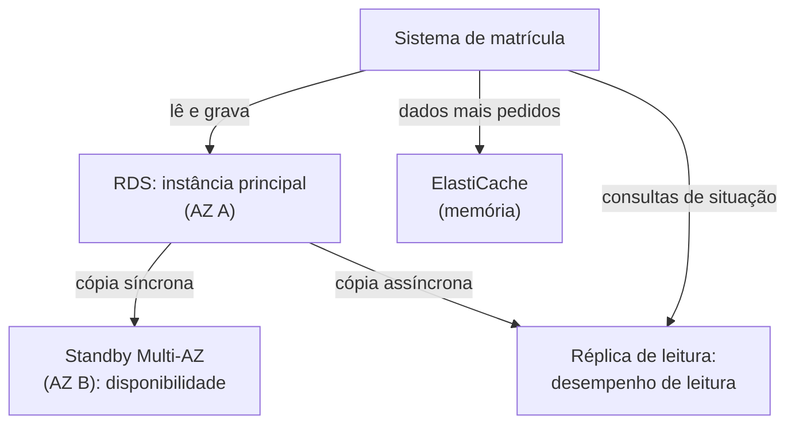

<!-- autoral -->

# 3.7 Bancos de dados

> **Domínio 3 — Tecnologia e Serviços de Nuvem (34% da prova)** · Depende das aulas [0.3](../fundamentos/03-dados.md), [1.3](../01-conceitos-de-nuvem/03-conceitos-de-arquitetura.md) e [3.3](03-ec2.md)

> 🔎 **Fichas para aprofundar:** [Amazon RDS](../../servicos/banco-de-dados/rds.md) · [Amazon Aurora](../../servicos/banco-de-dados/aurora.md) · [Amazon DynamoDB](../../servicos/banco-de-dados/dynamodb.md) · [Amazon ElastiCache](../../servicos/banco-de-dados/elasticache.md) · [Amazon DocumentDB](../../servicos/banco-de-dados/documentdb.md) · [Amazon Neptune](../../servicos/banco-de-dados/neptune.md) · [Amazon Redshift](../../servicos/banco-de-dados/redshift.md) · [AWS DMS e AWS SCT](../../servicos/migracao/dms-e-sct.md)

⬅️ [3.6 Outros serviços de computação](06-outros-servicos-de-computacao.md) · 🏠 [Índice do domínio](README.md) · 🏫 [O caso da escola](../00-guia-do-exame/caso-da-escola.md) · [3.8 Amazon S3 — armazenamento de objetos](08-s3.md) ➡️

---

O banco de dados do sistema de matrícula roda hoje numa instância do EC2. Quem instalou foi um técnico que já saiu da empresa, e ninguém sabe ao certo se os backups estão funcionando. Em janeiro, no pico, as consultas de "situação da matrícula" deixam o banco lento. E o aplicativo novo da escola precisa guardar a sessão de milhões de acessos sem cruzar tabela nenhuma.

Na [aula 0.3](../fundamentos/03-dados.md), você viu a diferença entre banco relacional (tabelas que se relacionam, consultadas com SQL) e não relacional (NoSQL, como chave-valor e documento). Esta aula mostra os serviços da AWS para cada caso e responde a primeira pergunta que o guia do exame cobra: **banco no EC2 ou banco gerenciado?**

## Banco no EC2 ou banco gerenciado

Instalar o banco numa instância do EC2 funciona, e dá controle total. Mas o cliente fica responsável por quase tudo: instalar o sistema operacional e o software do banco, aplicar patches nos dois, fazer backups, garantir alta disponibilidade e escalar.

Num **banco gerenciado**, a AWS assume essas tarefas. A documentação do Amazon RDS compara os dois modelos:

| Tarefa | Banco no EC2 | Amazon RDS |
|---|---|---|
| Otimizar a aplicação e as consultas | Cliente | Cliente |
| Escalar | Cliente | AWS |
| Alta disponibilidade | Cliente | AWS |
| Backups do banco | Cliente | AWS |
| Instalar e aplicar patches no software do banco | Cliente | AWS |
| Instalar e aplicar patches no sistema operacional | Cliente | AWS |

A AWS recomenda o RDS como escolha padrão para a maioria dos bancos relacionais. O banco no EC2 faz sentido quando a empresa precisa de algo que o serviço gerenciado não oferece, como acesso ao sistema operacional. Para a escola, o banco gerenciado resolve o problema do backup que ninguém confere.

## Bancos relacionais: Amazon RDS e Amazon Aurora

O **Amazon RDS** (Relational Database Service) facilita criar, operar e escalar um banco relacional na nuvem. Ele oferece motores que as equipes já conhecem: IBM Db2, MariaDB, Microsoft SQL Server, MySQL, Oracle Database e PostgreSQL. O RDS cuida de backups, patches, detecção de falhas e recuperação. Os backups automáticos permitem restaurar o banco para qualquer momento dentro do período de retenção que você define, e você também pode criar cópias manuais (snapshots).

Dois recursos do RDS se confundem na prova, porque os dois criam uma segunda cópia do banco:

- **Multi-AZ** existe para **disponibilidade**. O RDS mantém uma cópia de espera (standby) em outra zona de disponibilidade, atualizada de forma **síncrona**. Se a instância principal ou a zona falhar, o RDS passa a usar a standby. Na forma mais comum, com uma só standby, ela não atende leituras: só espera.
- **Réplica de leitura** existe para **desempenho de leitura**. É uma cópia só de leitura, atualizada de forma **assíncrona**, para onde a aplicação manda consultas e alivia a instância principal. Pode ficar na mesma Região ou em outra.

As consultas de "situação da matrícula" em janeiro pedem réplicas de leitura. A proteção contra a queda de uma zona de disponibilidade pede Multi-AZ. Uma coisa não substitui a outra.

O **Amazon Aurora** é um motor de banco relacional da própria AWS, totalmente gerenciado, que fala a mesma língua do MySQL e do PostgreSQL: o código e as ferramentas usados com esses bancos funcionam com o Aurora. Ele tem um armazenamento próprio que cresce sozinho com a necessidade e guarda cópias dos dados em três zonas de disponibilidade. A AWS informa até 6 vezes a vazão do MySQL e do PostgreSQL padrão em hardware semelhante. O Aurora faz parte do serviço gerenciado Amazon RDS.

## Banco NoSQL: Amazon DynamoDB

O **Amazon DynamoDB** é um banco NoSQL serverless e totalmente gerenciado, que trabalha com os modelos chave-valor e documento e entrega desempenho de milissegundos de um dígito em qualquer escala. A própria AWS dá o exemplo de um carrinho de compras: o desempenho é o mesmo com 10 usuários ou 100 milhões.

Não há servidor para escolher. No modo **sob demanda**, você paga pelas leituras e gravações feitas, e a tabela escala sozinha, inclusive até zero quando não há tráfego. Com as **tabelas globais**, a mesma tabela é replicada em várias Regiões, com leitura e gravação local em cada uma.

O limite é o que a [aula 0.3](../fundamentos/03-dados.md) mostrou: para escalar assim, o DynamoDB deixa de fora recursos que não escalam bem, como as junções (JOIN) entre tabelas. Ele serve para as sessões do aplicativo da escola, não para os relatórios que cruzam alunos, turmas e notas.

## Banco em memória: Amazon ElastiCache

Buscar o mesmo dado no banco milhares de vezes por minuto desperdiça tempo e capacidade. Um **cache** guarda os dados mais pedidos na memória, que é muito mais rápida que o disco, e entrega a resposta sem consultar o banco.

O **Amazon ElastiCache** é um serviço gerenciado de armazenamento de dados em memória e cache, que funciona com os motores Valkey, Memcached e Redis OSS. Pode ser usado como cache serverless, sem escolher servidores, ou em clusters de nós. Na escola, ele guardaria as respostas da "situação da matrícula" mais consultadas e aliviaria o banco principal no pico.

## Bancos para formatos específicos

A AWS chama de bancos **feitos para um propósito** os que atendem um formato de dado específico. Três aparecem na prova:

- O **Amazon DocumentDB** é um banco de documentos gerenciado para aplicações feitas para o MongoDB: roda o mesmo código e os mesmos drivers usados com o MongoDB.
- O **Amazon Neptune** é um banco de **grafos**: guarda itens e as ligações entre eles, como "aluno estuda com aluno". Atende motores de recomendação, detecção de fraude e grafos de conhecimento.
- O **Amazon Redshift** é um **data warehouse** gerenciado, um banco feito para análise de grandes volumes de dados com SQL e ferramentas de relatório. Ele volta na [aula 3.11](11-analytics.md).

## Migrar bancos: AWS DMS e AWS SCT

O guia do exame também cobra as ferramentas de migração de banco:

- O **AWS Database Migration Service** (AWS DMS) migra dados de bancos relacionais, data warehouses, bancos NoSQL e outros para a AWS. Faz migrações de uma vez ou replica as alterações continuamente para manter origem e destino iguais, e mantém o banco de origem funcionando até o fim da migração, com o mínimo de tempo parado.
- O **AWS Schema Conversion Tool** (AWS SCT) converte o **esquema** (a estrutura das tabelas e o código do banco) de um motor para outro, por exemplo de Oracle para Aurora PostgreSQL. O DMS também oferece essa conversão como recurso próprio, o DMS Schema Conversion.

Na migração para o mesmo motor (MySQL para RDS MySQL), basta o DMS. Na troca de motor, primeiro se converte o esquema e depois os dados são migrados com o DMS. A migração como um todo volta na [aula 3.17](17-migracao-e-transferencia.md).

## Como escolher

| Necessidade | Serviço |
|---|---|
| Relacional, SQL, transações, sem cuidar do servidor | RDS |
| Relacional que funciona com MySQL ou PostgreSQL, feito pela AWS | Aurora |
| Chave-valor ou documento, escala enorme, serverless | DynamoDB |
| Cache em memória para aliviar o banco | ElastiCache |
| Documentos de aplicações feitas para o MongoDB | DocumentDB |
| Relações entre itens (grafos) | Neptune |
| Análise de grandes volumes (data warehouse) | Redshift |
| Migrar dados de banco | DMS (com SCT ao trocar de motor) |

*Figura 3.7 — Multi-AZ protege contra falhas; réplicas de leitura e cache aliviam as leituras.*

## Na prova

- **"Sem cuidar de patches, backups e sistema operacional do banco" = banco gerenciado (RDS)**; controle total do sistema operacional = banco no EC2.
- **Multi-AZ = disponibilidade (cópia síncrona em outra AZ); réplica de leitura = desempenho de leitura (cópia assíncrona).**
- **"Funciona com MySQL e PostgreSQL, mais desempenho" = Aurora.**
- **"NoSQL, chave-valor, serverless, milissegundos em qualquer escala" = DynamoDB.**
- **"Cache em memória" = ElastiCache.**
- **"MongoDB" = DocumentDB; "grafos, recomendações, fraude" = Neptune; "data warehouse" = Redshift.**
- **"Migrar banco" = DMS; "converter esquema entre motores" = SCT.**

## Caso resolvido

**Situação.** A rede de escolas vai tirar o banco do sistema de matrícula do EC2. Ele usa MySQL. A direção quer que o sistema continue no ar se uma zona de disponibilidade falhar e que as consultas do pico de janeiro não deixem o banco lento. A migração deve acontecer sem parar as matrículas. O que usar?

**Raciocínio.** Banco relacional MySQL, sem querer cuidar de servidor: RDS para MySQL (ou Aurora, que funciona com MySQL). Continuar no ar se uma zona falhar pede Multi-AZ. Aliviar as consultas do pico pede réplicas de leitura, e um cache com ElastiCache pode ajudar com as respostas mais repetidas. Para migrar sem parar, o DMS copia os dados e replica as alterações enquanto o banco antigo continua em uso; como o motor não muda, não é preciso converter o esquema com o SCT.

**Por que as alternativas tentadoras falham.** Réplica de leitura não é a proteção principal contra a falha de uma zona: ela existe para leituras e é atualizada de forma assíncrona. Multi-AZ, na forma com uma standby, não alivia leituras, porque a standby não atende consultas. DynamoDB exigiria reescrever um sistema que depende de tabelas relacionadas.

## Revisão

Tente responder antes de abrir cada resposta.

### Quais tarefas a AWS assume quando o banco sai do EC2 e vai para o RDS?

Ver resposta

Instalação e patches do sistema operacional e do software do banco, backups, alta disponibilidade e escalonamento; o cliente continua cuidando da aplicação e das consultas.

Comentário: a AWS recomenda o RDS como escolha padrão para a maioria dos bancos relacionais.

### Qual é a diferença entre Multi-AZ e réplica de leitura no RDS?

Ver resposta

Multi-AZ mantém uma cópia síncrona em outra zona de disponibilidade para disponibilidade; a réplica de leitura é uma cópia assíncrona, só de leitura, para melhorar o desempenho de leitura.

Comentário: na forma com uma standby, o Multi-AZ não atende leituras.

### Quando escolher o DynamoDB em vez do RDS?

Ver resposta

Quando os dados são chave-valor ou documento e precisam de escala enorme com milissegundos de resposta, sem servidor para gerenciar.

Comentário: o DynamoDB não faz junções entre tabelas, então não serve para consultas que cruzam muitos dados relacionados.

### Para que serve o Amazon ElastiCache?

Ver resposta

Para guardar em memória os dados mais pedidos e responder sem consultar o banco, o que acelera a aplicação e alivia o banco principal.

Comentário: funciona com os motores Valkey, Memcached e Redis OSS.

### Uma empresa vai migrar um banco Oracle para o Aurora PostgreSQL. Que ferramentas usar?

Ver resposta

O AWS SCT (ou o DMS Schema Conversion) para converter o esquema, e o AWS DMS para migrar os dados.

Comentário: quando o motor não muda, basta o DMS.

## Resumo

- Banco gerenciado tira da equipe patches, backups, alta disponibilidade e escalonamento; banco no EC2 dá controle total.
- RDS oferece seis motores relacionais; Aurora é o relacional da AWS que funciona com MySQL e PostgreSQL.
- Multi-AZ protege contra falhas; réplicas de leitura aliviam consultas.
- DynamoDB é NoSQL serverless; ElastiCache é cache em memória; DocumentDB, Neptune e Redshift atendem documentos, grafos e análise.
- DMS migra dados; SCT converte esquemas entre motores.

## Fontes oficiais

Verificadas em 06/10/2026.

- [Content Domain 3 do guia do exame CLF-C02](https://docs.aws.amazon.com/aws-certification/latest/cloud-practitioner-02/cloud-practitioner-02-domain3.html): tarefa 3.4 (bancos no EC2 ou gerenciados, relacionais, NoSQL, em memória e migração).
- [In-Scope AWS Services](https://docs.aws.amazon.com/aws-certification/latest/cloud-practitioner-02/clf-02-in-scope-services.html): Aurora, DocumentDB, DynamoDB, ElastiCache, Neptune e RDS na categoria de banco de dados; DMS e SCT em migração; Redshift em análise.
- [What is Amazon RDS?](https://docs.aws.amazon.com/AmazonRDS/latest/UserGuide/Welcome.html): motores, tarefas gerenciadas e tabela comparando EC2 e RDS.
- [Introduction to backups](https://docs.aws.amazon.com/AmazonRDS/latest/UserGuide/USER_WorkingWithAutomatedBackups.html): backups automáticos e restauração para um momento do período de retenção.
- [Multi-AZ DB instance deployments](https://docs.aws.amazon.com/AmazonRDS/latest/UserGuide/Concepts.MultiAZSingleStandby.html) e [Configuring and managing a Multi-AZ deployment](https://docs.aws.amazon.com/AmazonRDS/latest/UserGuide/Concepts.MultiAZ.html): standby síncrona em outra AZ, que não atende leituras na forma com uma standby.
- [Working with read replicas](https://docs.aws.amazon.com/AmazonRDS/latest/UserGuide/USER_ReadRepl.html): cópia só de leitura, assíncrona, inclusive em outra Região.
- [What is Amazon Aurora?](https://docs.aws.amazon.com/AmazonRDS/latest/AuroraUserGuide/CHAP_AuroraOverview.html) e [Amazon Aurora storage](https://docs.aws.amazon.com/AmazonRDS/latest/AuroraUserGuide/Aurora.Overview.StorageReliability.html): compatibilidade, vazão de até 6 vezes, armazenamento que cresce sozinho com cópias em três AZs.
- [What is Amazon DynamoDB?](https://docs.aws.amazon.com/amazondynamodb/latest/developerguide/Introduction.html): serverless, chave-valor e documento, milissegundos de um dígito, sob demanda, tabelas globais, sem JOIN.
- [What is Amazon ElastiCache?](https://docs.aws.amazon.com/AmazonElastiCache/latest/dg/WhatIs.html): cache em memória com Valkey, Memcached e Redis OSS; serverless ou em nós.
- [What is Amazon DocumentDB?](https://docs.aws.amazon.com/documentdb/latest/devguide/what-is.html), [What is Amazon Neptune?](https://docs.aws.amazon.com/neptune/latest/userguide/intro.html) e [What is Amazon Redshift?](https://docs.aws.amazon.com/redshift/latest/mgmt/welcome.html): documentos para aplicações MongoDB, grafos e data warehouse.
- [What is AWS DMS?](https://docs.aws.amazon.com/dms/latest/userguide/Welcome.html), [AWS DMS (página do produto)](https://aws.amazon.com/dms/) e [What is AWS SCT?](https://docs.aws.amazon.com/SchemaConversionTool/latest/userguide/CHAP_Welcome.html): migração de dados com replicação contínua, origem em funcionamento até o fim e conversão de esquemas.

<!-- notas:inicio -->
## 📝 Minhas anotações

<!-- Escreva aqui suas observações, dúvidas e as questões que você errou sobre o tema. -->
<!-- notas:fim -->

---

⬅️ [3.6 Outros serviços de computação](06-outros-servicos-de-computacao.md) · 🏠 [Índice do domínio](README.md) · [3.8 Amazon S3 — armazenamento de objetos](08-s3.md) ➡️
