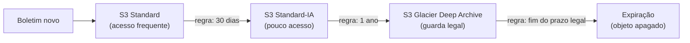

<!-- autoral -->

# 3.8 Amazon S3 — armazenamento de objetos

> **Domínio 3 — Tecnologia e Serviços de Nuvem (34% da prova)** · Depende das aulas [0.3](../fundamentos/03-dados.md) e [3.2](02-infraestrutura-global.md)

> 🔎 **Fichas para aprofundar:** [Amazon S3](../../servicos/armazenamento/s3.md) · [Classes de armazenamento do S3 (incluindo S3 Glacier)](../../servicos/armazenamento/s3-classes-de-armazenamento.md)

⬅️ [3.7 Bancos de dados](07-bancos-de-dados.md) · 🏠 [Índice do domínio](README.md) · 🏫 [O caso da escola](../00-guia-do-exame/caso-da-escola.md) · [3.9 Outros serviços de armazenamento](09-outros-armazenamentos.md) ➡️

---

A rede de escolas guarda muitos arquivos: fotos dos alunos, PDFs de boletins, documentos enviados na matrícula, vídeos de reuniões e cópias de segurança. Hoje tudo fica num servidor de arquivos que enche a cada semestre. Uma parte é aberta todo dia (as fotos do sistema); outra quase nunca (boletins de anos atrás, que a lei obriga a guardar). Pagar o mesmo preço para guardar as duas não faz sentido.

Na [aula 0.3](../fundamentos/03-dados.md), você viu o armazenamento de objetos: cada arquivo é guardado inteiro, com seus metadados, sem se preocupar com disco. O **Amazon S3** (Simple Storage Service) é o serviço de armazenamento de objetos da AWS. O guia do exame cobra para que serve o armazenamento de objetos, a diferença entre as **classes de armazenamento** do S3 e o uso das **políticas de ciclo de vida**.

## Buckets, objetos e chaves

Para guardar dados no S3, você cria um **bucket** (balde), escolhendo um nome e uma Região, e envia os dados para ele como **objetos**. Cada objeto tem uma **chave**, o nome que o identifica dentro do bucket. No endereço `https://boletins-escola.s3.sa-east-1.amazonaws.com/2025/aluno-123.pdf`, `boletins-escola` é o bucket e `2025/aluno-123.pdf` é a chave. A barra parece uma pasta, mas é só parte do nome.

Alguns pontos que a prova cobra:

- O **nome do bucket é único** entre todas as contas da AWS (dentro do mesmo conjunto de Regiões, como as Regiões comerciais), mas o bucket e seus dados ficam na **Região** escolhida.
- Cada objeto pode ter até **50 TB**, e o bucket guarda quantos objetos você quiser.
- O S3 é acessado pela rede, por chamadas de API, pelo console ou pela CLI. Ele não é o disco de uma instância; para isso existe o Amazon EBS ([aula 3.9](09-outros-armazenamentos.md)).

Usos típicos: arquivos de aplicações (fotos, vídeos, documentos), backups, dados para análise e sites estáticos.

## Durabilidade e disponibilidade

Duas palavras se confundem:

- **Durabilidade** é a chance de o dado **não se perder**. O S3 foi projetado para **99,999999999%** de durabilidade (os "11 noves") em todas as classes de armazenamento da tabela abaixo.
- **Disponibilidade** é a chance de o dado **estar acessível** quando você pede. Ela varia por classe: o S3 Standard foi projetado para 99,99%.

A durabilidade vem da redundância. A maioria das classes guarda os objetos em vários dispositivos em pelo menos três zonas de disponibilidade da Região, e resiste à perda de uma zona inteira. As exceções são as classes de uma só zona (One Zone), que guardam os dados numa única zona de disponibilidade.

## Classes de armazenamento

Cada objeto tem uma **classe de armazenamento**. A regra geral: quanto menos você acessa o dado, mais barato é guardá-lo, mas mais caro (ou mais demorado) é buscá-lo. Se você não escolher, o objeto vai para o S3 Standard.

| Classe | Para que serve | Pontos de prova |
|---|---|---|
| S3 Standard | Dados acessados com frequência | Padrão; milissegundos; 3 ou mais AZs; sem taxa de recuperação |
| S3 Intelligent-Tiering | Padrão de acesso desconhecido ou que muda | Move os objetos entre camadas sozinho; pequena taxa mensal de monitoramento por objeto; sem taxa de recuperação |
| S3 Express One Zone | Aplicações muito sensíveis a latência | Uma AZ; milissegundos de um dígito |
| S3 Standard-IA | Pouco acesso (cerca de uma vez por mês), mas rápido quando precisa | Taxa por GB recuperado; mínimo de 30 dias |
| S3 One Zone-IA | Pouco acesso, dado que pode ser recriado | Uma AZ só: perde os dados se a zona for destruída; mais barato que Standard-IA |
| S3 Glacier Instant Retrieval | Arquivo acessado cerca de uma vez por trimestre | Recuperação em milissegundos; mínimo de 90 dias |
| S3 Glacier Flexible Retrieval | Arquivo acessado uma ou duas vezes por ano | Precisa restaurar antes de ler: de minutos a 12 horas; mínimo de 90 dias |
| S3 Glacier Deep Archive | Arquivo de longo prazo, acessado menos de uma vez por ano | A opção de armazenamento mais barata da AWS; restauração em até 12 horas (padrão) ou 48 horas (em massa); mínimo de 180 dias |

"IA" quer dizer *infrequent access*, acesso pouco frequente. O **mínimo de dias** significa que, se você apagar o objeto antes do prazo, paga pelo prazo inteiro. Nas classes Glacier Flexible Retrieval e Deep Archive, o objeto fica arquivado e precisa ser restaurado antes de ser lido.

Na escola: as fotos do sistema ficam no Standard; os boletins antigos, guardados por obrigação legal e quase nunca abertos, vão para o Glacier Deep Archive; miniaturas que podem ser geradas de novo podem ir para o One Zone-IA.

## Políticas de ciclo de vida

Mover objetos de classe à mão não escala. Uma **configuração de ciclo de vida** (S3 Lifecycle) é um conjunto de regras que o S3 aplica sozinho a um grupo de objetos. Há dois tipos de ação:

- **Transição**: mudar o objeto de classe depois de um tempo. Exemplo: passar para Standard-IA 30 dias depois de criado e para Glacier Flexible Retrieval depois de um ano.
- **Expiração**: apagar o objeto depois de um tempo, por exemplo ao fim do prazo legal de guarda.

Na escola, uma regra pode mandar os boletins para o Glacier Deep Archive um ano depois de criados e apagá-los quando o prazo legal terminar. O limite: as transições têm custo por requisição, e mandar um objeto para uma classe com mínimo de dias e apagá-lo antes do prazo gera cobrança pelo prazo inteiro.

Quando o padrão de acesso é desconhecido, o Intelligent-Tiering faz esse trabalho sozinho, objeto a objeto, sem regras.

## Proteção e acesso

- **Privado por padrão**: buckets e objetos novos não permitem acesso público. O **Bloqueio de Acesso Público** (S3 Block Public Access) impede que alguém torne o bucket público por engano. O acesso é liberado por políticas do IAM e políticas de bucket.
- **Criptografia por padrão**: todo objeto novo é criptografado no servidor com chaves gerenciadas pelo S3 (SSE-S3), sem custo adicional.
- **URL pré-assinada**: dá acesso temporário a um objeto privado, por exemplo para um pai baixar o boletim do filho por alguns minutos.
- **Versionamento**: guarda as versões anteriores de cada objeto e protege contra exclusão ou sobrescrita acidental. Vem desligado e precisa ser ativado.
- **Replicação**: copia objetos automaticamente para outro bucket, em outra Região (Cross-Region Replication) ou na mesma (Same-Region Replication).
- **Object Lock**: impede que objetos sejam apagados ou sobrescritos por um período, no modelo WORM (gravar uma vez, ler muitas), para exigências regulatórias.
- **Site estático**: o S3 pode hospedar um site de páginas estáticas (HTML, imagens, scripts que rodam no navegador). Lógica no servidor, como processar um pagamento, exige computação.

## Cobrança

O S3 cobra pelo **armazenamento** (depende do tamanho, do tempo guardado e da classe), pelas **requisições** e **recuperações** feitas e pela **transferência de dados** para a internet. As classes mais baratas para guardar compensam com taxas de recuperação e prazos mínimos.

*Figura 3.8 — Uma política de ciclo de vida move os boletins para classes mais baratas e os apaga ao fim do prazo.*

## Na prova

- **"Guardar arquivos, backups, imagens, vídeos, site estático" = S3 (armazenamento de objetos).**
- **11 noves = durabilidade (não perder o dado); disponibilidade varia por classe.**
- **"Padrão de acesso imprevisível" = Intelligent-Tiering.**
- **"Pouco acesso, mas precisa ser rápido" = Standard-IA; "pode ser recriado" = One Zone-IA.**
- **"Arquivo raro, mas abrir na hora" = Glacier Instant Retrieval; "guardar por anos, quase nunca lido, mais barato" = Glacier Deep Archive.**
- **"Mover objetos de classe ou apagá-los automaticamente após X dias" = política de ciclo de vida.**
- **"Proteger contra exclusão acidental" = versionamento; "acesso temporário a um objeto privado" = URL pré-assinada.**

## Caso resolvido

**Situação.** A secretaria da rede precisa guardar os boletins por muitos anos, por exigência legal. No primeiro mês, pais e professores consultam bastante os boletins novos; depois, quase ninguém abre, e quando alguém pede um boletim antigo pode esperar até o dia seguinte. A direção quer o menor custo possível sem que ninguém precise mover arquivos à mão. O que fazer?

**Raciocínio.** Os boletins começam no S3 Standard, porque são muito consultados no primeiro mês. Uma política de ciclo de vida faz a transição para classes mais baratas com o tempo e termina no S3 Glacier Deep Archive, a opção de armazenamento mais barata da AWS, cuja restauração em até 12 horas cabe no "pode esperar até o dia seguinte". Uma regra de expiração apaga os boletins quando o prazo legal terminar.

**Por que as alternativas tentadoras falham.** Deixar tudo no Standard paga caro por dados que ninguém abre. O One Zone-IA guarda numa zona só, um risco inaceitável para documentos que não podem ser recriados. O Intelligent-Tiering também reduziria custos, mas aqui o padrão de acesso é conhecido, e a regra de ciclo de vida leva os dados até a classe mais barata e cuida da exclusão.

## Revisão

Tente responder antes de abrir cada resposta.

### O que identifica um objeto no S3?

Ver resposta

O bucket onde ele está e a sua chave, o nome único do objeto dentro do bucket (e a versão, quando o versionamento está ligado).

Comentário: o nome do bucket é único entre as contas, mas os dados ficam na Região escolhida.

### Qual é a diferença entre durabilidade e disponibilidade no S3?

Ver resposta

Durabilidade é a chance de o dado não se perder (11 noves em todas as classes da tabela desta aula); disponibilidade é a chance de ele estar acessível quando pedido, e varia por classe.

Comentário: classes de uma só zona têm a mesma durabilidade de projeto, mas não resistem à perda da zona.

### Quando usar o S3 Intelligent-Tiering?

Ver resposta

Quando o padrão de acesso aos dados é desconhecido ou muda, porque ele move cada objeto para a camada mais barata sozinho, sem taxa de recuperação.

Comentário: cobra uma pequena taxa mensal de monitoramento por objeto.

### O que uma política de ciclo de vida do S3 faz?

Ver resposta

Aplica regras automáticas a grupos de objetos: transição para outra classe depois de um tempo e expiração (exclusão) quando o prazo termina.

Comentário: serve para baixar custos com dados que envelhecem e para cumprir prazos de retenção.

### Qual classe tem o armazenamento mais barato, e qual é o preço dessa economia?

Ver resposta

O S3 Glacier Deep Archive; em troca, o objeto precisa ser restaurado antes da leitura, o que leva horas, e há mínimo de 180 dias de cobrança.

Comentário: serve para dados guardados por anos e lidos menos de uma vez por ano.

## Resumo

- S3 guarda objetos em buckets; cada objeto tem uma chave e pode ter até 50 TB.
- Durabilidade de 11 noves; a disponibilidade varia por classe.
- Classes vão do Standard (acesso frequente) ao Glacier Deep Archive (o mais barato para guardar), passando por Intelligent-Tiering, IA e Glacier.
- Políticas de ciclo de vida fazem transição e expiração automáticas.
- Buckets são privados e criptografados por padrão; versionamento, replicação e Object Lock protegem os dados.

## Fontes oficiais

Verificadas em 06/10/2026.

- [Content Domain 3 do guia do exame CLF-C02](https://docs.aws.amazon.com/aws-certification/latest/cloud-practitioner-02/cloud-practitioner-02-domain3.html): tarefa 3.6 (armazenamento de objetos, classes do S3 e políticas de ciclo de vida).
- [What is Amazon S3?](https://docs.aws.amazon.com/AmazonS3/latest/userguide/Welcome.html) e [General purpose buckets overview](https://docs.aws.amazon.com/AmazonS3/latest/userguide/UsingBucket.html): bucket, Região, chave e nome único.
- [Amazon S3 objects overview](https://docs.aws.amazon.com/AmazonS3/latest/userguide/UsingObjects.html): objetos de até 50 TB.
- [Data protection in Amazon S3](https://docs.aws.amazon.com/AmazonS3/latest/userguide/DataDurability.html): 11 noves de durabilidade, 99,99% de disponibilidade do Standard, pelo menos três AZs.
- [Understanding and managing Amazon S3 storage classes](https://docs.aws.amazon.com/AmazonS3/latest/userguide/storage-class-intro.html) e [S3 Glacier storage classes](https://docs.aws.amazon.com/AmazonS3/latest/userguide/glacier-storage-classes.html): classes, prazos mínimos, tempos de restauração e Deep Archive como a opção mais barata.
- [Managing the lifecycle of objects](https://docs.aws.amazon.com/AmazonS3/latest/userguide/object-lifecycle-mgmt.html): ações de transição e expiração.
- [Blocking public access](https://docs.aws.amazon.com/AmazonS3/latest/userguide/access-control-block-public-access.html) e [Default encryption](https://docs.aws.amazon.com/AmazonS3/latest/userguide/default-bucket-encryption.html): privado e criptografado (SSE-S3) por padrão.
- [Versioning](https://docs.aws.amazon.com/AmazonS3/latest/userguide/Versioning.html), [Replicating objects](https://docs.aws.amazon.com/AmazonS3/latest/userguide/replication.html), [Object Lock](https://docs.aws.amazon.com/AmazonS3/latest/userguide/object-lock.html) e [Sharing objects with presigned URLs](https://docs.aws.amazon.com/AmazonS3/latest/userguide/ShareObjectPreSignedURL.html): proteção e acesso temporário.
- [Hosting a static website](https://docs.aws.amazon.com/AmazonS3/latest/userguide/WebsiteHosting.html): sites estáticos.
- [Amazon S3 pricing](https://aws.amazon.com/s3/pricing/): cobrança por armazenamento, requisições, recuperações e transferência de dados.

<!-- notas:inicio -->
## 📝 Minhas anotações

<!-- Escreva aqui suas observações, dúvidas e as questões que você errou sobre o tema. -->
<!-- notas:fim -->

---

⬅️ [3.7 Bancos de dados](07-bancos-de-dados.md) · 🏠 [Índice do domínio](README.md) · [3.9 Outros serviços de armazenamento](09-outros-armazenamentos.md) ➡️
