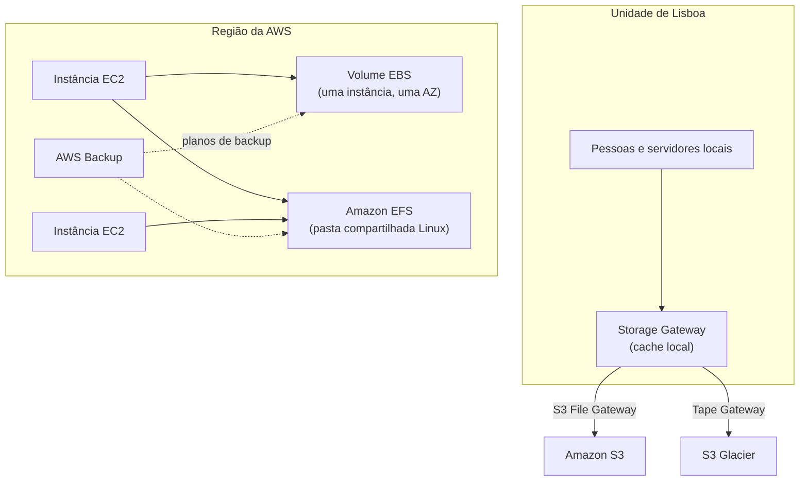

<!-- autoral -->

# 3.9 Outros serviços de armazenamento

> **Domínio 3 — Tecnologia e Serviços de Nuvem (34% da prova)** · Depende das aulas [0.3](../fundamentos/03-dados.md), [1.3](../01-conceitos-de-nuvem/03-conceitos-de-arquitetura.md), [3.3](03-ec2.md) e [3.8](08-s3.md)

> 🔎 **Fichas para aprofundar:** [Amazon EBS e instance store](../../servicos/armazenamento/ebs.md) · [Amazon EFS](../../servicos/armazenamento/efs.md) · [Amazon FSx](../../servicos/armazenamento/fsx.md) · [AWS Storage Gateway](../../servicos/armazenamento/storage-gateway.md) · [AWS Backup](../../servicos/armazenamento/aws-backup.md) · [AWS Elastic Disaster Recovery](../../servicos/armazenamento/elastic-disaster-recovery.md)

⬅️ [3.8 Amazon S3 — armazenamento de objetos](08-s3.md) · 🏠 [Índice do domínio](README.md) · 🏫 [O caso da escola](../00-guia-do-exame/caso-da-escola.md) · [3.10 Redes e entrega de conteúdo](10-rede-e-entrega-de-conteudo.md) ➡️

---

O S3 resolveu os arquivos da rede de escolas, mas nem todo dado cabe num bucket. O banco de dados que ainda roda no EC2 precisa de um disco. As instâncias do portal precisam ler a mesma pasta de materiais didáticos ao mesmo tempo. A secretaria usa computadores Windows e quer uma pasta compartilhada como a que tem hoje. A unidade de Lisboa ainda tem um servidor de arquivos local que enche todo ano. E a direção quer saber, num só lugar, se todos os backups estão em dia.

Na [aula 0.3](../fundamentos/03-dados.md), você viu as três formas de armazenamento: bloco, arquivo e objeto. O S3 cobre objetos. Esta aula cobre o resto da tarefa 3.6 do guia do exame: armazenamento em **bloco** (Amazon EBS e instance store), **serviços de arquivos** (Amazon EFS e Amazon FSx), **sistemas de arquivos com cache** local (AWS Storage Gateway) e o **AWS Backup**.

## Armazenamento em bloco: EBS e instance store

Na [aula 3.3](03-ec2.md), você viu os dois discos de uma instância do EC2:

- Um **volume do Amazon EBS** (Elastic Block Store) é anexado a uma instância e usado como um disco rígido local: para instalar programas, guardar arquivos ou rodar um banco de dados. Ele existe independentemente da instância e fica em **uma zona de disponibilidade**, onde os dados são replicados entre vários servidores. Há volumes **SSD**, para cargas transacionais como bancos de dados, e **HDD**, para cargas de grande vazão sequencial.
- O **instance store** é um disco ligado fisicamente ao servidor que hospeda a instância. É temporário: os dados se perdem quando a instância é parada ou encerrada.

O backup de um volume EBS é um **snapshot**, uma cópia de um momento do volume. Os snapshots são **incrementais**: cada um guarda só os blocos que mudaram desde o anterior. Eles ficam guardados no S3 (em buckets que você não acessa diretamente) e servem para restaurar volumes ou levar dados para outra zona de disponibilidade, Região ou conta.

Um ponto que a prova liga ao modelo de responsabilidade compartilhada: **a AWS não faz backup automático dos volumes EBS**. Criar snapshots com regularidade, à mão ou com uma ferramenta como o AWS Backup, é responsabilidade do cliente.

## Serviços de arquivos: EFS e FSx

O EBS normalmente serve uma instância por vez. Quando várias máquinas precisam ler e gravar a **mesma pasta**, o caminho é um serviço de arquivos.

O **Amazon EFS** (Elastic File System) oferece armazenamento de arquivos serverless e totalmente elástico: cresce e encolhe sozinho à medida que você adiciona e remove arquivos, até a escala de petabytes, sem provisionar capacidade. Ele usa o protocolo **NFS**, comum no Linux, e pode ser acessado por instâncias do EC2, containers do ECS e do EKS, o Fargate e o Lambda. O tipo regional, recomendado, guarda os dados em várias zonas de disponibilidade. O limite: o EFS **não é suportado em instâncias Windows**. Na escola, ele atende a pasta de materiais lida por todas as instâncias Linux do portal.

O **Amazon FSx** oferece sistemas de arquivos conhecidos, totalmente gerenciados. Há quatro opções:

- **FSx for Windows File Server**: servidores de arquivos Windows gerenciados, com o protocolo **SMB** usado pelo Windows. As aplicações e ferramentas Windows continuam funcionando sem mudança. É a resposta para a pasta compartilhada da secretaria.
- **FSx for Lustre**: armazenamento de alto desempenho para computação de alto desempenho (HPC) e inteligência artificial.
- **FSx for NetApp ONTAP** e **FSx for OpenZFS**: para empresas que já usam esses sistemas de armazenamento e querem levá-los para a nuvem.

A escolha costuma partir do sistema de arquivos que a empresa já conhece.

## Armazenamento híbrido: AWS Storage Gateway

O servidor de arquivos de Lisboa enche todo ano, mas as pessoas querem continuar abrindo os arquivos rapidamente, na rede local. O **AWS Storage Gateway** liga um equipamento instalado no local do cliente (uma máquina virtual ou um aparelho físico) ao armazenamento da AWS. Os dados ficam na nuvem, e o gateway mantém um **cache local** com o que é acessado com frequência, para que o acesso continue rápido. Por isso o guia do exame o chama de sistema de arquivos com cache.

Há três tipos:

- **S3 File Gateway**: as pessoas gravam arquivos numa pasta de rede comum (NFS ou SMB), e eles são guardados como objetos no S3, onde valem as classes e as políticas de ciclo de vida da [aula 3.8](08-s3.md).
- **Volume Gateway**: volumes de disco (iSCSI) para os servidores locais, com os dados guardados na AWS.
- **Tape Gateway**: fitas virtuais para o software de backup que hoje grava em fita, com o arquivamento no S3 Glacier Flexible Retrieval ou no S3 Glacier Deep Archive. Elimina o trabalho de manter fitas físicas.

Existia também o FSx File Gateway, que não está mais disponível para novos clientes.

## Backup centralizado: AWS Backup

Cada serviço tem seu próprio jeito de fazer backup: snapshots no EBS, backups automáticos no RDS, e assim por diante. Conferir um por um não escala.

O **AWS Backup** é um serviço totalmente gerenciado que **centraliza e automatiza** a proteção de dados entre serviços da AWS, na nuvem e no local do cliente. Você cria **planos de backup** (quando fazer, por quanto tempo guardar) e os aplica aos recursos, por exemplo pelas etiquetas (tags). Ele atende, entre outros, EC2, EBS, RDS, Aurora, DynamoDB, EFS, FSx e S3. Também copia backups para outras Regiões e contas, e move backups antigos para um armazenamento frio mais barato.

O limite: o AWS Backup só governa os backups feitos por ele. Backups criados por fora não entram no painel centralizado.

## Recuperação de desastres: AWS Elastic Disaster Recovery

Na [aula 1.3](../01-conceitos-de-nuvem/03-conceitos-de-arquitetura.md), você viu as estratégias de recuperação de desastres. O **AWS Elastic Disaster Recovery** (AWS DRS) replica continuamente servidores locais ou na nuvem para uma área de preparação na AWS, que usa armazenamento barato e o mínimo de computação. Em caso de desastre, ele lança instâncias de recuperação na AWS em minutos, com o estado mais recente ou de um momento anterior. Também permite testes sem interromper a produção. Backup guarda cópias; o DRS mantém um ambiente pronto para assumir.

## Como escolher

| Necessidade | Serviço |
|---|---|
| Arquivos, backups, mídia, site estático | S3 ([aula 3.8](08-s3.md)) |
| Disco persistente de uma instância do EC2 | EBS |
| Disco temporário muito rápido | Instance store |
| Pasta compartilhada por muitas instâncias Linux | EFS |
| Pasta compartilhada Windows (SMB) | FSx for Windows File Server |
| Alto desempenho para HPC e IA | FSx for Lustre |
| Datacenter local usando armazenamento da AWS, com cache local | Storage Gateway |
| Substituir backup em fita física | Tape Gateway |
| Gerenciar backups de vários serviços num só lugar | AWS Backup |
| Ambiente de recuperação pronto na AWS | Elastic Disaster Recovery |

*Figura 3.9 — Bloco para uma instância, arquivos para várias, gateway para o local do cliente e AWS Backup supervisionando as cópias.*

## Na prova

- **"Disco de uma instância do EC2" = EBS; "disco temporário, some ao parar" = instance store.**
- **A AWS não faz backup automático do EBS**: snapshots são responsabilidade do cliente.
- **"Várias instâncias Linux lendo os mesmos arquivos" = EFS.**
- **"Pasta compartilhada Windows, SMB" = FSx for Windows File Server; "HPC" = FSx for Lustre.**
- **"Datacenter local usando armazenamento da AWS", "cache local" = Storage Gateway; "substituir fitas" = Tape Gateway.**
- **"Centralizar e automatizar backups de vários serviços" = AWS Backup.**
- **"Recuperar servidores na AWS em minutos após um desastre" = Elastic Disaster Recovery.**

## Caso resolvido

**Situação.** A unidade de Lisboa tem um servidor de arquivos local que enche todo ano e um software de backup que grava em fitas, guardadas numa sala. A equipe quer continuar usando a pasta de rede como sempre, sem lentidão para abrir os arquivos do dia a dia, e quer parar de comprar e guardar fitas. O que usar?

**Raciocínio.** O AWS Storage Gateway atende os dois pedidos. Um S3 File Gateway apresenta a mesma pasta de rede às pessoas, guarda os arquivos no S3 (que cresce sem limite prático) e mantém um cache local com os arquivos mais usados, para que abri-los continue rápido. Um Tape Gateway apresenta fitas virtuais ao software de backup existente e arquiva os dados no S3 Glacier, eliminando as fitas físicas.

**Por que as alternativas tentadoras falham.** O EFS é um serviço de arquivos dentro da AWS para instâncias Linux; ele não resolve o acesso local rápido nem o backup em fita. O AWS Backup centraliza backups, mas não oferece uma interface de fita para o software que já existe. Mover tudo direto para o S3 obrigaria as pessoas a trocar a pasta de rede por outra forma de acesso.

## Revisão

Tente responder antes de abrir cada resposta.

### Qual é a diferença entre um volume EBS e o instance store?

Ver resposta

O volume EBS é persistente e existe independentemente da instância, numa zona de disponibilidade; o instance store é um disco físico do servidor, cujos dados se perdem quando a instância é parada ou encerrada.

Comentário: o backup do EBS é feito com snapshots incrementais, e criá-los é responsabilidade do cliente.

### Quando usar o EFS em vez do EBS?

Ver resposta

Quando várias instâncias Linux precisam acessar os mesmos arquivos ao mesmo tempo; o EFS é um sistema de arquivos compartilhado (NFS) que cresce e encolhe sozinho.

Comentário: o EFS não é suportado em instâncias Windows; para Windows, a opção é o FSx for Windows File Server.

### O que o Amazon FSx oferece?

Ver resposta

Sistemas de arquivos conhecidos totalmente gerenciados: Windows File Server, Lustre, NetApp ONTAP e OpenZFS.

Comentário: Windows File Server atende pastas compartilhadas Windows (SMB); Lustre atende HPC e IA.

### Para que serve o AWS Storage Gateway?

Ver resposta

Para ligar o ambiente local do cliente ao armazenamento da AWS, guardando os dados na nuvem e mantendo um cache local para acesso rápido.

Comentário: os tipos são S3 File Gateway, Volume Gateway e Tape Gateway, que substitui fitas físicas.

### Qual é a vantagem do AWS Backup?

Ver resposta

Centralizar e automatizar os backups de vários serviços com planos de backup, em vez de configurar e conferir serviço por serviço.

Comentário: ele copia backups entre Regiões e contas, mas não governa backups feitos fora dele.

## Resumo

- Bloco: EBS (persistente, uma AZ, snapshots incrementais por conta do cliente) e instance store (temporário).
- Arquivos: EFS (NFS, Linux, elástico) e FSx (Windows File Server, Lustre, NetApp ONTAP, OpenZFS).
- Storage Gateway liga o local do cliente à AWS, com cache local; Tape Gateway substitui fitas.
- AWS Backup centraliza backups; Elastic Disaster Recovery mantém um ambiente de recuperação pronto.

## Fontes oficiais

Verificadas em 06/10/2026.

- [Content Domain 3 do guia do exame CLF-C02](https://docs.aws.amazon.com/aws-certification/latest/cloud-practitioner-02/cloud-practitioner-02-domain3.html): tarefa 3.6 (bloco, arquivos, sistemas com cache e AWS Backup).
- [In-Scope AWS Services](https://docs.aws.amazon.com/aws-certification/latest/cloud-practitioner-02/clf-02-in-scope-services.html): AWS Backup, EBS, EFS, Elastic Disaster Recovery, FSx, S3, S3 Glacier e Storage Gateway na categoria de armazenamento.
- [What is Amazon EBS?](https://docs.aws.amazon.com/ebs/latest/userguide/what-is-ebs.html) e [Amazon EBS snapshots](https://docs.aws.amazon.com/ebs/latest/userguide/ebs-snapshots.html): volumes SSD e HDD, replicação na AZ, snapshots incrementais no S3 e backup como responsabilidade do cliente.
- [What is Amazon EFS?](https://docs.aws.amazon.com/efs/latest/ug/whatisefs.html): serverless, elástico, NFS, tipos regional e One Zone, sem suporte a Windows.
- [Amazon FSx](https://aws.amazon.com/fsx/) e [What is FSx for Windows File Server?](https://docs.aws.amazon.com/fsx/latest/WindowsGuide/what-is.html): quatro sistemas de arquivos; SMB e aplicações Windows sem mudança.
- [What is Volume Gateway?](https://docs.aws.amazon.com/storagegateway/latest/vgw/WhatIsStorageGateway.html), [What is S3 File Gateway?](https://docs.aws.amazon.com/filegateway/latest/files3/what-is-file-s3.html), [What is Tape Gateway?](https://docs.aws.amazon.com/storagegateway/latest/tgw/WhatIsStorageGateway.html) e [What is FSx File Gateway?](https://docs.aws.amazon.com/filegateway/latest/filefsxw/what-is-file-fsxw.html): tipos de gateway, cache local, arquivamento no Glacier e FSx File Gateway fechado a novos clientes.
- [What is AWS Backup?](https://docs.aws.amazon.com/aws-backup/latest/devguide/whatisbackup.html) e [Feature availability by resource](https://docs.aws.amazon.com/aws-backup/latest/devguide/backup-feature-availability.html): planos de backup, cópias entre Regiões e contas, armazenamento frio e serviços atendidos.
- [What is Elastic Disaster Recovery?](https://docs.aws.amazon.com/drs/latest/userguide/what-is-drs.html): replicação contínua, área de preparação e recuperação em minutos.

<!-- notas:inicio -->
## 📝 Minhas anotações

<!-- Escreva aqui suas observações, dúvidas e as questões que você errou sobre o tema. -->
<!-- notas:fim -->

---

⬅️ [3.8 Amazon S3 — armazenamento de objetos](08-s3.md) · 🏠 [Índice do domínio](README.md) · [3.10 Redes e entrega de conteúdo](10-rede-e-entrega-de-conteudo.md) ➡️
