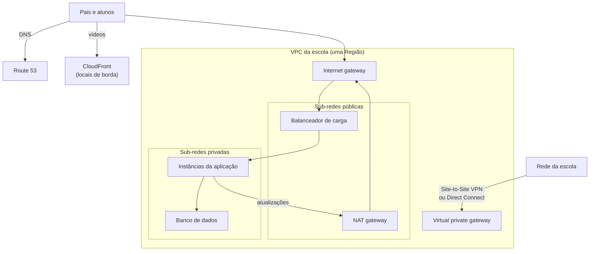

<!-- autoral -->

# 3.10 Redes e entrega de conteúdo

> **Domínio 3 — Tecnologia e Serviços de Nuvem (34% da prova)** · Depende das aulas [0.2](../fundamentos/02-rede.md), [2.8](../02-seguranca-e-conformidade/08-protecao-de-rede-e-aplicacoes.md), [3.1](01-formas-de-acesso-e-implantacao.md) e [3.2](02-infraestrutura-global.md)

> 🔎 **Fichas para aprofundar:** [Amazon VPC](../../servicos/redes/vpc.md) · [VPC Peering, Transit Gateway, VPC Endpoints e PrivateLink](../../servicos/redes/vpc-peering-transit-gateway-e-endpoints.md) · [AWS VPN](../../servicos/redes/site-to-site-vpn-e-client-vpn.md) · [AWS Direct Connect](../../servicos/redes/direct-connect.md) · [Amazon Route 53](../../servicos/redes/route-53.md) · [Amazon CloudFront](../../servicos/redes/cloudfront.md) · [AWS Global Accelerator](../../servicos/redes/global-accelerator.md) · [Amazon API Gateway](../../servicos/redes/api-gateway.md)

⬅️ [3.9 Outros serviços de armazenamento](09-outros-armazenamentos.md) · 🏠 [Índice do domínio](README.md) · 🏫 [O caso da escola](../00-guia-do-exame/caso-da-escola.md) · [3.11 Analytics](11-analytics.md) ➡️

---

O sistema de matrícula já tem instâncias, banco de dados e armazenamento. Falta decidir como tudo isso se conecta. O site precisa ser acessível da internet, mas o banco de dados não pode ser. As instâncias privadas precisam baixar atualizações. A secretaria quer acessar a AWS a partir da rede da escola. Os pais devem chegar ao site pelo nome `matricula.escola.com.br`. E os alunos de Lisboa reclamam que os vídeos demoram a carregar.

Na [aula 0.2](../fundamentos/02-rede.md), você viu endereço IP, rota, porta e DNS, e conheceu a **VPC**, a rede privada do cliente na AWS. Esta aula monta essa rede peça por peça e mostra os serviços que a ligam ao datacenter e aos usuários. O guia do exame cobra os componentes da VPC, a segurança na VPC, o propósito do Amazon Route 53 e as opções de conexão com a AWS.

## A VPC e suas sub-redes

Com a **Amazon VPC** (Virtual Private Cloud), você lança recursos da AWS numa rede virtual **isolada logicamente**, que você define, parecida com a rede de um datacenter próprio. Cada VPC fica numa Região e pode abranger várias zonas de disponibilidade dela. Toda conta já vem com uma **VPC padrão** em cada Região, pronta para lançar instâncias.

Dentro da VPC, você cria **sub-redes**: faixas de endereços IP da VPC. Cada sub-rede fica em **uma única zona de disponibilidade**. Para ter alta disponibilidade, cria-se uma sub-rede em cada zona e espalham-se os recursos entre elas, como na [aula 3.4](04-escalabilidade-e-balanceamento.md).

Para onde vai o tráfego de cada sub-rede é decidido pela **tabela de rotas** (route table), a mesma ideia de rota da [aula 0.2](../fundamentos/02-rede.md). É ela que define o tipo de sub-rede:

- **Sub-rede pública**: tem uma rota direta para um **internet gateway**. Os recursos nela, com endereço IP público, falam com a internet e podem receber conexões de fora. É onde fica o balanceador de carga do site.
- **Sub-rede privada**: não tem rota direta para o internet gateway. Ninguém na internet inicia uma conexão com ela. É onde ficam o banco de dados e as instâncias da aplicação. A AWS recomenda usar sub-redes privadas para proteger os recursos.

## Gateways: as portas de saída da VPC

Um **gateway** liga a VPC a outra rede:

- O **internet gateway** permite a comunicação entre a VPC e a internet. É um componente redundante e altamente disponível, gerenciado pela AWS.
- O **NAT gateway** permite que instâncias de uma sub-rede privada **iniciem** conexões com serviços fora da VPC, como baixar atualizações, sem que serviços de fora consigam iniciar conexões com elas. O NAT gateway público fica numa sub-rede pública e sai pelo internet gateway.
- O **virtual private gateway** é o lado da AWS de uma conexão VPN com o datacenter, que aparece adiante.

Na escola: o balanceador fica na sub-rede pública; as instâncias e o banco ficam nas privadas; as instâncias baixam atualizações pelo NAT gateway, e ninguém de fora alcança o banco.

## Segurança na VPC

A [aula 2.8](../02-seguranca-e-conformidade/08-protecao-de-rede-e-aplicacoes.md) explicou as duas camadas de filtro, e a prova as cobra aqui de novo:

- O **security group** é o firewall de cada recurso: só regras de permitir, e a resposta volta sozinha (stateful).
- A **ACL de rede** filtra no nível da sub-rede: aceita regras de permitir e negar, avaliadas em ordem, e a resposta precisa de regra própria (stateless).

O guia também cita o **Amazon Inspector** nesse tema: ele examina continuamente instâncias do EC2, imagens de container no ECR e funções Lambda em busca de falhas de software conhecidas e de **exposição de rede não intencional**, como uma porta aberta para a internet sem necessidade. Ele foi visto na [aula 2.9](../02-seguranca-e-conformidade/09-deteccao-de-ameacas.md).

## Ligando VPCs entre si e aos serviços da AWS

Com o tempo, a rede de escolas pode ter várias VPCs (uma por sistema, ou uma por conta).

- Uma **conexão de emparelhamento** (VPC peering) liga duas VPCs, na mesma conta ou em contas diferentes, e até em Regiões diferentes, para que os recursos conversem por endereços privados como se estivessem na mesma rede. O limite: o emparelhamento **não é transitivo**. Se A está ligada a B e B a C, A não fala com C sem uma ligação própria.
- O **AWS Transit Gateway** é um **ponto central** (hub) que interliga muitas VPCs e as redes locais. Em vez de dezenas de emparelhamentos, cada rede se liga uma vez ao hub.
- O **AWS PrivateLink** conecta a VPC, de forma privada, a serviços e recursos como se estivessem dentro dela, sem internet gateway, NAT ou endereço público. Ele é a base da maioria dos **VPC endpoints**, e também permite oferecer um serviço próprio a outros clientes da AWS.
- Para o Amazon S3 e o DynamoDB existe também o **gateway endpoint**, que dá acesso sem internet gateway nem NAT e não tem cobrança adicional.

## Ligando o datacenter à AWS: VPN ou Direct Connect

A [aula 3.1](01-formas-de-acesso-e-implantacao.md) apresentou as opções. A escolha entre elas:

| | AWS Site-to-Site VPN | AWS Direct Connect |
|---|---|---|
| Caminho | Pela internet | Cabo de fibra até um local do Direct Connect, sem passar pelos provedores de internet |
| Criptografia | Sim (IPsec) | Não por padrão; pode-se rodar uma VPN por cima ou usar MACsec |
| Desempenho | Varia com a internet | Mais banda e experiência de rede mais consistente |
| Quando usar | Ligar a rede local à VPC usando a internet que já existe | Volumes grandes e desempenho previsível |

O **AWS Client VPN** é a VPN para pessoas: cada usuário conecta seu computador à rede da AWS de onde estiver. Na escola, a secretaria começa com Site-to-Site VPN; se o volume de dados crescer e a internet virar gargalo, o Direct Connect entra, e combinar os dois dá uma conexão privada e criptografada.

## Levando os usuários até a aplicação

Quatro serviços cuidam do caminho entre o usuário e a aplicação.

O **Amazon Route 53** é o serviço de **DNS** da AWS, altamente disponível e escalável. Ele faz três coisas: **registra domínios** (como `escola.com.br`), **roteia** o tráfego, ligando o nome digitado ao site ou à aplicação, e faz **verificações de saúde** (health checks), enviando pedidos automáticos aos recursos para saber se estão funcionando e desviando o tráfego dos que não estão. As **políticas de roteamento** decidem a resposta:

| Política | O que faz |
|---|---|
| Simples | Um recurso só |
| Ponderada (weighted) | Divide o tráfego em proporções definidas, por exemplo para testar uma versão nova |
| Latência | Manda para a Região com a melhor latência para o usuário |
| Failover | Ativo-passivo: usa o recurso secundário quando o principal está doente |
| Geolocalização | Decide pela localização do usuário |
| Geoproximidade | Decide pela localização dos recursos, com ajuste de quanto tráfego cada um recebe |
| Resposta com vários valores | Responde com até oito registros saudáveis, escolhidos ao acaso |
| Por IP | Decide pelos endereços IP de onde vem o tráfego |

O **Amazon CloudFront** é a rede de entrega de conteúdo (CDN) da AWS. Ele acelera a entrega de conteúdo estático e dinâmico usando os **locais de borda** da [aula 3.2](02-infraestrutura-global.md): o pedido do usuário vai para o local de borda com a menor latência; se o conteúdo já está guardado lá, é entregue na hora; se não, o CloudFront o busca na **origem** (um bucket do S3 ou um servidor web, por exemplo) e o guarda para os próximos pedidos. É a resposta para os vídeos de Lisboa.

O **AWS Global Accelerator** dá à aplicação **endereços IP estáticos** anunciados a partir da rede de borda da AWS e leva o tráfego dos usuários pela **rede global da AWS** até os endpoints na Região mais próxima, melhorando desempenho e disponibilidade. A diferença para o CloudFront: o CloudFront entrega cópias guardadas nos locais de borda; o Global Accelerator leva cada conexão até a aplicação.

O **Amazon API Gateway** serve para criar, publicar, manter, monitorar e proteger **APIs** (REST, HTTP e WebSocket) em qualquer escala. É a porta de entrada comum para back-ends serverless: o aplicativo da escola chama a API, e o API Gateway encaminha o pedido para uma função Lambda.

*Figura 3.10 — Sub-rede pública para o que fala com a internet, privada para o resto; Route 53 e CloudFront levam os usuários até a aplicação.*

## Na prova

- **VPC = rede isolada logicamente numa Região; sub-rede = faixa de IPs numa AZ.**
- **"Sub-rede pública" = rota para o internet gateway; "instância privada precisa baixar atualizações" = NAT gateway.**
- **Security group = recurso, só permitir, stateful; ACL de rede = sub-rede, permitir e negar, stateless.**
- **Peering não é transitivo; "conectar muitas VPCs e o datacenter" = Transit Gateway.**
- **"Acessar serviços da AWS sem passar pela internet" = VPC endpoint (PrivateLink; gateway endpoint para S3 e DynamoDB).**
- **"Criptografado pela internet" = Site-to-Site VPN; "dedicado, sem provedores de internet, desempenho consistente" = Direct Connect.**
- **Route 53 = DNS: registro de domínios, roteamento e verificações de saúde.**
- **"Conteúdo com baixa latência no mundo todo, cache" = CloudFront; "IPs estáticos e rede global da AWS" = Global Accelerator.**
- **"Criar e publicar APIs" = API Gateway.**

## Caso resolvido

**Situação.** A rede de escolas vai montar a rede do sistema de matrícula do zero. Requisitos: o site deve ser acessível pelos pais pela internet; o banco de dados não pode ser alcançado de fora; as instâncias da aplicação precisam baixar atualizações; a rede da escola precisa de acesso privado e criptografado à VPC, e a internet atual é suficiente. Como montar?

**Raciocínio.** Uma VPC com sub-redes em duas zonas de disponibilidade. O balanceador de carga vai nas sub-redes públicas, com rota para o internet gateway. As instâncias e o banco vão nas sub-redes privadas, sem rota de entrada a partir da internet; security groups liberam só o tráfego do balanceador para as instâncias e das instâncias para o banco. Um NAT gateway na sub-rede pública permite às instâncias baixar atualizações. A rede da escola se liga por Site-to-Site VPN, que é criptografada e usa a internet que já existe. O Route 53 aponta `matricula.escola.com.br` para o balanceador.

**Por que as alternativas tentadoras falham.** Pôr o banco numa sub-rede pública para "facilitar" expõe exatamente o que deveria ficar protegido. Um internet gateway sozinho não serve para as instâncias privadas, porque elas não têm rota para ele; é o NAT gateway que permite a saída sem abrir a entrada. Direct Connect resolveria a conexão, mas não é criptografado por padrão e é mais do que a escola precisa quando a internet atual basta.

## Revisão

Tente responder antes de abrir cada resposta.

### O que torna uma sub-rede pública?

Ver resposta

Uma rota direta para um internet gateway na tabela de rotas da sub-rede; sem essa rota, a sub-rede é privada.

Comentário: cada sub-rede fica numa única zona de disponibilidade.

### Para que serve o NAT gateway?

Ver resposta

Para que instâncias em sub-redes privadas iniciem conexões com serviços fora da VPC, como baixar atualizações, sem que serviços de fora possam iniciar conexões com elas.

Comentário: o NAT gateway público fica numa sub-rede pública e sai pelo internet gateway.

### Quando usar o Transit Gateway em vez de VPC peering?

Ver resposta

Quando há muitas VPCs e redes locais para interligar; o Transit Gateway é um hub central, enquanto o peering liga só duas VPCs e não é transitivo.

Comentário: se A está ligada a B e B a C por peering, A não fala com C.

### Qual é a diferença entre Site-to-Site VPN e Direct Connect?

Ver resposta

A Site-to-Site VPN é uma conexão criptografada (IPsec) que passa pela internet; o Direct Connect é uma conexão dedicada por fibra até um local do Direct Connect, sem passar pelos provedores de internet, com desempenho mais consistente.

Comentário: o Direct Connect não é criptografado por padrão; pode-se rodar uma VPN por cima.

### Quais são as três funções do Amazon Route 53?

Ver resposta

Registrar domínios, rotear o tráfego do nome do domínio para os recursos e verificar a saúde desses recursos.

Comentário: as políticas de roteamento (latência, failover, ponderada e outras) decidem para onde cada usuário vai.

## Resumo

- VPC é a rede isolada do cliente numa Região; sub-redes ficam numa AZ e são públicas ou privadas pela tabela de rotas.
- Internet gateway liga a VPC à internet; NAT gateway dá saída às sub-redes privadas.
- Security groups e ACLs de rede protegem recursos e sub-redes; o Inspector aponta exposição de rede.
- Peering liga duas VPCs; Transit Gateway centraliza muitas; PrivateLink e endpoints evitam a internet.
- Site-to-Site VPN passa criptografada pela internet; Direct Connect é dedicado.
- Route 53 é DNS; CloudFront é CDN; Global Accelerator usa a rede da AWS com IPs estáticos; API Gateway publica APIs.

## Fontes oficiais

Verificadas em 06/10/2026.

- [Content Domain 3 do guia do exame CLF-C02](https://docs.aws.amazon.com/aws-certification/latest/cloud-practitioner-02/cloud-practitioner-02-domain3.html): tarefa 3.5 (componentes e segurança da VPC, Route 53 e conectividade).
- [In-Scope AWS Services](https://docs.aws.amazon.com/aws-certification/latest/cloud-practitioner-02/clf-02-in-scope-services.html): serviços de redes e entrega de conteúdo do exame.
- [What is Amazon VPC?](https://docs.aws.amazon.com/vpc/latest/userguide/what-is-amazon-vpc.html) e [Subnets for your VPC](https://docs.aws.amazon.com/vpc/latest/userguide/configure-subnets.html): VPC isolada, sub-rede numa AZ, tabelas de rotas, sub-redes públicas e privadas, VPC padrão.
- [Amazon VPC FAQs](https://aws.amazon.com/vpc/faqs/): VPC numa Região, abrangendo várias AZs; sub-rede numa só AZ.
- [Internet gateways](https://docs.aws.amazon.com/vpc/latest/userguide/VPC_Internet_Gateway.html) e [NAT gateways](https://docs.aws.amazon.com/vpc/latest/userguide/vpc-nat-gateway.html): comunicação com a internet e saída das sub-redes privadas.
- [What is VPC peering?](https://docs.aws.amazon.com/vpc/latest/peering/what-is-vpc-peering.html), [VPC peering basics](https://docs.aws.amazon.com/vpc/latest/peering/vpc-peering-basics.html) e [What is a transit gateway?](https://docs.aws.amazon.com/vpc/latest/tgw/what-is-transit-gateway.html): peering entre contas e Regiões, não transitivo; hub central.
- [What is AWS PrivateLink?](https://docs.aws.amazon.com/vpc/latest/privatelink/what-is-privatelink.html) e [Gateway endpoints](https://docs.aws.amazon.com/vpc/latest/privatelink/gateway-endpoints.html): acesso privado a serviços; gateway endpoints para S3 e DynamoDB sem cobrança adicional.
- [What is Amazon Inspector?](https://docs.aws.amazon.com/inspector/latest/user/what-is-inspector.html): vulnerabilidades de software e exposição de rede não intencional.
- [What is Direct Connect?](https://docs.aws.amazon.com/directconnect/latest/UserGuide/Welcome.html), [Encryption in transit](https://docs.aws.amazon.com/directconnect/latest/UserGuide/encryption-in-transit.html) e [Site-to-Site VPN](https://docs.aws.amazon.com/vpn/latest/s2svpn/VPC_VPN.html): conexão dedicada sem provedores de internet, sem criptografia por padrão; VPN IPsec.
- [What is Amazon Route 53?](https://docs.aws.amazon.com/Route53/latest/DeveloperGuide/Welcome.html) e [Choosing a routing policy](https://docs.aws.amazon.com/Route53/latest/DeveloperGuide/routing-policy.html): três funções e políticas de roteamento.
- [What is Amazon CloudFront?](https://docs.aws.amazon.com/AmazonCloudFront/latest/DeveloperGuide/Introduction.html): locais de borda, cache e origens.
- [What is AWS Global Accelerator?](https://docs.aws.amazon.com/global-accelerator/latest/dg/what-is-global-accelerator.html): IPs estáticos anycast e rede global da AWS.
- [What is Amazon API Gateway?](https://docs.aws.amazon.com/apigateway/latest/developerguide/welcome.html): APIs REST, HTTP e WebSocket em qualquer escala.

<!-- notas:inicio -->
## 📝 Minhas anotações

<!-- Escreva aqui suas observações, dúvidas e as questões que você errou sobre o tema. -->
<!-- notas:fim -->

---

⬅️ [3.9 Outros serviços de armazenamento](09-outros-armazenamentos.md) · 🏠 [Índice do domínio](README.md) · [3.11 Analytics](11-analytics.md) ➡️
