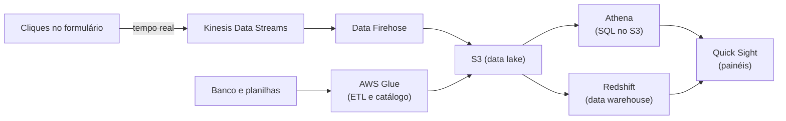

<!-- autoral -->

# 3.11 Analytics

> **Domínio 3 — Tecnologia e Serviços de Nuvem (34% da prova)** · Depende das aulas [0.3](../fundamentos/03-dados.md), [3.7](07-bancos-de-dados.md) e [3.8](08-s3.md)

> 🔎 **Fichas para aprofundar:** [Amazon Athena](../../servicos/analytics/athena.md) · [AWS Glue](../../servicos/analytics/glue.md) · [Amazon Kinesis e Amazon Data Firehose](../../servicos/analytics/kinesis.md) · [Amazon EMR](../../servicos/analytics/emr.md) · [Amazon Quick Sight](../../servicos/analytics/quicksight.md) · [Amazon OpenSearch Service](../../servicos/analytics/opensearch.md) · [Amazon Redshift](../../servicos/banco-de-dados/redshift.md)

⬅️ [3.10 Redes e entrega de conteúdo](10-rede-e-entrega-de-conteudo.md) · 🏠 [Índice do domínio](README.md) · 🏫 [O caso da escola](../00-guia-do-exame/caso-da-escola.md) · [3.12 IA e machine learning](12-ia-e-machine-learning.md) ➡️

---

A direção da rede de escolas quer respostas: quantas matrículas foram feitas por unidade em cada janeiro dos últimos cinco anos, quais turmas têm mais faltas, em que horário o site recebe mais acessos. Os dados existem, mas estão espalhados: registros de acesso guardados no S3, o banco do sistema de matrícula, planilhas das secretarias. E a coordenação quer ver, ao vivo, quantas pessoas estão preenchendo o formulário de matrícula no primeiro dia de inscrições.

Responder a essas perguntas é o trabalho de **análise de dados** (analytics). Ele tem etapas: **coletar** os dados (às vezes em tempo real), **preparar** e catalogar, **guardar** num lugar próprio para análise, **consultar** e **visualizar**. A AWS tem serviços para cada etapa, e o guia do exame cobra identificá-los, citando Amazon Athena, Amazon Kinesis, AWS Glue e Amazon Quick Sight.

## Onde os dados ficam para análise: data lake e data warehouse

Dois nomes aparecem sempre:

- Um **data lake** (lago de dados) é um repositório central que guarda dados estruturados e não estruturados, em qualquer escala, **como chegaram**, sem precisar organizá-los antes. Na AWS, o data lake costuma ser o Amazon S3 ([aula 3.8](08-s3.md)).
- Um **data warehouse** (armazém de dados) é um banco otimizado para analisar dados relacionais vindos dos sistemas da empresa, com a estrutura definida antes de os dados entrarem. Na AWS, é o **Amazon Redshift**, um data warehouse gerenciado na escala de petabytes, consultado com SQL e com ferramentas de relatório (BI). O Redshift Serverless provisiona a capacidade sozinho e não cobra quando está parado.

A diferença para o banco do sistema de matrícula ([aula 3.7](07-bancos-de-dados.md)): o banco transacional atende muitas operações pequenas do dia a dia, como gravar uma matrícula; o data warehouse atende poucas consultas grandes, como somar cinco anos de matrículas por unidade. Muitas empresas usam data lake e data warehouse juntos, porque atendem necessidades diferentes.

## Preparar e catalogar: AWS Glue

Dados espalhados em formatos diferentes precisam ser descobertos, limpos e organizados antes da análise. Esse trabalho tem um nome clássico, **ETL**: extrair (extract) os dados da origem, transformá-los (transform) e carregá-los (load) no destino.

O **AWS Glue** é um serviço **serverless de integração de dados**. Ele descobre e conecta mais de 70 fontes de dados, cria e roda pipelines de ETL para levar os dados ao data lake e mantém um **catálogo de dados** central, que registra onde está cada conjunto de dados e qual a sua estrutura. Os dados catalogados podem ser consultados pelo Athena, pelo EMR e pelo Redshift. Na escola, o Glue junta os registros de acesso, as exportações do banco e as planilhas num formato comum no S3.

## Consultar com SQL direto no S3: Amazon Athena

O **Amazon Athena** é um serviço de consulta interativa que analisa dados **direto no Amazon S3** usando SQL padrão. Você aponta o Athena para os dados e começa a consultar, sem montar servidor nem carregar os dados em outro lugar. É **serverless**: você paga pelas consultas que roda, pela **quantidade de dados lidos** em cada uma.

Por isso, organizar bem os dados reduz a conta: a AWS informa economia de até 90% por consulta ao **comprimir**, **particionar** e converter os dados para formatos colunares, porque o Athena passa a ler menos. Para a pergunta "em que horário o site recebe mais acessos", o Athena consulta os registros de acesso no S3 sem mover nada.

O limite é o outro lado da cobrança: uma consulta que varre arquivos grandes, sem compressão nem partição, lê tudo e custa mais, mesmo que a resposta seja pequena.

## Dados em tempo real: Amazon Kinesis e Amazon Data Firehose

Alguns dados não podem esperar a análise do fim do dia. Um **fluxo de dados** (streaming) é uma sequência contínua de registros pequenos, como cliques, leituras de sensores ou eventos de um aplicativo, que chegam o tempo todo.

- O **Amazon Kinesis Data Streams** coleta e processa grandes fluxos de registros **em tempo real**. Aplicações leem o fluxo e reagem enquanto os dados chegam.
- O **Amazon Data Firehose** (antes chamado Kinesis Data Firehose) é totalmente gerenciado e **entrega** fluxos de dados em tempo real a destinos como o S3, o Redshift e o OpenSearch Service, sem que você escreva a aplicação que lê o fluxo.
- O **Amazon Kinesis Video Streams** leva vídeo ao vivo de dispositivos para a AWS.

Na escola, cada clique no formulário de matrícula entra num fluxo do Kinesis, e um painel mostra ao vivo quantas pessoas estão preenchendo. O Firehose pode guardar esses mesmos eventos no S3 para análise posterior.

## Processar grandes volumes: Amazon EMR

O **Amazon EMR** é uma plataforma gerenciada de clusters para rodar ferramentas de **big data** de código aberto, como **Apache Hadoop** e **Apache Spark**, e processar e analisar volumes muito grandes de dados. A AWS cuida da criação e do gerenciamento do cluster; a equipe traz o conhecimento dessas ferramentas. "Spark" ou "Hadoop" no enunciado aponta para o EMR.

## Busca e análise de registros: Amazon OpenSearch Service

O **Amazon OpenSearch Service** é um serviço gerenciado para implantar, operar e escalar clusters do **OpenSearch**, um mecanismo de busca e análise de código aberto. Atende **busca** (como a busca de materiais no portal da escola), **análise de registros** (logs) e monitoramento de aplicações em tempo real. Ele também aceita versões antigas do Elasticsearch.

## Visualizar: Amazon Quick Sight

No fim do caminho, alguém precisa ver os números. O **Amazon Quick Sight** é o serviço de **visualização de dados e inteligência de negócios** (BI) da AWS: conecta-se às fontes de dados, cria **painéis** (dashboards) interativos e permite incorporar análises em aplicações. Ele faz parte do **Amazon Quick**, um serviço com IA que também automatiza tarefas e responde perguntas em linguagem natural sobre os dados. Os painéis de matrículas por unidade da direção ficam no Quick Sight.

## Como escolher

| Necessidade | Serviço |
|---|---|
| Guardar dados brutos em qualquer escala (data lake) | Amazon S3 |
| Data warehouse para consultas e relatórios com SQL | Amazon Redshift |
| Descobrir, catalogar e transformar dados (ETL) | AWS Glue |
| SQL direto nos arquivos do S3, sem servidor | Amazon Athena |
| Coletar e processar dados em tempo real | Amazon Kinesis Data Streams |
| Entregar fluxos de dados ao S3, Redshift ou OpenSearch | Amazon Data Firehose |
| Hadoop e Spark gerenciados | Amazon EMR |
| Busca e análise de logs | Amazon OpenSearch Service |
| Painéis e relatórios de BI | Amazon Quick Sight |

*Figura 3.11 — Coletar, preparar, guardar, consultar e visualizar: um serviço para cada etapa da análise.*

## Na prova

- **"SQL direto nos dados do S3, sem servidor, paga por consulta" = Athena.**
- **"Dados em tempo real, streaming, cliques, telemetria" = Kinesis; "entregar o fluxo no S3 ou Redshift" = Data Firehose.**
- **"ETL", "preparar dados", "catálogo de dados" = Glue.**
- **"Painéis, dashboards, BI" = Quick Sight.**
- **"Data warehouse", "relatórios sobre petabytes com SQL" = Redshift.**
- **"Hadoop", "Spark", "big data gerenciado" = EMR.**
- **"Busca de texto", "análise de logs" = OpenSearch Service.**

## Caso resolvido

**Situação.** A direção quer um painel com o número de acessos ao site por hora nos últimos dois anos. Os registros de acesso já estão guardados no S3, em arquivos de texto. A equipe de TI é pequena, não quer manter servidores e precisa de uma resposta ainda nesta semana. O que usar?

**Raciocínio.** Os dados já estão no S3, e a pergunta é pontual: o Athena consulta os arquivos com SQL, sem servidor e sem mover os dados, e cobra só pelos dados lidos. O Glue pode catalogar a estrutura dos arquivos para o Athena consultá-los, e converter os dados para um formato colunar comprimido baixa o custo das consultas seguintes. O Quick Sight se conecta ao Athena e mostra o painel para a direção.

**Por que as alternativas tentadoras falham.** Montar um data warehouse no Redshift para uma pergunta pontual exige carregar os dados e é mais trabalho do que o pedido precisa. O Kinesis serve para dados chegando em tempo real, e estes já estão guardados. O EMR exige conhecimento de Hadoop ou Spark que a equipe pequena não tem e não é necessário para uma consulta SQL.

## Revisão

Tente responder antes de abrir cada resposta.

### Qual é a diferença entre data lake e data warehouse?

Ver resposta

O data lake guarda dados estruturados e não estruturados como chegaram, em qualquer escala; o data warehouse guarda dados relacionais organizados antes, otimizados para consultas analíticas.

Comentário: na AWS, o data lake costuma ser o S3, e o data warehouse é o Redshift.

### Como o Amazon Athena é cobrado, e como reduzir esse custo?

Ver resposta

Pela quantidade de dados lidos em cada consulta; comprimir, particionar e usar formatos colunares reduz o que o Athena lê.

Comentário: o Athena é serverless e consulta os dados direto no S3 com SQL.

### O que o AWS Glue faz?

Ver resposta

Descobre, prepara e integra dados de muitas fontes, roda pipelines de ETL sem servidor e mantém um catálogo central de dados.

Comentário: os dados catalogados podem ser consultados pelo Athena, pelo EMR e pelo Redshift.

### Quando usar o Amazon Kinesis?

Ver resposta

Quando os dados chegam em fluxo contínuo e precisam ser coletados e processados em tempo real, como cliques ou leituras de sensores.

Comentário: o Data Firehose entrega esses fluxos a destinos como o S3 e o Redshift sem que você escreva a aplicação que os lê.

### Que serviço cria painéis de BI na AWS?

Ver resposta

O Amazon Quick Sight, que se conecta às fontes de dados e cria painéis interativos.

Comentário: ele faz parte do Amazon Quick, um serviço com IA.

## Resumo

- Data lake (S3) guarda dados como chegaram; data warehouse (Redshift) guarda dados organizados para análise.
- Glue prepara e cataloga; Athena consulta o S3 com SQL sem servidor.
- Kinesis coleta fluxos em tempo real; Data Firehose os entrega aos destinos.
- EMR roda Hadoop e Spark; OpenSearch Service faz busca e análise de logs.
- Quick Sight cria os painéis de BI.

## Fontes oficiais

Verificadas em 06/10/2026.

- [Content Domain 3 do guia do exame CLF-C02](https://docs.aws.amazon.com/aws-certification/latest/cloud-practitioner-02/cloud-practitioner-02-domain3.html): tarefa 3.7 (serviços de análise de dados).
- [In-Scope AWS Services](https://docs.aws.amazon.com/aws-certification/latest/cloud-practitioner-02/clf-02-in-scope-services.html): Athena, EMR, Glue, Kinesis, OpenSearch Service, Quick Sight e Redshift na categoria de análise.
- [What is a data lake? (página da AWS)](https://aws.amazon.com/what-is/data-lake/): data lake e comparação com data warehouse.
- [What is Amazon Redshift?](https://docs.aws.amazon.com/redshift/latest/mgmt/welcome.html): data warehouse gerenciado, petabytes, Redshift Serverless.
- [What is AWS Glue?](https://docs.aws.amazon.com/glue/latest/dg/what-is-glue.html): integração de dados serverless, mais de 70 fontes, ETL e catálogo.
- [What is Amazon Athena?](https://docs.aws.amazon.com/athena/latest/ug/what-is.html) e [Amazon Athena pricing](https://aws.amazon.com/athena/pricing/): SQL no S3, serverless, cobrança por dados lidos, economia de até 90%.
- [What is Kinesis Data Streams?](https://docs.aws.amazon.com/streams/latest/dev/introduction.html), [What is Amazon Data Firehose?](https://docs.aws.amazon.com/firehose/latest/dev/what-is-this-service.html) e [What is Kinesis Video Streams?](https://docs.aws.amazon.com/kinesisvideostreams/latest/dg/what-is-kinesis-video.html): fluxos em tempo real, entrega e vídeo.
- [What is Amazon EMR?](https://docs.aws.amazon.com/emr/latest/ManagementGuide/emr-what-is-emr.html): clusters gerenciados de Hadoop e Spark.
- [What is Amazon OpenSearch Service?](https://docs.aws.amazon.com/opensearch-service/latest/developerguide/what-is.html): busca e análise de logs.
- [What is Amazon Quick?](https://docs.aws.amazon.com/quicksuite/latest/userguide/what-is.html): Quick Sight como recurso de visualização e BI do Amazon Quick.

<!-- notas:inicio -->
## 📝 Minhas anotações

<!-- Escreva aqui suas observações, dúvidas e as questões que você errou sobre o tema. -->
<!-- notas:fim -->

---

⬅️ [3.10 Redes e entrega de conteúdo](10-rede-e-entrega-de-conteudo.md) · 🏠 [Índice do domínio](README.md) · [3.12 IA e machine learning](12-ia-e-machine-learning.md) ➡️
