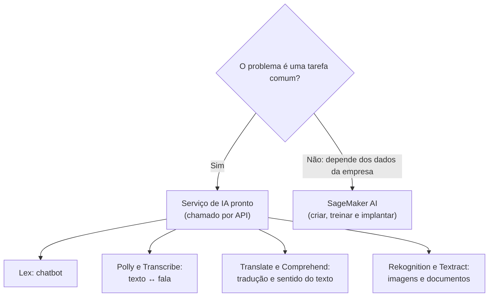

<!-- autoral -->

# 3.12 IA e machine learning

> **Domínio 3 — Tecnologia e Serviços de Nuvem (34% da prova)** · Depende das aulas [1.1](../01-conceitos-de-nuvem/01-o-que-e-computacao-em-nuvem.md) e [3.11](11-analytics.md)

> 🔎 **Fichas para aprofundar:** [Amazon SageMaker AI](../../servicos/ia-ml/sagemaker-ai.md) · [Amazon Q](../../servicos/ia-ml/amazon-q.md) · [Serviços de IA prontos (Rekognition, Comprehend, Lex, Polly, Transcribe, Translate, Textract e outros)](../../servicos/ia-ml/servicos-de-ia-prontos.md) · [Amazon Bedrock](../../servicos/ia-ml/bedrock.md)

⬅️ [3.11 Analytics](11-analytics.md) · 🏠 [Índice do domínio](README.md) · [3.13 Integração de aplicações](13-integracao-de-aplicacoes.md) ➡️

---

A rede de escolas tem uma lista de desejos. Atender os pais 24 horas por dia num chat que tire dúvidas sobre a matrícula. Ler automaticamente os documentos digitalizados que os pais enviam (certidões, comprovantes de endereço). Transformar as gravações das reuniões em texto. Oferecer os comunicados em inglês para as famílias de Lisboa que não falam português. E, num projeto mais ambicioso, prever quais alunos correm risco de abandonar a escola.

Tudo isso é **inteligência artificial**. A boa notícia é que a maior parte não exige uma equipe de cientistas de dados: a AWS oferece serviços prontos, chamados por API, para cada tarefa comum. O guia do exame cobra entender os serviços de IA e machine learning e as tarefas que eles fazem, citando o Amazon SageMaker AI e o Amazon Lex.

## IA, machine learning e IA generativa

Três termos se encaixam um dentro do outro:

- **Inteligência artificial** (IA) é o termo mais amplo: estratégias e técnicas para que máquinas façam tarefas que parecem humanas, como entender uma frase ou reconhecer um rosto.
- **Machine learning** (aprendizado de máquina, ML) é um tipo de IA que analisa dados sem instruções explícitas: processa grandes quantidades de dados históricos, encontra padrões e faz previsões sobre dados novos. O resultado do treinamento é um **modelo**, que recebe dados novos e devolve uma previsão.
- **IA generativa** é um tipo de IA que **cria conteúdo novo**: conversas, textos, imagens, vídeos, música. Ela usa **modelos de fundação** (foundation models), modelos de ML treinados com uma enorme variedade de dados gerais e capazes de realizar muitas tarefas diferentes.

Para a prova, a pergunta prática é: o problema é uma tarefa comum, que um serviço pronto resolve, ou exige um modelo próprio, treinado com os dados da empresa?

## Serviços de IA prontos

Cada um destes serviços resolve uma tarefa específica, já vem treinado pela AWS e é usado por chamadas de API, sem conhecimento de machine learning:

| Serviço | O que faz | Na escola |
|---|---|---|
| Amazon Lex | Cria **interfaces conversacionais** (chatbots) por voz e texto, com reconhecimento de fala e compreensão de linguagem natural | Chat que tira dúvidas da matrícula |
| Amazon Polly | Converte **texto em fala** com vozes realistas | Ler os comunicados em voz alta no aplicativo |
| Amazon Transcribe | Converte **fala em texto** (reconhecimento automático de fala), separando quem falou | Transcrever as reuniões de pais |
| Amazon Translate | **Traduz textos** entre idiomas | Comunicados em inglês para Lisboa |
| Amazon Comprehend | **Processamento de linguagem natural**: identifica entidades, frases-chave, idioma e **sentimento** de um texto | Saber se os comentários da pesquisa de satisfação são positivos ou negativos |
| Amazon Rekognition | **Análise de imagens e vídeos**: detecta objetos, textos e conteúdo impróprio, e compara rostos | Conferir se a foto enviada mostra um rosto |
| Amazon Textract | **Extrai texto, formulários e tabelas** de documentos, inclusive texto escrito à mão | Ler as certidões digitalizadas |

Dois pares confundem na prova. **Polly e Transcribe** fazem caminhos opostos: Polly vai do texto para a voz; Transcribe, da voz para o texto. **Textract e Rekognition** olham imagens, mas com objetivos diferentes: Textract extrai o conteúdo de documentos (campos, tabelas); Rekognition analisa o que aparece em fotos e vídeos (rostos, objetos, cenas).

Os serviços também se combinam. Um áudio em inglês pode passar pelo Transcribe (vira texto), pelo Translate (vira português) e pelo Polly (vira voz em português).

## Amazon SageMaker AI: modelos próprios

Prever o risco de abandono escolar não é uma tarefa pronta: depende das notas, das faltas e do histórico dos alunos da própria rede. Para isso, é preciso **treinar um modelo próprio**.

O **Amazon SageMaker AI** é um serviço de machine learning **totalmente gerenciado**. Com ele, cientistas de dados e desenvolvedores **criam, treinam e implantam** modelos de ML num ambiente hospedado pronto para produção, sem montar e gerenciar os próprios servidores. Ele oferece algoritmos gerenciados e aceita os algoritmos e frameworks que a equipe já usa.

A diferença em relação aos serviços prontos é de responsabilidade: com o SageMaker AI, a empresa escolhe os dados, treina o modelo e avalia o resultado; a AWS cuida da infraestrutura. Com o Rekognition, por exemplo, a AWS já entrega o modelo treinado.

## IA generativa: Amazon Q

O **Amazon Q** é a família de assistentes de IA generativa da AWS, e está na lista de serviços do exame. O **Amazon Q Developer** é um assistente conversacional que ajuda a entender, criar, estender e operar aplicações na AWS: responde perguntas sobre arquitetura, sobre os recursos da conta, boas práticas e documentação.

Duas mudanças recentes: o **Amazon Q Business**, assistente que respondia perguntas com base nos dados da empresa, não aceita mais clientes novos (a AWS indica o Amazon Quick, visto na [aula 3.11](11-analytics.md), para funções parecidas); e os plugins do Q Developer para editores de código deixam de ter suporte em 30/04/2027.

O **Amazon Bedrock**, serviço gerenciado que dá acesso a modelos de fundação de várias empresas de IA para criar aplicações de IA generativa, aparece com frequência em materiais sobre a AWS, mas não está na lista de serviços do exame CLF-C02.

## Como escolher

| Pedido | Serviço |
|---|---|
| Chatbot por voz ou texto | Lex |
| Texto em fala | Polly |
| Fala em texto | Transcribe |
| Tradução | Translate |
| Sentimento, entidades e idioma de textos | Comprehend |
| Rostos, objetos e conteúdo impróprio em imagens e vídeos | Rekognition |
| Texto, formulários e tabelas de documentos | Textract |
| Treinar e implantar um modelo próprio | SageMaker AI |
| Assistente de IA generativa para a AWS | Amazon Q Developer |

*Figura 3.12 — Tarefa comum pede um serviço pronto; um modelo próprio pede o SageMaker AI.*

## Na prova

- **"Criar, treinar e implantar modelos de ML" = SageMaker AI.**
- **"Chatbot", "interface conversacional" = Lex.**
- **"Texto em fala" = Polly; "fala em texto", "transcrever" = Transcribe.**
- **"Traduzir" = Translate.**
- **"Sentimento", "entidades", "linguagem natural" = Comprehend.**
- **"Rostos", "objetos em imagens e vídeos", "conteúdo impróprio" = Rekognition.**
- **"Extrair texto e tabelas de documentos digitalizados" = Textract.**
- **"Assistente de IA generativa da AWS" = Amazon Q.**

## Caso resolvido

**Situação.** A secretaria recebe centenas de certidões de nascimento digitalizadas por semana e digita os dados à mão no sistema. Ela quer automatizar a leitura dos campos (nome, data de nascimento, filiação) e, depois, conferir se a foto enviada pelo pai mostra mesmo um rosto. A equipe não tem cientistas de dados. O que usar?

**Raciocínio.** Ler campos de documentos digitalizados é a tarefa do Textract, que extrai texto, formulários e tabelas, inclusive texto à mão, por chamada de API. Conferir se uma foto mostra um rosto é análise de imagem, tarefa do Rekognition. Os dois são serviços prontos, sem treinamento de modelo, o que atende uma equipe sem cientistas de dados.

**Por que as alternativas tentadoras falham.** O SageMaker AI permitiria treinar um modelo próprio, mas exige conhecimento de ML e dados de treino, e as tarefas já têm serviço pronto. O Rekognition detecta texto em imagens, mas não organiza formulários e tabelas como o Textract. O Comprehend analisa o sentido de um texto que já existe; ele não lê o documento digitalizado.

## Revisão

Tente responder antes de abrir cada resposta.

### Qual é a relação entre IA, machine learning e IA generativa?

Ver resposta

IA é o termo amplo; machine learning é um tipo de IA que aprende padrões a partir de dados; IA generativa é um tipo de IA que cria conteúdo novo usando modelos de fundação.

Comentário: modelos de fundação são treinados com muitos dados gerais e fazem muitas tarefas diferentes.

### Quando usar o SageMaker AI em vez de um serviço de IA pronto?

Ver resposta

Quando o problema exige um modelo próprio, treinado com os dados da empresa, que nenhum serviço pronto resolve.

Comentário: com o SageMaker AI, a empresa cria, treina e implanta o modelo; a AWS cuida da infraestrutura.

### Qual é a diferença entre Amazon Polly e Amazon Transcribe?

Ver resposta

O Polly converte texto em fala; o Transcribe converte fala em texto.

Comentário: o Translate traduz textos e pode ficar entre os dois.

### Qual é a diferença entre Amazon Textract e Amazon Rekognition?

Ver resposta

O Textract extrai texto, formulários e tabelas de documentos; o Rekognition analisa imagens e vídeos para detectar rostos, objetos e conteúdo impróprio.

Comentário: "documento digitalizado" aponta para o Textract.

### Para que serve o Amazon Lex?

Ver resposta

Para criar interfaces conversacionais, como chatbots, por voz e texto, com reconhecimento de fala e compreensão de linguagem natural.

Comentário: não é preciso conhecimento de deep learning para criar um chatbot com o Lex.

## Resumo

- IA é o termo amplo; ML aprende com dados; IA generativa cria conteúdo com modelos de fundação.
- Serviços prontos: Lex (chatbot), Polly (texto em fala), Transcribe (fala em texto), Translate (tradução), Comprehend (sentido do texto), Rekognition (imagens e vídeos), Textract (documentos).
- SageMaker AI cria, treina e implanta modelos próprios.
- Amazon Q é o assistente de IA generativa da AWS; o Q Business não aceita clientes novos.

## Fontes oficiais

Verificadas em 06/10/2026.

- [Content Domain 3 do guia do exame CLF-C02](https://docs.aws.amazon.com/aws-certification/latest/cloud-practitioner-02/cloud-practitioner-02-domain3.html): tarefa 3.7 (serviços de IA e ML).
- [In-Scope AWS Services](https://docs.aws.amazon.com/aws-certification/latest/cloud-practitioner-02/clf-02-in-scope-services.html): Comprehend, Lex, Polly, Amazon Q, Rekognition, SageMaker AI, Textract, Transcribe e Translate na categoria de machine learning.
- [What is AI?](https://aws.amazon.com/what-is/artificial-intelligence/), [What is machine learning?](https://aws.amazon.com/what-is/machine-learning/) e [What is generative AI?](https://aws.amazon.com/what-is/generative-ai/): definições e modelos de fundação.
- [What is Amazon SageMaker AI?](https://docs.aws.amazon.com/sagemaker/latest/dg/whatis.html): criar, treinar e implantar modelos, totalmente gerenciado.
- [What is Amazon Lex V2?](https://docs.aws.amazon.com/lexv2/latest/dg/what-is.html), [What is Amazon Polly?](https://docs.aws.amazon.com/polly/latest/dg/what-is.html), [What is Amazon Transcribe?](https://docs.aws.amazon.com/transcribe/latest/dg/what-is.html) e [What is Amazon Translate?](https://docs.aws.amazon.com/translate/latest/dg/what-is.html): chatbots, texto em fala, fala em texto e tradução.
- [What is Amazon Comprehend?](https://docs.aws.amazon.com/comprehend/latest/dg/what-is.html), [What is Amazon Rekognition?](https://docs.aws.amazon.com/rekognition/latest/dg/what-is.html) e [What is Amazon Textract?](https://docs.aws.amazon.com/textract/latest/dg/what-is.html): linguagem natural, imagens e vídeos, documentos.
- [What is Amazon Q Developer?](https://docs.aws.amazon.com/amazonq/latest/qdeveloper-ug/what-is.html) e [Amazon Q Business availability change](https://docs.aws.amazon.com/amazonq/latest/qbusiness-ug/qbusiness-availability-change.html): assistente para a AWS, fim do suporte dos plugins e Q Business fechado a novos clientes.
- [What is Amazon Bedrock?](https://docs.aws.amazon.com/bedrock/latest/userguide/what-is-bedrock.html): acesso gerenciado a modelos de fundação.

<!-- notas:inicio -->
## 📝 Minhas anotações

<!-- Escreva aqui suas observações, dúvidas e as questões que você errou sobre o tema. -->
<!-- notas:fim -->

---

⬅️ [3.11 Analytics](11-analytics.md) · 🏠 [Índice do domínio](README.md) · [3.13 Integração de aplicações](13-integracao-de-aplicacoes.md) ➡️
