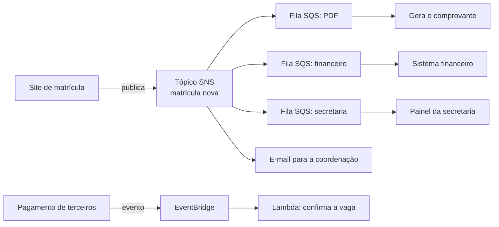

<!-- autoral -->

# 3.13 Integração de aplicações

> **Domínio 3 — Tecnologia e Serviços de Nuvem (34% da prova)** · Depende das aulas [0.4](../fundamentos/04-api-e-filas.md), [1.3](../01-conceitos-de-nuvem/03-conceitos-de-arquitetura.md) e [3.5](05-containers-e-serverless.md)

> 🔎 **Fichas para aprofundar:** [Amazon SQS](../../servicos/integracao/sqs.md) · [Amazon SNS](../../servicos/integracao/sns.md) · [Amazon EventBridge](../../servicos/integracao/eventbridge.md) · [AWS Step Functions](../../servicos/integracao/step-functions.md)

⬅️ [3.12 IA e machine learning](12-ia-e-machine-learning.md) · 🏠 [Índice do domínio](README.md) · [3.14 Aplicações de negócio, usuário final, front-end e IoT](14-aplicacoes-de-negocio-e-iot.md) ➡️

---

No primeiro dia de inscrições, milhares de pais enviam o formulário de matrícula ao mesmo tempo. Cada envio dispara trabalhos demorados: gerar o PDF do comprovante, enviar o e-mail de confirmação, avisar a secretaria da unidade, atualizar o sistema financeiro. Se o site esperar todos esses trabalhos terminarem antes de responder ao pai, ele trava. Se o sistema financeiro cair, as matrículas não podem se perder.

Na [aula 0.4](../fundamentos/04-api-e-filas.md), você viu a solução em palavras simples: deixar o recado numa **fila** em vez de esperar, e usar um **tópico** para avisar vários interessados de uma vez. Na [aula 1.3](../01-conceitos-de-nuvem/03-conceitos-de-arquitetura.md), viu que isso se chama **acoplamento fraco**: componentes que não dependem de que os outros estejam no ar no mesmo instante. Esta aula apresenta os serviços da AWS para isso. O guia do exame cobra o Amazon EventBridge, o Amazon SNS e o Amazon SQS, e a escolha do serviço certo para entregar mensagens e enviar alertas e notificações.

## Amazon SQS: a fila

O **Amazon SQS** (Simple Queue Service) oferece uma fila hospedada, segura, durável e disponível, para **integrar e desacoplar** componentes de um sistema. Um componente (o **produtor**) envia mensagens para a fila; outro (o **consumidor**) busca as mensagens quando pode, processa e as apaga. As mensagens ficam guardadas em vários servidores, por **4 dias** por padrão, com máximo configurável de **14 dias**.

Na escola, o site grava cada matrícula na fila e responde ao pai na hora. As instâncias que geram os PDFs puxam as mensagens no ritmo delas. Se houver um pico, a fila cresce e as instâncias vão esvaziando; se uma instância cair, a mensagem continua na fila para outra pegar.

Há dois tipos de fila:

| | Fila padrão (Standard) | Fila FIFO |
|---|---|---|
| Vazão | Quase ilimitada | Alta, com limites por segundo |
| Entrega | Pelo menos uma vez: uma mensagem pode chegar repetida | Processamento exato uma vez |
| Ordem | Melhor esforço: pode chegar fora de ordem | Primeiro a entrar, primeiro a sair, dentro de cada grupo de mensagens |

FIFO quer dizer *first in, first out*. A fila padrão serve quando a vazão importa mais; a FIFO, quando a ordem e a ausência de repetição importam, como lançamentos financeiros na ordem em que aconteceram.

O SQS também oferece a **fila de mensagens mortas** (dead-letter queue), que recebe as mensagens que falharam várias vezes, para que alguém investigue sem travar a fila principal.

## Amazon SNS: o tópico que avisa todos

Uma matrícula nova interessa a vários sistemas ao mesmo tempo. O **Amazon SNS** (Simple Notification Service) é um serviço totalmente gerenciado que entrega mensagens de **publicadores** a **assinantes**. O publicador envia a mensagem para um **tópico**, e o SNS a entrega a todos os assinantes daquele tópico. Esse modelo se chama **publicar e assinar** (pub/sub).

Os assinantes podem ser filas do SQS, funções Lambda, endereços HTTP(S), e-mail, notificações push em celulares, SMS e o Amazon Data Firehose, entre outros. Por isso o SNS é a resposta para **alertas e notificações**: avisar a equipe por e-mail ou SMS quando algo acontece.

A diferença essencial para o SQS: na fila, a mensagem espera até um consumidor buscá-la, e cada mensagem é processada por um consumidor; no tópico, o SNS **empurra** a mensagem para todos os assinantes na hora.

Os dois se combinam no padrão **fan-out** (espalhar): a mensagem publicada no tópico do SNS é copiada para várias filas do SQS, e cada fila alimenta um sistema diferente, em paralelo. Na escola, o tópico "matrícula nova" alimenta a fila do PDF, a fila do financeiro e a fila da secretaria; se o financeiro cair, a fila dele guarda as mensagens até ele voltar.

## Amazon EventBridge: reagir a eventos

Um **evento** é o registro de que algo aconteceu: um arquivo chegou ao S3, uma instância parou, um pagamento foi aprovado num sistema de terceiros. Uma **arquitetura orientada a eventos** é feita de componentes fracamente acoplados que emitem eventos e reagem a eles.

O **Amazon EventBridge** é um serviço serverless que usa eventos para ligar os componentes de uma aplicação. Um **barramento de eventos** (event bus) recebe eventos de aplicações próprias, de serviços da AWS e de softwares de terceiros e os entrega aos destinos certos, filtrando e transformando no caminho. O **EventBridge Scheduler** é um agendador serverless que roda tarefas em horários definidos ou em intervalos recorrentes.

Na escola, quando o sistema de pagamento de terceiros avisa que a taxa de matrícula foi paga, o EventBridge reconhece o evento e aciona a função Lambda que confirma a vaga. Toda noite, o Scheduler dispara o relatório de matrículas do dia.

## AWS Step Functions: coordenar várias etapas

Alguns processos têm etapas em ordem, com decisões no meio: validar os documentos, esperar a aprovação da coordenação, reservar a vaga, cobrar a taxa e, se a cobrança falhar, liberar a vaga. Coordenar isso com código espalhado em várias funções fica frágil.

O **AWS Step Functions** cria **fluxos de trabalho** (workflows, também chamados máquinas de estado), sequências de etapas em que cada etapa pode chamar um serviço da AWS, como uma função Lambda. Ele trata erros com **novas tentativas** ou desviando para etapas alternativas, mostra cada execução visualmente no console e atende fluxos longos, inclusive os que esperam uma ação humana.

## Como escolher

| Necessidade | Serviço |
|---|---|
| Desacoplar componentes e absorver picos | SQS |
| Garantir ordem e processar cada mensagem uma vez | SQS FIFO |
| Avisar vários sistemas ou pessoas ao mesmo tempo | SNS |
| Enviar alertas por e-mail, SMS ou push | SNS |
| Uma mensagem para várias filas em paralelo | SNS + SQS (fan-out) |
| Reagir a eventos de serviços da AWS ou de terceiros | EventBridge |
| Agendar tarefas recorrentes | EventBridge Scheduler |
| Coordenar um processo com várias etapas e tratamento de erros | Step Functions |

*Figura 3.13 — Fan-out com SNS e SQS para os trabalhos da matrícula; EventBridge reage ao evento de pagamento.*

## Na prova

- **"Desacoplar", "absorver picos", "fila", "o consumidor busca as mensagens" = SQS.**
- **"Ordem garantida", "sem duplicadas" = SQS FIFO.**
- **"Notificar vários assinantes", "pub/sub", "alertas por e-mail ou SMS" = SNS.**
- **"Uma mensagem para várias filas" = fan-out com SNS e SQS.**
- **"Reagir a eventos de serviços da AWS ou de SaaS", "barramento de eventos", "agendar" = EventBridge.**
- **"Coordenar várias etapas, com novas tentativas e espera por aprovação" = Step Functions.**

## Caso resolvido

**Situação.** Quando um pai conclui a matrícula, três sistemas precisam saber: o que gera o comprovante, o financeiro e o painel da secretaria. O financeiro às vezes fica fora do ar por alguns minutos, e nenhuma matrícula pode se perder. Além disso, a coordenação quer receber um e-mail a cada matrícula. Como integrar?

**Raciocínio.** O site publica a matrícula num tópico do SNS. O tópico entrega a mensagem a três filas do SQS, uma para cada sistema (fan-out), e a um assinante de e-mail para a coordenação. Cada sistema consome a sua fila no seu ritmo. Se o financeiro cair, a fila dele guarda as mensagens (por 4 dias por padrão, até 14 dias) até ele voltar, e os outros sistemas seguem normalmente.

**Por que as alternativas tentadoras falham.** Uma única fila do SQS faria cada matrícula ser processada por um só consumidor, e os outros sistemas não a veriam. Só o SNS, sem filas, empurraria a mensagem para o financeiro no momento em que ele está fora do ar. Chamar os três sistemas direto do site deixa o pai esperando e faz uma falha num sistema derrubar a matrícula.

## Revisão

Tente responder antes de abrir cada resposta.

### Para que serve o Amazon SQS?

Ver resposta

Para desacoplar componentes com uma fila: o produtor envia mensagens, e o consumidor as busca e processa no seu ritmo, o que absorve picos e falhas.

Comentário: as mensagens ficam 4 dias por padrão, com máximo de 14 dias.

### Qual é a diferença entre uma fila padrão e uma fila FIFO no SQS?

Ver resposta

A fila padrão tem vazão quase ilimitada, mas pode repetir mensagens e entregá-las fora de ordem; a FIFO mantém a ordem dentro de cada grupo e processa cada mensagem uma vez.

Comentário: FIFO quer dizer primeiro a entrar, primeiro a sair.

### Qual é a diferença entre SQS e SNS?

Ver resposta

No SQS, a mensagem espera numa fila até um consumidor buscá-la; no SNS, a mensagem publicada num tópico é empurrada na hora para todos os assinantes.

Comentário: combinados, formam o fan-out: um tópico do SNS alimenta várias filas do SQS.

### Quando usar o Amazon EventBridge?

Ver resposta

Para ligar componentes por eventos: receber eventos de aplicações, de serviços da AWS e de softwares de terceiros e entregá-los aos destinos certos, ou para agendar tarefas com o EventBridge Scheduler.

Comentário: é a base de arquiteturas orientadas a eventos.

### O que o AWS Step Functions faz?

Ver resposta

Coordena fluxos de trabalho com várias etapas, chamando serviços como o Lambda, com novas tentativas e caminhos alternativos em caso de erro.

Comentário: atende fluxos longos, inclusive os que esperam uma ação humana.

## Resumo

- SQS é a fila que desacopla componentes; a padrão prioriza vazão, a FIFO prioriza ordem e processamento único.
- SNS publica num tópico e entrega a todos os assinantes, inclusive por e-mail e SMS.
- Fan-out: SNS espalha a mensagem para várias filas do SQS.
- EventBridge liga componentes por eventos e agenda tarefas.
- Step Functions coordena processos com várias etapas.

## Fontes oficiais

Verificadas em 06/10/2026.

- [Content Domain 3 do guia do exame CLF-C02](https://docs.aws.amazon.com/aws-certification/latest/cloud-practitioner-02/cloud-practitioner-02-domain3.html): tarefa 3.8 (EventBridge, SNS e SQS; entregar mensagens e enviar alertas).
- [In-Scope AWS Services](https://docs.aws.amazon.com/aws-certification/latest/cloud-practitioner-02/clf-02-in-scope-services.html): EventBridge, SNS, SQS e Step Functions na categoria de integração de aplicações.
- [What is Amazon SQS?](https://docs.aws.amazon.com/AWSSimpleQueueService/latest/SQSDeveloperGuide/welcome.html), [Amazon SQS queue types](https://docs.aws.amazon.com/AWSSimpleQueueService/latest/SQSDeveloperGuide/sqs-queue-types.html) e [Amazon SQS message quotas](https://docs.aws.amazon.com/AWSSimpleQueueService/latest/SQSDeveloperGuide/quotas-messages.html): fila durável, tipos padrão e FIFO, fila de mensagens mortas e retenção de 4 a 14 dias.
- [What is Amazon SNS?](https://docs.aws.amazon.com/sns/latest/dg/welcome.html) e [Fanout scenario](https://docs.aws.amazon.com/sns/latest/dg/sns-common-scenarios.html): tópicos, tipos de assinante e fan-out.
- [What is Amazon EventBridge?](https://docs.aws.amazon.com/eventbridge/latest/userguide/eb-what-is.html): arquitetura orientada a eventos, barramentos e Scheduler.
- [What is Step Functions?](https://docs.aws.amazon.com/step-functions/latest/dg/welcome.html): fluxos de trabalho, tratamento de erros e visualização.

<!-- notas:inicio -->
## 📝 Minhas anotações

<!-- Escreva aqui suas observações, dúvidas e as questões que você errou sobre o tema. -->
<!-- notas:fim -->

---

⬅️ [3.12 IA e machine learning](12-ia-e-machine-learning.md) · 🏠 [Índice do domínio](README.md) · [3.14 Aplicações de negócio, usuário final, front-end e IoT](14-aplicacoes-de-negocio-e-iot.md) ➡️
