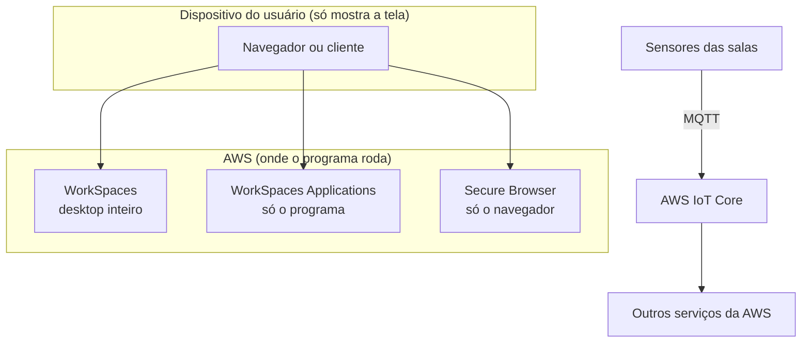

<!-- autoral -->

# 3.14 Aplicações de negócio, usuário final, front-end e IoT

> **Domínio 3 — Tecnologia e Serviços de Nuvem (34% da prova)** · Depende das aulas [1.1](../01-conceitos-de-nuvem/01-o-que-e-computacao-em-nuvem.md), [3.10](10-rede-e-entrega-de-conteudo.md) e [3.13](13-integracao-de-aplicacoes.md)

> 🔎 **Fichas para aprofundar:** [Amazon Connect](../../servicos/aplicacoes/amazon-connect.md) · [Amazon SES](../../servicos/aplicacoes/ses.md) · [Amazon WorkSpaces, WorkSpaces Applications e WorkSpaces Secure Browser](../../servicos/aplicacoes/workspaces-e-appstream.md) · [AWS Amplify](../../servicos/aplicacoes/amplify-e-appsync.md) · [AWS IoT Core](../../servicos/aplicacoes/iot-core-e-greengrass.md)

⬅️ [3.13 Integração de aplicações](13-integracao-de-aplicacoes.md) · 🏠 [Índice do domínio](README.md) · [3.15 Ferramentas de desenvolvimento](15-ferramentas-de-desenvolvimento.md) ➡️

---

Nem tudo o que a rede de escolas precisa é infraestrutura para montar. A central telefônica da secretaria vive congestionada em janeiro. Os e-mails de confirmação de matrícula às vezes caem no spam. Os professores precisam usar um programa de notas instalado só nos computadores da escola, mas querem acessá-lo de casa. Uma equipe pequena quer lançar o aplicativo dos pais sem virar especialista em nuvem. E as salas novas têm sensores de temperatura que precisam mandar leituras para algum lugar.

Para cada pedido, a AWS tem um serviço pronto. A tarefa 3.8 do guia do exame cobra esses serviços por categoria: **aplicações de negócio** (Amazon Connect e Amazon SES), **computação para o usuário final** (Amazon AppStream 2.0, Amazon WorkSpaces e Amazon WorkSpaces Secure Browser), **front-end web e mobile** (AWS Amplify) e **IoT** (AWS IoT Core).

## Aplicações de negócio: Amazon Connect e Amazon SES

O **Amazon Connect** é a central de atendimento (contact center) da AWS, na nuvem. Clientes entram em contato pelo canal que preferirem, como voz, chat e SMS; atendentes resolvem os casos; supervisores acompanham as métricas da equipe; administradores configuram números de telefone, filas e roteamento. Os recursos de IA podem resolver parte dos atendimentos sozinhos. Não há custo fixo: paga-se pelo uso. A AWS passou a chamar o produto de **Amazon Connect Customer**, e "Amazon Connect" virou o nome de um conjunto de soluções; na prova, "central de atendimento na nuvem" continua apontando para o Amazon Connect.

O **Amazon SES** (Simple Email Service) é uma plataforma de **e-mail** para enviar e receber mensagens com os endereços e domínios da própria empresa. Serve para e-mails transacionais (como a confirmação de matrícula), de marketing (como a divulgação de um evento) e boletins, e também para receber e-mails e tratá-los por software.

A diferença para o SNS da [aula 3.13](13-integracao-de-aplicacoes.md): o SNS pode mandar uma notificação simples por e-mail a quem assinou um tópico; o SES é o serviço de e-mail completo, para mensagens formatadas enviadas da aplicação aos clientes.

## Computação para o usuário final

Esta categoria responde a uma pergunta do guia: que serviços apresentam o resultado de máquinas virtuais na tela do usuário? Nos três, o programa roda na AWS, e o dispositivo do usuário só mostra a tela.

- O **Amazon WorkSpaces** cria **desktops virtuais** na nuvem, com Windows ou Linux, acessados de vários dispositivos ou pelo navegador. Não é preciso comprar e instalar hardware, e usuários entram e saem com facilidade. O **WorkSpaces Personal** dá a cada pessoa um desktop persistente e só dela; o **WorkSpaces Pools** oferece desktops não persistentes, recriados a cada uso.
- O **Amazon WorkSpaces Applications**, que o guia do exame ainda chama pelo nome antigo, **Amazon AppStream 2.0**, faz **streaming de aplicações**: o usuário abre um programa de desktop pelo navegador ou por um cliente, sem receber um desktop inteiro. A empresa mantém uma só versão de cada programa, e todos usam a mais recente.
- O **Amazon WorkSpaces Secure Browser** é um serviço gerenciado que dá acesso seguro, pelo navegador, a sites internos e aplicações SaaS, sem que os dados da empresa cheguem ao dispositivo do usuário. A AWS anunciou que ele deixa de aceitar clientes novos a partir de 29/10/2026.

Na escola: o programa de notas vai para o WorkSpaces Applications, e os professores o abrem de casa pelo navegador; a equipe da secretaria que precisa de um computador completo recebe um WorkSpace.

## Front-end web e mobile: AWS Amplify

O **AWS Amplify** acelera o desenvolvimento de aplicações **web e mobile full-stack** (com a parte visível, o front-end, e a parte de servidor, o back-end), sem exigir conhecimento de nuvem. Ele hospeda e implanta o front-end a partir de um repositório Git, com entrega contínua e distribuição pela rede de borda do CloudFront ([aula 3.10](10-rede-e-entrega-de-conteudo.md)), e adiciona recursos como login de usuários, armazenamento e dados em tempo real, configurando os serviços da AWS por trás. É a resposta para a equipe pequena que quer lançar o aplicativo dos pais.

## IoT: AWS IoT Core

**Internet das coisas** (IoT) é o nome para dispositivos conectados à internet que não são computadores: sensores, câmeras, medidores, eletrodomésticos. Eles enviam leituras e recebem comandos.

O **AWS IoT Core** permite a comunicação segura, nos dois sentidos, entre dispositivos conectados e os serviços da AWS. Ele conecta, gerencia e escala frotas de dispositivos sem que você provisione servidores, com autenticação mútua e criptografia. Aceita protocolos usados por dispositivos, como **MQTT**, um protocolo leve de publicar e assinar mensagens, além de HTTPS. Na escola, os sensores de temperatura publicam as leituras no IoT Core, que as encaminha para outros serviços da AWS, por exemplo para guardar e analisar.

## Como escolher

| Pedido | Serviço |
|---|---|
| Central de atendimento na nuvem (voz, chat) | Amazon Connect |
| Enviar e-mails da aplicação para clientes | Amazon SES |
| Desktop completo na nuvem para cada pessoa | Amazon WorkSpaces |
| Abrir um programa de desktop pelo navegador | WorkSpaces Applications (antes AppStream 2.0) |
| Acesso seguro pelo navegador a sites internos | WorkSpaces Secure Browser |
| Criar e hospedar aplicações web e mobile full-stack | AWS Amplify |
| Conectar e gerenciar dispositivos IoT | AWS IoT Core |

*Figura 3.14 — Na computação para o usuário final, o programa roda na AWS e o dispositivo só mostra a tela; o IoT Core recebe as leituras dos sensores.*

## Na prova

- **"Call center", "central de atendimento na nuvem" = Amazon Connect.**
- **"Enviar e-mails transacionais ou de marketing" = SES**; notificação simples a assinantes = SNS.
- **"Desktop virtual para funcionários remotos" = WorkSpaces.**
- **"Rodar um aplicativo de desktop pelo navegador" = AppStream 2.0 (hoje WorkSpaces Applications).**
- **"Acesso seguro a sites internos pelo navegador, sem dados no dispositivo" = WorkSpaces Secure Browser.**
- **"Criar e implantar aplicações web e mobile full-stack" = Amplify.**
- **"Conectar e gerenciar dispositivos IoT", "MQTT" = IoT Core.**

## Caso resolvido

**Situação.** A rede de escolas contratou professores temporários para janeiro. Eles precisam usar o programa de notas, que hoje só roda instalado nos computadores da escola, a partir dos próprios notebooks, em casa. A direção não quer comprar computadores nem instalar o programa em máquinas pessoais, e quer que todos usem sempre a mesma versão. O que usar?

**Raciocínio.** O pedido é usar um único programa de desktop a partir de qualquer dispositivo, sem instalá-lo. É streaming de aplicações: o WorkSpaces Applications (o AppStream 2.0 do guia do exame) roda o programa na AWS, e o professor o abre pelo navegador. A escola mantém uma só versão, e todos usam a mais recente. Quando o contrato termina, basta remover o acesso.

**Por que as alternativas tentadoras falham.** O WorkSpaces resolveria, mas entrega um desktop inteiro para cada professor quando só um programa é necessário. O WorkSpaces Secure Browser dá acesso a sites internos e aplicações web, não a um programa de desktop. O Amplify serve para criar aplicações web e mobile novas, não para levar um programa existente ao navegador.

## Revisão

Tente responder antes de abrir cada resposta.

### Para que serve o Amazon Connect?

Ver resposta

É a central de atendimento na nuvem: clientes entram em contato por voz, chat ou SMS, e atendentes resolvem os casos, pagando-se pelo uso.

Comentário: a AWS passou a chamar o produto de Amazon Connect Customer.

### Qual é a diferença entre Amazon SES e Amazon SNS para enviar e-mails?

Ver resposta

O SES é o serviço de e-mail completo, para mensagens transacionais e de marketing enviadas da aplicação; o SNS manda notificações simples a quem assinou um tópico.

Comentário: o SES também recebe e-mails e permite tratá-los por software.

### Qual é a diferença entre WorkSpaces e WorkSpaces Applications (AppStream 2.0)?

Ver resposta

O WorkSpaces entrega um desktop virtual inteiro; o WorkSpaces Applications faz streaming de programas de desktop específicos para o navegador ou um cliente.

Comentário: nos dois, o programa roda na AWS e o dispositivo só mostra a tela.

### O que o AWS Amplify oferece?

Ver resposta

Ferramentas para criar, implantar e hospedar aplicações web e mobile full-stack, sem exigir conhecimento de nuvem.

Comentário: ele implanta a partir do Git e distribui pela rede de borda do CloudFront.

### Para que serve o AWS IoT Core?

Ver resposta

Para conectar dispositivos IoT à AWS com segurança, nos dois sentidos, e gerenciar frotas de dispositivos sem provisionar servidores.

Comentário: aceita protocolos como MQTT e HTTPS.

## Resumo

- Connect é a central de atendimento na nuvem; SES envia e recebe e-mails.
- WorkSpaces entrega desktops; WorkSpaces Applications (antes AppStream 2.0) entrega programas; Secure Browser dá acesso seguro a sites internos.
- Amplify cria e hospeda aplicações web e mobile full-stack.
- IoT Core conecta e gerencia dispositivos IoT.

## Fontes oficiais

Verificadas em 06/10/2026.

- [Content Domain 3 do guia do exame CLF-C02](https://docs.aws.amazon.com/aws-certification/latest/cloud-practitioner-02/cloud-practitioner-02-domain3.html): tarefa 3.8 (aplicações de negócio, computação para o usuário final, front-end e IoT).
- [In-Scope AWS Services](https://docs.aws.amazon.com/aws-certification/latest/cloud-practitioner-02/clf-02-in-scope-services.html): Connect, SES, AppStream 2.0, WorkSpaces, WorkSpaces Secure Browser, Amplify e IoT Core.
- [What is Amazon Connect?](https://docs.aws.amazon.com/connect/latest/adminguide/what-is-amazon-connect.html) e [Amazon Connect (página do produto)](https://aws.amazon.com/connect/): central de atendimento, novo nome Connect Customer e cobrança pelo uso.
- [What is Amazon SES?](https://docs.aws.amazon.com/ses/latest/dg/Welcome.html): envio e recebimento de e-mails.
- [What is Amazon WorkSpaces?](https://docs.aws.amazon.com/workspaces/latest/adminguide/amazon-workspaces.html): desktops virtuais, Personal e Pools.
- [What is WorkSpaces Applications?](https://docs.aws.amazon.com/appstream2/latest/developerguide/what-is-appstream.html) e [Amazon WorkSpaces Applications (página do produto)](https://aws.amazon.com/workspaces/applications/): streaming de aplicações, antigo AppStream 2.0.
- [Amazon WorkSpaces Secure Browser (página do produto)](https://aws.amazon.com/workspaces/secure-browser/): acesso seguro pelo navegador e fim da entrada de novos clientes em 29/10/2026.
- [AWS Amplify (página do produto)](https://aws.amazon.com/amplify/) e [Welcome to AWS Amplify Hosting](https://docs.aws.amazon.com/amplify/latest/userguide/welcome.html): aplicações full-stack e hospedagem com Git e CloudFront.
- [What is AWS IoT?](https://docs.aws.amazon.com/iot/latest/developerguide/what-is-aws-iot.html) e [AWS IoT Core (página do produto)](https://aws.amazon.com/iot-core/): comunicação segura com dispositivos, protocolos MQTT e HTTPS.

<!-- notas:inicio -->
## 📝 Minhas anotações

<!-- Escreva aqui suas observações, dúvidas e as questões que você errou sobre o tema. -->
<!-- notas:fim -->

---

⬅️ [3.13 Integração de aplicações](13-integracao-de-aplicacoes.md) · 🏠 [Índice do domínio](README.md) · [3.15 Ferramentas de desenvolvimento](15-ferramentas-de-desenvolvimento.md) ➡️
