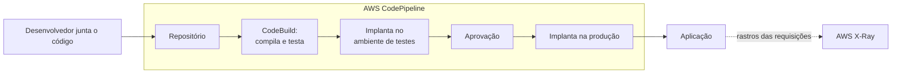

<!-- autoral -->

# 3.15 Ferramentas de desenvolvimento

> **Domínio 3 — Tecnologia e Serviços de Nuvem (34% da prova)** · Depende das aulas [3.1](01-formas-de-acesso-e-implantacao.md), [3.5](05-containers-e-serverless.md) e [3.13](13-integracao-de-aplicacoes.md)

> 🔎 **Fichas para aprofundar:** [Ferramentas de CI/CD (CodeBuild, CodePipeline e outras)](../../servicos/desenvolvimento/code-services.md) · [AWS X-Ray](../../servicos/desenvolvimento/x-ray.md) · [Console, CLI e SDKs](../../servicos/desenvolvimento/cli-sdk-e-cloudshell.md)

⬅️ [3.14 Aplicações de negócio, usuário final, front-end e IoT](14-aplicacoes-de-negocio-e-iot.md) · 🏠 [Índice do domínio](README.md) · [3.16 Gestão e governança](16-gestao-e-governanca.md) ➡️

---

A equipe que mantém o sistema de matrícula cresceu. Hoje, cada desenvolvedor termina sua parte, alguém junta o código à mão numa sexta-feira, compila no próprio computador e copia o resultado para os servidores. Às vezes uma mudança quebra outra, e ninguém percebe até os pais reclamarem. E quando o site fica lento, ninguém sabe se o problema está no site, na fila, na função Lambda ou no banco.

O guia do exame cobra identificar as ferramentas para **desenvolver, implantar e investigar problemas** em aplicações, citando o AWS CodeBuild, o AWS CodePipeline e o AWS X-Ray. Na lista de serviços do exame, a categoria de ferramentas de desenvolvimento tem esses três e a AWS CLI.

## CI/CD: entregar código com frequência e segurança

Dois termos resumem a solução para a sexta-feira caótica:

- **Integração contínua** (CI, *continuous integration*) é a prática em que os desenvolvedores juntam suas mudanças num repositório central com frequência, e cada junção dispara automaticamente a compilação e os testes. Um erro aparece minutos depois de entrar, não semanas.
- **Entrega contínua** (CD, *continuous delivery*) amplia a integração contínua: toda mudança que passa nos testes é preparada automaticamente para ir à produção, sendo implantada num ambiente de teste e, depois, na produção.

A sequência de etapas que leva o código do repositório à produção se chama **pipeline** (esteira). Na AWS, duas ferramentas da prova cuidam dela.

## AWS CodeBuild: compilar e testar

O **AWS CodeBuild** é um serviço de compilação (build) **totalmente gerenciado**. Ele compila o código-fonte, roda os testes de unidade e produz os pacotes prontos para implantar. Não há servidores de build para montar, atualizar ou escalar: o CodeBuild oferece ambientes prontos para as linguagens e ferramentas mais usadas, e aceita ambientes personalizados.

## AWS CodePipeline: automatizar a esteira

O **AWS CodePipeline** é um serviço de **entrega contínua**: você modela, visualiza e automatiza as etapas para lançar uma versão do software. Uma pipeline típica tem as etapas de **origem** (o código mudou no repositório), **build** (o CodeBuild compila e testa) e **implantação** (a nova versão vai para o ambiente). Cada mudança no código percorre a esteira sozinha.

Na escola, cada vez que alguém junta código no repositório, o CodePipeline chama o CodeBuild para compilar e testar; se os testes passarem, a nova versão é implantada no ambiente de testes e, com a aprovação, na produção. A sexta-feira caótica acaba.

Outras ferramentas da mesma família, como o AWS CodeDeploy (automatiza implantações) e o AWS CodeArtifact (repositório de pacotes de software), estão na lista de serviços **fora do escopo** do exame.

## AWS X-Ray: onde a requisição ficou lenta

Na [aula 3.13](13-integracao-de-aplicacoes.md), o sistema de matrícula virou um conjunto de peças: site, filas, funções Lambda, banco. Quando uma requisição demora, é preciso saber em qual peça.

O **AWS X-Ray** coleta dados sobre as requisições que a aplicação atende e oferece ferramentas para visualizar e filtrar esses dados e encontrar problemas e oportunidades de melhoria. Para cada requisição rastreada, ele mostra não só o pedido e a resposta, mas também as chamadas que a aplicação fez a outros recursos da AWS, microsserviços, bancos de dados e APIs. Esse acompanhamento de uma requisição por várias peças se chama **rastreamento distribuído**. Serviços como o Lambda já enviam dados ao X-Ray.

A diferença para o Amazon CloudWatch da [aula 2.7](../02-seguranca-e-conformidade/07-logs-monitoramento-e-auditoria.md): o CloudWatch coleta métricas e logs de cada recurso (o uso de CPU de uma instância, por exemplo); o X-Ray segue o caminho de uma requisição de ponta a ponta.

## AWS CLI e SDKs

A **AWS CLI** (interface de linha de comando) e os **SDKs** (kits para linguagens de programação) foram vistos na [aula 3.1](01-formas-de-acesso-e-implantacao.md): são as formas de chamar as APIs da AWS por comandos e por código, base para automatizar tarefas e para as próprias pipelines.

## Como escolher

| Necessidade | Serviço |
|---|---|
| Compilar o código e rodar testes, sem servidor de build | CodeBuild |
| Automatizar a esteira do repositório até a produção | CodePipeline |
| Descobrir em que parte da aplicação uma requisição ficou lenta ou falhou | X-Ray |
| Métricas, logs e alarmes de cada recurso | CloudWatch ([aula 2.7](../02-seguranca-e-conformidade/07-logs-monitoramento-e-auditoria.md)) |
| Chamar a AWS por comandos ou scripts | AWS CLI ([aula 3.1](01-formas-de-acesso-e-implantacao.md)) |

*Figura 3.15 — O CodePipeline leva cada mudança do repositório à produção, com o CodeBuild no meio; o X-Ray acompanha as requisições da aplicação.*

## Na prova

- **"Compilar o código, rodar testes, produzir pacotes" = CodeBuild.**
- **"Automatizar a esteira de entrega", "CI/CD", "pipeline" = CodePipeline.**
- **"Rastrear requisições entre microsserviços", "achar o gargalo", "rastreamento distribuído" = X-Ray.**
- **Métricas e logs de um recurso = CloudWatch; caminho de uma requisição = X-Ray.**
- **CodeDeploy e CodeArtifact estão fora do escopo do exame.**

## Caso resolvido

**Situação.** O site de matrícula ficou lento em algumas requisições depois da última versão. A aplicação passa por um balanceador, por funções Lambda, por uma fila e pelo banco de dados. As métricas de CPU das instâncias parecem normais. A equipe quer descobrir em que parte as requisições lentas estão demorando e, depois, impedir que versões com erro cheguem à produção. O que usar?

**Raciocínio.** Para achar onde a requisição demora, o X-Ray rastreia cada requisição pelas peças da aplicação e mostra quanto tempo ela passou em cada chamada, como a função Lambda e o banco. Para impedir que versões com erro cheguem à produção, o CodePipeline automatiza a esteira e chama o CodeBuild para compilar e rodar os testes a cada mudança; só o que passa nos testes segue adiante.

**Por que as alternativas tentadoras falham.** O CloudWatch mostra métricas de cada recurso, e elas já parecem normais; ele não segue o caminho de uma requisição de ponta a ponta. O CloudTrail registra quem fez cada chamada de API na conta, não o desempenho da aplicação. O CodeBuild sozinho compila e testa, mas não automatiza a esteira inteira até a produção.

## Revisão

Tente responder antes de abrir cada resposta.

### O que é integração contínua?

Ver resposta

É a prática de juntar as mudanças de código num repositório central com frequência, e cada junção dispara automaticamente a compilação e os testes.

Comentário: a entrega contínua amplia a ideia, preparando cada mudança aprovada para ir à produção.

### Para que serve o AWS CodeBuild?

Ver resposta

Para compilar o código-fonte, rodar os testes e produzir pacotes prontos para implantar, sem servidores de build para gerenciar.

Comentário: é um serviço totalmente gerenciado.

### Para que serve o AWS CodePipeline?

Ver resposta

Para modelar, visualizar e automatizar as etapas de lançamento de software, da mudança no repositório até a implantação.

Comentário: é o serviço de entrega contínua da AWS e costuma chamar o CodeBuild na etapa de build.

### O que o AWS X-Ray mostra?

Ver resposta

O caminho de cada requisição pela aplicação, incluindo as chamadas a outros serviços, microsserviços e bancos, para encontrar gargalos e erros.

Comentário: isso se chama rastreamento distribuído.

### Qual é a diferença entre o CloudWatch e o X-Ray?

Ver resposta

O CloudWatch coleta métricas e logs de cada recurso; o X-Ray segue uma requisição de ponta a ponta pelas várias peças da aplicação.

Comentário: os dois se complementam na investigação de problemas.

## Resumo

- Integração contínua junta e testa o código com frequência; entrega contínua prepara cada mudança para a produção.
- CodeBuild compila e testa; CodePipeline automatiza a esteira.
- X-Ray rastreia requisições pelas peças da aplicação.
- CLI e SDKs chamam a AWS por comandos e código.
- CodeDeploy e CodeArtifact estão fora do escopo do exame.

## Fontes oficiais

Verificadas em 06/10/2026.

- [Content Domain 3 do guia do exame CLF-C02](https://docs.aws.amazon.com/aws-certification/latest/cloud-practitioner-02/cloud-practitioner-02-domain3.html): tarefa 3.8 (CodeBuild, CodePipeline e X-Ray; ferramentas para desenvolver, implantar e investigar).
- [In-Scope AWS Services](https://docs.aws.amazon.com/aws-certification/latest/cloud-practitioner-02/clf-02-in-scope-services.html) e [Out-of-Scope AWS Services](https://docs.aws.amazon.com/aws-certification/latest/cloud-practitioner-02/clf-02-out-of-scope-services.html): CLI, CodeBuild, CodePipeline e X-Ray no escopo; CodeArtifact e CodeDeploy fora.
- [What is continuous integration?](https://aws.amazon.com/devops/continuous-integration/) e [What is continuous delivery?](https://aws.amazon.com/devops/continuous-delivery/): definições de CI e CD.
- [What is AWS CodeBuild?](https://docs.aws.amazon.com/codebuild/latest/userguide/welcome.html): build gerenciado que compila, testa e produz pacotes.
- [What is AWS CodePipeline?](https://docs.aws.amazon.com/codepipeline/latest/userguide/welcome.html): entrega contínua com etapas automatizadas.
- [What is AWS X-Ray?](https://docs.aws.amazon.com/xray/latest/devguide/aws-xray.html): rastreamento de requisições e chamadas a outros serviços.

<!-- notas:inicio -->
## 📝 Minhas anotações

<!-- Escreva aqui suas observações, dúvidas e as questões que você errou sobre o tema. -->
<!-- notas:fim -->

---

⬅️ [3.14 Aplicações de negócio, usuário final, front-end e IoT](14-aplicacoes-de-negocio-e-iot.md) · 🏠 [Índice do domínio](README.md) · [3.16 Gestão e governança](16-gestao-e-governanca.md) ➡️
