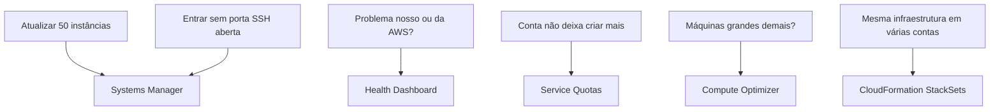

<!-- autoral -->

# 3.16 Gestão e governança

> **Domínio 3 — Tecnologia e Serviços de Nuvem (34% da prova)** · Depende das aulas [1.7](../01-conceitos-de-nuvem/07-economia-da-nuvem.md), [2.4](../02-seguranca-e-conformidade/04-governanca-multi-conta.md), [2.7](../02-seguranca-e-conformidade/07-logs-monitoramento-e-auditoria.md), [3.1](01-formas-de-acesso-e-implantacao.md) e [3.3](03-ec2.md)

> 🔎 **Fichas para aprofundar:** [AWS CloudFormation](../../servicos/gerenciamento/cloudformation.md) · [AWS Systems Manager](../../servicos/gerenciamento/systems-manager.md) · [AWS Health Dashboard](../../servicos/gerenciamento/health-dashboard.md) · [AWS Trusted Advisor](../../servicos/gerenciamento/trusted-advisor.md) · [AWS Compute Optimizer, Service Quotas, License Manager e outros](../../servicos/gerenciamento/compute-optimizer-service-quotas-e-license-manager.md) · [AWS Organizations](../../servicos/gerenciamento/organizations.md)

⬅️ [3.15 Ferramentas de desenvolvimento](15-ferramentas-de-desenvolvimento.md) · 🏠 [Índice do domínio](README.md) · 🏫 [O caso da escola](../00-guia-do-exame/caso-da-escola.md) · [3.17 Migração e transferência](17-migracao-e-transferencia.md) ➡️

---

A rede de escolas já tem dezenas de instâncias, várias contas e uma equipe de TI pequena. As perguntas do dia a dia mudaram: como aplicar a atualização de segurança em todas as instâncias de uma vez? Como entrar numa instância sem deixar a porta SSH aberta? Aquela lentidão de ontem foi culpa nossa ou um problema da AWS? Por que a conta não deixa criar mais instâncias? Estamos pagando por máquinas grandes demais?

Os serviços que respondem a essas perguntas formam a categoria de **gestão e governança** da lista de serviços do exame. Ela é a maior da lista, e vários de seus serviços já foram ensinados em outras aulas. Esta aula ensina os que faltam e termina com um mapa da categoria inteira.

## AWS Systems Manager: operar muitas máquinas de uma vez

O **AWS Systems Manager** permite ver, gerenciar e operar de forma centralizada muitos **nós** (instâncias do EC2, servidores no datacenter do cliente e máquinas em outras nuvens), em várias contas e Regiões. Para isso, cada máquina precisa ter o **SSM Agent** instalado e conseguir falar com o serviço.

Com as ferramentas do Systems Manager, é possível:

- **Conectar-se às máquinas com segurança, sem abrir portas de entrada**, com o Session Manager, visto na [aula 3.3](03-ec2.md). A porta SSH pode ficar fechada.
- **Aplicar patches em grande escala**, em todas as instâncias de uma vez.
- **Rodar comandos remotamente** em muitas máquinas (Run Command).
- **Guardar com segurança dados usados pelas aplicações**, como configurações, no Parameter Store.
- **Automatizar tarefas comuns de administração**.

Na escola, a atualização de segurança que antes levava um dia de trabalho, máquina por máquina, vira uma única operação do Systems Manager.

## AWS Health Dashboard: o problema é nosso ou da AWS?

O **AWS Health** dá visibilidade contínua sobre o desempenho dos recursos e a disponibilidade dos serviços e das contas da AWS. Ele informa eventos em andamento e atividades planejadas, como manutenções, para que o cliente se prepare. O **AWS Health Dashboard** tem duas visões:

- **Service health** (saúde dos serviços): página **pública** com os eventos dos serviços da AWS em todas as Regiões. Não exige login nem conta.
- **Your account health** (saúde da sua conta): eventos que podem afetar **as suas** contas e recursos. Está disponível a todos os clientes, sem configuração.

A **AWS Health API**, para consultar esses eventos por programa, exige os planos de suporte Business Support+, Enterprise Support ou Unified Operations ([aula 4.5](../04-cobranca-precos-e-suporte/05-planos-de-suporte.md)).

Para a lentidão de ontem, o Health Dashboard da conta mostra se houve um evento da AWS afetando os recursos da escola.

## Service Quotas: os limites da conta

Cada serviço da AWS define **cotas** (também chamadas de limites): valores máximos para recursos, ações e itens de uma conta, como o número de instâncias de um tipo numa Região. O **Service Quotas** mostra e gerencia as cotas de todos os serviços num só lugar. Quando a cota padrão não atende, e ela é ajustável, você **pede o aumento** pelo próprio Service Quotas.

É a resposta para "a conta não deixa criar mais instâncias": verificar a cota e pedir o aumento antes do pico de janeiro.

## AWS Compute Optimizer e AWS License Manager: usar o tamanho certo

Na [aula 1.7](../01-conceitos-de-nuvem/07-economia-da-nuvem.md), você viu o dimensionamento correto (rightsizing). O **AWS Compute Optimizer** analisa a configuração e as métricas de uso dos recursos e recomenda o tamanho certo, além de apontar recursos ociosos. As recomendações cobrem instâncias do EC2, Auto Scaling groups, volumes do EBS, funções Lambda, serviços do ECS no Fargate, bancos do RDS e do Aurora, entre outros. Ele mostra se cada recurso está bem dimensionado e o que mudar para reduzir custo e melhorar desempenho.

O **AWS License Manager** ajuda a gerenciar licenças de software de fornecedores como Microsoft, SAP, Oracle e IBM em várias Regiões e contas, com relatórios de conformidade, para evitar usar mais licenças do que a empresa tem.

## CloudFormation em escala

O **AWS CloudFormation**, visto na [aula 3.1](01-formas-de-acesso-e-implantacao.md), descreve a infraestrutura como código num modelo (template), e cada implantação vira uma **pilha** (stack). Dois recursos ajudam na governança:

- O **StackSets** cria, atualiza ou apaga pilhas em **várias contas e Regiões** numa única operação, a partir do mesmo modelo.
- A **detecção de desvio** (drift detection) aponta recursos que alguém alterou por fora do CloudFormation, por exemplo direto no console.

## O mapa da categoria

A categoria de gestão e governança do exame tem 16 serviços. Os que esta aula não detalhou estão em outras aulas:

| Serviço | Para que serve | Onde estudar |
|---|---|---|
| AWS Auto Scaling | Ajustar a capacidade à demanda | [Aula 3.4](04-escalabilidade-e-balanceamento.md) |
| AWS CloudFormation | Infraestrutura como código | [Aula 3.1](01-formas-de-acesso-e-implantacao.md) e esta aula |
| AWS CloudTrail | Registrar quem fez cada chamada de API | [Aula 2.7](../02-seguranca-e-conformidade/07-logs-monitoramento-e-auditoria.md) |
| Amazon CloudWatch | Métricas, logs e alarmes | [Aula 2.7](../02-seguranca-e-conformidade/07-logs-monitoramento-e-auditoria.md) |
| AWS Compute Optimizer | Recomendar o tamanho certo dos recursos | Esta aula |
| AWS Config | Registrar e avaliar a configuração dos recursos | [Aula 2.7](../02-seguranca-e-conformidade/07-logs-monitoramento-e-auditoria.md) |
| AWS Control Tower | Montar e governar um ambiente com várias contas | [Aula 2.4](../02-seguranca-e-conformidade/04-governanca-multi-conta.md) |
| AWS Health Dashboard | Eventos da AWS que afetam serviços e contas | Esta aula |
| AWS License Manager | Gerenciar licenças de software | Esta aula |
| AWS Management Console | Gerenciar a AWS pelo navegador | [Aula 3.1](01-formas-de-acesso-e-implantacao.md) |
| AWS Organizations | Agrupar e controlar várias contas | [Aula 2.4](../02-seguranca-e-conformidade/04-governanca-multi-conta.md) |
| AWS Service Catalog | Catálogo de produtos aprovados para implantar | [Aula 2.4](../02-seguranca-e-conformidade/04-governanca-multi-conta.md) |
| Service Quotas | Ver cotas e pedir aumento | Esta aula |
| AWS Systems Manager | Operar muitas máquinas de uma vez | Esta aula |
| AWS Trusted Advisor | Recomendações de custo, desempenho, segurança e tolerância a falhas | [Aula 2.9](../02-seguranca-e-conformidade/09-deteccao-de-ameacas.md) |
| AWS Well-Architected Tool | Revisar cargas de trabalho pelos pilares do framework | [Aula 1.4](../01-conceitos-de-nuvem/04-well-architected-framework.md) |

*Figura 3.16 — As perguntas da equipe de TI e o serviço que responde a cada uma.*

## Na prova

- **"Aplicar patches em muitas instâncias", "rodar comandos em várias máquinas" = Systems Manager.**
- **"Acessar a instância sem SSH nem bastion" = Session Manager (Systems Manager).**
- **"Evento da AWS que afeta os meus recursos", "manutenção agendada" = Health Dashboard.**
- **"Ver os limites da conta e pedir aumento" = Service Quotas.**
- **"Instância superdimensionada", "recomendação de tamanho" = Compute Optimizer.**
- **"Controlar o uso de licenças de software" = License Manager.**
- **"Mesma pilha em várias contas e Regiões" = CloudFormation StackSets.**

## Caso resolvido

**Situação.** Na véspera das inscrições, a equipe de TI da rede tenta criar mais 20 instâncias para o pico e recebe um erro de limite. No mesmo dia, uma parte dos pais relata lentidão, e a equipe quer saber se há algum problema da AWS na Região. Além disso, uma auditoria pede que todas as instâncias recebam a última atualização de segurança até o fim do dia. O que usar?

**Raciocínio.** O erro de limite é uma cota da conta: o Service Quotas mostra a cota de instâncias e permite pedir o aumento. A lentidão pode ser um evento da AWS: o Health Dashboard da conta mostra os eventos que afetam os recursos da escola, e a página pública mostra a saúde dos serviços na Região. A atualização em todas as instâncias é trabalho do Systems Manager, que aplica patches em grande escala numa única operação.

**Por que as alternativas tentadoras falham.** O Trusted Advisor tem verificações de limites de serviço, mas o pedido de aumento de cota é feito no Service Quotas. O CloudWatch mostra as métricas dos recursos da escola, não os eventos da própria AWS. Entrar em cada instância por SSH para atualizar uma por uma não termina no prazo e exige deixar a porta aberta.

## Revisão

Tente responder antes de abrir cada resposta.

### O que o AWS Systems Manager permite fazer?

Ver resposta

Operar de forma centralizada muitas máquinas na AWS e fora dela: aplicar patches em escala, rodar comandos remotamente, conectar-se sem abrir portas de entrada e guardar configurações.

Comentário: as máquinas precisam ter o SSM Agent instalado.

### Quais são as duas visões do AWS Health Dashboard?

Ver resposta

A saúde dos serviços, página pública com os eventos da AWS em todas as Regiões, e a saúde da conta, com os eventos que podem afetar as suas contas e recursos.

Comentário: o painel é gratuito e não exige configuração; a Health API exige plano Business Support+ ou superior.

### O que fazer quando a conta atinge o limite de um recurso?

Ver resposta

Verificar a cota no Service Quotas e, se ela for ajustável, pedir o aumento por lá.

Comentário: cada serviço define cotas padrão para os recursos e ações de uma conta.

### Para que serve o AWS Compute Optimizer?

Ver resposta

Para analisar a configuração e o uso dos recursos e recomendar o tamanho certo, além de apontar recursos ociosos, reduzindo custo e melhorando desempenho.

Comentário: cobre EC2, Auto Scaling groups, EBS, Lambda, ECS no Fargate e bancos, entre outros.

### O que o CloudFormation StackSets acrescenta ao CloudFormation?

Ver resposta

A possibilidade de criar, atualizar ou apagar pilhas em várias contas e Regiões numa única operação, a partir do mesmo modelo.

Comentário: a detecção de desvio aponta recursos alterados por fora do CloudFormation.

## Resumo

- Systems Manager opera muitas máquinas: patches, comandos, Session Manager e Parameter Store.
- Health Dashboard mostra a saúde pública dos serviços e os eventos que afetam a sua conta.
- Service Quotas mostra os limites e recebe os pedidos de aumento.
- Compute Optimizer recomenda o tamanho certo; License Manager controla licenças.
- StackSets leva a mesma pilha do CloudFormation a várias contas e Regiões.
- Os demais serviços da categoria estão nas aulas indicadas no mapa.

## Fontes oficiais

Verificadas em 06/10/2026.

- [In-Scope AWS Services](https://docs.aws.amazon.com/aws-certification/latest/cloud-practitioner-02/clf-02-in-scope-services.html): os 16 serviços da categoria de gestão e governança.
- [What is AWS Systems Manager?](https://docs.aws.amazon.com/systems-manager/latest/userguide/what-is-systems-manager.html): operação centralizada de nós, SSM Agent e ferramentas.
- [What is AWS Health?](https://docs.aws.amazon.com/health/latest/ug/what-is-aws-health.html), [AWS Health Dashboard – Service health](https://docs.aws.amazon.com/health/latest/ug/aws-health-dashboard-status.html) e [AWS Health API](https://docs.aws.amazon.com/health/latest/ug/health-api.html): painel para todos os clientes, página pública e planos exigidos pela API.
- [What is Service Quotas?](https://docs.aws.amazon.com/servicequotas/latest/userguide/intro.html): cotas e pedidos de aumento.
- [What is AWS Compute Optimizer?](https://docs.aws.amazon.com/compute-optimizer/latest/ug/what-is-compute-optimizer.html): recomendações de tamanho, recursos ociosos e recursos atendidos.
- [What is AWS License Manager?](https://docs.aws.amazon.com/license-manager/latest/userguide/license-manager.html): gestão de licenças entre Regiões e contas.
- [StackSets concepts](https://docs.aws.amazon.com/AWSCloudFormation/latest/UserGuide/what-is-cfnstacksets.html) e [Detect drift](https://docs.aws.amazon.com/AWSCloudFormation/latest/UserGuide/using-cfn-stack-drift.html): pilhas em várias contas e Regiões e alterações feitas por fora.
- [AWS Trusted Advisor](https://docs.aws.amazon.com/awssupport/latest/user/trusted-advisor.html): recomendações e verificações de limites de serviço.

<!-- notas:inicio -->
## 📝 Minhas anotações

<!-- Escreva aqui suas observações, dúvidas e as questões que você errou sobre o tema. -->
<!-- notas:fim -->

---

⬅️ [3.15 Ferramentas de desenvolvimento](15-ferramentas-de-desenvolvimento.md) · 🏠 [Índice do domínio](README.md) · [3.17 Migração e transferência](17-migracao-e-transferencia.md) ➡️
