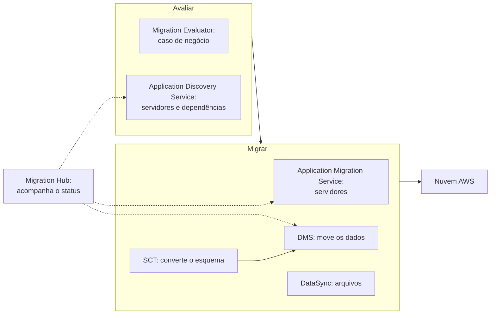

<!-- autoral -->

# 3.17 Migração e transferência

> **Domínio 3 — Tecnologia e Serviços de Nuvem (34% da prova)** · Depende das aulas [1.6](../01-conceitos-de-nuvem/06-estrategias-de-migracao.md), [3.7](07-bancos-de-dados.md) e [3.9](09-outros-armazenamentos.md)

> 🔎 **Fichas para aprofundar:** [Migration Evaluator, Application Discovery Service e Migration Hub](../../servicos/migracao/discovery-migration-hub-e-evaluator.md) · [AWS Application Migration Service (AWS Transform MGN)](../../servicos/migracao/application-migration-service.md) · [AWS DMS e AWS SCT](../../servicos/migracao/dms-e-sct.md) · [DataSync e Transfer Family](../../servicos/migracao/datasync-e-transfer-family.md) · [Família Snow](../../servicos/migracao/snow-family.md)

⬅️ [3.16 Gestão e governança](16-gestao-e-governanca.md) · 🏠 [Índice do domínio](README.md) · 🏫 [O caso da escola](../00-guia-do-exame/caso-da-escola.md) · [3.18 Serviços menos conhecidos que podem aparecer](18-servicos-menos-conhecidos.md) ➡️

---

Na [aula 1.6](../01-conceitos-de-nuvem/06-estrategias-de-migracao.md), a rede de escolas escolheu a estratégia: levar o sistema de matrícula para a AWS como está (rehost) e trocar o banco de dados por um serviço gerenciado. Agora vem a parte prática. O centro de dados da escola tem dezenas de máquinas virtuais, o banco Oracle do sistema financeiro e anos de documentos digitalizados num servidor de arquivos. A diretoria quer saber quanto a mudança vai custar, a equipe não sabe direito quais servidores conversam entre si, e o sistema não pode parar em janeiro.

O guia do exame cobra os recursos que apoiam a migração (domínio 1) e as ferramentas de migração de bancos de dados, citando o AWS DMS e a AWS SCT (domínio 3). Na lista de serviços do exame, a categoria de migração e transferência tem seis serviços: AWS Application Discovery Service, AWS Application Migration Service, AWS Database Migration Service (AWS DMS), Migration Evaluator, AWS Migration Hub e AWS Schema Conversion Tool (AWS SCT). Esta aula segue a ordem de uma migração: avaliar, planejar, migrar servidores, migrar bancos e mover arquivos.

## Avaliar: quanto custa e o que existe

O **Migration Evaluator** monta o **caso de negócio** da migração, isto é, a justificativa financeira para a diretoria. Ele faz uma avaliação personalizada do ambiente atual, aponta servidores superdimensionados e recomenda alternativas mais baratas na AWS, inclusive comparando o custo de trazer licenças próprias com o de usar instâncias com licença incluída. A AWS oferece o Migration Evaluator sem custo.

O **AWS Application Discovery Service** ajuda a planejar a migração coletando dados de **configuração e uso** dos servidores e bancos de dados locais. Ele também exporta as **conexões de rede entre os servidores**, o que revela as **dependências**: quais máquinas conversam entre si e precisam migrar juntas, agrupadas como uma aplicação. A coleta pode ser feita de três formas:

- **Sem agente:** um coletor instalado no VMware vCenter identifica as máquinas virtuais.
- **Com agente:** um agente instalado em cada servidor, físico ou virtual, coleta dados detalhados de desempenho, conexões de rede e processos em execução.
- **Importação de arquivo:** os dados do ambiente são importados direto, sem coletor nem agente.

## Acompanhar: um lugar para ver tudo

O **AWS Migration Hub** oferece um **lugar único** para descobrir os servidores, planejar as migrações e **acompanhar o status de cada aplicação** sendo migrada, qualquer que seja a ferramenta usada. Os dados do Application Discovery Service aparecem nele, e as ferramentas de migração, como o Application Migration Service e o AWS DMS, enviam a ele o andamento de cada servidor e banco.

Uma mudança recente: o Migration Hub e o Application Discovery Service **não aceitam novos clientes desde 07/11/2025**. Quem já usa continua usando, e a AWS indica o **AWS Transform**, lançado em maio de 2025, como o serviço que reúne essas funções com automação por IA. Os dois continuam na lista de serviços do exame, então vale saber para que servem.

## Migrar servidores: Application Migration Service

O **AWS Application Migration Service** hoje se chama **AWS Transform MGN** (a sigla MGN continua); a lista do exame usa o nome antigo. Ele **automatiza o rehost** (*lift and shift*) de servidores físicos, virtuais e de outras nuvens para a AWS. Funciona assim: faz **replicação contínua** dos discos dos servidores de origem para a AWS enquanto eles seguem funcionando, converte os servidores para rodarem na AWS e, na hora da virada, lança as instâncias, com janelas de virada que costumam ser de **minutos**. Depois da migração, a aplicação já na AWS pode ser modernizada aos poucos.

Na escola, o MGN replica as máquinas virtuais do sistema de matrícula durante semanas, a equipe testa as cópias na AWS e a virada acontece numa madrugada de novembro, longe do pico de janeiro.

## Migrar bancos de dados: DMS e SCT

O **AWS Database Migration Service** (AWS DMS) migra **bancos relacionais, data warehouses, bancos NoSQL** e outros armazenamentos de dados, para a AWS ou entre ambientes na nuvem e locais. Ele faz uma **migração única** ou **replica continuamente as mudanças**, mantendo origem e destino sincronizados. Com a replicação contínua, o banco de origem segue atendendo o sistema durante a migração, e a parada fica reduzida ao momento da virada.

Quando o banco muda de motor, como de Oracle para Aurora PostgreSQL, o **esquema** (tabelas, índices, visões e o código guardado no banco) precisa ser traduzido antes. A **AWS Schema Conversion Tool** (AWS SCT) é um programa instalado no computador que **converte o esquema** de um motor de banco para outro. O próprio DMS também oferece a conversão de esquema, com o recurso **DMS Schema Conversion**.

- **Migração homogênea** (mesmo motor, como MySQL para RDS for MySQL): não há esquema para converter, e o DMS move os dados.
- **Migração heterogênea** (motores diferentes, como Oracle para Aurora PostgreSQL): primeiro a SCT ou o DMS Schema Conversion converte o esquema, depois o DMS move os dados.

## Mover arquivos e grandes volumes

O **AWS DataSync** transfere arquivos e objetos **pela rede**, com rapidez e segurança, entre o armazenamento local (compartilhamentos NFS e SMB, HDFS e armazenamento de objetos), outras nuvens e os serviços de armazenamento da AWS, como S3, EFS e FSx. Ele automatiza a transferência, criptografa os dados e confere a integridade na chegada. Serve para migrar dados, arquivar dados frios em classes como o S3 Glacier Deep Archive e replicar dados.

A **família AWS Snow** transferia dados **fora da rede**, em dispositivos físicos enviados ao cliente. O AWS Snowball Edge **não está mais disponível para novos clientes**, e a AWS não oferece mais nenhum dispositivo da família Snow para novos pedidos. Para novos clientes, a AWS indica o DataSync para transferência pela rede e o **AWS Data Transfer Terminal**, um local físico seguro onde o cliente leva seus dispositivos de armazenamento para enviar os dados à AWS com rapidez. A família Snow e o DataSync não aparecem na lista de serviços do exame.

O **AWS Transfer Family** oferece transferência gerenciada de arquivos por SFTP, FTPS, FTP e outros protocolos, direto para os serviços de armazenamento da AWS; ele está na lista de serviços **fora do escopo** do exame.

## Como escolher

| Necessidade | Serviço |
|---|---|
| Justificar o custo da migração para a diretoria (caso de negócio) | Migration Evaluator |
| Descobrir os servidores locais, seu uso e as dependências entre eles | Application Discovery Service |
| Acompanhar num só lugar o andamento de todas as migrações | Migration Hub |
| Levar servidores para a AWS sem alterá-los (rehost) | Application Migration Service (AWS Transform MGN) |
| Migrar um banco com o sistema funcionando | AWS DMS |
| Converter o esquema para outro motor de banco | AWS SCT (ou DMS Schema Conversion) |
| Copiar arquivos pela rede para S3, EFS ou FSx | DataSync |

*Figura 3.17 — A jornada de migração: avaliar o custo e o ambiente, migrar servidores, bancos e arquivos, e acompanhar tudo no Migration Hub.*

## Na prova

- **"Caso de negócio", "justificar o custo da migração" = Migration Evaluator.**
- **"Descobrir servidores locais e as dependências entre eles" = Application Discovery Service.**
- **"Acompanhar o progresso das migrações num só lugar" = Migration Hub.**
- **"Lift and shift", "rehost de servidores", "migrar máquinas virtuais sem alterá-las" = Application Migration Service.**
- **"Migrar banco com o mínimo de parada", "replicação contínua do banco" = AWS DMS.**
- **"Trocar de motor de banco", "converter o esquema" = AWS SCT junto com o DMS.**

## Caso resolvido

**Situação.** Depois da matrícula, a rede vai migrar o sistema financeiro. O banco dele é Oracle e deve virar Amazon Aurora PostgreSQL. O registro das mensalidades não pode parar durante a migração, e o banco não pode ficar fora do ar por horas. Quais serviços usar para o banco?

**Raciocínio.** Os motores são diferentes, então é uma migração heterogênea: primeiro a AWS SCT (ou o DMS Schema Conversion) converte o esquema do Oracle para o Aurora PostgreSQL. Depois, o AWS DMS migra os dados e replica continuamente as mudanças enquanto o Oracle segue atendendo o sistema financeiro; na virada, o sistema passa a usar o Aurora e a parada é curta.

**Por que as alternativas tentadoras falham.** O Application Migration Service leva o servidor inteiro como está, o que manteria o Oracle e não troca de motor. O DMS sozinho move os dados, mas não traduz o esquema entre motores diferentes. O DataSync copia arquivos, não bancos de dados em funcionamento. O Migration Evaluator calcula o custo, mas não migra nada.

## Revisão

Tente responder antes de abrir cada resposta.

### Para que serve o Migration Evaluator?

Ver resposta

Para montar o caso de negócio da migração, comparando o custo do ambiente atual com alternativas na AWS.

Comentário: a AWS oferece o Migration Evaluator sem custo.

### O que o AWS Application Discovery Service coleta?

Ver resposta

Dados de configuração e uso dos servidores e bancos locais, e as conexões de rede entre os servidores, que revelam as dependências.

Comentário: a coleta pode ser feita sem agente, com agente ou por importação de arquivo. O serviço não aceita novos clientes desde 07/11/2025, mas continua na lista do exame.

### O que faz o AWS Application Migration Service?

Ver resposta

Automatiza o rehost (lift and shift) de servidores físicos, virtuais e de outras nuvens para a AWS, com replicação contínua e virada rápida.

Comentário: hoje o serviço se chama AWS Transform MGN.

### Qual é a diferença entre o AWS DMS e a AWS SCT?

Ver resposta

O DMS move os dados do banco, uma vez ou com replicação contínua; a SCT converte o esquema quando o banco muda de motor.

Comentário: na migração para o mesmo motor, o DMS basta.

### Qual serviço da lista do exame acompanha o andamento das migrações num só lugar?

Ver resposta

O AWS Migration Hub.

Comentário: ele recebe o status do Application Migration Service e do DMS. Não aceita novos clientes desde 07/11/2025; a AWS indica o AWS Transform no lugar.

## Resumo

- Avaliar: Migration Evaluator (custo) e Application Discovery Service (servidores e dependências).
- Acompanhar: Migration Hub.
- Migrar servidores: Application Migration Service, hoje AWS Transform MGN.
- Migrar bancos: DMS move os dados; SCT converte o esquema na troca de motor.
- Arquivos pela rede: DataSync. A família Snow não está mais disponível para novos clientes.
- Migration Hub e Application Discovery Service não aceitam novos clientes desde 07/11/2025, mas seguem na lista do exame.

## Fontes oficiais

Verificadas em 06/10/2026.

- [Content Domain 3 do guia do exame CLF-C02](https://docs.aws.amazon.com/aws-certification/latest/cloud-practitioner-02/cloud-practitioner-02-domain3.html): ferramentas de migração de bancos (DMS e SCT).
- [In-Scope AWS Services](https://docs.aws.amazon.com/aws-certification/latest/cloud-practitioner-02/clf-02-in-scope-services.html) e [Out-of-Scope AWS Services](https://docs.aws.amazon.com/aws-certification/latest/cloud-practitioner-02/clf-02-out-of-scope-services.html): os seis serviços de migração no escopo; Transfer Family fora.
- [Migration Evaluator](https://aws.amazon.com/migration-evaluator/): caso de negócio, servidores superdimensionados, comparação de licenças e avaliação sem custo.
- [What is AWS Application Discovery Service?](https://docs.aws.amazon.com/application-discovery/latest/userguide/what-is-appdiscovery.html) e [availability change](https://docs.aws.amazon.com/application-discovery/latest/userguide/application-discovery-service-availability-change.html): dados coletados, conexões de rede, três formas de coleta e fechamento a novos clientes em 07/11/2025.
- [What Is AWS Migration Hub?](https://docs.aws.amazon.com/migrationhub/latest/ug/whatishub.html) e [availability change](https://docs.aws.amazon.com/migrationhub/latest/ug/migrationhub-availability-change.html): lugar único de acompanhamento, fechamento a novos clientes em 07/11/2025 e AWS Transform (maio de 2025).
- [What Is AWS Transform MGN?](https://docs.aws.amazon.com/mgn/latest/ug/what-is-mgn.html): rehost de servidores físicos, virtuais e de nuvem, replicação contínua e virada em minutos.
- [What is AWS Database Migration Service?](https://docs.aws.amazon.com/dms/latest/userguide/Welcome.html): tipos de bancos, migração única ou replicação contínua, DMS Schema Conversion e SCT.
- [What is the AWS Schema Conversion Tool?](https://docs.aws.amazon.com/SchemaConversionTool/latest/userguide/CHAP_Welcome.html): conversão de esquema entre motores; MySQL para Aurora MySQL sem SCT.
- [What is AWS DataSync?](https://docs.aws.amazon.com/datasync/latest/userguide/what-is-datasync.html): origens e destinos, criptografia, validação de integridade e casos de uso.
- [AWS Snowball Edge availability change](https://docs.aws.amazon.com/snowball/latest/developer-guide/snowball-edge-availability-change.html): fim de novos pedidos da família Snow e alternativas (DataSync e Data Transfer Terminal).
- [What is AWS Transfer Family?](https://docs.aws.amazon.com/transfer/latest/userguide/what-is-aws-transfer-family.html): protocolos de transferência gerenciada.

<!-- notas:inicio -->
## 📝 Minhas anotações

<!-- Escreva aqui suas observações, dúvidas e as questões que você errou sobre o tema. -->
<!-- notas:fim -->

---

⬅️ [3.16 Gestão e governança](16-gestao-e-governanca.md) · 🏠 [Índice do domínio](README.md) · [3.18 Serviços menos conhecidos que podem aparecer](18-servicos-menos-conhecidos.md) ➡️
