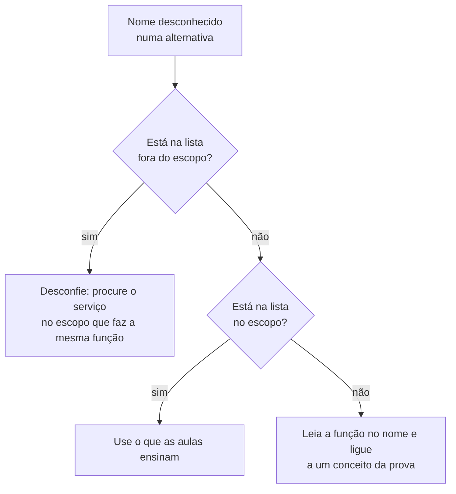

<!-- autoral -->

# 3.18 Serviços menos conhecidos que podem aparecer

> **Domínio 3 — Tecnologia e Serviços de Nuvem (34% da prova)** · Depende das aulas [1.4](../01-conceitos-de-nuvem/04-well-architected-framework.md), [2.3](../02-seguranca-e-conformidade/03-iam.md) e das aulas [3.1 a 3.17](README.md)

> 🔎 **Fichas para aprofundar:** [Lake Formation, MSK, Data Exchange, AppFlow e outros serviços de dados](../../servicos/analytics/lake-formation-msk-e-outros.md) · [AWS Firewall Manager e AWS Network Firewall](../../servicos/seguranca/firewall-manager-e-network-firewall.md) · [Recursos de ajuda e parceiros](../../servicos/custos/recursos-de-ajuda-e-parceiros.md) · [Serviços de mídia e jogos](../../servicos/fora-do-escopo/midia-e-jogos.md) · [IoT, robótica e satélite](../../servicos/fora-do-escopo/iot-robotica-e-satelite.md) · [Desenvolvimento e aplicações](../../servicos/fora-do-escopo/desenvolvimento-e-aplicacoes.md) · [Rede e diretório](../../servicos/fora-do-escopo/rede-e-diretorio.md) · [Gerenciamento e custos](../../servicos/fora-do-escopo/gerenciamento-e-custos.md)

⬅️ [3.17 Migração e transferência](17-migracao-e-transferencia.md) · 🏠 [Índice do domínio](README.md) · 🏫 [O caso da escola](../00-guia-do-exame/caso-da-escola.md)

---

Uma coordenadora da rede de escolas está estudando para a prova. No simulado, aparece uma alternativa com um serviço que ela nunca viu nas aulas, e ela trava: será que precisava decorar esse também? A AWS tem centenas de serviços, e ninguém aprende todos. O que resolve é saber como a AWS define o que a prova cobra e ter um método para lidar com um nome desconhecido.

Esta aula fecha o domínio 3 com três coisas: como funcionam as listas oficiais de serviços, quais categorias a prova declara fora do escopo, e alguns serviços que ficam fora da lista mas se ligam a ideias que a prova cobra.

## Como a AWS define o escopo

O guia do exame tem duas listas. A lista de **serviços no escopo** reúne os serviços e recursos que podem ser cobrados, organizados por categoria (analytics, computação, banco de dados, migração, segurança e outras). A lista de **serviços fora do escopo** reúne os que a prova não cobra. As duas avisam que **não são exaustivas e podem mudar**: um serviço que não aparece em nenhuma delas pode surgir numa questão, e a AWS pode atualizar as listas.

As aulas 3.1 a 3.17 cobriram os serviços da lista no escopo. Quando um nome desconhecido aparece numa questão, três perguntas ajudam:

1. **O que o nome diz?** Muitos nomes da AWS descrevem a função: *Fault Injection* (injeção de falhas), *Data Exchange* (troca de dados), *Ground Station* (estação terrestre).
2. **Ele está na lista fora do escopo?** Se estiver, a prova não cobra esse serviço; como resposta certa, ele é improvável, e uma alternativa com ele merece desconfiança.
3. **A questão pede uma função que um serviço conhecido cumpre?** Muitas vezes a resposta certa é o serviço da lista no escopo que faz aquilo, e o nome estranho é só uma alternativa a descartar.

## O que está fora do escopo

A lista fora do escopo é organizada por categoria. Algumas categorias inteiras não têm nenhum serviço no escopo, como **jogos** (Amazon GameLift), **serviços de mídia** (a família AWS Elemental e o Amazon IVS) e **robótica** (AWS RoboMaker). Outras categorias têm serviços dos dois lados. Alguns exemplos fora do escopo, ao lado de vizinhos que estão no escopo:

| Categoria | Fora do escopo | No escopo, para comparar |
|---|---|---|
| Analytics | Amazon AppFlow, AWS Data Exchange, Amazon MSK (Kafka gerenciado) | Athena, Glue, Kinesis ([aula 3.11](11-analytics.md)) |
| Banco de dados | Amazon Keyspaces, Amazon MemoryDB | DynamoDB, ElastiCache ([aula 3.7](07-bancos-de-dados.md)) |
| Ferramentas de desenvolvimento | AWS CloudShell, AWS CodeDeploy, AWS CodeArtifact, AWS Device Farm | CodeBuild, CodePipeline, X-Ray ([aula 3.15](15-ferramentas-de-desenvolvimento.md)) |
| Machine learning | Amazon Personalize, Amazon Fraud Detector | Rekognition, Comprehend, SageMaker AI ([aula 3.12](12-ia-e-machine-learning.md)) |
| Migração e transferência | AWS Transfer Family, AWS Migration Hub Refactor Spaces | DMS, Application Migration Service ([aula 3.17](17-migracao-e-transferencia.md)) |
| Rede | AWS Ground Station (comunicação com satélites), Amazon VPC Lattice, AWS Cloud Map | VPC, Route 53, CloudFront ([aula 3.10](10-rede-e-entrega-de-conteudo.md)) |
| Segurança | AWS Network Firewall | AWS WAF, Shield, Firewall Manager ([aula 2.8](../02-seguranca-e-conformidade/08-protecao-de-rede-e-aplicacoes.md)) |
| Computação | AWS Wavelength | EC2, Outposts ([aula 3.6](06-outros-servicos-de-computacao.md)) |
| Apoio ao cliente | AWS IQ, AWS Activate, AWS Managed Services | AWS Support |

O AWS IQ, que conectava clientes a especialistas independentes, foi **encerrado em 28/05/2026**; a AWS indica o AWS Marketplace Professional Services para contratar consultorias.

## Fora das listas, mas ligados ao que a prova cobra

Alguns serviços não aparecem em nenhuma das duas listas, mas se ligam a conceitos que a prova cobra. Reconhecer a função deles ajuda a acertar a questão pelo conceito.

- **AWS Security Token Service** (AWS STS): gera **credenciais temporárias**, que expiram sozinhas e são a base das funções do IAM e da federação de identidades. Foi visto na [aula 2.3](../02-seguranca-e-conformidade/03-iam.md).
- **AWS Sustainability**: o console que mostra o **impacto ambiental** do uso da AWS na conta, com as **emissões de carbono** ao longo do tempo, por Região e por serviço, e o uso de água. Ele amplia a antiga **Customer Carbon Footprint Tool**, nome que ainda aparece em materiais de estudo. Os dados de um mês saem no mês seguinte. Liga-se ao pilar **Sustentabilidade** do Well-Architected ([aula 1.4](../01-conceitos-de-nuvem/04-well-architected-framework.md)).
- **AWS Fault Injection Service** (AWS FIS): faz **experimentos de injeção de falhas** nas cargas de trabalho, seguindo os princípios da **engenharia do caos**: provoca interrupções controladas para observar como a aplicação reage e torná-la mais resiliente. Liga-se ao pilar **Confiabilidade**.
- **AWS Resilience Hub**: um lugar central para definir **metas de resiliência** das aplicações, avaliar se elas atendem a essas metas e aplicar recomendações baseadas no Well-Architected. Também roda experimentos do FIS.

## Como escolher

| Situação na questão | O que fazer |
|---|---|
| O serviço está na lista no escopo | Use o que as aulas 3.1 a 3.17 ensinam |
| O serviço está na lista fora do escopo | Desconfie da alternativa; procure o serviço no escopo que cumpre a função pedida |
| O serviço não está em nenhuma lista | Leia a função no nome e ligue a um conceito da prova (segurança, custo, pilares do Well-Architected) |
| A questão pede credenciais temporárias | AWS STS |
| A questão pede as emissões de carbono do uso da AWS | AWS Sustainability (antiga Customer Carbon Footprint Tool) |
| A questão pede testar a resiliência provocando falhas | AWS Fault Injection Service |

*Figura 3.18 — Um método para lidar com um serviço desconhecido numa questão.*

## Na prova

- **As listas de serviços no escopo e fora do escopo não são exaustivas e podem mudar.**
- **Jogos, mídia e robótica estão fora do escopo; a prova não cobra esses serviços.**
- **"Credenciais temporárias" = AWS STS.**
- **"Medir a pegada de carbono do uso da AWS" = AWS Sustainability (Customer Carbon Footprint Tool), ligado ao pilar Sustentabilidade.**
- **"Engenharia do caos", "injetar falhas para testar a resiliência" = AWS Fault Injection Service, ligado ao pilar Confiabilidade.**

## Caso resolvido

**Situação.** A diretoria da rede de escolas quer acompanhar as emissões de carbono geradas pelo uso da AWS, por Região e por serviço, para um relatório de sustentabilidade. As alternativas são: Amazon CloudWatch, AWS Cost Explorer, AWS Sustainability (Customer Carbon Footprint Tool) e Amazon Personalize. Qual escolher?

**Raciocínio.** O pedido é medir o impacto ambiental do uso da AWS. O console AWS Sustainability, que amplia a Customer Carbon Footprint Tool, mostra as emissões de carbono da conta ao longo do tempo, por Região e por serviço. O tema se liga ao pilar Sustentabilidade do Well-Architected.

**Por que as alternativas tentadoras falham.** O CloudWatch mostra métricas e logs dos recursos, não emissões de carbono. O Cost Explorer analisa gastos, não impacto ambiental. O Amazon Personalize está na lista fora do escopo e é um serviço de machine learning, sem relação com emissões de carbono.

## Revisão

Tente responder antes de abrir cada resposta.

### As listas de serviços do guia do exame são completas?

Ver resposta

Não: tanto a lista no escopo quanto a lista fora do escopo avisam que não são exaustivas e podem mudar.

Comentário: por isso vale ter um método para nomes desconhecidos, além de conhecer bem os serviços da lista no escopo.

### O que fazer quando uma alternativa cita um serviço da lista fora do escopo?

Ver resposta

Desconfiar dela e procurar o serviço do escopo que cumpre a função pedida, já que a prova não cobra os serviços fora do escopo.

Comentário: exemplos fora do escopo são GameLift, Elemental, RoboMaker, Ground Station, Network Firewall e Transfer Family.

### Qual serviço gera credenciais temporárias na AWS?

Ver resposta

O AWS Security Token Service (AWS STS).

Comentário: as credenciais temporárias expiram sozinhas e são a base das funções do IAM e da federação.

### Onde ver as emissões de carbono do uso da AWS?

Ver resposta

No console AWS Sustainability, que amplia a antiga Customer Carbon Footprint Tool.

Comentário: ele mostra as emissões por Região e por serviço, e se liga ao pilar Sustentabilidade do Well-Architected.

### Para que serve o AWS Fault Injection Service?

Ver resposta

Para fazer experimentos de injeção de falhas, seguindo a engenharia do caos, e ver como a aplicação reage a interrupções.

Comentário: liga-se ao pilar Confiabilidade; o AWS Resilience Hub avalia as aplicações contra metas de resiliência e também roda esses experimentos.

## Resumo

- As listas no escopo e fora do escopo não são exaustivas e podem mudar.
- Diante de um nome desconhecido: leia a função no nome, confira as listas e procure o serviço do escopo que cumpre a função.
- Jogos, mídia e robótica estão fora do escopo; outras categorias têm serviços dos dois lados.
- AWS IQ foi encerrado em 28/05/2026.
- STS gera credenciais temporárias; AWS Sustainability mostra as emissões de carbono; FIS e Resilience Hub testam e avaliam a resiliência.

## Fontes oficiais

Verificadas em 06/10/2026.

- [In-Scope AWS Services](https://docs.aws.amazon.com/aws-certification/latest/cloud-practitioner-02/clf-02-in-scope-services.html) e [Out-of-Scope AWS Services](https://docs.aws.amazon.com/aws-certification/latest/cloud-practitioner-02/clf-02-out-of-scope-services.html): as duas listas, o aviso de que não são exaustivas e os serviços citados em cada uma.
- [AWS Ground Station](https://aws.amazon.com/ground-station/): serviço gerenciado de comunicação com satélites.
- [AWS IQ](https://aws.amazon.com/iq/): serviço encerrado em 28/05/2026 e indicação do AWS Marketplace Professional Services.
- [Temporary security credentials in IAM](https://docs.aws.amazon.com/IAM/latest/UserGuide/id_credentials_temp.html): o AWS STS gera credenciais temporárias, base das funções e da federação.
- [What is AWS Sustainability?](https://docs.aws.amazon.com/sustainability/latest/userguide/what-is-sustainability.html) e [AWS Sustainability console](https://aws.amazon.com/sustainability/tools/console/): emissões de carbono por Região e serviço, uso de água, publicação no mês seguinte e relação com a Customer Carbon Footprint Tool.
- [What is AWS Fault Injection Service?](https://docs.aws.amazon.com/fis/latest/userguide/what-is.html): experimentos de injeção de falhas e engenharia do caos.
- [What is AWS Resilience Hub?](https://docs.aws.amazon.com/resilience-hub/latest/userguide/what-is.html): metas de resiliência, avaliação, recomendações do Well-Architected e experimentos do FIS.

<!-- notas:inicio -->
## 📝 Minhas anotações

<!-- Escreva aqui suas observações, dúvidas e as questões que você errou sobre o tema. -->
<!-- notas:fim -->

---

⬅️ [3.17 Migração e transferência](17-migracao-e-transferencia.md) · 🏠 [Índice do domínio](README.md)
