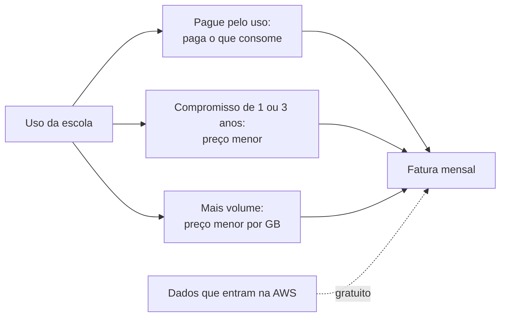

<!-- autoral -->

# 4.1 Princípios de preço da AWS

> **Domínio 4 — Cobrança, Preços e Suporte (12% da prova)** · Depende das aulas [1.7](../01-conceitos-de-nuvem/07-economia-da-nuvem.md) e [3.3](../03-tecnologia-e-servicos/03-ec2.md)

> 🔎 **Fichas para aprofundar:** [Pricing Calculator, Cost and Usage Report e outras ferramentas de faturamento](../../servicos/custos/pricing-calculator-cur-e-outras-ferramentas.md) · [Amazon EC2](../../servicos/computacao/ec2.md)

🏠 [Índice do domínio](README.md) · 🏫 [O caso da escola](../00-guia-do-exame/caso-da-escola.md) · [4.2 Modelos de compra do EC2](02-modelos-de-compra-ec2.md) ➡️

---

A primeira fatura da AWS chegou à rede de escolas, e a diretora financeira tem perguntas. Por que veio uma cobrança de uma instância de testes que ninguém usou no fim de semana? Por que a conta deste mês foi maior que a do anterior, se o sistema de matrícula é o mesmo? E dá para pagar menos sabendo que o sistema vai rodar o ano inteiro?

Na [aula 1.7](../01-conceitos-de-nuvem/07-economia-da-nuvem.md), a escola trocou custos fixos por custos variáveis. Este domínio, que vale 12% da prova, mostra como esses custos variáveis são calculados, as formas de compra, as ferramentas de acompanhamento e os planos de suporte. O guia do exame começa pela tarefa de comparar os modelos de preço da AWS. Esta aula apresenta as ideias gerais; a [aula 4.2](02-modelos-de-compra-ec2.md) detalha as formas de compra do EC2.

## Pagar pelo uso

Na maior parte dos serviços, a AWS cobra no modelo **pague pelo uso** (*pay-as-you-go*): você paga só pelos serviços de que precisa, pelo tempo em que usa, sem contrato de longo prazo nem licenciamento complexo. A própria AWS compara com a conta de água ou de luz: paga-se pelo que se consome, e, quando se para de usar, não há custo adicional nem multa de cancelamento.

A consequência para a escola: o que gera cobrança é o recurso existir ou estar em uso, não a quantidade de pais acessando o site. Uma instância do EC2 em execução é cobrada por segundo, mesmo ociosa; parada, deixa de ser cobrada, mas os volumes EBS ligados a ela continuam cobrados ([aula 3.3](../03-tecnologia-e-servicos/03-ec2.md)). Foi isso que aconteceu com a instância de testes esquecida.

## As outras formas de pagar

A página de preços da AWS apresenta mais três formas de pagar, além de pagar pelo uso:

- **Economize ao se comprometer** (*save when you commit*): os **Savings Plans** dão preços menores que os sob demanda em troca do compromisso de usar uma quantidade de serviço, medida em dólares por hora, por **1 ou 3 anos**. As instâncias reservadas seguem a mesma ideia. As duas estão na [aula 4.2](02-modelos-de-compra-ec2.md).
- **Pague menos usando mais** (*pay less by using more*): alguns serviços têm **descontos por volume**. No Amazon S3 e na transferência de dados de saída do EC2, o preço é escalonado em faixas: quanto mais se usa, menor o preço por GB. A AWS informa também que a **transferência de dados de entrada** na AWS é gratuita.
- **Preço fixo** (*flat rate*): planos que reúnem vários serviços da AWS num só preço mensal, sem cobrança por excedente; para crescer, troca-se por um plano com mais recursos.

Para a escola, isso responde à terceira pergunta da diretora: como o sistema de matrícula vai rodar o ano inteiro, um compromisso de 1 ano custa menos que pagar tudo sob demanda.

## O que costuma aparecer na fatura

Cada serviço tem as próprias unidades de cobrança, e uma aplicação junta várias delas. As mais comuns:

- **Computação:** tempo em que a capacidade fica disponível, como os segundos de uma instância do EC2 em execução.
- **Armazenamento:** quantidade de dados guardada, em geral por GB por mês, como no S3 e no EBS.
- **Transferência de dados:** dados que saem da AWS para a internet ou passam entre Regiões e zonas de disponibilidade. Os detalhes estão na [aula 4.3](03-cobranca-de-outros-recursos.md).
- **Requisições e execuções:** em serviços sem servidor, como o Lambda, paga-se por chamada e pelo tempo de execução ([aula 3.5](../03-tecnologia-e-servicos/05-containers-e-serverless.md)).

Para responder à segunda pergunta da diretora: a conta mudou porque o uso mudou, como mais dados guardados ou mais dados enviados aos pais, mesmo com o mesmo sistema.

## AWS Free Tier: começar sem custo

O **AWS Free Tier** permite experimentar serviços sem compromisso de custo. Hoje, quem cria uma conta nova escolhe entre dois planos:

- **Plano gratuito** (*Free account plan*): para experimentar e montar provas de conceito sem cobrança. A conta recebe **US$ 100 em créditos** e pode ganhar até **US$ 100 a mais** completando atividades. O plano termina em **6 meses** ou quando os créditos acabam, o que vier primeiro, e não dá acesso a alguns serviços que gastariam os créditos rapidamente, como Savings Plans e instâncias reservadas. Ao terminar, a conta é fechada, a não ser que se passe para o plano pago.
- **Plano pago** (*Paid account plan*): acesso a todos os serviços desde o início, com os mesmos créditos. O que passar dos créditos é cobrado pelo preço normal.

Além dos créditos, há duas ofertas: **sempre gratuito** (*always free*), mais de 30 serviços com uma cota mensal gratuita, nos dois planos; e **testes de curto prazo** (*short-term trials*) de alguns serviços, só no plano pago, contados a partir da ativação. Contas antigas e materiais de estudo ainda citam o modelo anterior, com ofertas de 12 meses gratuitos.

## Como escolher

| Situação | Princípio ou oferta |
|---|---|
| Uso imprevisível, sem querer contrato | Pague pelo uso |
| Uso estável por 1 ou 3 anos | Economize ao se comprometer (Savings Plans, instâncias reservadas) |
| Muito armazenamento no S3 ou muita transferência de saída | Pague menos usando mais (faixas de volume) |
| Vários serviços num preço mensal sem surpresa | Plano de preço fixo |
| Experimentar a AWS sem gastar | Free Tier (plano gratuito) |

*Figura 4.1 — As formas de pagar se combinam na mesma fatura; a transferência de dados de entrada não é cobrada.*

## Na prova

- **"Sem contrato, paga só pelo que usa, para quando quiser" = pague pelo uso.**
- **"Desconto em troca de compromisso de 1 ou 3 anos" = Savings Plans ou instâncias reservadas.**
- **"Quanto mais usa, menor o preço por GB" = desconto por volume (S3, transferência de saída).**
- **Transferência de dados de entrada na AWS é gratuita; a de saída para a internet é cobrada.**
- **Instância parada não cobra o uso do EC2, mas os volumes EBS continuam cobrados.**

## Caso resolvido

**Situação.** A diretora financeira quer entender três linhas da fatura: a instância de testes que ficou parada desde sexta-feira, mas ainda gerou cobrança; o aumento da conta depois que a escola passou a enviar vídeos das aulas aos pais; e se existe desconto para o servidor de matrícula, que roda o ano todo. O que explicar?

**Raciocínio.** A instância parada não cobra mais o uso do EC2, mas o volume EBS dela continua existindo e sendo cobrado; para zerar, é preciso apagar o volume (depois de guardar o que for necessário). O envio de vídeos aumentou a transferência de dados de saída para a internet, que é cobrada. Para o servidor que roda o ano todo, um compromisso de 1 ou 3 anos, como um Savings Plan, reduz o preço em relação ao sob demanda.

**Por que as alternativas tentadoras falham.** "Instância parada não custa nada" esquece os volumes EBS. "O upload dos vídeos para a AWS encareceu a conta" confunde entrada com saída: a entrada é gratuita. "Desconto por volume resolve o servidor anual" troca o princípio: o desconto para uso estável vem do compromisso, não do volume.

## Revisão

Tente responder antes de abrir cada resposta.

### O que significa pagar pelo uso?

Ver resposta

Pagar só pelos serviços que você usa, pelo tempo em que usa, sem contrato de longo prazo e sem multa ao parar de usar.

Comentário: é o modelo da maior parte dos serviços da AWS.

### Como funciona o princípio "economize ao se comprometer"?

Ver resposta

Você se compromete a usar uma quantidade de serviço por 1 ou 3 anos e, em troca, paga preços menores que os sob demanda.

Comentário: Savings Plans e instâncias reservadas são os exemplos; a aula 4.2 detalha os dois.

### O que é o desconto por volume?

Ver resposta

Preço escalonado em faixas: quanto mais você usa, menor o preço por unidade, como no S3 e na transferência de dados de saída do EC2.

Comentário: é o princípio "pague menos usando mais".

### A transferência de dados para dentro da AWS é cobrada?

Ver resposta

Não: a AWS informa que a transferência de dados de entrada é gratuita.

Comentário: a saída para a internet é cobrada; a aula 4.3 mostra os outros casos.

### Como funciona o plano gratuito do AWS Free Tier para contas novas?

Ver resposta

A conta recebe US$ 100 em créditos, pode ganhar mais US$ 100 com atividades, e o plano termina em 6 meses ou quando os créditos acabam.

Comentário: o plano pago dá acesso a todos os serviços e cobra o que passar dos créditos.

## Resumo

- Pague pelo uso: sem contrato, paga o que consome.
- Economize ao se comprometer: Savings Plans e instâncias reservadas, por 1 ou 3 anos.
- Pague menos usando mais: faixas de volume no S3 e na transferência de saída.
- Transferência de entrada é gratuita; a de saída é cobrada.
- Free Tier para contas novas: até US$ 200 em créditos; o plano gratuito dura até 6 meses.

## Fontes oficiais

Verificadas em 06/10/2026.

- [Content Domain 4 do guia do exame CLF-C02](https://docs.aws.amazon.com/aws-certification/latest/cloud-practitioner-02/cloud-practitioner-02-domain4.html): peso de 12% e tarefa 4.1 (comparar modelos de preço).
- [AWS Pricing](https://aws.amazon.com/pricing/): pague pelo uso, preço fixo, economize ao se comprometer, pague menos usando mais e transferência de entrada gratuita.
- [Amazon EC2 instance state changes](https://docs.aws.amazon.com/AWSEC2/latest/UserGuide/ec2-instance-lifecycle.html): cobrança por estado da instância e volumes EBS cobrados em qualquer estado.
- [What are Savings Plans?](https://docs.aws.amazon.com/savingsplans/latest/userguide/what-is-savings-plans.html): compromisso por hora, por 1 ou 3 anos.
- [Explore AWS services with AWS Free Tier](https://docs.aws.amazon.com/awsaccountbilling/latest/aboutv2/free-tier.html) e [Choosing a plan](https://docs.aws.amazon.com/awsaccountbilling/latest/aboutv2/free-tier-plans.html): planos gratuito e pago, créditos, 6 meses, sempre gratuito e testes de curto prazo.
- [AWS Free Tier](https://aws.amazon.com/free/): até US$ 200 em créditos para clientes novos.

<!-- notas:inicio -->
## 📝 Minhas anotações

<!-- Escreva aqui suas observações, dúvidas e as questões que você errou sobre o tema. -->
<!-- notas:fim -->

---

🏠 [Índice do domínio](README.md) · [4.2 Modelos de compra do EC2](02-modelos-de-compra-ec2.md) ➡️
