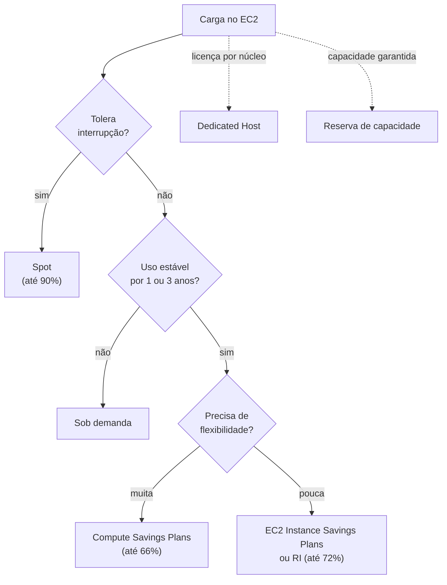

<!-- autoral -->

# 4.2 Modelos de compra do EC2

> **Domínio 4 — Cobrança, Preços e Suporte (12% da prova)** · Depende das aulas [3.3](../03-tecnologia-e-servicos/03-ec2.md), [2.4](../02-seguranca-e-conformidade/04-governanca-multi-conta.md) e [4.1](01-principios-de-preco.md)

> 🔎 **Fichas para aprofundar:** [Amazon EC2](../../servicos/computacao/ec2.md)

⬅️ [4.1 Princípios de preço da AWS](01-principios-de-preco.md) · 🏠 [Índice do domínio](README.md) · 🏫 [O caso da escola](../00-guia-do-exame/caso-da-escola.md) · [4.3 Como outros recursos são cobrados](03-cobranca-de-outros-recursos.md) ➡️

---

A rede de escolas usa o Amazon EC2 de vários jeitos. O servidor do sistema de matrícula fica ligado o ano inteiro. Toda noite, um processo gera os boletins dos alunos e pode rodar a qualquer hora da madrugada. Em janeiro, o pico de inscrições exige muitas instâncias a mais por algumas semanas. E um software de gestão antigo tem licença cobrada por núcleo físico do servidor. Pagar tudo pelo preço sob demanda funciona, mas sai caro.

O guia do exame cobra identificar quando usar cada forma de compra de computação: instâncias sob demanda, instâncias reservadas, instâncias Spot, Savings Plans, Dedicated Hosts, Dedicated Instances e reservas de capacidade. Cobra também a flexibilidade das instâncias reservadas e o comportamento delas no AWS Organizations.

## Sob demanda: sem compromisso

Nas **instâncias sob demanda** (*On-Demand*), você paga pela capacidade **por segundo**, com mínimo de 60 segundos, só enquanto a instância está em execução, sem compromisso de longo prazo. Você decide quando ligar, parar e encerrar. É o ponto de partida e a referência de preço: os descontos das outras formas são calculados sobre ele.

Serve para cargas curtas, imprevisíveis ou que não podem ser interrompidas, e para testar algo novo antes de saber quanto vai usar. O pico de janeiro da escola, que dura poucas semanas por ano, é um bom exemplo.

## Savings Plans: compromisso de gasto por hora

Os **Savings Plans** dão preços menores que os sob demanda em troca do compromisso de gastar uma quantidade fixa de **dólares por hora** em computação, por **1 ou 3 anos**. O compromisso é com o gasto, não com uma configuração de instância. Para computação, há dois tipos principais:

- **Compute Savings Plans:** a maior flexibilidade, com preços até **66%** menores que os sob demanda. Valem para o EC2 em qualquer família, tamanho, Região, sistema operacional ou locação, e também para o **AWS Fargate** e o **AWS Lambda**. A escola pode trocar de família de instância, mudar de Região ou passar uma aplicação do EC2 para contêineres no Fargate sem perder o desconto.
- **EC2 Instance Savings Plans:** até **72%** de desconto, com compromisso com uma **família de instâncias numa Região** (por exemplo, a família m5 na Virgínia). Dentro dela, o tamanho e o sistema operacional podem mudar.

Há também os **Database Savings Plans**, com até 35% de desconto em serviços de banco de dados como Aurora, RDS e DynamoDB, e os **SageMaker AI Savings Plans**, para o SageMaker AI. Um Savings Plan **não reserva capacidade**: ele só reduz o preço.

## Instâncias reservadas: compromisso com uma configuração

As **instâncias reservadas** (*Reserved Instances*, RIs) dão desconto de até **72%** em relação ao sob demanda em troca do compromisso com uma **configuração de instância** (tipo de instância, plataforma, escopo e locação) por **1 ou 3 anos**. Uma RI não é uma instância: é um desconto aplicado automaticamente às instâncias em execução que combinam com a configuração reservada.

A **flexibilidade** das RIs, cobrada na prova, depende de duas escolhas:

- **Classe:** a **Standard** dá o maior desconto, mas não pode ser trocada; a **Convertible** dá desconto menor e pode ser trocada durante o prazo por outra com nova família, tipo, plataforma, escopo ou locação. Só a Standard pode ser vendida no **Reserved Instance Marketplace** quando não for mais usada.
- **Escopo:** a RI **regional** vale em qualquer zona de disponibilidade da Região e, no Linux com locação padrão, para qualquer tamanho dentro da família; ela **não reserva capacidade**. A RI **zonal** vale só numa zona e num tamanho, mas **reserva capacidade** naquela zona. O preço é o mesmo nos dois escopos.

Para pagar RIs e Savings Plans há três opções: **tudo adiantado** (*All Upfront*), **parte adiantada** (*Partial Upfront*) e **nada adiantado** (*No Upfront*), com o restante em parcelas mensais. Encerrar a instância não cancela o compromisso: a RI continua cobrada até o fim do prazo.

**RIs no AWS Organizations.** Com o faturamento consolidado da [aula 2.4](../02-seguranca-e-conformidade/04-governanca-multi-conta.md), a organização é tratada como uma só conta para fins de cobrança: o desconto de uma RI comprada por uma conta pode ser aproveitado pelas instâncias de qualquer outra conta da organização. Esse compartilhamento vale também para os Savings Plans e pode ser desligado nas preferências de faturamento.

## Spot: capacidade sobrando com até 90% de desconto

As **instâncias Spot** usam a capacidade do EC2 que está sobrando, com descontos de até **90%** em relação ao sob demanda. A troca: a AWS pode **interromper** a instância quando precisar da capacidade de volta, com um **aviso dois minutos antes**. O preço Spot é definido pelo EC2 para cada tipo de instância e zona, e muda aos poucos de acordo com a oferta e a procura.

Spot é a escolha econômica quando a aplicação tolera interrupção e tem flexibilidade de horário, como análise de dados, processamento em lote e tarefas em segundo plano. A geração noturna dos boletins da escola, que pode recomeçar de onde parou, encaixa bem. O banco de dados do sistema de matrícula não.

## Hardware dedicado: Dedicated Hosts e Dedicated Instances

Por padrão, as instâncias rodam em hardware compartilhado: várias contas da AWS podem usar o mesmo servidor físico, isoladas entre si. Duas opções colocam as instâncias em servidores dedicados:

- **Dedicated Host:** um **servidor físico inteiro** dedicado a você, com visibilidade e controle de onde as instâncias rodam. Permite usar licenças de software próprias cobradas **por soquete, por núcleo ou por máquina virtual** (*Bring Your Own License*, BYOL), como as do Windows Server e do SQL Server. É a resposta para o software de gestão da escola.
- **Dedicated Instance:** instâncias que rodam em hardware dedicado a uma única conta, sem visibilidade nem controle do servidor físico e com suporte limitado a licenças próprias.

As duas servem para exigências de conformidade que pedem hardware não compartilhado. Não há diferença de desempenho, segurança ou hardware entre elas; a diferença está no controle do servidor e no suporte a licenças.

## Reservas de capacidade: garantir que vai ter máquina

As **reservas de capacidade sob demanda** (*On-Demand Capacity Reservations*) reservam capacidade do EC2 numa **zona de disponibilidade específica**, pelo tempo que for preciso, para quando não pode faltar máquina. Podem começar na hora, sem compromisso de prazo e com cancelamento a qualquer momento, ou numa data futura, com prazo mínimo combinado.

A reserva é cobrada pelo **preço sob demanda, usada ou não**: se a escola reserva 20 instâncias e roda 15, paga as 15 em uso e as 5 reservadas sem uso. Por si só, ela não dá desconto, mas os descontos de Savings Plans e de RIs regionais se aplicam a ela. Para a semana da abertura das matrículas, a escola pode reservar capacidade na zona que usa e combinar com um Savings Plan.

## Como escolher

| Situação | Forma de compra |
|---|---|
| Carga curta, imprevisível ou que não pode ser interrompida | Sob demanda |
| Uso estável, com liberdade para mudar família, Região ou ir para Fargate e Lambda | Compute Savings Plans |
| Uso estável de uma família de instâncias numa Região | EC2 Instance Savings Plans ou RI |
| Uso estável com configuração que pode mudar no prazo | RI Convertible |
| Carga tolerante a interrupção, com horário flexível | Spot |
| Licença por soquete ou por núcleo físico | Dedicated Host |
| Hardware não compartilhado, sem controlar o servidor | Dedicated Instance |
| Garantir capacidade numa zona numa data | Reserva de capacidade (ou RI zonal) |

*Figura 4.2 — Um caminho para escolher a forma de compra do EC2; licenças e capacidade garantida são necessidades à parte.*

## Na prova

- **"Não pode ser interrompida e é imprevisível", "curto prazo" = sob demanda.**
- **"Roda 24 horas por dia por 1 ou 3 anos" = Savings Plans ou instâncias reservadas.**
- **"Desconto que cobre EC2, Fargate e Lambda" = Compute Savings Plans.**
- **"Maior desconto" e "tolera interrupção" = Spot, com aviso de dois minutos.**
- **"Licença por soquete ou núcleo físico", "BYOL" = Dedicated Host.**
- **"Garantir capacidade numa zona" = reserva de capacidade ou RI zonal; Savings Plans e RIs regionais não reservam capacidade.**
- **No Organizations, o desconto de RIs e Savings Plans é compartilhado entre as contas.**

## Caso resolvido

**Situação.** A escola quer cortar custos no EC2. O servidor de matrícula roda o ano todo, e a equipe planeja levar parte dele para contêineres no Fargate no ano que vem. A geração de boletins roda à noite, demora algumas horas e pode recomeçar se for interrompida. O que usar para cada carga?

**Raciocínio.** O servidor de matrícula tem uso estável, mas vai mudar de forma: um Compute Savings Plan dá desconto no EC2 agora e continua valendo quando a carga for para o Fargate. A geração de boletins tolera interrupção e tem horário flexível, então instâncias Spot dão o maior desconto.

**Por que as alternativas tentadoras falham.** Uma RI Standard ou um EC2 Instance Savings Plan prendem a escola a uma família de instâncias do EC2 e não cobrem o Fargate. Spot no servidor de matrícula arrisca interromper as inscrições. Sob demanda para os boletins funciona, mas paga o preço cheio por uma carga que aceitaria Spot.

## Revisão

Tente responder antes de abrir cada resposta.

### Quando usar instâncias Spot?

Ver resposta

Quando a carga tolera interrupção e tem horário flexível, como processamento em lote e análise de dados; o desconto chega a 90%.

Comentário: a AWS pode retomar a capacidade com aviso de dois minutos.

### Qual é a diferença entre Compute Savings Plans e EC2 Instance Savings Plans?

Ver resposta

O Compute Savings Plans vale para qualquer família, Região e sistema, e também para Fargate e Lambda (até 66%); o EC2 Instance Savings Plans exige uma família numa Região e dá até 72%.

Comentário: mais flexibilidade, menos desconto.

### Qual é a diferença entre uma RI Standard e uma RI Convertible?

Ver resposta

A Standard dá o maior desconto, mas não pode ser trocada; a Convertible dá desconto menor e pode ser trocada por outra configuração durante o prazo.

Comentário: só a Standard pode ser vendida no Reserved Instance Marketplace.

### Quando escolher um Dedicated Host?

Ver resposta

Quando é preciso um servidor físico inteiro, com controle de onde as instâncias rodam, para usar licenças próprias cobradas por soquete, núcleo ou máquina virtual.

Comentário: a Dedicated Instance também usa hardware dedicado, mas sem controle do servidor e com suporte limitado a licenças próprias.

### Como as RIs se comportam numa organização do AWS Organizations?

Ver resposta

Com o faturamento consolidado, o desconto de uma RI comprada por uma conta pode ser aproveitado pelas instâncias de qualquer conta da organização.

Comentário: o compartilhamento vale também para Savings Plans e pode ser desligado.

## Resumo

- Sob demanda: por segundo, sem compromisso; é a referência de preço.
- Savings Plans: compromisso de gasto por hora; Compute (até 66%, inclui Fargate e Lambda) e EC2 Instance (até 72%).
- RIs: compromisso com uma configuração (até 72%); Standard ou Convertible; regional ou zonal.
- Spot: até 90%, com interrupção avisada dois minutos antes.
- Dedicated Host para licenças por núcleo; Dedicated Instance para hardware não compartilhado.
- Reserva de capacidade garante máquina numa zona e cobra o preço sob demanda, usada ou não.

## Fontes oficiais

Verificadas em 06/10/2026.

- [Content Domain 4 do guia do exame CLF-C02](https://docs.aws.amazon.com/aws-certification/latest/cloud-practitioner-02/cloud-practitioner-02-domain4.html): formas de compra, flexibilidade das RIs e RIs no Organizations (tarefa 4.1).
- [Amazon EC2 billing and purchasing options](https://docs.aws.amazon.com/AWSEC2/latest/UserGuide/instance-purchasing-options.html) e [On-Demand Instances](https://docs.aws.amazon.com/AWSEC2/latest/UserGuide/ec2-on-demand-instances.html): as sete formas e a cobrança por segundo com mínimo de 60 segundos.
- [Savings Plans types](https://docs.aws.amazon.com/savingsplans/latest/userguide/plan-types.html) e [What are Savings Plans?](https://docs.aws.amazon.com/savingsplans/latest/userguide/what-is-savings-plans.html): tipos, descontos (66%, 72%, 35%), cobertura de Fargate e Lambda e opções de pagamento.
- [Amazon EC2 Reserved Instances](https://aws.amazon.com/ec2/pricing/reserved-instances/): desconto de até 72% e opções de pagamento.
- [Types of Reserved Instances](https://docs.aws.amazon.com/AWSEC2/latest/UserGuide/reserved-instances-types.html) e [Regional and zonal Reserved Instances](https://docs.aws.amazon.com/AWSEC2/latest/UserGuide/reserved-instances-scope.html): Standard e Convertible, Marketplace, escopo e reserva de capacidade.
- [Reserved Instances (consolidated billing)](https://docs.aws.amazon.com/awsaccountbilling/latest/aboutv2/ri-behavior.html): compartilhamento do desconto no Organizations.
- [Spot Instances](https://docs.aws.amazon.com/AWSEC2/latest/UserGuide/using-spot-instances.html), [Spot Instance interruption notices](https://docs.aws.amazon.com/AWSEC2/latest/UserGuide/spot-instance-termination-notices.html) e [Amazon EC2 Spot](https://aws.amazon.com/ec2/spot/): preço Spot, cargas indicadas, aviso de dois minutos e até 90%.
- [Dedicated Hosts](https://docs.aws.amazon.com/AWSEC2/latest/UserGuide/dedicated-hosts-overview.html) e [Dedicated Instances](https://docs.aws.amazon.com/AWSEC2/latest/UserGuide/dedicated-instance.html): servidor físico dedicado, BYOL e diferenças.
- [On-Demand Capacity Reservations](https://docs.aws.amazon.com/AWSEC2/latest/UserGuide/ec2-capacity-reservations.html) e [pricing and billing](https://docs.aws.amazon.com/AWSEC2/latest/UserGuide/capacity-reservations-pricing-billing.html): reserva por zona, cobrança sob demanda usada ou não e descontos aplicáveis.

<!-- notas:inicio -->
## 📝 Minhas anotações

<!-- Escreva aqui suas observações, dúvidas e as questões que você errou sobre o tema. -->
<!-- notas:fim -->

---

⬅️ [4.1 Princípios de preço da AWS](01-principios-de-preco.md) · 🏠 [Índice do domínio](README.md) · [4.3 Como outros recursos são cobrados](03-cobranca-de-outros-recursos.md) ➡️
