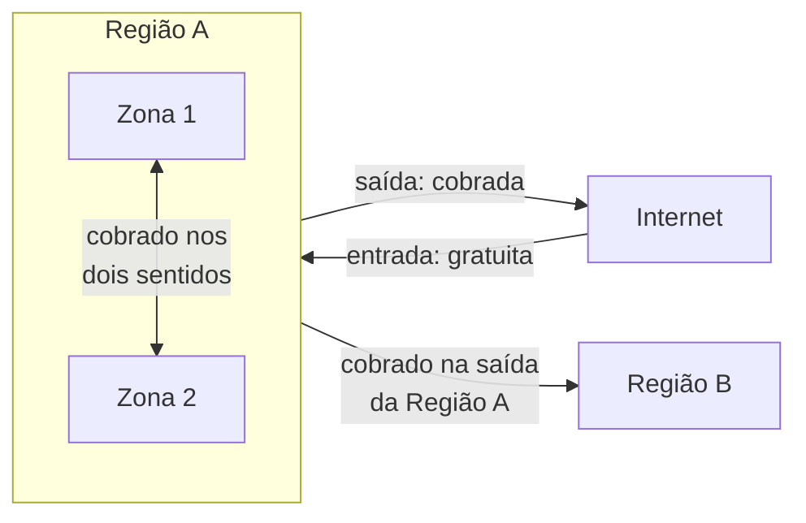

<!-- autoral -->

# 4.3 Como outros recursos são cobrados

> **Domínio 4 — Cobrança, Preços e Suporte (12% da prova)** · Depende das aulas [3.8](../03-tecnologia-e-servicos/08-s3.md), [3.9](../03-tecnologia-e-servicos/09-outros-armazenamentos.md), [3.10](../03-tecnologia-e-servicos/10-rede-e-entrega-de-conteudo.md) e [4.1](01-principios-de-preco.md)

> 🔎 **Fichas para aprofundar:** [Amazon S3](../../servicos/armazenamento/s3.md) · [Amazon EBS e instance store](../../servicos/armazenamento/ebs.md) · [AWS Lambda](../../servicos/computacao/lambda.md)

⬅️ [4.2 Modelos de compra do EC2](02-modelos-de-compra-ec2.md) · 🏠 [Índice do domínio](README.md) · [4.4 Ferramentas de custo e faturamento](04-ferramentas-de-custo.md) ➡️

---

A rede de escolas já entendeu as instâncias do EC2, mas a fatura tem outras linhas. Os pais assistem às reuniões gravadas, que saem da AWS para a internet. O sistema de matrícula roda em duas zonas de disponibilidade e conversa com o banco o tempo todo. Uma cópia dos boletins vai para outra Região, por segurança. E há volumes, arquivos, endereços IP e funções Lambda espalhados pela conta. Cada um tem sua regra de cobrança.

O guia do exame cobra entender os custos de transferência de dados de entrada e de saída, inclusive entre Regiões e dentro da mesma Região, e as opções de preço das classes de armazenamento. Esta aula reúne essas regras e as de outros recursos que aparecem com frequência na fatura.

## Transferência de dados: o caminho do dado define o preço

Para saber se uma transferência é cobrada, olhe de onde o dado sai e para onde vai:

- **Da internet para a AWS (entrada):** gratuita.
- **Da AWS para a internet (saída):** cobrada por GB, com preço menor por GB nas faixas de volume maiores. Todo cliente tem **100 GB de saída para a internet gratuitos por mês**, somados entre todos os serviços e Regiões (exceto China e GovCloud).
- **Entre Regiões da AWS:** cobrada pela **saída da Região de origem**; a entrada na Região de destino não é cobrada.
- **Entre zonas de disponibilidade da mesma Região:** cobrada para recursos como EC2, RDS, Redshift e ElastiCache, **nos dois sentidos** (a página de preços do EC2 mostra US$ 0,01 por GB em cada direção).
- **Dentro da mesma zona de disponibilidade:** gratuita entre EC2, RDS, Redshift e ElastiCache. O tráfego que passa por um IPv4 público ou Elastic IP é cobrado mesmo assim.
- **Entre o EC2 e serviços como S3, DynamoDB, SQS e SNS na mesma Região:** gratuita quando feita diretamente.

Na escola: o envio dos vídeos aos pais é saída para a internet, cobrada; a cópia dos boletins para outra Região é cobrada na saída da Região de origem; a conversa do sistema com o banco em outra zona é cobrada nos dois sentidos; e o upload das gravações para a AWS é entrada, gratuita.

Para reduzir a saída para a internet de conteúdo muito acessado, a escola pode servir os vídeos pelo Amazon CloudFront ([aula 3.10](../03-tecnologia-e-servicos/10-rede-e-entrega-de-conteudo.md)): o conteúdo em cache nos pontos de presença atende os pedidos repetidos, e menos requisições chegam à origem.

## Armazenamento: cada serviço mede de um jeito

- **Amazon S3:** cobra pelo **armazenamento** (tamanho, tempo guardado e classe), pelas **requisições** e **recuperações** e pela **transferência de dados** para a internet. As classes mais baratas para guardar cobram taxa por GB recuperado e têm **prazo mínimo**: apagar um objeto antes do prazo gera cobrança pelo prazo inteiro.
- **Amazon EBS:** cobra por **GB-mês provisionado**, isto é, pelo tamanho do volume criado, cheio ou não. Alguns tipos cobram também desempenho provisionado acima de um patamar incluído.
- **Amazon EFS:** sem taxa mínima; paga-se só pelo armazenamento **usado** e pelas leituras e gravações.

As opções de preço das classes do S3 ([aula 3.8](../03-tecnologia-e-servicos/08-s3.md)) seguem uma regra: quanto menos o dado é acessado, mais barato guardar e mais caro (ou mais demorado) buscar.

| Classe do S3 | Recuperação | Prazo mínimo |
|---|---|---|
| S3 Standard | Sem taxa de recuperação | Nenhum |
| S3 Intelligent-Tiering | Sem taxa de recuperação; taxa de monitoramento por objeto | Nenhum |
| S3 Standard-IA e One Zone-IA | Taxa por GB recuperado | 30 dias |
| S3 Glacier Instant Retrieval | Taxa por GB recuperado; leitura em milissegundos | 90 dias |
| S3 Glacier Flexible Retrieval | Taxa por GB recuperado; restauração antes de ler | 90 dias |
| S3 Glacier Deep Archive | Taxa por GB recuperado; restauração em até 12 ou 48 horas; o armazenamento mais barato da AWS | 180 dias |

Na escola, um volume EBS de 500 GB com 50 GB usados é cobrado pelos 500 GB; já os arquivos compartilhados no EFS são cobrados só pelo que ocupam.

## Rede: endereços IP e NAT

- **Endereços IPv4 públicos:** todo IPv4 público é cobrado por hora, **em uso ou ocioso** (a página de preços da VPC mostra US$ 0,005 por hora por endereço). Um Elastic IP esquecido na conta continua custando.
- **NAT gateway** ([aula 3.10](../03-tecnologia-e-servicos/10-rede-e-entrega-de-conteudo.md)): cobra **por hora** enquanto existir e **por GB processado**, além da transferência de dados normal.

## Serviços sem servidor e gerenciados

Nos serviços sem servidor, paga-se pelo que é executado, sem custo enquanto nada roda:

- **AWS Lambda:** por **número de pedidos** e pela **duração** da execução ([aula 3.5](../03-tecnologia-e-servicos/05-containers-e-serverless.md)).
- **AWS Fargate:** pela vCPU, memória e armazenamento que os contêineres consomem.
- **Amazon DynamoDB sob demanda:** pelas leituras e gravações feitas ([aula 3.7](../03-tecnologia-e-servicos/07-bancos-de-dados.md)).
- **Amazon Athena:** pela quantidade de dados lidos em cada consulta ([aula 3.11](../03-tecnologia-e-servicos/11-analytics.md)).

## Serviços sem cobrança adicional

Alguns serviços não cobram nada por si: você paga só os recursos que eles criam ou usam.

- **IAM**, **IAM Identity Center** e **AWS STS** ([aula 2.3](../02-seguranca-e-conformidade/03-iam.md)).
- **Faturamento consolidado** do AWS Organizations ([aula 2.4](../02-seguranca-e-conformidade/04-governanca-multi-conta.md)).
- **AWS Elastic Beanstalk** ([aula 3.6](../03-tecnologia-e-servicos/06-outros-servicos-de-computacao.md)): paga as instâncias, o balanceador e o que mais ele criar.
- **Amazon EC2 Auto Scaling**: paga as instâncias, os volumes e os alarmes do CloudWatch usados.
- **AWS CloudFormation**, com os recursos da própria AWS: paga os recursos que a pilha cria.

O limite: "sem cobrança adicional" não quer dizer "de graça". Um ambiente do Elastic Beanstalk ou uma pilha do CloudFormation pode criar instâncias, volumes e balanceadores que custam como qualquer outro.

## Como escolher

| Situação | Cobrança |
|---|---|
| Upload de arquivos da internet para a AWS | Gratuito |
| Site enviando conteúdo aos usuários | Saída para a internet (100 GB por mês gratuitos, somando tudo) |
| Réplica de dados em outra Região | Saída da Região de origem |
| Instâncias e banco em zonas diferentes | Cobrado nos dois sentidos |
| Volume EBS pouco usado | Paga o tamanho provisionado |
| Arquivo guardado por obrigação e quase nunca lido | S3 Glacier Deep Archive: o mais barato, com restauração demorada |
| Elastic IP sem uso | Cobrado por hora |

*Figura 4.3 — O caminho do dado define a cobrança: entrada gratuita, saída para a internet e entre Regiões cobradas, e tráfego entre zonas cobrado nos dois sentidos.*

## Na prova

- **Entrada da internet para a AWS é gratuita; saída para a internet é cobrada.**
- **Entre Regiões, cobra-se a saída da Região de origem.**
- **Entre zonas da mesma Região, há cobrança; dentro da mesma zona, não (salvo pelo IPv4 público).**
- **EBS cobra o volume provisionado; EFS e S3 cobram o que é guardado.**
- **Classes mais baratas do S3 cobram recuperação e têm prazo mínimo.**
- **IAM, Organizations, Elastic Beanstalk, Auto Scaling e CloudFormation não cobram por si; os recursos criados, sim.**

## Caso resolvido

**Situação.** A fatura da escola subiu. A equipe encontrou: um volume EBS de 1 TB com pouco uso, ligado a uma instância parada; três Elastic IPs que ninguém usa; e um aumento grande na transferência de dados de saída desde que os vídeos das reuniões passaram a ser baixados direto do S3 pelos pais. O que explica cada linha e o que fazer?

**Raciocínio.** O EBS cobra pelo terabyte provisionado, mesmo com a instância parada e o disco quase vazio: vale guardar o que importa e reduzir ou apagar o volume. Elastic IPs são IPv4 públicos e são cobrados por hora mesmo ociosos: basta liberá-los. Os vídeos baixados pelos pais são saída para a internet; servi-los pelo CloudFront faz o cache atender os pedidos repetidos e reduz as requisições à origem.

**Por que as alternativas tentadoras falham.** "Instância parada não gera custo" esquece o EBS e os IPs. "Mudar os vídeos para o Glacier Deep Archive" baratearia o armazenamento, mas os pais não conseguiriam assistir sem restauração demorada, e a saída continuaria cobrada. "Copiar os vídeos para outra Região" acrescenta transferência entre Regiões em vez de reduzir custo.

## Revisão

Tente responder antes de abrir cada resposta.

### Qual transferência de dados é gratuita: entrada ou saída?

Ver resposta

A entrada, da internet para a AWS. A saída para a internet é cobrada, com 100 GB gratuitos por mês somando todos os serviços e Regiões.

Comentário: a transferência entre Regiões é cobrada na saída da Região de origem.

### A transferência entre zonas de disponibilidade da mesma Região é cobrada?

Ver resposta

Sim, para recursos como EC2, RDS, Redshift e ElastiCache, nos dois sentidos; dentro da mesma zona é gratuita, salvo o tráfego por IPv4 público.

Comentário: é um custo a considerar ao espalhar a aplicação entre zonas para ter alta disponibilidade.

### Como o Amazon EBS é cobrado?

Ver resposta

Por GB-mês provisionado: paga-se o tamanho do volume criado, cheio ou não.

Comentário: o EFS, ao contrário, cobra só o armazenamento usado.

### Qual é o preço da economia nas classes mais baratas do S3?

Ver resposta

Taxa por GB recuperado, prazo mínimo de armazenamento e, nas classes Glacier Flexible Retrieval e Deep Archive, restauração demorada antes da leitura.

Comentário: apagar o objeto antes do prazo mínimo gera cobrança pelo prazo inteiro.

### Cite serviços que não cobram nada por si.

Ver resposta

IAM, faturamento consolidado do Organizations, Elastic Beanstalk, EC2 Auto Scaling e CloudFormation com recursos da AWS.

Comentário: paga-se pelos recursos que eles criam ou usam.

## Resumo

- Entrada gratuita; saída para a internet cobrada (100 GB por mês gratuitos no total); entre Regiões, cobra-se a saída da origem.
- Entre zonas da mesma Região, cobrado nos dois sentidos; na mesma zona, gratuito (salvo por IPv4 público).
- S3 cobra armazenamento, requisições, recuperações e transferência; EBS cobra o provisionado; EFS cobra o usado.
- IPv4 público é cobrado por hora, em uso ou não; NAT gateway cobra por hora e por GB.
- Lambda, Fargate, DynamoDB sob demanda e Athena cobram pelo que executam.
- IAM, Organizations, Elastic Beanstalk, Auto Scaling e CloudFormation não cobram por si.

## Fontes oficiais

Verificadas em 06/10/2026.

- [Content Domain 4 do guia do exame CLF-C02](https://docs.aws.amazon.com/aws-certification/latest/cloud-practitioner-02/cloud-practitioner-02-domain4.html): transferência de dados e opções de preço de armazenamento (tarefa 4.1).
- [Amazon EC2 On-Demand Pricing](https://aws.amazon.com/ec2/pricing/on-demand/): entrada gratuita, 100 GB de saída gratuitos, tráfego entre zonas, na mesma zona e entre o EC2 e outros serviços na mesma Região.
- [Understanding data transfer charges](https://docs.aws.amazon.com/cur/latest/userguide/cur-data-transfers-charges.html): cobrança entre Regiões na saída da origem e nos dois sentidos dentro da Região.
- [Amazon S3 pricing](https://aws.amazon.com/s3/pricing/) e [Amazon S3 storage classes](https://docs.aws.amazon.com/AmazonS3/latest/userguide/storage-class-intro.html): dimensões de cobrança, taxas de recuperação e prazos mínimos.
- [Amazon EBS pricing](https://aws.amazon.com/ebs/pricing/) e [Amazon EFS pricing](https://aws.amazon.com/efs/pricing/): GB-mês provisionado no EBS; armazenamento usado e sem taxa mínima no EFS.
- [Amazon VPC pricing](https://aws.amazon.com/vpc/pricing/): IPv4 público por hora, em uso ou ocioso, e cobrança do NAT gateway.
- [Amazon CloudFront pricing](https://aws.amazon.com/cloudfront/pricing/): menos requisições à origem com o cache.
- [What is IAM?](https://docs.aws.amazon.com/IAM/latest/UserGuide/introduction.html), [Consolidating billing for AWS Organizations](https://docs.aws.amazon.com/awsaccountbilling/latest/aboutv2/consolidated-billing.html), [What is Amazon EC2 Auto Scaling?](https://docs.aws.amazon.com/autoscaling/ec2/userguide/what-is-amazon-ec2-auto-scaling.html) e [AWS CloudFormation pricing](https://aws.amazon.com/cloudformation/pricing/): serviços sem cobrança adicional.

<!-- notas:inicio -->
## 📝 Minhas anotações

<!-- Escreva aqui suas observações, dúvidas e as questões que você errou sobre o tema. -->
<!-- notas:fim -->

---

⬅️ [4.2 Modelos de compra do EC2](02-modelos-de-compra-ec2.md) · 🏠 [Índice do domínio](README.md) · [4.4 Ferramentas de custo e faturamento](04-ferramentas-de-custo.md) ➡️
