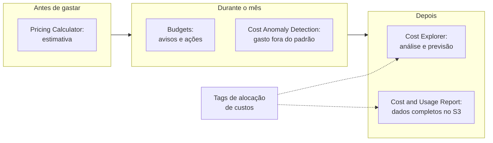

<!-- autoral -->

# 4.4 Ferramentas de custo e faturamento

> **Domínio 4 — Cobrança, Preços e Suporte (12% da prova)** · Depende das aulas [1.7](../01-conceitos-de-nuvem/07-economia-da-nuvem.md), [2.4](../02-seguranca-e-conformidade/04-governanca-multi-conta.md) e [4.1](01-principios-de-preco.md)

> 🔎 **Fichas para aprofundar:** [AWS Cost Explorer](../../servicos/custos/cost-explorer.md) · [AWS Budgets](../../servicos/custos/budgets.md) · [Pricing Calculator, Cost and Usage Report e outras ferramentas de faturamento](../../servicos/custos/pricing-calculator-cur-e-outras-ferramentas.md)

⬅️ [4.3 Como outros recursos são cobrados](03-cobranca-de-outros-recursos.md) · 🏠 [Índice do domínio](README.md) · 🏫 [O caso da escola](../00-guia-do-exame/caso-da-escola.md) · [4.5 Planos de AWS Support](05-planos-de-suporte.md) ➡️

---

A diretora financeira da rede de escolas tem uma lista de pedidos. Antes de aprovar o novo sistema da biblioteca, quer saber quanto ele vai custar. Quer entender por que os gastos subiram nos últimos meses e quanto vão ser no fim do ano. Quer um aviso antes que a conta passe de US$ 2.000 no mês. Quer saber quanto cada escola da rede gasta. E a contabilidade pede os dados detalhados para montar as próprias planilhas.

O guia do exame cobra os recursos de cobrança, orçamento e gestão de custos: o AWS Budgets, o AWS Cost Explorer, a AWS Pricing Calculator, o faturamento consolidado do AWS Organizations, as tags de alocação de custos e os relatórios de cobrança, como o AWS Cost and Usage Report. Cada pedido da diretora tem uma ferramenta.

## A fatura: o console de Billing and Cost Management

A AWS emite a fatura **mensalmente**, com o uso e as taxas recorrentes. Taxas únicas, como a compra de uma instância reservada com pagamento total adiantado, são cobradas na hora. No console do **AWS Billing and Cost Management**, a página **Bills** mostra a estimativa do mês em curso e as faturas fechadas dos meses anteriores, com o detalhe por serviço. Para dúvidas sobre a fatura ou para contestar uma cobrança, o caminho é abrir um caso no AWS Support ([aula 4.5](05-planos-de-suporte.md)).

## Antes de gastar: AWS Pricing Calculator

A **AWS Pricing Calculator** é uma ferramenta web **gratuita** para **estimar** o custo de usar serviços da AWS antes de criá-los. Serve para modelar uma solução, explorar preços, ver os cálculos por trás da estimativa e planejar gastos, e não exige experiência com a AWS. A estimativa mostra os custos adiantados, mensais e anuais, pode ser compartilhada por um link e exportada em CSV ou PDF. Ela não inclui impostos.

É a resposta ao primeiro pedido: a diretora monta o sistema da biblioteca na calculadora e vê o custo antes de qualquer recurso existir. Cada serviço também tem uma página de preços no site da AWS, que a calculadora usa como base.

## Entender o que já foi gasto: AWS Cost Explorer

O **AWS Cost Explorer** permite **ver e analisar** custos e uso com gráficos e relatórios, filtrando e agrupando por serviço, conta, Região e tags. Mostra até os **últimos 13 meses**, faz a **previsão** dos próximos 18 meses e traz recomendações de compra de instâncias reservadas e de Savings Plans. Usar o Cost Explorer pelo console é gratuito; o acesso pela API é cobrado por requisição.

É a resposta ao segundo pedido: a diretora vê no gráfico que o aumento veio da transferência de dados e consulta a previsão até dezembro.

## Ser avisado a tempo: AWS Budgets

O **AWS Budgets** acompanha custos e uso contra um valor definido e **avisa** por e-mail ou por um tópico do Amazon SNS. Os tipos de orçamento:

- **Custo:** limite de gasto, com aviso quando o custo **real** ou o **previsto** se aproxima ou passa do valor.
- **Uso:** limite de uso de um ou mais serviços.
- **Utilização e cobertura de RIs e de Savings Plans:** avisa quando os descontos comprados estão sendo pouco usados ou cobrem pouco do uso.

Além de avisar, o Budgets pode **agir** quando o limite é atingido, de forma automática ou depois de uma aprovação: aplicar uma política do IAM ou uma SCP que impeça criar novos recursos, ou agir sobre instâncias específicas do EC2 e do RDS. É a resposta ao terceiro pedido: um orçamento de custo de US$ 2.000 por mês com aviso quando a previsão passar de 80%.

Outra opção de aviso é o **alarme de cobrança do Amazon CloudWatch**, que monitora a métrica de cobranças estimadas da conta. Ele dispara quando a cobrança **atual** passa do limite; não usa previsão.

O **AWS Cost Anomaly Detection** completa o quadro: usa **machine learning** para detectar gastos fora do padrão e avisa por e-mail ou SNS, apontando as causas prováveis por serviço, conta, Região ou tipo de uso. Ele pega o que um limite fixo não pega, como um gasto que dobrou sem passar do orçamento.

## Separar os custos: tags de alocação e faturamento consolidado

Uma **tag** é um rótulo com chave e valor colocado num recurso, como `escola = Lisboa`. As **tags de alocação de custos** usam essas tags para organizar os custos nos relatórios. Há dois tipos:

- **Definidas pelo usuário:** você cria e aplica, como `escola` ou `projeto`. Aparecem com o prefixo `user:`.
- **Geradas pela AWS:** a AWS cria e aplica, como `createdBy`, que registra quem criou o recurso. Têm o prefixo `aws:`.

Os dois tipos precisam ser **ativados** no console de Billing and Cost Management, separadamente, para aparecer no Cost Explorer e nos relatórios de custo. É a resposta ao quarto pedido: com a tag `escola` ativada, a diretora vê o gasto de cada unidade.

Quando cada escola tem sua conta, o **faturamento consolidado** do AWS Organizations ([aula 2.4](../02-seguranca-e-conformidade/04-governanca-multi-conta.md)) junta todas numa **fatura única**, paga pela conta de gerenciamento. Ele soma o uso das contas, o que compartilha os **descontos por volume**, os de instâncias reservadas e os de Savings Plans, e não tem custo adicional.

## Os dados completos: Cost and Usage Report e Data Exports

O **AWS Cost and Usage Report** (CUR) tem o conjunto **mais completo** de dados de custo e uso disponível. Ele publica os relatórios num **bucket do S3** da conta, com os custos por hora, dia ou mês, por serviço ou por recurso e pelas tags de alocação. Os dados podem ser lidos numa planilha ou analisados com o Amazon Athena, o Amazon Redshift ou o Amazon Quick Sight. Hoje, a forma recomendada de receber esses dados é o **CUR 2.0**, criado pelo **AWS Data Exports**, que também exporta outros conjuntos, como recomendações de otimização e emissões de carbono.

É a resposta ao último pedido: a contabilidade recebe os dados detalhados no S3 e monta as planilhas que quiser.

Outro serviço que aparece na fatura é o **AWS Marketplace** ([aula 4.6](06-outros-recursos-de-ajuda.md)): o software de terceiros comprado nele é cobrado na própria fatura da AWS. O AWS Billing Conductor, para refaturar custos a clientes ou áreas internas, está na lista **fora do escopo** do exame.

## Como escolher

| Pedido | Ferramenta |
|---|---|
| Estimar o custo antes de criar os recursos | AWS Pricing Calculator |
| Ver a fatura do mês e as anteriores | Billing and Cost Management (página Bills) |
| Analisar gastos passados, ver tendências e prever | AWS Cost Explorer |
| Ser avisado ao passar de um valor, real ou previsto | AWS Budgets |
| Agir automaticamente ao estourar o orçamento | AWS Budgets (ações) |
| Detectar gasto fora do padrão | AWS Cost Anomaly Detection |
| Separar custos por escola, projeto ou time | Tags de alocação de custos (ativadas) |
| Uma fatura para várias contas, com descontos somados | Faturamento consolidado do Organizations |
| Dados mais detalhados para análise própria | Cost and Usage Report (Data Exports) |

*Figura 4.4 — As ferramentas de custo ao longo do tempo: estimar antes, acompanhar durante e analisar depois, com as tags separando os custos.*

## Na prova

- **"Estimar o custo antes de migrar ou criar" = Pricing Calculator.**
- **"Visualizar gastos passados", "tendência", "prever o gasto" = Cost Explorer.**
- **"Alerta quando passar de um valor", "orçamento" = Budgets; avisa pelo real ou pelo previsto.**
- **"Gasto fora do padrão", "machine learning" = Cost Anomaly Detection.**
- **"Ratear custos por departamento ou projeto" = tags de alocação de custos, que precisam ser ativadas.**
- **"Dados mais detalhados", "por recurso e por hora" = Cost and Usage Report.**
- **"Várias contas, uma fatura, descontos somados" = faturamento consolidado.**

## Caso resolvido

**Situação.** Cada escola da rede tem sua própria conta da AWS. A diretoria quer uma fatura só, quer aproveitar os descontos de volume e as instâncias reservadas compradas pela sede em todas as contas, e quer ver quanto cada projeto gasta, mesmo quando um projeto usa recursos de várias contas. O que configurar?

**Raciocínio.** O AWS Organizations com faturamento consolidado junta as contas numa fatura única, soma o uso para os descontos por volume e compartilha os descontos das instâncias reservadas entre as contas, sem custo adicional. Para ver o gasto por projeto, a equipe aplica uma tag `projeto` aos recursos e a ativa como tag de alocação de custos; depois, filtra por ela no Cost Explorer.

**Por que as alternativas tentadoras falham.** O Budgets avisa sobre limites, mas não junta faturas nem separa custos por projeto sozinho. A Pricing Calculator estima custos futuros, não mostra o gasto real. Criar as tags sem ativá-las no console de Billing deixa os relatórios sem a divisão por projeto.

## Revisão

Tente responder antes de abrir cada resposta.

### Para que serve a AWS Pricing Calculator?

Ver resposta

Para estimar o custo de usar serviços da AWS antes de criá-los; é uma ferramenta web gratuita.

Comentário: a estimativa pode ser compartilhada por link e exportada em CSV ou PDF.

### Qual é a diferença entre o Cost Explorer e o Budgets?

Ver resposta

O Cost Explorer analisa os gastos passados e faz previsões; o Budgets define limites e avisa (ou age) quando o custo ou o uso se aproxima deles.

Comentário: o Budgets pode avisar pelo valor real ou pelo previsto.

### Quais são os dois tipos de tags de alocação de custos?

Ver resposta

As definidas pelo usuário (prefixo `user:`) e as geradas pela AWS (prefixo `aws:`), e as duas precisam ser ativadas no console de Billing para aparecer nos relatórios.

Comentário: servem para separar custos por projeto, escola, time ou ambiente.

### O que o AWS Cost and Usage Report oferece?

Ver resposta

O conjunto mais completo de dados de custo e uso, entregue num bucket do S3, por hora, dia ou mês, por recurso e por tag.

Comentário: hoje é criado pelo AWS Data Exports, na versão CUR 2.0.

### O que o faturamento consolidado do Organizations traz?

Ver resposta

Uma fatura única para várias contas e a soma do uso de todas, o que compartilha descontos por volume, de instâncias reservadas e de Savings Plans, sem custo adicional.

Comentário: a conta de gerenciamento paga a fatura de todas as contas.

## Resumo

- Pricing Calculator estima antes; a página Bills mostra a fatura.
- Cost Explorer analisa 13 meses e prevê os próximos.
- Budgets avisa pelo real ou previsto e pode agir; Cost Anomaly Detection pega gastos fora do padrão.
- Tags de alocação separam custos e precisam ser ativadas.
- Faturamento consolidado: uma fatura e descontos somados, sem custo.
- Cost and Usage Report: os dados mais completos, no S3, via Data Exports.

## Fontes oficiais

Verificadas em 06/10/2026.

- [Content Domain 4 do guia do exame CLF-C02](https://docs.aws.amazon.com/aws-certification/latest/cloud-practitioner-02/cloud-practitioner-02-domain4.html): recursos de cobrança, orçamento e custos (tarefa 4.2).
- [Understanding your bill](https://docs.aws.amazon.com/awsaccountbilling/latest/aboutv2/getting-viewing-bill.html): fatura mensal, taxas únicas, estimativa do mês e contato com o Support.
- [What is AWS Pricing Calculator?](https://docs.aws.amazon.com/pricing-calculator/latest/userguide/what-is-pricing-calculator.html): ferramenta gratuita, usos, compartilhamento, exportação e impostos.
- [Analyzing your costs and usage with AWS Cost Explorer](https://docs.aws.amazon.com/cost-management/latest/userguide/ce-what-is.html) e [filtros](https://docs.aws.amazon.com/cost-management/latest/userguide/ce-filtering.html): filtros por serviço, conta, Região e tag, 13 meses, previsão de 18 meses, recomendações, console gratuito e API cobrada.
- [Managing your costs with AWS Budgets](https://docs.aws.amazon.com/cost-management/latest/userguide/budgets-managing-costs.html) e [Configuring budget actions](https://docs.aws.amazon.com/cost-management/latest/userguide/budgets-controls.html): tipos de orçamento, avisos e ações.
- [Create a billing alarm](https://docs.aws.amazon.com/AmazonCloudWatch/latest/monitoring/monitor_estimated_charges_with_cloudwatch.html): alarme sobre cobranças estimadas, sem previsão.
- [AWS Cost Anomaly Detection](https://docs.aws.amazon.com/cost-management/latest/userguide/manage-ad.html): machine learning, alertas e causas.
- [AWS cost allocation tags](https://docs.aws.amazon.com/awsaccountbilling/latest/aboutv2/cost-alloc-tags.html): tipos, prefixos e ativação.
- [Consolidating billing for AWS Organizations](https://docs.aws.amazon.com/awsaccountbilling/latest/aboutv2/consolidated-billing.html): fatura única, uso combinado e sem custo adicional.
- [What are AWS Cost and Usage Reports?](https://docs.aws.amazon.com/cur/latest/userguide/what-is-cur.html) e [What is AWS Data Exports?](https://docs.aws.amazon.com/cur/latest/userguide/what-is-data-exports.html): dados mais completos no S3 e CUR 2.0.
- [What is AWS Marketplace?](https://docs.aws.amazon.com/marketplace/latest/buyerguide/what-is-marketplace.html): compras cobradas na fatura da AWS.
- [Out-of-Scope AWS Services](https://docs.aws.amazon.com/aws-certification/latest/cloud-practitioner-02/clf-02-out-of-scope-services.html): Billing Conductor fora do escopo.

<!-- notas:inicio -->
## 📝 Minhas anotações

<!-- Escreva aqui suas observações, dúvidas e as questões que você errou sobre o tema. -->
<!-- notas:fim -->

---

⬅️ [4.3 Como outros recursos são cobrados](03-cobranca-de-outros-recursos.md) · 🏠 [Índice do domínio](README.md) · [4.5 Planos de AWS Support](05-planos-de-suporte.md) ➡️
