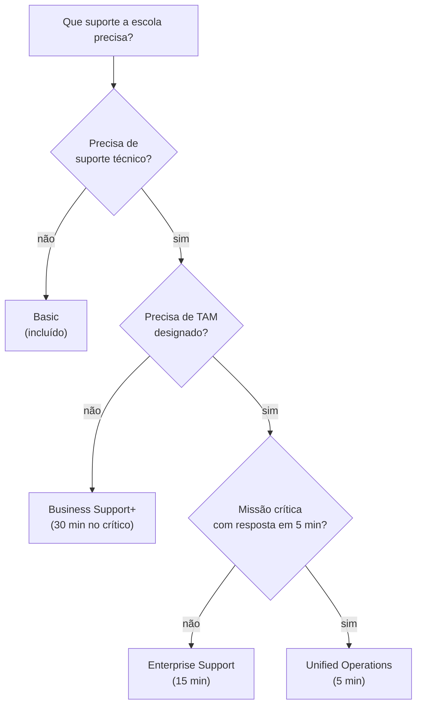

<!-- autoral -->

# 4.5 Planos de AWS Support

> **Domínio 4 — Cobrança, Preços e Suporte (12% da prova)** · Depende das aulas [2.9](../02-seguranca-e-conformidade/09-deteccao-de-ameacas.md), [3.16](../03-tecnologia-e-servicos/16-gestao-e-governanca.md) e [4.4](04-ferramentas-de-custo.md)

> 🔎 **Fichas para aprofundar:** [Planos de AWS Support](../../servicos/custos/planos-de-suporte.md) · [AWS Trusted Advisor](../../servicos/gerenciamento/trusted-advisor.md)

⬅️ [4.4 Ferramentas de custo e faturamento](04-ferramentas-de-custo.md) · 🏠 [Índice do domínio](README.md) · [4.6 Outros recursos de ajuda](06-outros-recursos-de-ajuda.md) ➡️

---

São 22h de um domingo de janeiro, e o sistema de matrícula da rede de escolas parou de responder. A equipe técnica, de duas pessoas, já olhou os painéis e não achou a causa. Dá para ligar para alguém da AWS agora? Quanto tempo até um especialista responder? A resposta depende do plano de suporte que a escola contratou.

O guia do exame cobra identificar as opções de suporte da AWS: o atendimento ao cliente e as comunidades, o Basic Support, o AWS Business Support+, o AWS Enterprise Support e o AWS Unified Operations. Cobra também o papel do AWS Trusted Advisor, do AWS Health Dashboard e da AWS Health API, e o AWS Support Center.

## Os planos mudaram

A AWS reorganizou os planos de suporte. Hoje são quatro: **Basic**, **AWS Business Support+**, **AWS Enterprise Support** e **AWS Unified Operations**. Os planos antigos **Developer**, **Business** e **Enterprise On-Ramp** serão descontinuados em **01/01/2027**: quem tem Developer ou Business pode passar para o Business Support+, e os clientes do Enterprise On-Ramp são migrados para o Enterprise Support ao longo de 2026. Materiais de estudo antigos ainda citam os planos antigos; o guia do exame já cita os novos.

Todos os planos são cobrados mensalmente, sem contrato de longo prazo.

## Basic: incluído para todos

O **Basic Support** está incluído para todo cliente da AWS, sem custo. Ele oferece, 24 horas por dia:

- **Atendimento ao cliente** para dúvidas de **conta e faturamento** e pedidos de aumento de cota de serviço.
- **Documentação**, whitepapers, guias de boas práticas e o **AWS re:Post**, a comunidade de perguntas e respostas ([aula 4.6](06-outros-recursos-de-ajuda.md)).
- **AWS Trusted Advisor** com as **verificações principais**: todas as de limites de serviço e algumas de segurança e tolerância a falhas.
- **AWS Health**: uma visão personalizada da saúde dos serviços da AWS, com alertas quando os seus recursos são afetados.

O que o Basic **não** tem: abrir caso de **suporte técnico**. Com ele, a escola de domingo à noite pode pesquisar a documentação e perguntar no re:Post, mas não pode chamar um engenheiro da AWS.

## Business Support+: o mínimo para produção

O **AWS Business Support+** é o plano que a AWS recomenda como **mínimo para cargas de produção**. Ele traz:

- Acesso **24/7** a engenheiros de suporte da nuvem por **telefone, web e chat**, com casos ilimitados.
- Respostas em tempo real com **IA generativa**, que considera o contexto da conta.
- Tempo de resposta humana de **menos de 30 minutos** quando um sistema crítico para o negócio está fora do ar.
- **Todas as verificações do Trusted Advisor** e a **AWS Support API**, para automatizar casos e verificações.
- Ajuda com **software de terceiros** comum na AWS, como sistemas operacionais das instâncias do EC2.

O preço é o maior entre **US$ 29 por mês por conta** e uma porcentagem da fatura mensal da AWS, que diminui por faixas à medida que o gasto cresce.

## Enterprise Support: um especialista designado

O **AWS Enterprise Support** tem tudo do Business Support+ e acrescenta:

- Um **Technical Account Manager (TAM) designado**: um especialista técnico da AWS que acompanha a conta.
- Resposta de até **15 minutos** para casos críticos de produção.
- **Revisões estratégicas** com especialistas da AWS, revisões do Well-Architected e apoio para eventos importantes, como lançamentos, com o AWS Countdown.

O preço mínimo é **US$ 5.000 por mês**, ou uma porcentagem da fatura, o que for maior.

## Unified Operations: para cargas de missão crítica

O **AWS Unified Operations** é o plano para cargas de **missão crítica** que exigem resiliência maior e conhecimento específico da aplicação. Acrescenta resposta em até **5 minutos** de um engenheiro de gestão de incidentes, um TAM e **engenheiros especialistas designados** para as aplicações do cliente, **monitoramento 24/7 das cargas**, revisões de cargas críticas e procedimentos operacionais personalizados. O preço mínimo é **US$ 50.000 por mês**.

## Tempos de resposta

| Gravidade do caso | Business Support+ | Enterprise Support | Unified Operations |
|---|---|---|---|
| Sistema crítico para o negócio fora do ar | menos de 30 min | menos de 15 min | menos de 5 min |
| Sistema de produção fora do ar | menos de 1 h | menos de 1 h | menos de 1 h |
| Sistema de produção prejudicado | menos de 4 h | menos de 4 h | menos de 4 h |
| Sistema prejudicado | menos de 12 h | menos de 12 h | menos de 12 h |
| Orientação geral | menos de 24 h | menos de 24 h | menos de 24 h |

No Basic, não há caso técnico, então não há tempo de resposta técnica.

## O AWS Support Center

O **AWS Support Center**, no console, é onde se abrem e acompanham os **casos de suporte**. Há três tipos:

- **Conta e faturamento:** disponível para todos os clientes.
- **Aumento de limite de serviço** (cota): disponível para todos os clientes.
- **Técnico:** problemas técnicos com os serviços; **não disponível no Basic**.

Ao abrir um caso, escolhe-se a **gravidade**. A boa prática é usar a mais alta só para o que não tem contorno ou afeta a produção diretamente.

## Trusted Advisor e AWS Health para controlar custos

O guia do exame cobra o papel do Trusted Advisor, do Health Dashboard e da Health API para gerenciar e monitorar o ambiente, inclusive para **otimizar custos**:

- O **AWS Trusted Advisor** ([aula 2.9](../02-seguranca-e-conformidade/09-deteccao-de-ameacas.md)) examina o ambiente e recomenda quando há chance de **economizar**, melhorar a disponibilidade e o desempenho ou fechar brechas de segurança, como recursos ociosos. No Basic, só as verificações principais; nos planos pagos, todas.
- O **AWS Health Dashboard** ([aula 3.16](../03-tecnologia-e-servicos/16-gestao-e-governanca.md)) mostra a saúde dos serviços e os eventos que afetam a sua conta, como manutenções planejadas. A **AWS Health API**, para consumir esses eventos por programa, está nos planos Business Support+, Enterprise e Unified Operations.

## Como escolher

| Necessidade | Plano |
|---|---|
| Só dúvidas de conta e faturamento, documentação e comunidade | Basic |
| Carga de produção com suporte técnico 24/7 por telefone e chat | Business Support+ |
| Todas as verificações do Trusted Advisor ao menor custo | Business Support+ |
| TAM designado e resposta em até 15 minutos | Enterprise Support |
| Missão crítica, resposta em até 5 minutos e monitoramento 24/7 | Unified Operations |

*Figura 4.5 — Um caminho para escolher o plano de suporte, do Basic ao Unified Operations.*

## Na prova

- **"Só ajuda com a fatura ou a conta" = Basic (atendimento ao cliente incluído para todos).**
- **Basic não abre caso técnico.**
- **"Plano mínimo para produção", "suporte 24/7 por telefone", "todas as verificações do Trusted Advisor" = Business Support+.**
- **"TAM designado", "15 minutos" = Enterprise Support.**
- **"5 minutos", "missão crítica", "monitoramento 24/7 das cargas" = Unified Operations.**
- **Developer, Business e Enterprise On-Ramp encerram em 01/01/2027.**

## Caso resolvido

**Situação.** A rede de escolas roda o sistema de matrícula em produção e quer falar com um engenheiro da AWS a qualquer hora, por telefone, quando o sistema cair. Também quer todas as verificações do Trusted Advisor. Não precisa de um especialista designado e quer o menor custo. Qual plano?

**Raciocínio.** Suporte técnico 24/7 por telefone, resposta rápida para sistema fora do ar e todas as verificações do Trusted Advisor estão no Business Support+, que a AWS recomenda como mínimo para produção. Sem a exigência de TAM, ele é o plano mais barato que atende.

**Por que as alternativas tentadoras falham.** O Basic não permite caso técnico e tem só as verificações principais do Trusted Advisor. O Enterprise Support e o Unified Operations atendem, mas acrescentam TAM e outros recursos que a escola não pediu, a um custo mínimo bem maior. O plano Developer está sendo descontinuado.

## Revisão

Tente responder antes de abrir cada resposta.

### O que o Basic Support oferece?

Ver resposta

Atendimento ao cliente 24/7 para conta e faturamento, pedidos de aumento de cota, documentação, re:Post, as verificações principais do Trusted Advisor e o AWS Health.

Comentário: está incluído para todos e não permite abrir caso técnico.

### Qual é o plano mínimo recomendado pela AWS para cargas de produção?

Ver resposta

O AWS Business Support+.

Comentário: tem suporte técnico 24/7, resposta de menos de 30 minutos para sistema crítico fora do ar e todas as verificações do Trusted Advisor.

### O que o Enterprise Support acrescenta ao Business Support+?

Ver resposta

Um Technical Account Manager (TAM) designado, resposta de até 15 minutos para casos críticos e revisões estratégicas com especialistas da AWS.

Comentário: o preço mínimo é de US$ 5.000 por mês.

### Quais tipos de caso existem no AWS Support Center?

Ver resposta

Conta e faturamento, aumento de limite de serviço e técnico; os dois primeiros estão disponíveis para todos, e o técnico exige um plano pago.

Comentário: a gravidade escolhida no caso define o tempo de resposta esperado.

### O que acontece com os planos Developer, Business e Enterprise On-Ramp?

Ver resposta

Serão descontinuados em 01/01/2027; a AWS indica o Business Support+ no lugar dos dois primeiros e migra o Enterprise On-Ramp para o Enterprise Support.

Comentário: materiais antigos ainda citam esses planos.

## Resumo

- Planos atuais: Basic, Business Support+, Enterprise Support e Unified Operations.
- Basic: incluído, conta e faturamento, sem caso técnico.
- Business Support+: mínimo para produção, 24/7, 30 minutos no crítico, todas as verificações do Trusted Advisor; a partir de US$ 29 por conta.
- Enterprise Support: TAM designado, 15 minutos; a partir de US$ 5.000.
- Unified Operations: missão crítica, 5 minutos; a partir de US$ 50.000.
- Developer, Business e Enterprise On-Ramp encerram em 01/01/2027.

## Fontes oficiais

Verificadas em 06/10/2026.

- [Content Domain 4 do guia do exame CLF-C02](https://docs.aws.amazon.com/aws-certification/latest/cloud-practitioner-02/cloud-practitioner-02-domain4.html): planos citados, Trusted Advisor, Health Dashboard, Health API e Support Center (tarefa 4.3).
- [AWS Support Plans](https://docs.aws.amazon.com/awssupport/latest/user/aws-support-plans.html): planos atuais, recursos de cada um e fim de Developer, Business e Enterprise On-Ramp em 01/01/2027.
- [Compare AWS Support plans](https://aws.amazon.com/premiumsupport/plans/): o que o Basic inclui, plano mínimo para produção, tempos de resposta, TAM, Health API e Trusted Advisor por plano.
- [AWS Support pricing](https://aws.amazon.com/premiumsupport/pricing/): preços mínimos e cobrança mensal sem contrato de longo prazo.
- [AWS Enterprise Support](https://aws.amazon.com/premiumsupport/plans/enterprise/): revisões do Well-Architected conduzidas pelo TAM e AWS Countdown.
- [Case management](https://docs.aws.amazon.com/awssupport/latest/user/case-management.html): tipos de caso, caso técnico fora do Basic e escolha da gravidade.
- [AWS Trusted Advisor](https://docs.aws.amazon.com/awssupport/latest/user/trusted-advisor.html): recomendações e verificações disponíveis por plano.

<!-- notas:inicio -->
## 📝 Minhas anotações

<!-- Escreva aqui suas observações, dúvidas e as questões que você errou sobre o tema. -->
<!-- notas:fim -->

---

⬅️ [4.4 Ferramentas de custo e faturamento](04-ferramentas-de-custo.md) · 🏠 [Índice do domínio](README.md) · [4.6 Outros recursos de ajuda](06-outros-recursos-de-ajuda.md) ➡️
