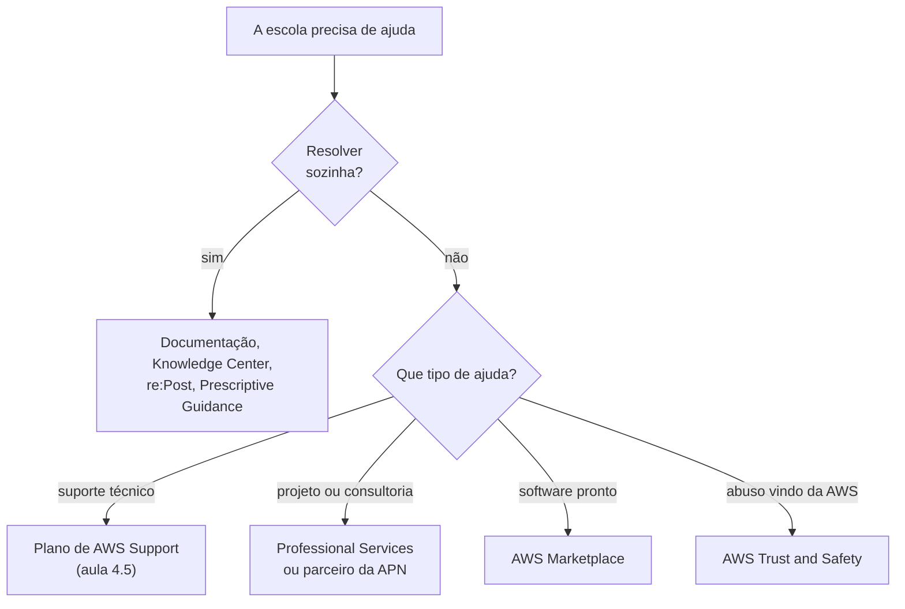

<!-- autoral -->

# 4.6 Outros recursos de ajuda

> **Domínio 4 — Cobrança, Preços e Suporte (12% da prova)** · Depende das aulas [2.10](../02-seguranca-e-conformidade/10-outros-pontos-de-seguranca.md), [4.4](04-ferramentas-de-custo.md) e [4.5](05-planos-de-suporte.md)

> 🔎 **Fichas para aprofundar:** [Recursos de ajuda, parceiros e serviços ao cliente](../../servicos/custos/recursos-de-ajuda-e-parceiros.md) · [Planos de AWS Support](../../servicos/custos/planos-de-suporte.md)

⬅️ [4.5 Planos de AWS Support](05-planos-de-suporte.md) · 🏠 [Índice do domínio](README.md) · 🏫 [O caso da escola](../00-guia-do-exame/caso-da-escola.md)

---

A equipe técnica da rede de escolas é pequena, e os pedidos não param. Um técnico quer aprender a configurar um serviço e resolver um erro sem abrir caso de suporte. A diretoria quer ajuda de especialistas para migrar o sistema financeiro. A escola precisa de um software de backup pronto para usar na AWS. E um dia chega uma reclamação: um endereço da AWS está enviando spam para os e-mails dos pais.

Além dos planos de suporte da [aula 4.5](05-planos-de-suporte.md), o guia do exame cobra localizar os recursos técnicos nos sites oficiais da AWS, o papel da AWS Partner Network e do AWS Marketplace, as opções de assistência técnica da AWS e o papel da equipe AWS Trust and Safety. Esta aula fecha a apostila com esse mapa.

## Aprender e resolver sozinho: os recursos oficiais

- **Documentação da AWS:** guias técnicos detalhados e referências de todos os serviços e ferramentas. É a fonte primária, e a maioria dos serviços tem uma seção de solução de problemas.
- **Whitepapers:** documentos técnicos da AWS, com guias e diagramas de especialistas.
- **Blogs da AWS:** novidades, tutoriais e casos, como o AWS Security Blog da [aula 2.10](../02-seguranca-e-conformidade/10-outros-pontos-de-seguranca.md).
- **AWS Prescriptive Guidance:** recursos da AWS e de parceiros para acelerar a adoção da nuvem e a modernização, como o guia das estratégias de migração da [aula 1.6](../01-conceitos-de-nuvem/06-estrategias-de-migracao.md).
- **AWS re:Post:** a comunidade de perguntas e respostas da AWS, com conhecimento organizado e respostas de outros usuários, da AWS e de especialistas.
- **AWS Knowledge Center:** dentro do re:Post, artigos e vídeos oficiais que respondem às perguntas mais comuns dos clientes, inclusive para resolver problemas técnicos e de conta.

Na escola, o técnico procura o erro no Knowledge Center, lê a documentação do serviço e, se não achar, pergunta no re:Post. Tudo isso está disponível para todos, inclusive no plano Basic.

## Pedir ajuda a especialistas

- **AWS Professional Services:** a equipe de consultoria da própria AWS, que ajuda as organizações a projetar, construir, migrar e gerenciar cargas de trabalho na AWS.
- **Arquitetos de soluções da AWS** (*solutions architects*): o guia do exame os cita, ao lado do Professional Services, como opção de assistência técnica da AWS.
- **Parceiros da AWS Partner Network:** empresas especializadas que implementam projetos, apresentadas a seguir.

Para a migração do sistema financeiro, a diretoria pode contratar o AWS Professional Services ou um parceiro da APN que faça migrações.

## AWS Partner Network: os parceiros

A **AWS Partner Network** (APN) é uma comunidade global de organizações que usam tecnologias, programas, financiamento e ferramentas da AWS para criar soluções e serviços para os clientes. Os parceiros que o guia cita são de dois tipos:

- **Fornecedores independentes de software** (*independent software vendors*, ISVs): empresas que criam produtos de software que rodam na AWS ou funcionam junto com ela.
- **Integradores de sistemas** (*system integrators*) e consultorias: empresas que implementam projetos, como migrações e novas arquiteturas.

Para quem se torna parceiro, o guia cita como benefícios o **treinamento e a certificação**, os **eventos para parceiros** e os **descontos por volume**. Os parceiros também podem vender soluções no AWS Marketplace e vender em conjunto com a AWS.

## AWS Marketplace: comprar software pronto

O **AWS Marketplace** é um **catálogo digital com curadoria** para encontrar, comprar, implantar e gerenciar **software, dados e serviços de terceiros**, em categorias como segurança, redes, armazenamento e machine learning. Os produtos vêm em formatos como AMIs e software como serviço (SaaS), com opções de preço como teste gratuito, por hora, mensal, anual, plurianual e licença própria (BYOL). A AWS cuida da cobrança, e as compras aparecem na **fatura da AWS** ([aula 4.4](04-ferramentas-de-custo.md)).

O guia cobra três serviços que o Marketplace oferece:

- **Gestão de custos:** acompanhar os gastos do Marketplace no Cost Explorer, criar orçamentos no Budgets e usar tags de alocação de custos.
- **Governança e controle:** o **Private Marketplace** monta um catálogo de produtos pré-aprovados que os usuários da organização podem comprar, e o AWS Organizations centraliza contas e pagamento.
- **Direitos de uso** (*entitlements*): o **Managed Entitlements** distribui, ativa e acompanha as licenças compradas no Marketplace pelo AWS License Manager, entre as contas da organização.

Para o software de backup, a escola compra no Marketplace, paga na fatura da AWS e, com o Private Marketplace, garante que cada unidade só compre produtos aprovados pela sede.

## Denunciar abuso: AWS Trust and Safety

Quando alguém usa recursos da AWS para fazer mal a outros, como enviar spam, hospedar golpes ou atacar redes, a denúncia vai para a equipe **AWS Trust and Safety**, pelo formulário de abuso da AWS ([aula 2.10](../02-seguranca-e-conformidade/10-outros-pontos-de-seguranca.md)). Esse não é um assunto para o caso de suporte comum. É o caminho para a reclamação de spam que chegou à escola.

## O que está fora do escopo

Alguns recursos de ajuda aparecem em materiais de estudo, mas estão na lista **fora do escopo** do exame: o **AWS IQ**, que foi encerrado em 28/05/2026; o **AWS Managed Services** (AMS); e o **AWS Activate**, programa para startups.

## Como escolher

| Necessidade | Recurso |
|---|---|
| Resposta oficial para uma dúvida comum | AWS Knowledge Center |
| Perguntar à comunidade | AWS re:Post |
| Referência técnica de um serviço | Documentação da AWS |
| Orientação da AWS e de parceiros para adotar a nuvem e modernizar | AWS Prescriptive Guidance |
| Consultoria da própria AWS | AWS Professional Services |
| Empresa para implementar um projeto | Parceiro da APN (integrador de sistemas ou consultoria) |
| Software de terceiros pago na fatura da AWS | AWS Marketplace |
| Catálogo de produtos pré-aprovados para a organização | Private Marketplace |
| Denunciar spam ou ataque vindo da AWS | AWS Trust and Safety |

*Figura 4.6 — Para onde levar cada tipo de pedido de ajuda.*

## Na prova

- **"Artigos oficiais com as dúvidas mais comuns" = Knowledge Center; "comunidade de perguntas e respostas" = re:Post.**
- **"Orientação para acelerar a adoção da nuvem e a modernização" = AWS Prescriptive Guidance.**
- **"Consultoria da própria AWS" = AWS Professional Services; "empresa parceira que implementa" = parceiro da APN.**
- **ISV cria software; integrador de sistemas implementa projetos.**
- **"Comprar software de terceiros e pagar na fatura da AWS" = AWS Marketplace; catálogo aprovado = Private Marketplace.**
- **"Denunciar abuso de recursos da AWS" = AWS Trust and Safety.**

## Caso resolvido

**Situação.** A sede da rede de escolas quer que as unidades comprem uma ferramenta de monitoramento de um fornecedor de software, pagando pela fatura da AWS que já existe, e que só possam escolher ferramentas aprovadas pela sede. Também quer controlar quantas licenças cada unidade usa. O que usar?

**Raciocínio.** O AWS Marketplace vende software de terceiros com cobrança na fatura da AWS. O Private Marketplace limita as compras a um catálogo de produtos pré-aprovados pela organização, e o Managed Entitlements distribui e acompanha as licenças compradas entre as contas, pelo AWS License Manager.

**Por que as alternativas tentadoras falham.** O AWS Professional Services é consultoria, não loja de software. A AWS Partner Network reúne os fornecedores, mas não é o lugar de compra com cobrança na fatura e controle de catálogo. O re:Post é comunidade de perguntas e respostas.

## Revisão

Tente responder antes de abrir cada resposta.

### Qual é a diferença entre o AWS re:Post e o AWS Knowledge Center?

Ver resposta

O re:Post é a comunidade de perguntas e respostas da AWS; o Knowledge Center, dentro do re:Post, reúne artigos e vídeos oficiais com as perguntas mais comuns dos clientes.

Comentário: os dois estão disponíveis para todos, sem plano pago.

### O que é o AWS Professional Services?

Ver resposta

A equipe de consultoria da própria AWS, que ajuda a projetar, construir, migrar e gerenciar cargas de trabalho na AWS.

Comentário: parceiros da APN são a alternativa fora da AWS.

### Qual é a diferença entre um ISV e um integrador de sistemas na APN?

Ver resposta

O ISV (fornecedor independente de software) cria produtos de software; o integrador de sistemas implementa projetos para os clientes.

Comentário: o guia cita treinamento e certificação, eventos e descontos por volume como benefícios de ser parceiro.

### Quais serviços o AWS Marketplace oferece além da compra de software?

Ver resposta

Gestão de custos, governança e controle (como o Private Marketplace) e gestão de direitos de uso das licenças (Managed Entitlements).

Comentário: as compras aparecem na fatura da AWS.

### A quem denunciar spam ou ataques vindos de recursos da AWS?

Ver resposta

À equipe AWS Trust and Safety, pelo formulário de abuso da AWS.

Comentário: não é assunto para um caso de suporte comum.

## Resumo

- Para resolver sozinho: documentação, whitepapers, blogs, Prescriptive Guidance, Knowledge Center e re:Post.
- Para ajuda de especialistas: AWS Professional Services, arquitetos de soluções e parceiros da APN.
- APN: ISVs criam software, integradores implementam projetos.
- Marketplace: software de terceiros na fatura da AWS, com gestão de custos, governança e direitos de uso.
- Abuso de recursos da AWS: AWS Trust and Safety.
- AWS IQ (encerrado), AMS e Activate estão fora do escopo.

## Fontes oficiais

Verificadas em 06/10/2026.

- [Content Domain 4 do guia do exame CLF-C02](https://docs.aws.amazon.com/aws-certification/latest/cloud-practitioner-02/cloud-practitioner-02-domain4.html): recursos técnicos, APN, ISVs, integradores, benefícios de parceiros, Marketplace, Professional Services, solutions architects e Trust and Safety (tarefa 4.3).
- [AWS re:Post](https://repost.aws/) e [AWS Knowledge Center](https://repost.aws/knowledge-center): comunidade com conhecimento organizado e artigos e vídeos oficiais.
- [AWS Prescriptive Guidance](https://aws.amazon.com/prescriptive-guidance/): recursos da AWS e de parceiros para adoção da nuvem e modernização.
- [AWS Whitepapers](https://aws.amazon.com/whitepapers/) e [Troubleshooting resources](https://docs.aws.amazon.com/awssupport/latest/user/troubleshooting.html): whitepapers e seções de solução de problemas na documentação.
- [AWS Professional Services](https://aws.amazon.com/professional-services/): consultoria para projetar, construir, migrar e gerenciar cargas.
- [AWS Partner Network](https://aws.amazon.com/partners/): comunidade global de parceiros, ISVs, consultorias, certificações e venda no Marketplace.
- [What is AWS Marketplace?](https://docs.aws.amazon.com/marketplace/latest/buyerguide/what-is-marketplace.html) e [AWS Marketplace features](https://aws.amazon.com/marketplace/features/): catálogo, formatos, opções de preço, fatura da AWS, gestão de custos, Private Marketplace e Managed Entitlements.
- [Out-of-Scope AWS Services](https://docs.aws.amazon.com/aws-certification/latest/cloud-practitioner-02/clf-02-out-of-scope-services.html) e [AWS IQ](https://aws.amazon.com/iq/): IQ, AMS e Activate fora do escopo; IQ encerrado em 28/05/2026.

<!-- notas:inicio -->
## 📝 Minhas anotações

<!-- Escreva aqui suas observações, dúvidas e as questões que você errou sobre o tema. -->
<!-- notas:fim -->

---

⬅️ [4.5 Planos de AWS Support](05-planos-de-suporte.md) · 🏠 [Índice do domínio](README.md)
