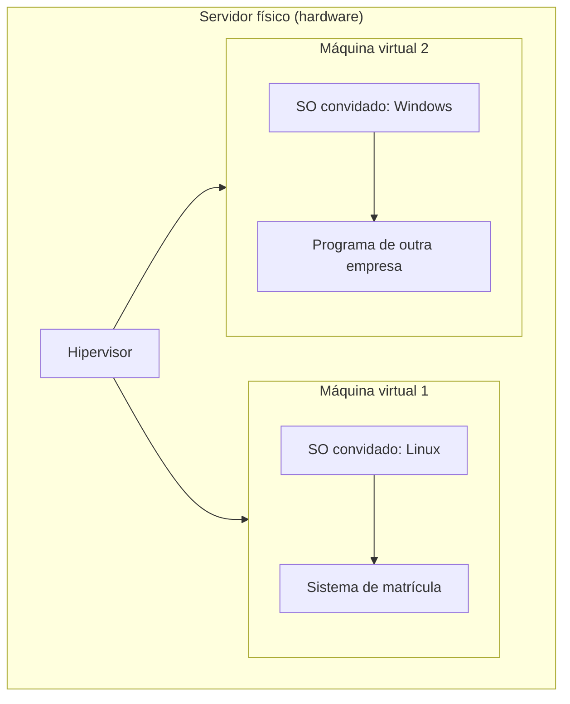

<!-- autoral -->

# 0.1 Computador, servidor e virtualização

> **Capítulo 0 — Fundamentos de TI** · Prepara para as aulas [1.1](../01-conceitos-de-nuvem/01-o-que-e-computacao-em-nuvem.md) e [3.3](../03-tecnologia-e-servicos/03-ec2.md)

🏠 [Índice do capítulo](README.md) · [1.1 O que é computação em nuvem](../01-conceitos-de-nuvem/01-o-que-e-computacao-em-nuvem.md) ➡️

---

A escola do nosso exemplo tem um sistema de matrícula. Os pais entram pelo navegador, preenchem um formulário e enviam documentos. Em janeiro, quando abrem as matrículas, o sistema fica lento; no resto do ano, quase ninguém o usa. Hoje ele roda num computador guardado numa sala da secretaria, e foi a mesma pessoa que comprou a máquina quem instalou o sistema, configurou a rede e aplica as atualizações.

Antes de falar em nuvem, vale entender o que existe dentro dessa sala: um computador, um sistema operacional, um programa que atende pedidos e, cada vez mais, uma camada que permite dividir uma máquina física em várias. É sobre essas peças que a AWS vai oferecer serviços, e é a divisão entre elas que a prova cobra quando pergunta "quem cuida do quê".

## O computador por dentro

Todo computador, do notebook ao servidor de um datacenter, tem as mesmas quatro partes. O **processador** (CPU) executa as instruções dos programas. A **memória** (RAM) guarda o que está sendo usado agora: é rápida, mas perde tudo quando a máquina desliga. O **armazenamento** (disco ou SSD) guarda os dados de forma permanente, mais devagar que a memória. E a **placa de rede** liga a máquina a outras.

Essa divisão explica muitas escolhas que você vai fazer na AWS. Um sistema que faz muitos cálculos precisa de mais processador; um que mantém muitos dados em uso ao mesmo tempo precisa de mais memória; um que guarda muitos arquivos precisa de mais armazenamento. Quando a AWS oferece "tipos" de servidor diferentes, ela está oferecendo combinações diferentes dessas peças.

## O sistema operacional

Os programas não falam direto com o processador ou com o disco. Entre eles fica o **sistema operacional** (SO), como Linux ou Windows. O SO decide qual programa usa o processador em cada momento, reparte a memória, organiza os arquivos no disco e controla o acesso à rede. O sistema de matrícula da escola é um programa que roda *em cima* do SO.

O SO precisa de manutenção: falhas de segurança são descobertas o tempo todo, e os fabricantes publicam correções, chamadas de **patches**. Aplicar patches no SO é uma tarefa diferente de atualizar o sistema de matrícula. Guarde essa diferença: na prova, a pergunta "quem aplica o patch?" depende de qual dessas camadas está em jogo.

## O que torna um computador um servidor

**Servidor** não é um tipo especial de peça; é um papel. Um computador vira servidor quando roda um programa que fica esperando pedidos de outros computadores e responde a eles. O computador da secretaria é um servidor porque atende os navegadores dos pais. O computador de cada pai, que faz o pedido, é o **cliente**.

Na prática, máquinas feitas para esse papel têm peças mais robustas, ficam ligadas o tempo todo e moram em salas com energia, refrigeração e acesso controlados: os **datacenters**. Manter um datacenter próprio custa caro antes mesmo do primeiro uso, e esse é um dos problemas que a computação em nuvem resolve (aula [1.1](../01-conceitos-de-nuvem/01-o-que-e-computacao-em-nuvem.md)).

## Virtualização: um computador físico, várias máquinas

O servidor da escola fica quase parado onze meses por ano. Isso é comum: muitos servidores físicos usam só uma pequena parte do processador e da memória. A **virtualização** resolve esse desperdício. Um programa chamado **hipervisor** roda sobre o hardware e o divide em várias **máquinas virtuais** (VMs). Cada VM recebe sua parte de processador, memória, disco e rede, e enxerga essa parte como se fosse um computador inteiro.

Cada VM tem o seu próprio SO, chamado **sistema operacional convidado**, e os seus próprios programas. Uma VM não enxerga os dados das outras: o hipervisor mantém cada uma isolada, mesmo dividindo o mesmo hardware. Por isso uma empresa pode alugar uma VM sem saber quem mais usa a mesma máquina física.

*Figura 0.1 — Um servidor físico, um hipervisor e duas máquinas virtuais isoladas. Cada VM tem seu próprio sistema operacional e seus próprios programas; o hipervisor reparte o hardware entre elas.*

A virtualização tem um custo: o hipervisor também consome parte do hardware, e as VMs que dividem a mesma máquina física dividem também a sua capacidade total. Há casos em que uma empresa precisa de uma máquina física só para ela, por exemplo por causa de licenças de software contadas por processador ou por núcleo físico. A AWS oferece opções para isso, que você verá na aula [3.3](../03-tecnologia-e-servicos/03-ec2.md).

## Onde isso aparece na AWS

O serviço da AWS que entrega servidores virtuais é o **Amazon EC2**. A AWS chama cada servidor virtual de **instância**. Ao criar uma instância, você escolhe o **tipo de instância**, que define quanto de processador, memória, armazenamento e rede ela recebe, e uma **AMI** (Amazon Machine Image), um modelo que traz o sistema operacional e os programas iniciais. São as mesmas peças desta aula, com outros nomes.

A divisão em camadas também define a responsabilidade. Pelo modelo de responsabilidade compartilhada, a AWS opera tudo do sistema operacional da máquina física e da camada de virtualização para baixo, até a segurança física do datacenter. Quem cria uma instância EC2 cuida do SO convidado, inclusive das atualizações e dos patches de segurança, e dos programas que instala nela. O modelo completo é o assunto da aula [2.1](../02-seguranca-e-conformidade/01-responsabilidade-compartilhada.md).

## Na prova

A prova não pergunta como montar um computador, mas usa este vocabulário o tempo todo. Três confusões aparecem com frequência:

- **"Servidor virtual" é instância EC2.** Quando o enunciado fala em servidor, máquina virtual ou capacidade de computação que você administra, a resposta costuma ser EC2.
- **Patch do SO convidado é do cliente.** Num EC2, quem aplica patches no sistema operacional da instância é o cliente. A AWS cuida da máquina física e do hipervisor.
- **Virtualização isola, mas não dispensa cuidado.** O hipervisor separa uma VM da outra; ele não protege o sistema de matrícula de uma senha fraca ou de um SO desatualizado.

## Caso resolvido

**Situação.** A escola quer tirar o sistema de matrícula da sala da secretaria. O diretor propõe comprar um servidor novo, mais potente, para aguentar o pico de janeiro. A coordenadora de TI propõe usar uma máquina virtual alugada.

**Raciocínio.** O servidor novo resolve o pico, mas passa o ano inteiro quase parado, e a escola continua cuidando de energia, refrigeração, peças e substituição. A máquina virtual divide um hardware que a escola não precisa comprar nem manter; a escola paga pela parte que usa e pode escolher uma VM maior em janeiro e uma menor no resto do ano.

**Por que as alternativas tentadoras falham.** "A VM é mais segura porque o fornecedor cuida de tudo" está errado: a escola continua responsável pelo SO convidado e pelo sistema de matrícula. "Basta comprar um servidor grande para nunca ter problema" ignora o custo do equipamento ocioso e a manutenção que continua com a escola.

## Revisão

Tente responder antes de abrir cada resposta.

### Qual é a diferença entre memória e armazenamento?

Ver resposta

A memória guarda o que os programas estão usando agora e perde tudo quando a máquina desliga; o armazenamento guarda os dados de forma permanente, mas é mais lento.

Por isso um servidor que reinicia continua com os arquivos no disco, mas precisa recarregar os programas na memória. Na AWS, o tipo de instância define quanta memória a máquina virtual recebe; o armazenamento permanente é escolhido à parte.

### O que faz um computador ser um servidor?

Ver resposta

O papel que ele cumpre: rodar um programa que espera pedidos de outros computadores (os clientes) e responde a eles.

Não depende de uma peça especial. Servidores de datacenter têm peças mais robustas e ficam ligados o tempo todo, mas o que os define é atender pedidos. O computador dos pais que acessam a matrícula é o cliente.

### Para que serve o hipervisor?

Ver resposta

Ele divide um computador físico em várias máquinas virtuais, reparte o hardware entre elas e mantém cada uma isolada das outras.

Cada máquina virtual tem seu próprio sistema operacional convidado. O isolamento permite que empresas diferentes usem o mesmo hardware físico sem enxergar os dados umas das outras. Na AWS, o hipervisor é responsabilidade da AWS.

### Numa instância EC2, quem aplica os patches do sistema operacional?

Ver resposta

O cliente. O sistema operacional da instância é o SO convidado, e a AWS é responsável só pelo que fica abaixo dele: hipervisor, máquina física e datacenter.

A pergunta testa se você separa as camadas. Atualizar o sistema de matrícula também é do cliente. Em serviços em que a AWS administra o sistema operacional por você, essa divisão muda; isso aparece na aula 2.1.

## Resumo

- Um computador tem processador, memória, armazenamento e rede; os "tipos" de servidor da AWS combinam essas peças.
- O sistema operacional fica entre o hardware e os programas e precisa de patches próprios.
- Servidor é um papel: o computador que atende pedidos de clientes.
- O hipervisor divide uma máquina física em várias máquinas virtuais isoladas, cada uma com seu SO convidado.
- Na AWS, o servidor virtual é a instância EC2; tipo de instância define o hardware e a AMI traz o software inicial.
- A AWS cuida do hardware e do hipervisor; o cliente cuida do SO convidado e dos programas que instala.

## Fontes oficiais

Verificadas em 06/10/2026.

- [What is Amazon EC2?](https://docs.aws.amazon.com/AWSEC2/latest/UserGuide/concepts.html): EC2 oferece capacidade de computação sob demanda; instância é um servidor virtual; o tipo de instância determina o hardware.
- [Amazon Machine Images in Amazon EC2](https://docs.aws.amazon.com/AWSEC2/latest/UserGuide/AMIs.html): a AMI fornece o software necessário para configurar e iniciar uma instância, incluindo o sistema operacional.
- [Amazon EC2 Dedicated Hosts](https://docs.aws.amazon.com/AWSEC2/latest/UserGuide/dedicated-hosts-overview.html): servidor físico dedicado, que permite usar licenças contadas por soquete, por núcleo ou por VM.
- [Shared Responsibility Model](https://aws.amazon.com/compliance/shared-responsibility-model/): a AWS opera do sistema operacional do host e da camada de virtualização até a segurança física; o cliente gerencia o SO convidado, incluindo atualizações e patches de segurança.

<!-- notas:inicio -->
## 📝 Minhas anotações

<!-- Escreva aqui suas observações, dúvidas e as questões que você errou sobre o tema. -->
<!-- notas:fim -->

---

🏠 [Índice do capítulo](README.md) · [1.1 O que é computação em nuvem](../01-conceitos-de-nuvem/01-o-que-e-computacao-em-nuvem.md) ➡️
