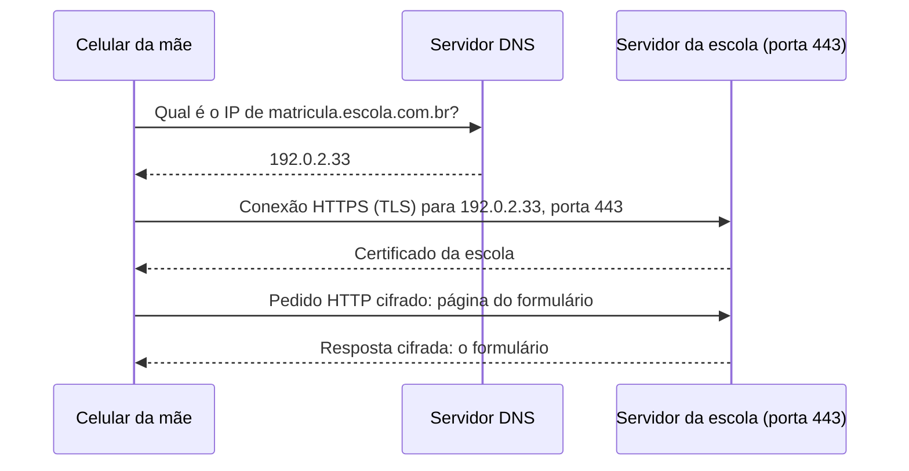

<!-- autoral -->

# 0.2 Rede: endereço IP, porta, DNS e HTTPS

> **Capítulo 0 — Fundamentos de TI** · Prepara para as aulas [2.8](../02-seguranca-e-conformidade/08-protecao-de-rede-e-aplicacoes.md) e [3.10](../03-tecnologia-e-servicos/10-rede-e-entrega-de-conteudo.md)

⬅️ [0.1 Computador, servidor e virtualização](01-servidor-e-virtualizacao.md) · 🏠 [Índice do capítulo](README.md) · [0.3 Dados: arquivo, bloco, objeto e banco de dados](03-dados.md) ➡️

---

Uma mãe digita `matricula.escola.com.br` no celular e, em menos de um segundo, vê o formulário da escola. Entre o toque na tela e a página aparecer, o celular precisou descobrir onde está o servidor da escola, chegar até ele atravessando várias redes, dizer qual programa daquele servidor queria usar e conversar de um jeito que ninguém no caminho conseguisse ler os dados do filho.

Cada uma dessas etapas tem um nome: endereço IP, roteamento, porta, DNS e HTTPS. Na AWS, você vai configurar todas elas, e várias questões da prova perguntam qual peça resolve qual problema. Esta aula segue o caminho do pedido da mãe, peça por peça.

## Endereço IP: onde fica cada máquina

Numa rede, cada máquina precisa de um endereço para receber dados, como uma casa precisa de endereço para receber cartas. Esse endereço é o **endereço IP**. A versão mais usada, o IPv4, tem quatro números de 0 a 255 separados por pontos, como `192.0.2.33`. Como o IPv4 tem uma quantidade limitada de endereços, existe também o IPv6, com endereços bem mais longos.

Há dois tipos de endereço que importam aqui. O **IP público** é único na internet inteira: qualquer máquina conectada consegue enviar dados para ele. O **IP privado** só vale dentro de uma rede interna, como a rede da secretaria da escola; o mesmo endereço privado pode existir em milhares de redes diferentes, porque nenhuma delas o anuncia para a internet. Por isso um computador com IP privado não é alcançável diretamente de fora.

## Roteamento: como os dados chegam lá

O pedido da mãe não vai do celular direto ao servidor. Ele é dividido em pequenos pedaços, chamados **pacotes**, e passa por vários equipamentos no caminho, os **roteadores**. Cada roteador olha o endereço de destino do pacote e decide para qual vizinho mandá-lo, consultando uma **tabela de rotas**: uma lista de regras do tipo "para estes endereços, siga por aquele caminho".

A internet é isso: muitas redes, de empresas e provedores diferentes, ligadas por roteadores que trocam pacotes entre si. Uma **rede privada**, como a da escola, só se comunica com a internet se houver uma rota e um equipamento que façam essa ponte. Sem rota, não há caminho, por mais que as máquinas existam.

## Porta: qual programa vai atender

O endereço IP leva o pacote até a máquina certa, mas uma máquina pode rodar vários programas que atendem a rede ao mesmo tempo. A **porta** é um número que diz qual deles deve receber o pacote. Se o IP é o endereço do prédio, a porta é o número do apartamento.

Alguns números são convenções que todo mundo segue: a porta **80** é a do HTTP, a **443** é a do HTTPS e a **22** é a do SSH, usado para administrar servidores Linux à distância. Saber isso ajuda a ler regras de segurança. Uma regra que libera a porta 443 para qualquer endereço deixa o site aberto ao público; uma regra que libera a porta 22 para qualquer endereço deixa a administração do servidor exposta, o que quase nunca é desejável.

## DNS: do nome ao número

Ninguém decora `192.0.2.33`. As pessoas usam nomes, como `matricula.escola.com.br`. O **DNS** (Domain Name System) é o sistema que traduz nomes em endereços IP, funcionando como uma agenda telefônica da internet. Quando a mãe digita o nome, o celular pergunta a um servidor DNS qual é o IP correspondente e só então envia o pedido para esse IP.

Quem registra o domínio da escola mantém os **registros** que dizem para qual IP cada nome aponta. Se a escola trocar o servidor de lugar, basta atualizar o registro: o nome continua o mesmo para os pais. O limite é que o DNS só informa o endereço. Ele não protege o servidor nem garante que o site esteja no ar.

## HTTP e HTTPS: a conversa entre navegador e servidor

Depois de chegar à máquina e à porta certas, navegador e servidor precisam de regras para conversar. O **HTTP** define essas regras: o navegador envia um **pedido** ("quero a página do formulário") e o servidor devolve uma **resposta** com a página ou com um código de erro.

O HTTP comum viaja em texto aberto: qualquer equipamento no caminho poderia ler o CPF que a mãe digitou. O **HTTPS** é o HTTP dentro de uma conexão criptografada pelo protocolo **TLS**. Para isso, o servidor apresenta um **certificado digital**, que prova ao navegador que ele está falando com o site verdadeiro da escola, e os dois combinam chaves para cifrar a conversa. O cadeado no navegador indica que a conexão está protegida. Ele não indica que o site é honesto nem que o servidor está livre de falhas.

*Figura 0.2 — O caminho de um acesso: primeiro o DNS traduz o nome em IP; depois o celular abre uma conexão HTTPS na porta 443 do servidor, confere o certificado e só então troca pedido e resposta cifrados.*

## Onde isso aparece na AWS

Na AWS, a rede privada do cliente é a **VPC** (Virtual Private Cloud): uma rede virtual dedicada à sua conta e isolada logicamente das outras redes virtuais da nuvem AWS. Dentro dela você cria **sub-redes**, que são faixas de endereços IP onde ficam recursos como as instâncias EC2. Uma sub-rede é **pública** quando sua tabela de rotas tem uma rota para um **internet gateway**, a ponte entre a VPC e a internet; sem essa rota, ela é privada. É a mesma ideia de rota desta aula.

As regras de porta ficam nos **security groups**, que funcionam como um firewall virtual da instância: cada regra diz qual protocolo, qual porta e qual origem podem entrar ou qual destino pode sair. O DNS da AWS é o **Amazon Route 53**, que traduz nomes de domínio em endereços IP. E o certificado do HTTPS pode ficar num balanceador de carga, escolhido no **AWS Certificate Manager**. Tudo isso volta com detalhe nas aulas [2.8](../02-seguranca-e-conformidade/08-protecao-de-rede-e-aplicacoes.md) e [3.10](../03-tecnologia-e-servicos/10-rede-e-entrega-de-conteudo.md).

## Na prova

- **"Sub-rede pública" é questão de rota.** O que torna uma sub-rede pública é a rota para o internet gateway, não o nome que você dá a ela.
- **Porta aberta é decisão de segurança.** Enunciados sobre "permitir acesso web" pedem a porta 443 (ou 80); liberar SSH para qualquer endereço é o exemplo clássico de configuração arriscada.
- **DNS não é firewall nem CDN.** Route 53 resolve nomes; ele não filtra ataques nem guarda cópias do site.
- **HTTPS protege o caminho, não o servidor.** Criptografia em trânsito impede que alguém leia os dados no caminho; ela não corrige uma senha fraca nem um sistema desatualizado.

## Caso resolvido

**Situação.** A escola levou o sistema de matrícula para uma instância EC2. O banco de dados com os documentos dos alunos ficou em outra instância. A equipe quer que os pais acessem o formulário, mas que ninguém de fora alcance o banco de dados.

**Raciocínio.** O servidor do formulário precisa receber pedidos da internet: fica numa sub-rede pública, com regra liberando a porta 443 para qualquer origem. O banco de dados só precisa conversar com o servidor do formulário: fica numa sub-rede privada, sem rota para a internet, e sua regra libera a porta do banco apenas para o servidor do formulário. O nome `matricula.escola.com.br` aponta, pelo DNS, para o servidor público, e o certificado garante o HTTPS.

**Por que as alternativas tentadoras falham.** "Colocar tudo na sub-rede pública e confiar na senha do banco" deixa o banco alcançável por qualquer pessoa na internet. "Usar só HTTPS" protege os dados no caminho, mas não impede ninguém de tentar se conectar ao banco. E "esconder o banco por não divulgar o nome dele no DNS" não adianta: quem conhece o IP público chega lá sem precisar do nome.

## Revisão

Tente responder antes de abrir cada resposta.

### Qual é a diferença entre IP público e IP privado?

Ver resposta

O IP público é único na internet e pode receber dados de qualquer lugar; o IP privado só vale dentro de uma rede interna e não é alcançável diretamente da internet.

Por isso o mesmo IP privado pode existir em muitas redes diferentes. Para uma máquina com IP privado falar com a internet, é preciso uma rota e um equipamento que façam a ponte.

### Para que serve a porta, se a máquina já tem um endereço IP?

Ver resposta

O IP leva os dados até a máquina; a porta indica qual programa daquela máquina deve recebê-los.

É como o número do apartamento num prédio. Por convenção, a porta 443 é do HTTPS, a 80 do HTTP e a 22 do SSH. Regras de firewall, como os security groups, são escritas em termos de porta e origem.

### O que o DNS faz, e o que ele não faz?

Ver resposta

O DNS traduz um nome de domínio no endereço IP do servidor; ele não protege o servidor nem garante que o site esteja funcionando.

Trocar o servidor de lugar exige só atualizar o registro DNS, sem mudar o nome que as pessoas usam. Na AWS, o serviço de DNS é o Route 53.

### O que o HTTPS acrescenta ao HTTP?

Ver resposta

Criptografia da conversa por TLS e um certificado que prova ao navegador que ele está falando com o site verdadeiro.

Com isso, ninguém no caminho consegue ler ou alterar os dados. O HTTPS não protege o servidor em si: um sistema com falhas continua vulnerável mesmo com o cadeado no navegador.

### O que faz uma sub-rede da VPC ser pública?

Ver resposta

Ter, na sua tabela de rotas, uma rota para um internet gateway.

Sem essa rota, a sub-rede é privada, e os recursos nela não são alcançáveis diretamente da internet. O nome da sub-rede não muda nada; o que decide é a rota.

## Resumo

- O endereço IP identifica uma máquina na rede; o público vale na internet inteira, o privado só dentro de uma rede interna.
- Roteadores levam os pacotes de rede em rede seguindo tabelas de rotas; sem rota, não há caminho.
- A porta indica qual programa da máquina atende: 443 para HTTPS, 80 para HTTP, 22 para SSH.
- O DNS traduz nomes em endereços IP; na AWS, é o Route 53.
- O HTTPS é o HTTP cifrado por TLS, com certificado que prova a identidade do site.
- Na AWS, a rede privada é a VPC; a sub-rede é pública quando tem rota para um internet gateway; os security groups definem quais portas e origens são aceitas.

## Fontes oficiais

Verificadas em 06/10/2026.

- [How Amazon VPC works](https://docs.aws.amazon.com/vpc/latest/userguide/how-it-works.html): VPC é uma rede virtual dedicada à conta e isolada logicamente das outras redes virtuais da nuvem AWS; sub-rede é uma faixa de endereços IP da VPC; uma sub-rede com rota para um internet gateway é pública.
- [Enable internet access for a VPC using an internet gateway](https://docs.aws.amazon.com/vpc/latest/userguide/VPC_Internet_Gateway.html): o internet gateway liga os recursos das sub-redes públicas à internet.
- [Control traffic to your AWS resources using security groups](https://docs.aws.amazon.com/vpc/latest/userguide/vpc-security-groups.html): security groups funcionam como firewall virtual e cada regra define protocolo, porta e origem ou destino.
- [How internet traffic is routed to your website or web application](https://docs.aws.amazon.com/Route53/latest/DeveloperGuide/welcome-dns-service.html): Route 53 traduz nomes de domínio em endereços IP.
- [Create an HTTPS listener for your Application Load Balancer](https://docs.aws.amazon.com/elasticloadbalancing/latest/application/create-https-listener.html): o listener HTTPS exige um certificado de servidor, que pode ser escolhido no AWS Certificate Manager.

<!-- notas:inicio -->
## 📝 Minhas anotações

<!-- Escreva aqui suas observações, dúvidas e as questões que você errou sobre o tema. -->
<!-- notas:fim -->

---

⬅️ [0.1 Computador, servidor e virtualização](01-servidor-e-virtualizacao.md) · 🏠 [Índice do capítulo](README.md) · [0.3 Dados: arquivo, bloco, objeto e banco de dados](03-dados.md) ➡️
