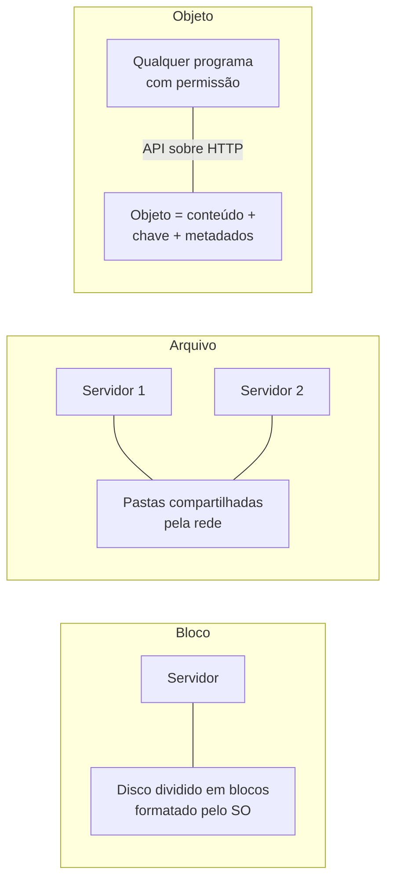

<!-- autoral -->

# 0.3 Dados: arquivo, bloco, objeto e banco de dados

> **Capítulo 0 — Fundamentos de TI** · Prepara para as aulas [3.7](../03-tecnologia-e-servicos/07-bancos-de-dados.md), [3.8](../03-tecnologia-e-servicos/08-s3.md) e [3.9](../03-tecnologia-e-servicos/09-outros-armazenamentos.md)

⬅️ [0.2 Rede: endereço IP, porta, DNS e HTTPS](02-rede.md) · 🏠 [Índice do capítulo](README.md) · [0.4 Como programas conversam: API, requisição e fila](04-api-e-filas.md) ➡️

---

O sistema de matrícula da escola guarda três tipos de coisa. Os dados de cada aluno (nome, data de nascimento, turma) ficam num banco de dados. Os documentos que os pais enviam (certidão, comprovante de residência, foto) ficam como arquivos. E o próprio sistema, com o sistema operacional e os programas, fica num disco ligado ao servidor.

Parece tudo "dado guardado", mas cada tipo é guardado de um jeito diferente, por razões diferentes. A AWS tem serviços separados para cada jeito, e a prova cobra muito a escolha certa entre eles. Esta aula explica as três formas de armazenar (bloco, arquivo e objeto) e os dois grandes tipos de banco de dados (relacional e não relacional).

## Armazenamento em bloco: o disco da máquina

O disco de um computador, visto de perto, não sabe o que é um arquivo. Ele é dividido em **blocos** de tamanho fixo, cada um com um número, e só sabe gravar e ler blocos. Quem transforma esses blocos em pastas e arquivos é o sistema operacional, que **formata** o disco com um sistema de arquivos e mantém o registro de quais blocos pertencem a qual arquivo.

Esse é o **armazenamento em bloco**. Como o sistema operacional fala direto com os blocos, o acesso é rápido e permite alterar só um pedacinho de um arquivo grande sem reescrevê-lo inteiro. Por isso é o tipo usado para o disco onde o sistema operacional está instalado e para bancos de dados que rodam no próprio servidor. O limite: em regra, um disco de bloco pertence a uma máquina por vez, que é quem o formatou e o controla.

## Armazenamento de arquivos: a pasta compartilhada

Na secretaria, três funcionárias precisam abrir os mesmos documentos dos alunos, cada uma no seu computador. Para isso existe o **armazenamento de arquivos**: um servidor guarda os arquivos organizados em pastas e subpastas e os oferece pela rede. Cada computador enxerga essas pastas como se fossem locais, e o servidor de arquivos controla quem pode ler ou alterar o quê.

A vantagem é o compartilhamento com a organização de pastas que todo mundo já conhece. O custo é que todo acesso passa pela rede e pelo servidor de arquivos, o que é mais lento que um disco local e exige controlar dois usuários editando o mesmo arquivo ao mesmo tempo.

## Armazenamento de objetos: guardar sem se preocupar com o disco

Os documentos dos pais têm um padrão diferente: são gravados uma vez, quase nunca alterados e lidos de vez em quando. E podem ser milhões. Para esse padrão existe o **armazenamento de objetos**. Cada arquivo vira um **objeto**, que reúne o conteúdo, um identificador único (a **chave**) e **metadados**, como tipo, tamanho, data de criação e etiquetas que você escolher.

Os objetos não ficam em pastas de verdade nem num disco que você formata. Você grava e lê cada objeto inteiro pela rede, por chamadas de **API** sobre HTTP, informando a chave. Em troca, o armazenamento cresce sem que você precise prever a capacidade, e o provedor cuida da durabilidade dos dados. O limite é que, para mudar um pedaço do objeto, você grava o objeto inteiro de novo. Por isso ele não serve como disco de sistema operacional nem para um banco de dados que altera pequenos trechos o tempo todo.

*Figura 0.3 — As três formas de armazenar. Bloco: um disco ligado a um servidor, que o formata. Arquivo: pastas compartilhadas pela rede entre vários servidores. Objeto: conteúdo, chave e metadados, gravados e lidos inteiros por API.*

## Banco de dados relacional: tabelas que se relacionam

Os dados dos alunos têm estrutura fixa: todo aluno tem nome, data de nascimento e turma. Um **banco de dados relacional** guarda esse tipo de dado em **tabelas**, com **linhas** (cada aluno) e **colunas** (cada informação). As tabelas se relacionam: a tabela de matrículas aponta para a tabela de alunos e para a de turmas. A estrutura das tabelas, o **esquema**, é definida antes de gravar os dados.

Para consultar, usa-se a linguagem **SQL**, que permite cruzar tabelas ("todos os alunos da turma 5A com documentos pendentes") e fazer **transações**: um conjunto de alterações que acontece inteiro ou não acontece, como transferir um aluno de turma sem que ele fique em duas ao mesmo tempo. O custo dessa consistência é que crescer exige, em geral, uma máquina maior, e mudar o esquema dá trabalho.

## Banco de dados não relacional: flexível e fácil de espalhar

Agora imagine que a escola lança um aplicativo e quer guardar a sessão de cada usuário conectado: milhões de leituras e gravações por dia, sempre buscando pelo identificador do usuário, sem cruzar tabelas. Um **banco de dados não relacional** (também chamado **NoSQL**) é feito para isso. No modelo **chave-valor**, cada item é encontrado direto pela sua chave; no modelo **documento**, cada item é um registro com campos que podem variar de um para outro.

Como as consultas são simples e cada item é independente, esse tipo de banco consegue espalhar os dados por muitas máquinas e responder rápido mesmo com volume enorme. O limite é justamente a simplicidade: consultas que cruzam muitos dados ou exigem transações complexas são difíceis ou impossíveis, e o desenho dos dados precisa partir das consultas que a aplicação vai fazer.

## Onde isso aparece na AWS

Cada forma de armazenar tem um serviço principal. O **Amazon EBS** oferece armazenamento em bloco: volumes que funcionam como discos de uma instância EC2. O **Amazon EFS** oferece armazenamento de arquivos compartilhado, com pastas acessadas pela rede por muitos servidores ao mesmo tempo. O **Amazon S3** oferece armazenamento de objetos, cada um com seu conteúdo e seus metadados.

Para bancos de dados, o **Amazon RDS** é o serviço de banco relacional gerenciado, com vários motores, como MySQL e PostgreSQL; a AWS cuida de tarefas como backups automáticos e patches do software do banco. O **Amazon DynamoDB** é um banco NoSQL serverless, que trabalha com os modelos chave-valor e documento. Esses serviços voltam nas aulas [3.7](../03-tecnologia-e-servicos/07-bancos-de-dados.md), [3.8](../03-tecnologia-e-servicos/08-s3.md) e [3.9](../03-tecnologia-e-servicos/09-outros-armazenamentos.md).

## Na prova

- **Disco de instância é bloco.** "Volume para o sistema operacional ou para um banco no EC2" aponta para EBS.
- **Vários servidores lendo os mesmos arquivos é arquivo.** "Sistema de arquivos compartilhado entre várias instâncias" aponta para EFS.
- **Muitos arquivos, gravados uma vez, acessados pela internet é objeto.** Backup, fotos, documentos e sites estáticos apontam para S3.
- **Relacional quando há tabelas que se cruzam e transações.** "SQL", "joins" e "aplicação relacional existente" apontam para RDS.
- **Não relacional quando o acesso é por chave, em grande escala.** "Milissegundos", "chave-valor", "serverless" e "escala sem administrar servidores" apontam para DynamoDB.

## Caso resolvido

**Situação.** A escola está levando o sistema de matrícula para a AWS e precisa decidir onde guardar três coisas: o sistema operacional do servidor, os documentos enviados pelos pais e os dados de alunos e turmas, que o sistema cruza o tempo todo para montar relatórios.

**Raciocínio.** O sistema operacional precisa de um disco formatado e de acesso rápido a pequenos trechos: armazenamento em bloco, um volume EBS. Os documentos são muitos, gravados uma vez e lidos de vez em quando: armazenamento de objetos, o S3. Os dados de alunos e turmas têm estrutura fixa, se relacionam e alimentam relatórios com cruzamentos: banco relacional, o RDS.

**Por que as alternativas tentadoras falham.** "Guardar os documentos no mesmo disco do servidor" funciona no começo, mas o disco tem tamanho fixo, pertence a uma só máquina e some junto com ela se não houver cópia. "Usar DynamoDB para tudo porque é serverless" esbarra nos relatórios: cruzar alunos, turmas e documentos pendentes é exatamente o tipo de consulta em que o banco relacional é melhor. E "guardar a tabela de alunos como um arquivo no S3" obriga a regravar o arquivo inteiro a cada matrícula.

## Revisão

Tente responder antes de abrir cada resposta.

### Qual é a diferença entre armazenamento em bloco e armazenamento de objetos?

Ver resposta

No bloco, o sistema operacional formata o disco e altera pequenos trechos diretamente; no objeto, cada arquivo é gravado e lido inteiro por API, com uma chave e metadados.

Por isso o bloco serve de disco para sistema operacional e bancos de dados, e o objeto serve para grandes volumes de arquivos que mudam pouco. Na AWS, bloco é EBS e objeto é S3.

### Quando faz sentido usar armazenamento de arquivos?

Ver resposta

Quando vários servidores precisam acessar os mesmos arquivos ao mesmo tempo, organizados em pastas.

O acesso passa pela rede, então é mais lento que um disco local, mas permite o compartilhamento. Na AWS, o serviço é o EFS.

### O que caracteriza um banco de dados relacional?

Ver resposta

Dados em tabelas com esquema definido, que se relacionam entre si e são consultadas com SQL, com suporte a transações.

As transações garantem que um conjunto de alterações aconteça inteiro ou não aconteça. Na AWS, o banco relacional gerenciado é o RDS.

### Por que um banco não relacional escala com mais facilidade?

Ver resposta

Porque as consultas são simples e cada item é encontrado pela sua chave, o que permite espalhar os dados por muitas máquinas.

O preço é perder consultas que cruzam muitos dados e transações complexas. Na AWS, o DynamoDB é o banco NoSQL serverless, com os modelos chave-valor e documento.

## Resumo

- Bloco: disco dividido em blocos, formatado pelo sistema operacional, rápido e ligado a uma máquina; na AWS, EBS.
- Arquivo: pastas compartilhadas pela rede entre várias máquinas; na AWS, EFS.
- Objeto: conteúdo, chave e metadados, gravados e lidos inteiros por API, com capacidade que cresce sem planejamento; na AWS, S3.
- Banco relacional: tabelas que se relacionam, esquema definido, SQL e transações; na AWS, RDS.
- Banco não relacional: acesso por chave, esquema flexível e escala horizontal, com consultas mais simples; na AWS, DynamoDB.

## Fontes oficiais

Verificadas em 06/10/2026.

- [Block vs File vs Object Storage](https://aws.amazon.com/compare/the-difference-between-block-file-object-storage/): definições de armazenamento em bloco, arquivo e objeto; EBS como bloco para uma instância EC2, EFS como arquivos compartilhados por muitos clientes e S3 como objetos com metadados.
- [What is Amazon DynamoDB?](https://docs.aws.amazon.com/amazondynamodb/latest/developerguide/Introduction.html): banco NoSQL serverless e totalmente gerenciado, com modelos chave-valor e documento.
- [Select a database service for your Lambda-based applications](https://docs.aws.amazon.com/lambda/latest/dg/ddb-rds-database-decision.html): RDS como banco relacional gerenciado, com backups automáticos e patches; DynamoDB quando não há consultas complexas com joins.

<!-- notas:inicio -->
## 📝 Minhas anotações

<!-- Escreva aqui suas observações, dúvidas e as questões que você errou sobre o tema. -->
<!-- notas:fim -->

---

⬅️ [0.2 Rede: endereço IP, porta, DNS e HTTPS](02-rede.md) · 🏠 [Índice do capítulo](README.md) · [0.4 Como programas conversam: API, requisição e fila](04-api-e-filas.md) ➡️
