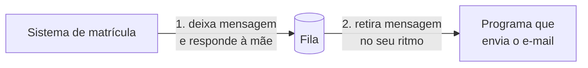

<!-- autoral -->

# 0.4 Como programas conversam: API, requisição e fila

> **Capítulo 0 — Fundamentos de TI** · Prepara para as aulas [3.1](../03-tecnologia-e-servicos/01-formas-de-acesso-e-implantacao.md) e [3.13](../03-tecnologia-e-servicos/13-integracao-de-aplicacoes.md)

⬅️ [0.3 Dados: arquivo, bloco, objeto e banco de dados](03-dados.md) · 🏠 [Índice do capítulo](README.md) · 🏫 [O caso da escola](../00-guia-do-exame/caso-da-escola.md) · [0.5 Segurança básica](05-seguranca-basica.md) ➡️

---

Quando a mãe envia o formulário de matrícula, o sistema da escola não faz tudo sozinho. Ele pede ao banco de dados que grave a matrícula, pede ao armazenamento que guarde os documentos, pede a um serviço de e-mail que mande a confirmação e avisa a secretaria que há uma matrícula nova para conferir. São vários programas, muitas vezes de fornecedores diferentes, conversando entre si.

Para que essa conversa funcione, cada programa precisa anunciar o que sabe fazer e como deve ser chamado. E, quando um deles está lento ou fora do ar, os outros não podem parar junto. Esta aula explica as duas ideias que resolvem isso: a **API**, que define a conversa, e a **fila**, que deixa os programas trabalharem cada um no seu ritmo.

## API: o cardápio de um programa

**API** (*Application Programming Interface*, interface de programação de aplicações) é o conjunto de operações que um programa oferece para outros programas usarem, com as regras de como pedir cada uma. Funciona como o cardápio de um restaurante: diz o que pode ser pedido e o que é preciso informar em cada pedido, sem mostrar como a cozinha trabalha.

O serviço de e-mail da escola, por exemplo, pode oferecer uma operação "enviar mensagem", que exige destinatário, assunto e texto. O sistema de matrícula não precisa saber como o e-mail é entregue; basta chamar a operação com as informações certas. Se o fornecedor trocar a forma de entregar os e-mails por dentro, nada muda para quem chama, desde que a API continue a mesma. Essa separação é o que permite montar um sistema juntando peças de origens diferentes.

## Requisição e resposta

A maioria das APIs usadas na internet funciona sobre HTTP, o mesmo protocolo da aula [0.2](02-rede.md). Quem chama envia uma **requisição** para um endereço da API, indicando a operação e os dados; o programa que atende executa o trabalho e devolve uma **resposta**, com o resultado ou com um código de erro. É a mesma conversa entre navegador e servidor, só que entre dois programas.

Esse modelo é **síncrono**: quem chamou fica esperando a resposta para continuar. Isso é simples e funciona bem quando a operação é rápida. O problema aparece quando ela é lenta ou quando o outro lado está fora do ar. Se o serviço de e-mail demorar dez segundos, a mãe fica dez segundos olhando para a tela de "enviando". Se ele cair, a matrícula inteira falha, mesmo que o e-mail fosse a parte menos importante.

## Fila: deixar o recado em vez de esperar

A **fila** resolve esse problema mudando a forma da conversa. Em vez de chamar o outro programa e esperar, quem precisa de um trabalho deixa uma **mensagem** numa fila e segue em frente. Do outro lado, um ou mais programas **consumidores** retiram as mensagens da fila e fazem o trabalho no seu próprio ritmo. É como deixar o pedido no balcão: quem pediu não precisa ficar parado na frente da cozinha.

Essa forma de comunicação é **assíncrona** e traz três vantagens. Se o consumidor cair, as mensagens esperam na fila até ele voltar, dentro do prazo que a fila guarda cada mensagem. Se chegar um pico, como na abertura das matrículas, a fila absorve o excesso e os consumidores processam aos poucos. E os dois lados podem ser trocados ou escalados separadamente. Dizemos que a fila **desacopla** os componentes. O limite: o resultado não volta na hora. A fila serve para trabalhos que podem acontecer daqui a alguns segundos, como mandar um e-mail ou gerar um PDF, e não para responder algo que o usuário está esperando na tela.

*Figura 0.4 — Com a fila, o sistema de matrícula deixa a mensagem e responde à mãe na hora. O programa de e-mail retira a mensagem quando puder. Se ele estiver fora do ar, a mensagem espera na fila.*

## Uma mensagem para vários interessados

Às vezes um mesmo acontecimento interessa a vários programas: quando uma matrícula é concluída, a secretaria quer ser avisada, o financeiro precisa gerar o boleto e o sistema de e-mail precisa mandar a confirmação. Em vez de o sistema de matrícula chamar cada um, ele **publica** um aviso num **tópico**, e todos os programas que se **inscreveram** nesse tópico recebem uma cópia. Esse modelo se chama **publicação e inscrição** (*publish/subscribe*). Um interessado novo só precisa se inscrever; o sistema de matrícula não muda.

## Onde isso aparece na AWS

Os serviços da AWS também são usados por API. Criar uma instância, gravar um objeto no S3 ou mudar uma permissão são operações das APIs dos serviços. Além do console no navegador, há a **AWS CLI**, que faz essas chamadas por comandos no terminal, e os **SDKs**, bibliotecas que fazem as mesmas chamadas de dentro de um programa. Com a CLI e os SDKs, tarefas repetitivas viram scripts. A aula [3.1](../03-tecnologia-e-servicos/01-formas-de-acesso-e-implantacao.md) compara essas formas de acesso.

Para quem cria a própria API, o **Amazon API Gateway** é o serviço que publica, protege e monitora APIs, funcionando como a porta de entrada para os programas que estão por trás. A fila é o **Amazon SQS**, um serviço de filas totalmente gerenciado que guarda as mensagens entre os componentes e permite desacoplá-los. Por padrão, cada mensagem fica guardada por 4 dias, e esse prazo pode ir de 1 minuto a 14 dias. O modelo de publicação e inscrição é o **Amazon SNS**, em que um tópico entrega cada mensagem a vários inscritos, inclusive filas do SQS. Os dois voltam na aula [3.13](../03-tecnologia-e-servicos/13-integracao-de-aplicacoes.md).

## Na prova

- **"Desacoplar" e "absorver picos" apontam para fila.** O enunciado que fala em componentes que não podem depender da disponibilidade um do outro, ou em processar pedidos no próprio ritmo, pede SQS.
- **"Notificar vários sistemas ao mesmo tempo" aponta para tópico.** Um aviso para muitos destinos é SNS; uma fila entrega cada mensagem para um consumidor.
- **Console, CLI e SDK dão acesso aos mesmos serviços.** O console é visual; a CLI e os SDKs chamam as APIs por comando ou por código e permitem automatizar.
- **API Gateway não é balanceador de carga nem fila.** Ele é a porta de entrada de uma API: recebe as requisições, aplica controle de acesso e repassa para o programa que faz o trabalho.

## Caso resolvido

**Situação.** Na última abertura de matrículas, o serviço de e-mail ficou lento e o formulário passou a dar erro para os pais, porque o sistema esperava a confirmação do e-mail para concluir a matrícula. A escola quer evitar que isso se repita.

**Raciocínio.** O e-mail de confirmação não precisa sair no mesmo segundo em que a mãe envia o formulário. O sistema pode gravar a matrícula, deixar uma mensagem numa fila com os dados do e-mail e responder à mãe na hora. Um programa separado retira as mensagens e envia os e-mails. Se o serviço de e-mail ficar lento ou cair, as mensagens se acumulam na fila e são enviadas quando ele voltar, sem afetar o formulário.

**Por que as alternativas tentadoras falham.** "Aumentar o servidor do formulário" não resolve: o gargalo é a espera pelo serviço de e-mail, não a capacidade do servidor. "Tentar de novo até o e-mail responder" deixa a mãe esperando ainda mais. E usar só um tópico de notificação, sem fila, não guarda as mensagens para depois se o programa de e-mail estiver fora do ar.

## Revisão

Tente responder antes de abrir cada resposta.

### O que é uma API?

Ver resposta

O conjunto de operações que um programa oferece a outros programas, com as regras de como pedir cada uma.

Quem chama não precisa saber como o trabalho é feito por dentro. Na AWS, as operações dos serviços também são APIs, que a CLI e os SDKs chamam diretamente.

### Qual é a diferença entre comunicação síncrona e assíncrona?

Ver resposta

Na síncrona, quem chama espera a resposta para continuar; na assíncrona, quem chama deixa o pedido, por exemplo numa fila, e segue em frente sem esperar.

A síncrona é simples, mas faz uma lentidão ou falha de um lado travar o outro. A assíncrona evita isso, ao custo de o resultado não voltar na hora.

### Por que uma fila ajuda quando há um pico de pedidos?

Ver resposta

Porque as mensagens se acumulam na fila e os consumidores as processam no próprio ritmo, sem sobrecarregar quem faz o trabalho.

O mesmo vale quando o consumidor cai: as mensagens esperam até ele voltar. Na AWS, o serviço de filas é o SQS.

### Quando usar um tópico em vez de uma fila?

Ver resposta

Quando a mesma mensagem precisa chegar a vários programas ao mesmo tempo.

No modelo de publicação e inscrição, quem publica não precisa conhecer os inscritos. Na AWS, o tópico é o SNS, que pode entregar a mensagem inclusive a filas do SQS, combinando as duas ideias.

## Resumo

- API é o conjunto de operações que um programa oferece a outros, com as regras de cada pedido.
- A maioria das APIs da internet funciona por requisição e resposta sobre HTTP, de forma síncrona.
- A fila torna a comunicação assíncrona: quem pede deixa a mensagem e segue; o consumidor processa no seu ritmo.
- A fila desacopla os componentes, absorve picos e guarda as mensagens se o consumidor cair.
- Publicação e inscrição entrega uma mensagem a vários interessados por meio de um tópico.
- Na AWS: os serviços são usados por API (a CLI e os SDKs chamam as APIs diretamente); API Gateway publica APIs; SQS é fila; SNS é tópico.

## Fontes oficiais

Verificadas em 06/10/2026.

- [What is the AWS Command Line Interface?](https://docs.aws.amazon.com/cli/latest/userguide/cli-chap-welcome.html): a CLI dá acesso direto às APIs públicas dos serviços da AWS a partir de comandos no terminal.
- [What is Amazon API Gateway?](https://docs.aws.amazon.com/apigateway/latest/developerguide/welcome.html): serviço para criar, publicar, manter, monitorar e proteger APIs; as APIs são a porta de entrada para os serviços por trás delas.
- [Amazon SQS](https://aws.amazon.com/sqs/): fila de mensagens totalmente gerenciada.
- [Amazon Simple Queue Service API Reference](https://docs.aws.amazon.com/AWSSimpleQueueService/latest/APIReference/Welcome.html): o SQS move dados entre componentes distribuídos e ajuda a desacoplá-los.
- [Amazon SQS message quotas](https://docs.aws.amazon.com/AWSSimpleQueueService/latest/SQSDeveloperGuide/quotas-messages.html): retenção padrão de 4 dias, mínima de 60 segundos e máxima de 14 dias.
- [What is Amazon SNS?](https://docs.aws.amazon.com/sns/latest/dg/welcome.html): entrega mensagens de publicadores a inscritos por meio de tópicos, inclusive para filas do SQS, funções Lambda e endpoints HTTP/S.

<!-- notas:inicio -->
## 📝 Minhas anotações

<!-- Escreva aqui suas observações, dúvidas e as questões que você errou sobre o tema. -->
<!-- notas:fim -->

---

⬅️ [0.3 Dados: arquivo, bloco, objeto e banco de dados](03-dados.md) · 🏠 [Índice do capítulo](README.md) · [0.5 Segurança básica](05-seguranca-basica.md) ➡️
