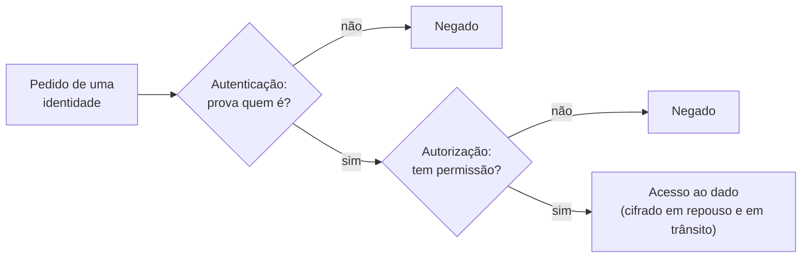

<!-- autoral -->

# 0.5 Segurança básica: identidade, autenticação, autorização e criptografia

> **Capítulo 0 — Fundamentos de TI** · Prepara para as aulas [2.1](../02-seguranca-e-conformidade/01-responsabilidade-compartilhada.md) a [2.5](../02-seguranca-e-conformidade/05-criptografia.md)

⬅️ [0.4 Como programas conversam: API, requisição e fila](04-api-e-filas.md) · 🏠 [Índice do capítulo](README.md) · 🏫 [O caso da escola](../00-guia-do-exame/caso-da-escola.md) · [Capítulo 1](../01-conceitos-de-nuvem/README.md) ➡️

---

O sistema de matrícula guarda dados sensíveis: endereço das famílias, documentos, informações de saúde dos alunos. Várias pessoas precisam usá-lo, mas cada uma de um jeito. Os pais veem só a matrícula dos próprios filhos. A secretária confere os documentos de todos. O diretor vê relatórios. O técnico de TI administra o servidor, mas não precisa ler os documentos. E nenhum estranho deveria ver nada, nem se conseguisse copiar o disco ou escutar a rede.

Proteger isso exige responder a quatro perguntas, sempre nesta ordem: **quem é** essa pessoa ou programa, **como ela prova** que é quem diz ser, **o que ela pode fazer** e **como os dados ficam ilegíveis** para quem não deveria vê-los. São os conceitos de identidade, autenticação, autorização e criptografia, que voltam em todo o capítulo 2.

## Identidade: quem está pedindo

Uma **identidade** é a representação de quem faz um pedido ao sistema. Pode ser uma pessoa, como a secretária, ou um programa, como o serviço que envia os e-mails da escola. Cada identidade precisa ser única: se todos da secretaria usam o mesmo login, ninguém sabe depois quem apagou um documento.

Dar uma identidade para cada pessoa e para cada programa permite duas coisas: dar a cada um só o que ele precisa e registrar quem fez o quê. Por isso compartilhar senhas é um problema de segurança mesmo entre colegas de confiança.

## Autenticação: provar quem você é

**Autenticação** é o processo de provar que você é a identidade que diz ser. A forma mais comum é a senha: algo que só você **sabe**. O problema é que senhas vazam, são adivinhadas ou reaproveitadas em vários sites. Por isso existe a **autenticação multifator** (MFA): além da senha, o sistema pede uma segunda prova de outro tipo, normalmente algo que só você **tem**, como um código gerado no celular ou uma chave física.

Com MFA, quem roubar a senha ainda não consegue entrar sem o segundo fator. O limite é que a autenticação só responde "quem é você". Ela não diz nada sobre o que essa pessoa pode fazer depois de entrar.

## Autorização: o que você pode fazer

**Autorização** é a decisão sobre o que uma identidade já autenticada pode fazer. A secretária e o diretor entram no mesmo sistema, mas a autorização decide que só a secretária pode aprovar documentos. Essas regras ficam em **permissões**, que dizem quais ações cada identidade pode realizar e sobre quais dados ou recursos.

A regra de ouro é o **menor privilégio**: cada identidade recebe só as permissões de que precisa para o seu trabalho, nada além. O técnico de TI pode reiniciar o servidor, mas não ler os documentos dos alunos. Se a conta dele for invadida, o estrago fica limitado ao que ela podia fazer. O custo do menor privilégio é trabalho: é preciso pensar nas permissões de cada função e revê-las quando as funções mudam.

## Criptografia: dados ilegíveis para quem não tem a chave

Mesmo com identidades, autenticação e permissões bem configuradas, alguém pode copiar um disco ou capturar o tráfego da rede. A **criptografia** protege contra isso: ela transforma os dados num formato ilegível usando uma **chave**, e só quem tem a chave certa consegue transformá-los de volta. O dado protegido é chamado de **cifrado**.

Há dois momentos em que os dados precisam de proteção. **Em trânsito**, enquanto viajam pela rede, como no HTTPS da aula [0.2](02-rede.md). **Em repouso**, enquanto estão guardados num disco, num banco de dados ou num objeto. Um disco cifrado roubado é só um amontoado de dados sem sentido.

A criptografia move o problema de lugar: em vez de proteger os dados, você passa a proteger as chaves. Quem tiver a chave lê tudo; quem perder a chave perde os dados. Por isso o controle das chaves (quem pode usá-las, onde ficam guardadas, quando são trocadas) é tão importante quanto a própria criptografia.

*Figura 0.5 — Todo pedido passa por duas perguntas em sequência: a autenticação confere quem é; a autorização confere o que pode fazer. A criptografia protege o dado mesmo que alguém o obtenha por fora desse caminho.*

## Onde isso aparece na AWS

Na AWS, identidades e permissões ficam no **AWS IAM** (Identity and Access Management). Com ele, quem administra a conta controla quem pode ser autenticado, isto é, entrar, e quem é autorizado, isto é, tem permissão para usar cada recurso. As permissões são escritas em **políticas**, e a própria AWS recomenda conceder só as permissões necessárias para cada tarefa (menor privilégio) e exigir MFA. O IAM é o assunto da aula [2.3](../02-seguranca-e-conformidade/03-iam.md).

Para criptografia, o **AWS KMS** (Key Management Service) cria e controla as chaves usadas para cifrar os dados. O KMS é integrado à maioria dos serviços da AWS que cifram dados, e, nas chaves que cria, o cliente decide quem pode usá-las. A aula [2.5](../02-seguranca-e-conformidade/05-criptografia.md) detalha as opções. Pelo modelo de responsabilidade compartilhada, configurar identidades, permissões e criptografia dos próprios dados é tarefa do cliente.

## Na prova

- **Autenticação e autorização são perguntas diferentes.** "Provar quem é" (senha, MFA) é autenticação; "o que pode fazer" (permissões, políticas) é autorização.
- **MFA é a resposta para senha comprometida.** Enunciados sobre proteger o login contra roubo de senha pedem MFA.
- **Menor privilégio aparece em toda a prova.** Entre várias opções que funcionam, a correta costuma ser a que dá menos permissão.
- **Criptografia em trânsito e em repouso são proteções separadas.** HTTPS protege a viagem; cifrar o disco ou o banco protege o que está guardado. Uma não substitui a outra.
- **Quem configura a segurança dos dados é o cliente.** A AWS oferece IAM e KMS; decidir quem acessa e quais dados cifrar é responsabilidade de quem usa a conta.

## Caso resolvido

**Situação.** A escola contratou uma empresa para fazer a manutenção do servidor do sistema de matrícula. O técnico da empresa pediu "acesso de administrador" para não perder tempo pedindo permissões. Ao mesmo tempo, a direção quer garantir que, se alguém copiar os dados do disco, não consiga ler os documentos dos alunos.

**Raciocínio.** O técnico recebe uma identidade própria, com MFA, e só as permissões de que precisa para manter o servidor: menor privilégio. Ele não recebe permissão para ler os documentos, porque o trabalho dele não exige isso. Os documentos e o banco de dados ficam cifrados em repouso, com chaves cujo uso fica restrito ao sistema de matrícula e a quem precisa. Assim, um disco copiado não revela os dados, e uma conta de manutenção invadida não dá acesso aos documentos.

**Por que as alternativas tentadoras falham.** Dar acesso de administrador "por praticidade" transforma qualquer erro ou invasão da conta do técnico num problema da escola inteira. Usar uma senha compartilhada da escola apaga o registro de quem fez o quê. E cifrar os dados mas deixar a chave liberada para todo mundo não protege nada: quem pode usar a chave lê os dados.

## Revisão

Tente responder antes de abrir cada resposta.

### Qual é a diferença entre autenticação e autorização?

Ver resposta

Autenticação prova quem a identidade é; autorização decide o que essa identidade, já autenticada, pode fazer.

As duas acontecem em sequência a cada pedido. Senha e MFA são autenticação; permissões e políticas são autorização. Na AWS, as duas ficam no IAM.

### Por que o MFA protege mesmo quando a senha vaza?

Ver resposta

Porque exige uma segunda prova de outro tipo, normalmente algo que só o usuário tem, como um código gerado no celular.

Quem rouba a senha não tem o segundo fator e não consegue entrar. Exigir MFA é uma das recomendações da AWS para as identidades da conta.

### O que é o princípio do menor privilégio?

Ver resposta

Dar a cada identidade só as permissões necessárias para o seu trabalho, nada além.

Se a conta for invadida ou a pessoa errar, o estrago fica limitado ao que ela podia fazer. Na prova, quando várias opções funcionam, a que dá menos permissão costuma ser a correta.

### Qual é a diferença entre criptografia em trânsito e em repouso?

Ver resposta

Em trânsito protege os dados enquanto viajam pela rede, como no HTTPS; em repouso protege os dados guardados em disco, banco de dados ou objeto.

Uma não substitui a outra. Nas duas, a segurança depende de controlar quem pode usar as chaves. Na AWS, o KMS cria e controla as chaves usadas para cifrar os dados em repouso.

## Resumo

- Identidade representa quem faz o pedido, pessoa ou programa; cada um precisa da sua.
- Autenticação prova quem a identidade é; MFA acrescenta um segundo fator além da senha.
- Autorização decide o que a identidade pode fazer, por meio de permissões; o menor privilégio limita o estrago de erros e invasões.
- Criptografia torna os dados ilegíveis sem a chave, em trânsito e em repouso; proteger as chaves passa a ser o ponto central.
- Na AWS, identidades e permissões ficam no IAM e as chaves no KMS; configurar os dois para os próprios dados é responsabilidade do cliente.

## Fontes oficiais

Verificadas em 06/10/2026.

- [What is IAM?](https://docs.aws.amazon.com/IAM/latest/UserGuide/introduction.html): o IAM controla quem é autenticado (entra) e autorizado (tem permissão) a usar os recursos.
- [Security best practices in IAM](https://docs.aws.amazon.com/IAM/latest/UserGuide/best-practices.html): a AWS recomenda aplicar permissões de menor privilégio e exigir MFA.
- [AWS Key Management Service](https://docs.aws.amazon.com/kms/latest/developerguide/overview.html): o KMS cria e controla as chaves criptográficas que protegem os dados.
- [Shared Responsibility Model](https://aws.amazon.com/compliance/shared-responsibility-model/): a segurança na nuvem é do cliente, incluindo os dados, as opções de criptografia e as permissões configuradas no IAM.
- [AWS KMS FAQs](https://aws.amazon.com/kms/faqs/): o KMS é integrado à maioria dos outros serviços da AWS para cifrar os dados guardados neles.
- [Data protection in AWS Key Management Service](https://docs.aws.amazon.com/kms/latest/developerguide/data-protection.html): nas chaves gerenciadas pelo cliente, a conta dona tem controle total e exclusivo das políticas que autorizam o uso da chave.

<!-- notas:inicio -->
## 📝 Minhas anotações

<!-- Escreva aqui suas observações, dúvidas e as questões que você errou sobre o tema. -->
<!-- notas:fim -->

---

⬅️ [0.4 Como programas conversam: API, requisição e fila](04-api-e-filas.md) · 🏠 [Índice do capítulo](README.md) · [Capítulo 1](../01-conceitos-de-nuvem/README.md) ➡️
