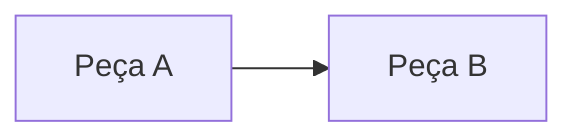

<!-- autoral -->

<!--
Modelo de aula autoral (Fase 3 do plano de implementação).

- O marcador autoral na primeira linha faz o gerar_docs.py preservar o corpo da aula. Os flashcards da
  aula saem da seção "Revisão": uma pergunta por subtítulo ###, e o primeiro parágrafo da resposta vira o card.
- Escreva em prosa. Use listas só para enumerações reais e tabelas só para comparar itens lado a lado.
- Cada termo novo é explicado em prosa no primeiro uso; o glossário serve para relembrar.
- Não cite um serviço antes de ensiná-lo, a não ser com remissão explícita ("veremos na aula 3.10").
- Toda informação sobre a AWS precisa estar confirmada na documentação oficial e listada em "Fontes oficiais".
  O que não for confirmado vai para docs/00-guia-do-exame/pendencias-de-verificacao.md, não para a aula.
- Apague estes comentários ao escrever a aula. Modelo completo em
  docs/02-seguranca-e-conformidade/01-responsabilidade-compartilhada.md (aula-piloto).
-->

# x.y Título da aula

> **Domínio N — Nome do domínio (peso% da prova)** · Depende das aulas [0.x](../fundamentos/arquivo.md)

🏠 [Índice do domínio](README.md) · [x.y+1 Próxima aula](arquivo-da-proxima.md) ➡️

---

<!-- Abertura: o problema, contado pelo caso da escola, em um ou dois parágrafos. Sem tabela de termos.
     Termine dizendo o que a aula vai explicar. -->

## Conceito central

<!-- Um subtítulo por conceito central, com nome que diga do que se trata (não "Conceito 1").
     Em cada um, nesta ordem: o que é → como funciona por dentro → por que existe → custo ou limite. -->

## Outro conceito central

<!-- Figura: pelo menos uma quando houver relação espacial ou de fluxo.
     Fluxos e sequências: Mermaid no próprio Markdown. Arquiteturas com ícones AWS: draw.io exportado em SVG
     para assets/imagens/, com o .drawio ao lado. Toda figura com legenda em texto e legível em preto e branco. -->

*Figura x.y — Legenda que explica a figura sem depender da cor.*

## Na prova

<!-- Como o tema aparece nos enunciados e as confusões mais comuns, em itens curtos com a regra em negrito
     seguida da explicação. Substitui os "Cai na prova" espalhados. -->

- **Regra curta em negrito.** Explicação de uma ou duas frases.

## Caso resolvido

**Situação.** Cenário no caso da escola, com o requisito que decide a resposta.

**Raciocínio.** Como chegar à resposta a partir dos conceitos da aula.

**Por que as alternativas tentadoras falham.** Cada alternativa plausível e o motivo de não servir.

## Revisão

Tente responder antes de abrir cada resposta.

### Pergunta de compreensão?

Ver resposta

Resposta direta em um parágrafo. Este parágrafo vira o flashcard.

Comentário: por que a resposta é essa e qual confusão a pergunta testa. Não copie outro trecho da aula.

<!-- Três a cinco perguntas, cada uma no mesmo formato. -->

## Resumo

<!-- Cinco a oito linhas para revisão rápida. Último bloco de conteúdo da aula. -->

- Ideia principal.

## Fontes oficiais

Verificadas em DD/MM/AAAA.

- [Título da página oficial](https://docs.aws.amazon.com/...): o que a página confirma.

<!-- notas:inicio -->
## 📝 Minhas anotações

<!-- Escreva aqui suas observações, dúvidas e as questões que você errou sobre o tema. -->
<!-- notas:fim -->

---

🏠 [Índice do domínio](README.md) · [x.y+1 Próxima aula](arquivo-da-proxima.md) ➡️
